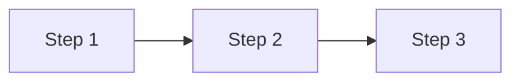

# Note Template

> Use this template for every stub file.  
> Study existing notes in `CURRICULUM/html5/` or `CURRICULUM/javascript/` to calibrate depth and tone.  
> Every section is required unless marked optional.

---

# [Lesson Title]

> **Course:** [Course Name] | **Module:** [Module Name] | **Difficulty:** beginner / intermediate / advanced

---

## Overview

[2–4 sentences introducing the concept. What is it? Why does it exist? Where is it used?]

---

## Learning Objectives

By the end of this lesson, you will be able to:

- [Objective 1]
- [Objective 2]
- [Objective 3]

---

## Prerequisites

- [Prerequisite concept or lesson]
- [Prerequisite concept or lesson]

---

## Theory

[Core explanation of the concept. Use plain language. Build from fundamentals up.]

> **Definition:** [Key term] is [clear definition].

---

## Internal Working / How It Works

[Explain what happens internally — browser, engine, runtime, or framework behaviour.]



> **Diagram:** [One sentence describing the diagram.]

---

## Architecture

[Optional for simple topics. Required for architectural concepts, patterns, or multi-layer systems.]

| Layer | Responsibility |
|---|---|
| [Layer 1] | [What it does] |
| [Layer 2] | [What it does] |

---

## Code Examples

### Example 1 — [Descriptive Title]

```html
<!-- or js, css, jsx — use the correct language identifier -->
<!-- Explain what this demonstrates in comments -->
```

### Example 2 — [Descriptive Title]

```javascript
// Second example — covers a different scenario or edge case
```

---

## Hands-on Practice

1. [Task step 1]
2. [Task step 2]
3. [Task step 3 — builds on previous]

---

## Real-world Example

[Show how this concept is used in a real project or professional scenario. Code snippet with context.]

---

## Best Practices

| Practice | Reason |
|---|---|
| [Practice 1] | [Why it matters] |
| [Practice 2] | [Why it matters] |
| [Practice 3] | [Why it matters] |

---

## Common Mistakes

| Mistake | Why It's Wrong | Correct Approach |
|---|---|---|
| [Mistake 1] | [Reason] | [Fix] |
| [Mistake 2] | [Reason] | [Fix] |

---

## Interview Questions

**Q1: [Question]**

> [Concise, accurate answer — 2–5 sentences]

**Q2: [Question]**

> [Answer]

**Q3: [Question]**

> [Answer]

---

## Summary

[3–5 bullet points summarising what was covered in this lesson.]

- [Key takeaway 1]
- [Key takeaway 2]
- [Key takeaway 3]

---

## Cheat Sheet

| Concept / Syntax | Description |
|---|---|
| `[syntax]` | [What it does] |
| `[syntax]` | [What it does] |
| `[syntax]` | [What it does] |

---

## References

- [MDN Web Docs — Topic Name](https://developer.mozilla.org/)
- [Official documentation link]
- [Additional reference]
