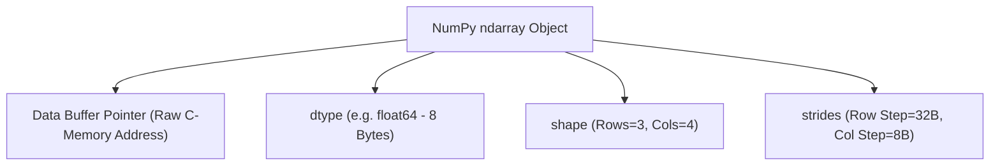

# Lesson 1.1 NumPy Core Architecture & ndarray Memory Layout

> **Course**: Python Data Science | **Module**: Module 1 | **Difficulty**: beginner

---

- **Estimated Time**: 45 Minutes (15m Reading | 20m Practice | 10m Quiz)
- **Difficulty Level**: ⭐ Beginner
- **Prerequisites**: [Math Lesson 1.11 Non-Parametric Methods](file:///d:/My%20Drive/all%20files/PROJECT%20FILES/notes/docs/curriculum/_08_ds_math/_01_11_non_parametric_statistical_methods.md)
- **XP Reward**: +50 XP

### Learning Objectives
By the end of this lesson, you will be able to:
1. Explain the architectural advantages of NumPy **`ndarray`** memory layouts over Python lists.
2. Differentiate between C-contiguous and Fortran-contiguous array memory layouts.
3. Inspect core array metadata attributes (`shape`, `ndim`, `dtype`, `strides`, `itemsize`).
4. Construct multi-dimensional arrays using NumPy array creation functions (`np.zeros()`, `np.ones()`, `np.arange()`, `np.linspace()`).

---

---

Install `numpy`:

```bash
pip install numpy
```

---

---

### 3.1 Python Lists vs NumPy `ndarray`
Standard Python lists store pointers to scattered PyObject memory addresses, causing heavy pointer indirection, cache misses, and type-checking overhead during loops.

NumPy's **`ndarray`** (N-dimensional array) stores data in a single **contiguous block of memory** with fixed element data types (`dtype`). This contiguous layout enables SIMD (Single Instruction, Multiple Data) CPU vectorization and C-level execution speed (50x to 100x faster than standard Python loops):

```
┌─────────────────────────────────────────────────────────────────────────────┐
│                       PYTHON LIST vs NUMPY NDARRAY MEMORY                    │
├─────────────────────────────────────────────────────────────────────────────┤
│ Standard Python List: [ Pointer ] ──► PyObject (Integer 10)                 │
│                       [ Pointer ] ──► PyObject (Integer 20)  (Scattered!)   │
├─────────────────────────────────────────────────────────────────────────────┤
│ NumPy `ndarray`:      [ 10 ][ 20 ][ 30 ][ 40 ] (Contiguous 64-bit C-Buffer!)│
└─────────────────────────────────────────────────────────────────────────────┘
```

### 3.2 Array Strides
**Strides** are tuples specifying the number of bytes to step in memory to advance to the next element along each dimension axis.

For a 2D matrix of 64-bit integers (`int64`, 8 bytes) with shape `(3, 4)` in C-contiguous row-major layout:
- Step 1 row down $\to$ Advance 4 elements $\times$ 8 bytes = **32 bytes**
- Step 1 column right $\to$ Advance 1 element $\times$ 8 bytes = **8 bytes**
- `strides = (32, 8)`

---

---



---

---

```python
# NumPy Core Architecture & Memory Inspection (numpy_architecture.py)
import numpy as np

# 1. Create a 2D 3x4 Array of 64-bit Floating-Point Numbers
arr = np.array([
    [1.5, 2.5, 3.5, 4.5],
    [5.5, 6.5, 7.5, 8.5],
    [9.5, 10.5, 11.5, 12.5]
], dtype=np.float64)

print("==================================================")
print("             NUMPY NDARRAY METADATA REPORT         ")
print("==================================================")
print(f"Array Output:\n{arr}\n")
print(f"Dimensions (ndim)       : {arr.ndim}")
print(f"Shape (shape)           : {arr.shape}")
print(f"Total Elements (size)   : {arr.size}")
print(f"Data Type (dtype)       : {arr.dtype}")
print(f"Item Size (itemsize)    : {arr.itemsize} Bytes")
print(f"Total Memory (nbytes)   : {arr.nbytes} Bytes")
print(f"Memory Strides (strides): {arr.strides}")
print(f"C-Contiguous Memory Flag: {arr.flags['C_CONTIGUOUS']}")

# 2. Array Creation Routines
zero_arr = np.zeros(shape=(2, 3), dtype=np.int32)
range_arr = np.arange(start=0, stop=10, step=2)
linear_space = np.linspace(start=0.0, stop=1.0, num=5)

print("\n--- Array Creation Routines ---")
print(f"np.zeros(2, 3)     :\n{zero_arr}")
print(f"np.arange(0, 10, 2): {range_arr}")
print(f"np.linspace(0, 1, 5): {linear_space}")
```

---

---

- **High-Frequency Algorithmic Trading Engines**: Quantitative finance platforms process millions of order book tick events in contiguous NumPy `float64` memory blocks, allowing SIMD vector execution engines to calculate rolling portfolio variance in sub-milliseconds.

---

---

1. Save code as `numpy_architecture.py`.
2. Run `python numpy_architecture.py`.
3. Observe strides `(32, 8)` and verify total memory footprint (96 Bytes)!

---

---

| Bug / Error | Root Cause | Engineering Solution |
| :--- | :--- | :--- |
| **`TypeError: Cannot cast ufunc ...`** | Attempting to perform in-place array math with mismatched data types (e.g., adding `float64` into an `int32` array). | Cast array data types explicitly using `arr = arr.astype(np.float64)`. |

---

---

- **Specify `dtype` Explicitly**: Always pass `dtype` (e.g. `np.float32` or `np.int64`) when creating large arrays to optimize memory allocation.

---

---

### Q1: Why are NumPy `ndarray` operations significantly faster than standard Python list comprehensions?
**Answer**: Python lists store pointers to individual heap-allocated `PyObject` instances, requiring type checking and pointer indirection for every loop iteration. NumPy `ndarray` stores homogeneous data in a single contiguous block of memory. This allows C-compiled loops to utilize CPU L1/L2 cache locality and SIMD (Single Instruction, Multiple Data) vector instructions to process multiple data points per clock cycle.

---

---

```json
{
  "quiz_title": "Lesson 1.1 NumPy Architecture Assessment",
  "questions": [
    {
      "question_id": "Q1",
      "type": "multiple_choice",
      "question_text": "Which NumPy array attribute specifies the byte offset steps needed to move between elements across dimensions?",
      "options": ["shape", "strides", "itemsize", "ndim"],
      "correct_answer_index": 1,
      "explanation": "strides specifies byte offset steps per dimension."
    }
  ]
}
```

---

---

Create a 3x3 matrix of `np.float32`, inspect its `strides`, and convert it to `np.int64`.

---

---

**Front**: What property in `arr.flags` confirms an array stores data in row-major C-contiguous memory?
**Back**: `arr.flags['C_CONTIGUOUS']`.
<!-- flashcard:end -->

---

---

```python
arr = np.array([[1, 2], [3, 4]], dtype=np.float64)
print(arr.shape, arr.dtype, arr.strides)
```

---
