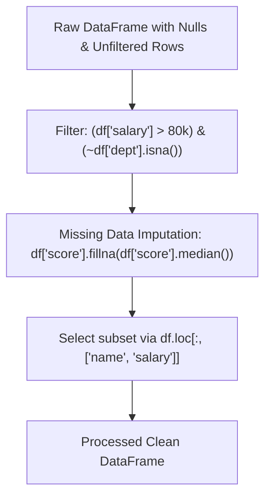

```yaml
schema_version: "2.0"
metadata:
  lesson_id: "DS-MOD02-LES02"
  course_slug: "course-09-python-data-science"
  course_title: "Course 2: Python Data Science Ecosystem (NumPy, Pandas, & Visualization)"
  module_slug: "mod-02-pandas-data-wrangling"
  module_title: "Module 2 - High-Performance Data Wrangling with Pandas"
  lesson_slug: "pandas-indexing-filtering-and-imputation"
  lesson_title: "Lesson 2.2 Advanced Indexing (loc/iloc), Filtering, & Missing Data Imputation"
  sort_order: 202

pedagogy:
  difficulty: "intermediate"
  estimated_time:
    reading_minutes: 20
    practice_minutes: 25
    quiz_minutes: 10
    total_minutes: 55
  bloom_taxonomy_level: "Apply"
  xp_reward: 60

prerequisites:
  required_lesson_ids:
    - "DS-MOD02-LES01"
  required_skills:
    - "Pandas DataFrames & Series Ingestion"

skills_acquired:
  - "Label-Based Indexing with `df.loc[]`"
  - "Integer Position Indexing with `df.iloc[]`"
  - "Multi-Condition Boolean Masking (`&`, `|`, `~`)"
  - "Missing Data Detection & Imputation (`isna()`, `fillna()`, `dropna()`)"
  - "Vectorized String & Regex Operations (`df['col'].str.contains()`)"

dependencies:
  software:
    - "VS Code / Jupyter Notebook"
    - "Python 3.12+"
    - "pandas"
  hardware: []

seo_and_social:
  meta_title: "Pandas Indexing & Filtering: loc vs iloc, fillna Imputation & Boolean Masks"
  meta_description: "Master Pandas Selection & Cleaning: df.loc vs df.iloc indexing, multi-condition boolean filtering, missing value imputation with fillna(), and str.contains regex."
  keywords: ["Pandas loc iloc", "Pandas Filtering", "fillna Imputation", "Pandas Missing Data", "Boolean Indexing Pandas", "str.contains Regex"]

assessment_config:
  has_quiz: true
  has_lab: true
  has_flashcards: true
  pass_score_percentage: 80
```

# Lesson 2.2 Advanced Indexing (`loc`/`iloc`), Filtering, & Missing Data Imputation

## 1. Overview & Learning Objectives [id: overview]

- **Estimated Time**: 55 Minutes (20m Reading | 25m Practice | 10m Quiz)
- **Difficulty Level**: ⭐⭐ Intermediate
- **Prerequisites**: [Lesson 2.1 Pandas Ingestion](file:///d:/My%20Drive/all%20files/PROJECT%20FILES/notes/docs/curriculum/_09_python_data_science/_09_03_pandas_dataframes_series_and_ingestion.md)
- **XP Reward**: +60 XP

### Learning Objectives
By the end of this lesson, you will be able to:
1. Differentiate between label-based selection (**`df.loc[]`**) and integer position selection (**`df.iloc[]`**).
2. Construct complex multi-condition boolean filters using bitwise operators (`&`, `|`, `~`).
3. Detect, drop, or impute missing null values using `isna()`, `dropna()`, and **`fillna()`**.
4. Apply vectorized string operations and regex pattern matching via `df['col'].str`.

---

## 2. Environment & Prerequisites [id: prerequisites]

Open Python REPL or VS Code.

---

## 3. Theoretical Foundations [id: theory]

### 3.1 `loc` vs `iloc` Indexing Mechanics
- **`df.loc[row_labels, col_labels]`**: Selects data based on **explicit index labels** and column names. Slicing with `loc` is **inclusive** of the end boundary (`'A':'C'`).
- **`df.iloc[row_positions, col_positions]`**: Selects data based on **integer memory positions** (0-indexed). Slicing with `iloc` follows standard Python **exclusive** end boundaries (`0:3`).

```
┌─────────────────────────────────────────────────────────────────────────────┐
│                          LOC vs ILOC SELECTION MATRIX                       │
├─────────────────┬───────────────────────────────┬───────────────────────────┤
│ Indexer         │ Target Specifier              │ Slice Endpoint Inclusion  │
├─────────────────┼───────────────────────────────┼───────────────────────────┤
│ **`df.loc[]`**  │ Explicit Index Labels / Names │ **INCLUSIVE** of stop     │
│ **`df.iloc[]`** │ Integer Positions (0, 1, 2...)│ **EXCLUSIVE** of stop     │
└─────────────────┴───────────────────────────────┴───────────────────────────┘
```

> [!WARNING]
> **Bitwise Operators for Pandas Masks**: In Pandas boolean filtering, use bitwise operators `&` (AND), `|` (OR), and `~` (NOT). You MUST wrap individual conditions in parentheses: `(df['age'] > 30) & (df['dept'] == 'Engineering')`. Standard Python `and` / `or` will raise a `ValueError`!

---

## 4. Architecture & Diagram Visualizations [id: diagram]



---

## 5. Code & Hardware Implementation [id: syntax]

```python
# Pandas Advanced Indexing, Filtering, & Imputation (pandas_indexing.py)
import pandas as pd
import numpy as np

# 1. Construct DataFrame with Missing Values (NaN)
data = {
    "employee": ["Alice", "Bob", "Charlie", "David", "Eve", "Frank"],
    "dept": ["Engineering", "Marketing", "Engineering", None, "Finance", "Engineering"],
    "salary": [95000, 62000, np.nan, 88000, 64000, 120000],
    "performance_score": [88.5, np.nan, 92.0, 75.0, 81.0, 95.0]
}

df = pd.DataFrame(data)

print("==================================================")
print("             RAW DATAFRAME WITH NULLS             ")
print("==================================================")
print(df)

# 2. Advanced Indexing: loc vs iloc
# Select rows 0 to 2 and specific columns by label
print("\n--- df.loc Selection (Label Based) ---")
print(df.loc[0:2, ["employee", "salary"]])

# Select first 3 rows and first 2 columns by integer position
print("\n--- df.iloc Selection (Integer Position Based) ---")
print(df.iloc[0:3, 0:2])

# 3. Multi-Condition Boolean Filtering
# High earners (> $80k) in Engineering
mask = (df["salary"] > 80000) & (df["dept"] == "Engineering")
print("\n--- High Earning Engineers ---")
print(df[mask])

# 4. Missing Data Detection & Imputation
print("\n--- Missing Value Counts ---")
print(df.isna().sum())

# Impute missing department with 'Unknown'
df["dept"] = df["dept"].fillna("Unknown")

# Impute missing salary with Median salary
median_salary = df["salary"].median()
df["salary"] = df["salary"].fillna(median_salary)

print("\n--- Clean DataFrame After Imputation ---")
print(df)

# 5. String Regex Filter
eng_employees = df[df["dept"].str.contains("Eng", case=False)]
print(f"\nString Matching 'Eng':\n{eng_employees[['employee', 'dept']]}")
```

---

## 6. Enterprise Real-World Applications [id: examples]

- **Financial Risk Data Wrangling**: Quantitative risk platforms isolate non-null credit risk profiles using `df.loc[]` multi-condition filters while imputing missing historical volatility values using group median `fillna()` strategies.

---

## 7. Guided Step-by-Step Hands-On Exercise [id: exercises]

1. Save code as `pandas_indexing.py`.
2. Run `python pandas_indexing.py`.
3. Observe how missing NaN values are successfully detected and imputed with median values!

---

## 8. Common Pitfalls & Troubleshooting [id: common_mistakes]

| Bug / Error | Root Cause | Engineering Solution |
| :--- | :--- | :--- |
| **`ValueError: The truth value of a Series is ambiguous`** | Using Python keyword `and` / `or` instead of bitwise `&` / `|` between Pandas Series conditions. | Use `&` and `|` and wrap each boolean condition in parentheses: `(cond1) & (cond2)`. |

---

## 9. Best Practices & Optimization [id: best_practices]

- **Parenthesize Boolean Conditions**: Always enclose individual filter conditions in parentheses when combining masks.

---

## 10. Industry Interview Q&A [id: interview_qa]

### Q1: What is the crucial difference between `df.loc[0:2]` and `df.iloc[0:2]` in Pandas?
**Answer**: `df.loc[0:2]` performs label-based selection and returns rows with labels `0`, `1`, and `2` (**inclusive** of label `2`). `df.iloc[0:2]` performs integer position-based selection and returns rows at memory positions `0` and `1` (**exclusive** of position `2`).

---

## 11. Self-Assessment Quiz [id: quiz]

```json
{
  "quiz_title": "Lesson 2.2 Indexing & Imputation Assessment",
  "questions": [
    {
      "question_id": "Q1",
      "type": "multiple_choice",
      "question_text": "Which bitwise operator performs logical AND filtering between boolean Series in Pandas?",
      "options": ["and", "&", "&&", "bit_and"],
      "correct_answer_index": 1,
      "explanation": "& is the bitwise AND operator required for Pandas Series filtering."
    }
  ]
}
```

---

## 12. Portfolio Assignment & Challenge [id: lab]

Filter rows where salary > $70k and impute missing numerical values using `fillna(median)`.

---

## 13. Spaced Repetition Flashcards [id: flashcards]

**Front**: How do you fill NaN missing values in a Pandas column with the column's mean value?
**Back**: `df['col'] = df['col'].fillna(df['col'].mean())`.
<!-- flashcard:end -->

---

## 14. Summary & Cheat Sheet [id: summary]

```python
df.loc[0:3, ["colA", "colB"]]
mask = (df["A"] > 10) & (df["B"] == "X")
df["val"] = df["val"].fillna(df["val"].median())
```
