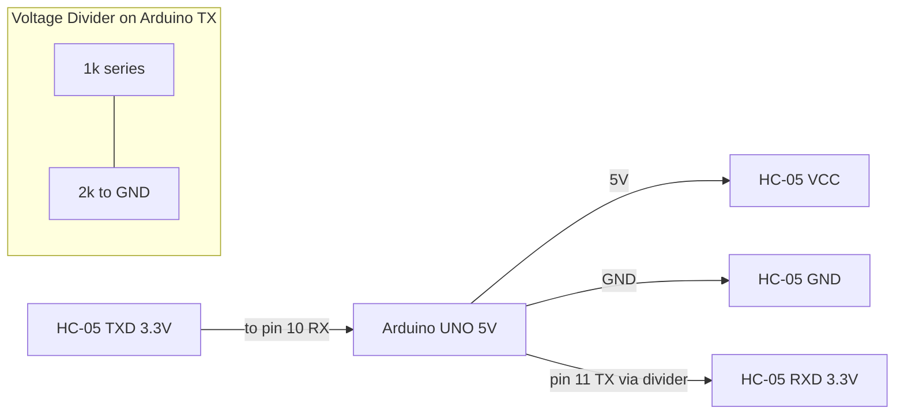
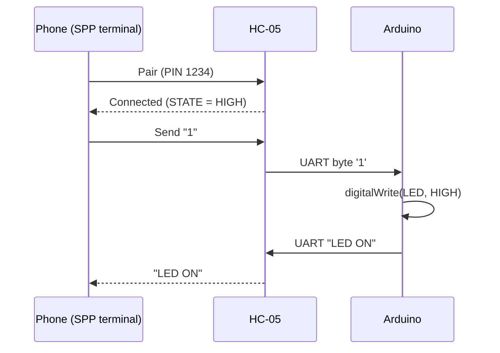
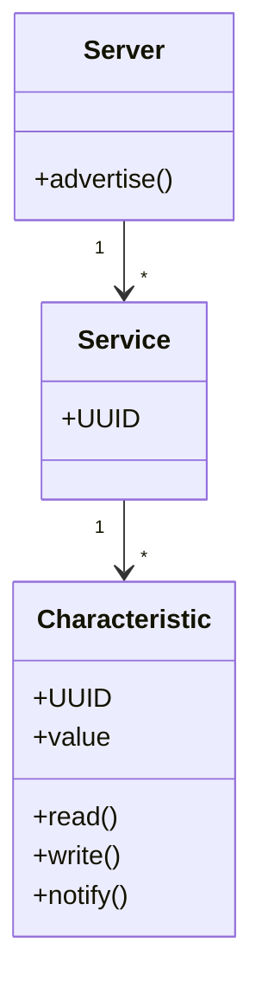

# Bluetooth Modules

## Overview

Bluetooth is a short-range wireless technology that operates in the 2.4 GHz ISM band
and lets microcontrollers talk to phones, laptops, and other devices without wires.
In embedded and IoT projects it is the easiest way to add a wireless serial link —
for example, to send sensor readings to a phone or to receive commands that switch a
relay on and off.

This lesson covers the two flavours of Bluetooth — **Bluetooth Classic** and
**Bluetooth Low Energy (BLE)** — and the most common hardware: the **HC-05** and
**HC-06** serial modules, and the **ESP32**, which has Classic *and* BLE built in. By
the end you will be able to wire a module safely, configure it with AT commands, and
exchange data over a serial link.

---

## Learning Objectives

After this lesson you will be able to:

- Explain the difference between Bluetooth Classic and Bluetooth Low Energy (BLE).
- Identify the HC-05 / HC-06 pins and wire them safely to a 5 V Arduino.
- Configure an HC-05 with AT commands (name, baud rate, PIN, role).
- Send and receive data over the Serial Port Profile (SPP) using `SoftwareSerial`.
- Use the ESP32 `BluetoothSerial` API (Classic) and the `BLE` API (a simple GATT server).
- Choose Classic vs BLE for an application based on power and throughput.

---

## Prerequisites

- Basic Arduino / ESP32 programming (`setup()`, `loop()`, `Serial`).
- Understanding of **UART serial communication** (TX, RX, baud rate).
- Awareness of **logic levels**: 5 V vs 3.3 V and why they matter.
- A smartphone with a "Serial Bluetooth Terminal" app (Android) or a BLE scanner app.

---

## Theory / Concept

### The Bluetooth family

Bluetooth is standardised by the **Bluetooth SIG**. Two profiles matter for embedded work:

| Feature | Bluetooth Classic (BR/EDR) | Bluetooth Low Energy (BLE) |
|---|---|---|
| Purpose | Continuous data streams (audio, serial) | Small, infrequent data (sensors, beacons) |
| Throughput | Up to ~2–3 Mbps | ~0.27 Mbps effective |
| Power | Higher (stays connected) | Very low (sleeps between events) |
| Connection model | Serial Port Profile (SPP) | GATT (services + characteristics) |
| Typical modules | HC-05, HC-06 | ESP32, nRF52, HM-10 |
| Pairing | PIN based | Pairing/bonding or connectionless advertising |

**Key idea:** Classic behaves like a *wireless UART cable* — open a serial port and bytes
flow. BLE instead exposes a small *database* (GATT) of values called **characteristics**
that a client reads, writes, or subscribes to.

### HC-05 vs HC-06

- **HC-06** — *slave only*. It can only be connected *to* (e.g., by a phone). Simple, cheap.
- **HC-05** — *master or slave*. It can also initiate connections, so two Arduinos can talk
  to each other. It has a `KEY`/`EN` pin to enter AT command mode.

Both use the **Serial Port Profile (SPP)** and appear to the microcontroller as a plain
UART at (by default) **9600 baud**.

### AT command mode (HC-05)

To change settings you enter **AT mode** by holding the `KEY`/`EN` pin **HIGH while
powering up**; the module then runs its command UART at **38400 baud**. In AT mode you can
rename the module, change the PIN, set the baud rate, and set the role (master/slave).

### ESP32 Bluetooth

The ESP32 is a dual-mode radio: it supports **Classic SPP** (via `BluetoothSerial` — a
drop-in wireless replacement for `Serial`) and **BLE** (via the `BLEDevice` stack). No
external module or level shifting is needed because everything is on-chip and already 3.3 V.

---

## Architecture / Diagrams

**Wiring block diagram (Arduino UNO ↔ HC-05):**



**Serial data / pairing sequence (phone ↔ HC-05 ↔ Arduino):**



**BLE GATT hierarchy (how BLE organises data):**



---

## Syntax / API / Commands

**Common HC-05 AT commands** (enter AT mode first; terminal at 38400 baud; line ending CR+LF):

| Command | Meaning | Example response |
|---|---|---|
| `AT` | Test connection | `OK` |
| `AT+NAME=MyRobot` | Set Bluetooth name | `OK` |
| `AT+PSWD="1234"` | Set pairing PIN | `OK` |
| `AT+UART=9600,0,0` | Set data-mode baud rate | `OK` |
| `AT+ROLE=1` | 1 = master, 0 = slave | `OK` |
| `AT+VERSION?` | Firmware version | `+VERSION:...` |
| `AT+ORGL` | Restore factory defaults | `OK` |

**Arduino `SoftwareSerial` API:**

```cpp
#include <SoftwareSerial.h>
SoftwareSerial BT(10, 11); // RX = 10, TX = 11
BT.begin(9600);            // open link at module baud
BT.available();            // bytes waiting
BT.read();                 // read one byte
BT.print("hello");         // send data
```

**ESP32 `BluetoothSerial` API (Classic SPP):**

```cpp
#include "BluetoothSerial.h"
BluetoothSerial SerialBT;
SerialBT.begin("ESP32-BT"); // name shown when pairing
SerialBT.available();
SerialBT.read();
SerialBT.print("data");
```

---

## Hardware Explanation

**HC-05 pinout:**

| Pin | Name | Function | Notes |
|---|---|---|---|
| 1 | `EN` / `KEY` | Enter AT mode when HIGH at power-up | Leave floating/LOW for normal use |
| 2 | `VCC` | Power input | **3.6 V – 6 V** (on-board regulator → 3.3 V core) |
| 3 | `GND` | Ground | Common with MCU |
| 4 | `TXD` | Module transmit → MCU RX | **3.3 V logic out** (safe into a 5 V RX) |
| 5 | `RXD` | Module receive ← MCU TX | **3.3 V only — NOT 5 V tolerant** |
| 6 | `STATE` | HIGH when connected | Optional status line |

- **Voltage:** `VCC` accepts 3.6–6 V (so a 5 V Arduino rail is fine), but the **`RXD` logic
  pin is 3.3 V**. Driving it directly from a 5 V Arduino TX can damage it over time.
- **Fix:** put a **voltage divider** on the Arduino TX → HC-05 RXD line. 1 kΩ in series with
  2 kΩ to ground gives `5 V × 2k/(1k+2k) ≈ 3.3 V`.
- **Current:** roughly 30–40 mA average with short peaks; the Arduino 5 V pin can supply it.
- **Communication protocol:** UART (asynchronous serial) carrying the Bluetooth **SPP**
  stream — from the MCU's point of view it is just a serial cable.
- **Compatible boards:** any 3.3 V or 5 V MCU with a spare UART / SoftwareSerial — Arduino
  UNO/Nano/Mega, STM32, and (natively) the ESP32.

---

## Code Examples

### Example 1 — Bluetooth serial echo (Arduino + HC-05)

Beginner: whatever the phone sends is echoed back and printed to the PC serial monitor.

```cpp
#include <SoftwareSerial.h>

// HC-05: module TXD -> pin 10 (RX), module RXD <- pin 11 (TX, via divider)
SoftwareSerial BT(10, 11);

void setup() {
  Serial.begin(9600);   // debug to PC
  BT.begin(9600);       // link to HC-05 (default data baud)
  Serial.println("Bluetooth ready. Pair and send data.");
}

void loop() {
  if (BT.available()) {      // phone -> Arduino
    char c = BT.read();
    Serial.write(c);         // show on PC
    BT.write(c);             // echo back to phone
  }
  if (Serial.available()) {  // PC -> phone (optional)
    BT.write(Serial.read());
  }
}
```

*Explanation:* `SoftwareSerial` creates a second UART on pins 10/11 so the hardware
`Serial` stays free for debugging. `available()` checks for incoming bytes; `read()` /
`write()` move one byte at a time.

### Example 2 — Control an LED from your phone

Intermediate: send `1` to turn the LED on, `0` to turn it off, with a confirmation.

```cpp
#include <SoftwareSerial.h>
SoftwareSerial BT(10, 11);
const int LED = 13;

void setup() {
  pinMode(LED, OUTPUT);
  BT.begin(9600);
}

void loop() {
  if (BT.available()) {
    char cmd = BT.read();
    if (cmd == '1') {            // command: ON
      digitalWrite(LED, HIGH);
      BT.println("LED ON");
    } else if (cmd == '0') {     // command: OFF
      digitalWrite(LED, LOW);
      BT.println("LED OFF");
    }
  }
}
```

*Explanation:* the Arduino treats each received character as a command; `println` sends a
human-readable acknowledgement back to the phone terminal.

### Example 3 — ESP32 Classic Bluetooth (no external module)

```cpp
#include "BluetoothSerial.h"
BluetoothSerial SerialBT;

void setup() {
  Serial.begin(115200);
  SerialBT.begin("ESP32-BT");        // pair with this name
  Serial.println("ESP32 Bluetooth started");
}

void loop() {
  if (SerialBT.available()) Serial.write(SerialBT.read());  // phone -> PC
  if (Serial.available())   SerialBT.write(Serial.read());  // PC -> phone
  delay(20);
}
```

*Explanation:* `BluetoothSerial` mirrors the `Serial` API, so the same read/write pattern
works — but the radio is on-chip and already 3.3 V, so no divider is needed.

### Example 4 — ESP32 BLE server that notifies a value

Advanced: expose a characteristic a phone can subscribe to.

```cpp
#include <BLEDevice.h>
#include <BLEServer.h>
#include <BLEUtils.h>

#define SERVICE_UUID        "12345678-1234-1234-1234-1234567890ab"
#define CHARACTERISTIC_UUID "abcd1234-1234-1234-1234-1234567890ab"

BLECharacteristic *pChar;

void setup() {
  BLEDevice::init("ESP32-BLE");
  BLEServer  *pServer  = BLEDevice::createServer();
  BLEService *pService = pServer->createService(SERVICE_UUID);
  pChar = pService->createCharacteristic(
      CHARACTERISTIC_UUID,
      BLECharacteristic::PROPERTY_READ | BLECharacteristic::PROPERTY_NOTIFY);
  pService->start();
  pServer->getAdvertising()->start();   // start advertising
}

void loop() {
  static int counter = 0;
  pChar->setValue(String(counter++).c_str());
  pChar->notify();                       // push to subscribed clients
  delay(1000);
}
```

*Explanation:* BLE data lives in a **characteristic** inside a **service**. `notify()` pushes
updates to any phone that subscribed — how BLE sensors stream readings with very little power.

---

## Step-by-Step Hands-on Exercise

**Goal:** control an LED on an Arduino UNO from your phone over an HC-05.

1. **Wire it up:**
   - HC-05 `VCC → 5 V`, `GND → GND`.
   - HC-05 `TXD → Arduino pin 10`.
   - Arduino pin 11 → 1 kΩ → HC-05 `RXD`; HC-05 `RXD` → 2 kΩ → GND (voltage divider).
   - LED (with 220 Ω) on pin 13, or use the on-board LED.
2. **Upload** Example 2 (LED control sketch).
3. **Pair:** on your phone, pair with `HC-05` (PIN `1234` or `0000`).
4. **Connect:** open a "Serial Bluetooth Terminal" app and connect to the HC-05.
5. **Test:** send `1` → LED on and the app shows `LED ON`; send `0` → LED off.

**Expected output (in the app):**

```
LED ON
LED OFF
```

**Verification:**
- The HC-05 `STATE` LED goes from fast-blinking to steady when connected.
- The physical LED responds within a fraction of a second of each command.

---

## Real World Applications

- **Wireless serial debugging / configuration** of robots and machines without a cable.
- **Fitness wearables and medical sensors** (heart-rate straps, glucose meters) use **BLE**
  for multi-day battery life.
- **Beacons** (retail, indoor navigation) broadcast BLE advertising packets.
- **Automotive OBD-II dongles** stream diagnostics to a phone over Bluetooth.
- **Consumer electronics:** wireless keyboards, game controllers, audio (Classic A2DP).

---

## Best Practices

- Always put a **voltage divider** (or logic-level shifter) on a 5 V MCU's TX → module RXD.
- **Rename** each module (`AT+NAME`) and **change the default PIN** for security.
- Match the **baud rate** on both ends; 9600 is reliable, higher baud can be flaky on `SoftwareSerial`.
- Prefer a **hardware UART** (ESP32, Arduino Mega `Serial1`) for high or sustained data.
- Choose **BLE for battery-powered sensors**, **Classic for continuous streams**.
- Add a **100 nF decoupling capacitor** across the module's VCC/GND for stability.

---

## Common Mistakes

- **Feeding 5 V into `RXD`** — slowly damages the module. Use the divider.
- **Crossing TX/RX wrong** — module `TXD` → MCU **RX**, module `RXD` → MCU **TX**.
- **Wrong AT baud** — the HC-05 command UART is **38400** in AT mode, not 9600.
- **Forgetting to hold `KEY` HIGH** at power-up when entering AT mode.
- **Sharing pins 0/1** on an UNO with USB — use `SoftwareSerial` pins instead.
- **Baud mismatch** producing garbage characters (`ÿØ...`) — set both sides equal.

*Debugging tip:* garbage → suspect baud rate first; nothing at all → suspect swapped TX/RX
or a missing common ground.

---

## Interview Questions

**Beginner**

1. *Difference between Bluetooth Classic and BLE?* Classic streams continuous data (higher
   throughput, more power); BLE handles small, infrequent transfers with very low power.
2. *Why does the HC-05 `RXD` need a voltage divider with a 5 V Arduino?* Its logic input is
   3.3 V tolerant; 5 V can damage it, so the divider scales 5 V to ~3.3 V.

**Intermediate**

3. *How do you enter AT mode on an HC-05 and at what baud?* Hold `KEY`/`EN` HIGH while powering
   up; the command UART runs at 38400 baud.
4. *What is SPP and why is it convenient?* Serial Port Profile makes Bluetooth behave like a
   wireless UART cable, so existing serial code works unchanged.

**Advanced**

5. *Describe the GATT model in BLE.* A server exposes services; each service contains
   characteristics (values with UUIDs) that clients read, write, or subscribe to via
   notifications/indications.
6. *When pick the ESP32 over HC-05 + Arduino?* When you need BLE, dual-mode, on-chip Wi-Fi,
   native 3.3 V logic (no divider), higher throughput, or a single-chip solution.

---

## Self Assessment Quiz

1. Which band does Bluetooth use? A) 433 MHz  B) 2.4 GHz  C) 5 GHz  D) 900 MHz
2. Which module can be **both** master and slave? A) HC-06  B) HC-05  C) Neither  D) HM-10
3. Default data-mode baud of the HC-05: A) 4800  B) 9600  C) 38400  D) 115200
4. AT-mode command baud of the HC-05: A) 9600  B) 19200  C) 38400  D) 57600
5. BLE organises data using: A) SPP  B) GATT services & characteristics  C) FTP  D) HTTP
6. The HC-05 `RXD` logic level is: A) 3.3 V  B) 5 V  C) 12 V  D) 1.8 V
7. Which pin indicates an active connection? A) EN  B) STATE  C) VCC  D) GND
8. To rename an HC-05 you use: A) `AT+PSWD`  B) `AT+ROLE`  C) `AT+NAME`  D) `AT+UART`
9. Best for a coin-cell heart-rate sensor: A) Classic  B) BLE  C) Wi-Fi  D) LoRa
10. In `SoftwareSerial BT(10, 11)`, pin 10 is: A) TX  B) RX  C) VCC  D) Reset
11. The module `TXD` connects to the MCU's: A) TX  B) RX  C) GND  D) VCC
12. Which library gives the ESP32 a Classic SPP link? A) `WiFi.h`  B) `BluetoothSerial.h`  C) `SPI.h`  D) `Wire.h`

**Answers:** 1-B, 2-B, 3-B, 4-C, 5-B, 6-A, 7-B, 8-C, 9-B, 10-B, 11-B, 12-B

---

## Assignment

**Mini task:** Configure an HC-05 with a custom name (`AT+NAME=YourName-BT`) and PIN, then
echo a potentiometer value to your phone once per second.

**Portfolio project:** Build a **Bluetooth-controlled robot car or home light**. Define a
command protocol (`F/B/L/R/S` or `ON/OFF`), document the wiring with a diagram, and record a
short demo.

**Challenge task:** Using two HC-05 modules (one `AT+ROLE=1` master, one slave), create an
**Arduino-to-Arduino** wireless link that passes a button press on one board to an LED on the
other — no phone involved.

---

## Summary

- Bluetooth has two profiles: **Classic** (wireless UART / SPP, higher power) and **BLE**
  (low power, GATT model).
- **HC-06** is slave-only; **HC-05** can be master or slave and has an AT command mode.
- The module's `RXD` is **3.3 V** — use a voltage divider from a 5 V MCU.
- Data mode runs at **9600** baud; AT mode at **38400**.
- The **ESP32** provides both Classic and BLE on-chip with no level shifting.

---

## Cheat Sheet

**HC-05 pinout**

| Pin | Use |
|---|---|
| EN/KEY | HIGH at power-up → AT mode |
| VCC | 3.6–6 V |
| GND | Ground |
| TXD | → MCU RX (3.3 V out) |
| RXD | ← MCU TX (3.3 V, use divider) |
| STATE | HIGH when connected |

**Key AT commands**

```text
AT                 -> OK (test)
AT+NAME=MyBT       -> rename
AT+PSWD="1234"     -> set PIN
AT+UART=9600,0,0   -> set baud
AT+ROLE=1          -> master (0=slave)
AT+ORGL            -> factory reset
```

**Classic vs BLE**

| | Classic | BLE |
|---|---|---|
| Model | SPP (serial) | GATT |
| Power | Higher | Very low |
| Best for | Streams | Sensors/beacons |

---

## References

- Bluetooth SIG — Core Specification: https://www.bluetooth.com/specifications/
- HC-05 Datasheet (Guangzhou HC Information Technology).
- Espressif ESP32 Bluetooth API Guide: https://docs.espressif.com/
- Arduino `SoftwareSerial` reference: https://docs.arduino.cc/
- Learning OS internal references: `foundations/esp32`, `foundations/arduino` (Communication Protocols).
