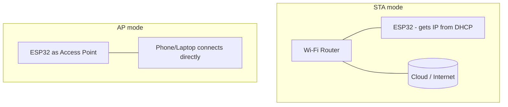
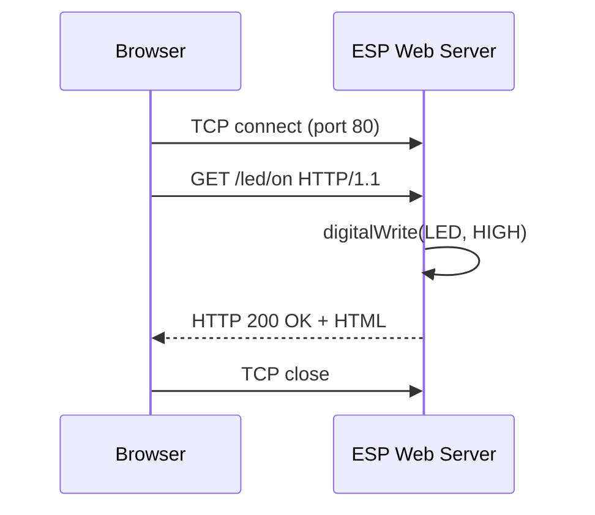
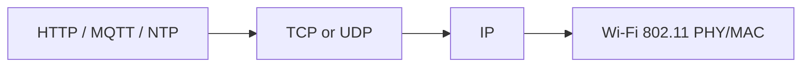

# WiFi Modules

## Overview

Wi-Fi lets a microcontroller join an existing network (or create its own) and speak the
same TCP/IP protocols as the rest of the internet — HTTP, TCP, and UDP. For IoT this is the
bridge that turns a sensor into a *connected* device that can push data to a cloud dashboard
or be controlled from anywhere.

This lesson focuses on the two most popular Wi-Fi chips in the maker and industrial IoT
world: the **ESP8266** and the **ESP32**. You will learn the difference between **Station
(STA)** mode and **Access Point (AP)** mode, how the **TCP/IP** stack carries **HTTP**,
**TCP**, and **UDP** traffic, and how to write firmware that connects to Wi-Fi, serves a web
page, and exchanges data with a server.

---

## Learning Objectives

After this lesson you will be able to:

- Describe the roles of the ESP8266 and ESP32 as Wi-Fi microcontrollers.
- Explain **STA mode**, **AP mode**, and when to use each.
- Relate **TCP/IP**, **HTTP**, **TCP**, and **UDP** to real firmware.
- Connect an ESP to a Wi-Fi network and print its IP address.
- Run a simple **web server** on the ESP to control hardware from a browser.
- Make an **HTTP client** request and send **UDP** packets.

---

## Prerequisites

- Completion of *Lesson 1.1 — Bluetooth Modules* (wireless basics) is helpful.
- Basic Arduino / ESP programming and the Arduino IDE with the ESP board package installed.
- Awareness of what an **IP address**, **port**, and **URL** are.
- A 2.4 GHz Wi-Fi network you can connect to (ESP8266/ESP32 do **not** use 5 GHz).

---

## Theory / Concept

### ESP8266 vs ESP32

| Feature | ESP8266 | ESP32 |
|---|---|---|
| CPU | Single-core ~80/160 MHz | Dual-core up to 240 MHz |
| Wi-Fi | 2.4 GHz 802.11 b/g/n | 2.4 GHz 802.11 b/g/n |
| Bluetooth | No | Classic + BLE |
| GPIO / ADC | Limited | Many GPIO, multiple ADC, DAC, touch |
| Typical board | NodeMCU, Wemos D1 mini | ESP32 DevKit, WROOM |

Both are **3.3 V** parts programmed with the Arduino core or ESP-IDF.

### STA mode vs AP mode

- **Station (STA) mode** — the ESP *joins* an existing Wi-Fi router, like a phone or laptop.
  It receives an IP from the router's DHCP and can reach the internet. Use this for cloud IoT.
- **Access Point (AP) mode** — the ESP *becomes* a Wi-Fi hotspot that other devices connect
  to directly. Use this for local configuration portals or offline control with no router.
- **AP+STA** — the ESP can do both at once (e.g., host a setup page while also connected to
  the home network).

### The TCP/IP stack (why it matters)

Once on a network, the ESP speaks standard internet protocols:

- **IP** delivers packets between addresses.
- **TCP** is a *reliable, ordered, connection-oriented* stream — used by HTTP, MQTT, most APIs.
- **UDP** is *connectionless and best-effort* — smaller and faster, used for time sync (NTP),
  telemetry, and local discovery where an occasional lost packet is acceptable.
- **HTTP** is a request/response protocol *built on top of TCP* — the language of web servers
  and REST APIs.

**Rule of thumb:** need every byte guaranteed and in order → **TCP/HTTP**; need speed and can
tolerate loss → **UDP**.

---

## Architecture / Diagrams

**STA vs AP topology:**



**HTTP request over TCP (browser ↔ ESP web server):**



**Protocol layering:**



---

## Syntax / API / Commands

**ESP32 / ESP8266 Wi-Fi (Arduino core):**

```cpp
#include <WiFi.h>          // ESP32  (use <ESP8266WiFi.h> on ESP8266)
WiFi.begin("SSID", "PASS");    // STA: join a network
WiFi.status();                 // WL_CONNECTED when ready
WiFi.localIP();                // assigned IP address
WiFi.softAP("ESP-AP", "12345678"); // AP: create a hotspot
```

**Web server (ESP32 `WebServer`):**

```cpp
#include <WebServer.h>
WebServer server(80);
server.on("/", handler);   // route
server.begin();
server.handleClient();     // call inside loop()
```

**HTTP client and UDP:**

```cpp
#include <HTTPClient.h>    // http.begin(url); http.GET();
#include <WiFiUdp.h>       // udp.beginPacket(ip, port); udp.print(...); udp.endPacket();
```

---

## Hardware Explanation

**ESP32 DevKit essentials:**

| Aspect | Detail |
|---|---|
| Logic / power | **3.3 V** logic; board has a USB → 3.3 V regulator |
| Current | Idle ~80 mA; **Wi-Fi TX peaks 300–500 mA** — supply must handle spikes |
| Power source | USB, or a stable 3.3 V / 5 V-to-3.3 V supply with headroom |
| Antenna | On-board PCB antenna (keep it clear of metal/ground pours) |
| ADC caveat | On ESP32, ADC2 pins can't be used while Wi-Fi is active — use ADC1 pins |
| Boot pins | Strapping pins (e.g., GPIO0, GPIO2, GPIO15) affect boot — avoid heavy loads there |

- **Voltage:** never feed 5 V into a GPIO; inputs are 3.3 V. Power the board via USB/VIN,
  not by back-feeding 3.3 V from a weak source.
- **Current:** brown-outs (random resets) during Wi-Fi connect almost always mean the supply
  can't deliver the TX current peak — add a **470–1000 µF** bulk capacitor and use a good USB
  cable / supply.
- **Communication protocol:** 2.4 GHz 802.11 b/g/n carrying the TCP/IP stack.
- **Compatible boards:** NodeMCU (ESP8266), Wemos D1 mini, ESP32 DevKitC, WROOM/WROVER modules.

---

## Code Examples

### Example 1 — Connect to Wi-Fi and print the IP (STA mode)

```cpp
#include <WiFi.h>                    // ESP8266: #include <ESP8266WiFi.h>
const char* SSID = "YourNetwork";
const char* PASS = "YourPassword";

void setup() {
  Serial.begin(115200);
  WiFi.begin(SSID, PASS);            // join the router
  Serial.print("Connecting");
  while (WiFi.status() != WL_CONNECTED) {  // wait for DHCP
    delay(500);
    Serial.print(".");
  }
  Serial.println();
  Serial.print("Connected. IP = ");
  Serial.println(WiFi.localIP());   // e.g. 192.168.1.42
}

void loop() {}
```

*Explanation:* `WiFi.begin()` starts the join; the loop polls `status()` until the router
grants an IP via DHCP, which `localIP()` then prints.

### Example 2 — Web server to control an LED from a browser

```cpp
#include <WiFi.h>
#include <WebServer.h>

WebServer server(80);
const int LED = 2;               // on-board LED on many ESP32 boards

void handleRoot() {
  server.send(200, "text/html",
    "<h1>ESP32</h1><a href='/on'>ON</a> | <a href='/off'>OFF</a>");
}
void handleOn()  { digitalWrite(LED, HIGH); server.send(200, "text/plain", "LED ON"); }
void handleOff() { digitalWrite(LED, LOW);  server.send(200, "text/plain", "LED OFF"); }

void setup() {
  pinMode(LED, OUTPUT);
  WiFi.begin("YourNetwork", "YourPassword");
  while (WiFi.status() != WL_CONNECTED) delay(500);
  server.on("/", handleRoot);
  server.on("/on", handleOn);
  server.on("/off", handleOff);
  server.begin();
}

void loop() {
  server.handleClient();         // must run continuously
}
```

*Explanation:* each URL path is a **route** mapped to a handler. Opening the ESP's IP in a
browser and clicking the links drives the LED — classic HTTP-over-TCP control.

### Example 3 — Access Point mode (no router needed)

```cpp
#include <WiFi.h>

void setup() {
  Serial.begin(115200);
  WiFi.softAP("ESP32-Setup", "12345678");   // SSID, password (>=8 chars)
  Serial.print("AP IP: ");
  Serial.println(WiFi.softAPIP());          // usually 192.168.4.1
}

void loop() {}
```

*Explanation:* `softAP()` turns the ESP into a hotspot. Any phone can join `ESP32-Setup`
and reach the board at `192.168.4.1` — ideal for first-time Wi-Fi configuration portals.

### Example 4 — HTTP client (send data to a server)

```cpp
#include <WiFi.h>
#include <HTTPClient.h>

void postReading(float temp) {
  if (WiFi.status() != WL_CONNECTED) return;
  HTTPClient http;
  http.begin("http://example.com/api/temp");     // target URL
  http.addHeader("Content-Type", "application/json");
  int code = http.POST("{\"temp\":" + String(temp) + "}");
  Serial.printf("HTTP status: %d\n", code);       // 200 = OK
  http.end();
}
```

*Explanation:* here the ESP is the **client** making an outbound request — the pattern for
pushing sensor data to a REST API or cloud service.

### Example 5 — UDP packet (lightweight, connectionless)

```cpp
#include <WiFi.h>
#include <WiFiUdp.h>
WiFiUDP udp;

void sendTelemetry() {
  udp.beginPacket("192.168.1.50", 4210);  // destination IP + port
  udp.print("temp=24.5");
  udp.endPacket();                          // fire-and-forget
}
```

*Explanation:* UDP has no handshake and no delivery guarantee, so it is smaller and faster —
good for frequent telemetry where an occasional lost packet doesn't matter.

---

## Step-by-Step Hands-on Exercise

**Goal:** control the on-board LED from any browser on your Wi-Fi.

1. Install the **ESP32 board package** in the Arduino IDE (Boards Manager → "esp32").
2. Open **Example 2**, set your `SSID`/`PASSWORD`, and select your ESP32 board + port.
3. **Upload** and open the Serial Monitor at 115200 baud.
4. Note the printed **IP address** (e.g., `192.168.1.42`).
5. On a phone/PC on the **same network**, open `http://192.168.1.42/` in a browser.
6. Click **ON** / **OFF**.

**Expected output:**
- Browser shows the page and the responses `LED ON` / `LED OFF`.
- The on-board LED toggles accordingly.

**Verification:**
- Serial Monitor shows a successful connection and IP.
- Visiting `/on` and `/off` directly also works, confirming the routes.

---

## Real World Applications

- **Cloud IoT sensors** pushing temperature/energy data to dashboards (STA + HTTP/MQTT).
- **Smart home devices** (plugs, bulbs) exposing a local web UI or REST API.
- **Wi-Fi provisioning portals** (AP mode) where a new device hosts a setup page.
- **OTA (over-the-air) firmware updates** delivered over the network.
- **Local telemetry / game controllers** using low-latency UDP.

---

## Best Practices

- Keep Wi-Fi credentials out of source — use a config portal (AP mode) or a separate header.
- Provide a **solid 3.3 V supply with bulk capacitance** to survive TX current peaks.
- Always **check `WiFi.status()`** before making requests, and handle reconnects.
- Use **ADC1** pins when Wi-Fi is active (ADC2 is unavailable during Wi-Fi on ESP32).
- Prefer **HTTPS/TLS** or MQTT with credentials for production, not plain HTTP.
- Don't block `loop()`; call `server.handleClient()` frequently and avoid long `delay()`s.

---

## Common Mistakes

- **Trying to use a 5 GHz network** — ESP8266/ESP32 are 2.4 GHz only.
- **Brown-out resets during connect** — under-powered USB/supply; add capacitance.
- **Feeding 5 V into a GPIO** — damages the 3.3 V input.
- **Forgetting `server.handleClient()`** in `loop()` — the web server appears "dead".
- **Using ADC2 pins with Wi-Fi on** — readings fail; switch to ADC1.
- **Hard-coding an IP** and being surprised when DHCP assigns a different one — print it.

*Debugging tip:* can't reach the web page? Confirm the phone is on the **same subnet** and use
the exact IP printed on Serial.

---

## Interview Questions

**Beginner**

1. *What is the difference between STA and AP mode?* STA joins an existing router; AP makes the
   ESP its own hotspot that others connect to.
2. *Which frequency band do the ESP8266/ESP32 support?* 2.4 GHz 802.11 b/g/n (not 5 GHz).

**Intermediate**

3. *When would you use UDP instead of TCP/HTTP?* When you need speed and low overhead and can
   tolerate occasional packet loss (telemetry, NTP, discovery).
4. *Why do ESP boards sometimes reset while connecting to Wi-Fi?* The Wi-Fi TX current peak
   (300–500 mA) browns out a weak supply; add bulk capacitance / a better source.

**Advanced**

5. *Explain how HTTP relates to TCP/IP.* HTTP is an application-layer request/response protocol
   carried over a reliable TCP connection, which itself runs over IP.
6. *What limitation exists for ADC on the ESP32 when Wi-Fi is on?* ADC2 pins are used by the
   Wi-Fi driver and become unavailable, so you must read analog inputs on ADC1.

---

## Self Assessment Quiz

1. ESP8266/ESP32 Wi-Fi band: A) 5 GHz  B) 2.4 GHz  C) 900 MHz  D) 60 GHz
2. In STA mode the ESP: A) becomes a hotspot  B) joins a router  C) disables Wi-Fi  D) uses BLE
3. `WiFi.softAP(...)` puts the ESP in: A) STA  B) AP  C) sleep  D) client
4. Which protocol is reliable and ordered? A) UDP  B) TCP  C) ICMP  D) ARP
5. HTTP runs on top of: A) UDP  B) TCP  C) SPI  D) I2C
6. A typical AP-mode IP address is: A) 10.0.0.1  B) 192.168.4.1  C) 127.0.0.1  D) 8.8.8.8
7. `WiFi.localIP()` returns: A) the router MAC  B) the ESP's assigned IP  C) the SSID  D) the gateway port
8. Wi-Fi TX current peaks around: A) 5 mA  B) 50 mA  C) 300–500 mA  D) 2 A
9. Which must run continuously for a web server? A) `WiFi.begin()`  B) `server.handleClient()`  C) `delay()`  D) `Serial.begin()`
10. On ESP32 with Wi-Fi on, use which ADC? A) ADC2  B) ADC1  C) either  D) neither
11. Which is connectionless? A) TCP  B) UDP  C) HTTP  D) TLS
12. ESP GPIO logic level: A) 1.8 V  B) 3.3 V  C) 5 V  D) 12 V

**Answers:** 1-B, 2-B, 3-B, 4-B, 5-B, 6-B, 7-B, 8-C, 9-B, 10-B, 11-B, 12-B

---

## Assignment

**Mini task:** Connect an ESP to Wi-Fi and print its IP, RSSI (signal strength), and MAC to
the Serial Monitor.

**Portfolio project:** Build a **Wi-Fi weather station** — read a temperature/humidity sensor
and serve a live web page (auto-refresh) showing the readings; document the wiring and routes.

**Challenge task:** Add a **captive-configuration portal**: on first boot the ESP starts in AP
mode, serves a form to enter Wi-Fi credentials, stores them, then reboots into STA mode and
connects automatically.

---

## Summary

- The **ESP8266** and **ESP32** are 3.3 V, 2.4 GHz Wi-Fi microcontrollers (ESP32 adds BLE).
- **STA mode** joins a router; **AP mode** makes the ESP a hotspot; **AP+STA** does both.
- On the network the ESP speaks **TCP/IP**: **TCP/HTTP** for reliable request/response,
  **UDP** for fast best-effort data.
- Supply enough current — Wi-Fi TX peaks cause brown-outs on weak supplies.
- A few lines of Arduino code turn the ESP into a web server, HTTP client, or UDP sender.

---

## Cheat Sheet

**Mode selection**

| Need | Mode |
|---|---|
| Reach the internet / cloud | STA |
| Direct local connection, no router | AP |
| Setup portal + online | AP+STA |

**Protocol pick**

| Need | Use |
|---|---|
| Reliable, ordered, web/API | TCP / HTTP |
| Fast, small, tolerant of loss | UDP |

**Core API**

```text
WiFi.begin(ssid, pass)   -> join network (STA)
WiFi.softAP(ssid, pass)  -> hotspot (AP)
WiFi.localIP()           -> assigned IP
server.on(path, fn)      -> route
server.handleClient()    -> service requests (in loop)
http.begin(url)/GET/POST -> HTTP client
udp.beginPacket/endPacket-> UDP send
```

---

## References

- Espressif ESP32 Wi-Fi API Guide: https://docs.espressif.com/
- ESP8266 Arduino Core docs: https://arduino-esp8266.readthedocs.io/
- IETF RFC 2616 / 7230 (HTTP), RFC 768 (UDP), RFC 793 (TCP).
- Arduino `WiFi` / `WebServer` / `HTTPClient` references: https://docs.arduino.cc/
- Learning OS internal references: `foundations/esp32`, `foundations/esp8266`, `foundations/iot-cloud`.
