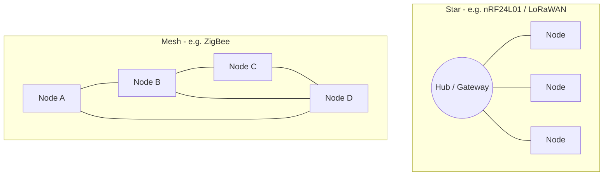
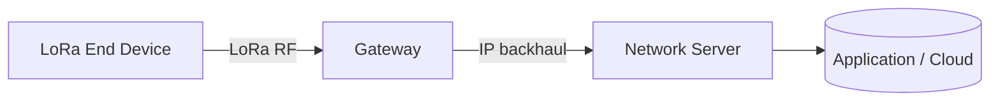
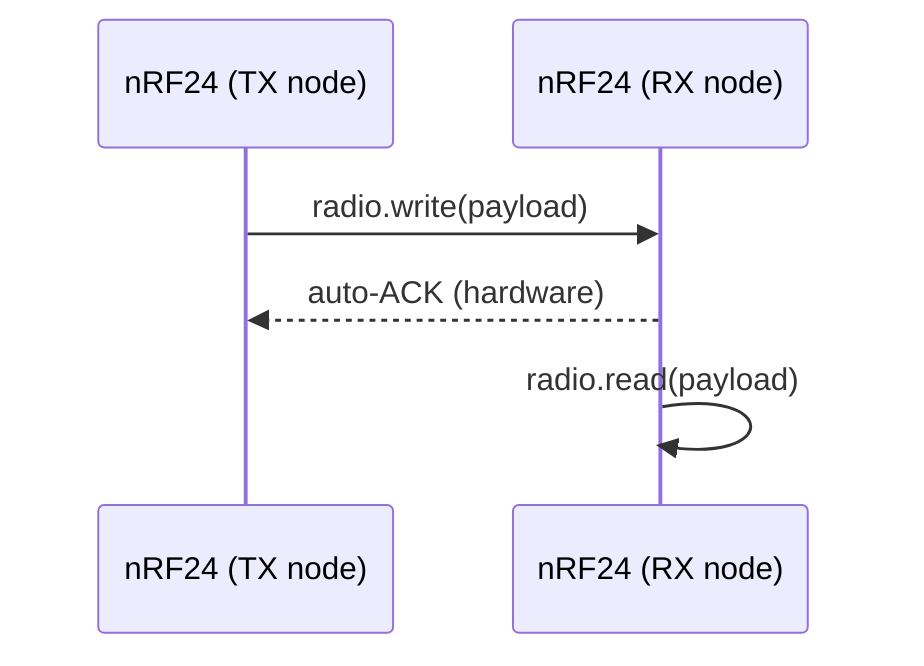

# Long Range Communication

## Overview

Bluetooth and Wi-Fi are great indoors, but many IoT deployments need to send small amounts
of data over **hundreds of metres to several kilometres** — across a farm, a factory, or a
city — often on **battery power for months**. That is the job of long-range, low-power radio
technologies.

This lesson surveys the main options an embedded engineer chooses between: **LoRa** (very long
range, low data rate), **ZigBee** (self-healing mesh networks), the **nRF24L01** (cheap 2.4 GHz
peer-to-peer), and **RF433** (ultra-simple one-way remotes). You will also learn what a **mesh
network** is and why it matters. This topic is marked *Optional Discussion* — treat it as an
architectural map so you can pick the right radio for a project.

---

## Learning Objectives

After this lesson you will be able to:

- Compare LoRa, ZigBee, nRF24L01, and RF433 by range, data rate, power, and topology.
- Explain the trade-off between **range and data rate**.
- Describe what a **mesh network** is and how it improves coverage and reliability.
- Wire an **nRF24L01** correctly (including its 3.3 V and power-decoupling needs).
- Write basic transmit/receive firmware for nRF24L01 and LoRa.
- Choose an appropriate long-range technology for a given IoT scenario.

---

## Prerequisites

- Completion of Lessons 1.1 (Bluetooth) and 1.2 (Wi-Fi).
- Understanding of **SPI** communication (most of these modules are SPI devices).
- Familiarity with **3.3 V logic** and the idea of frequency **bands** (433/868/915 MHz, 2.4 GHz).
- Awareness of regional radio regulations (allowed bands differ by country).

---

## Theory / Concept

### The range vs data-rate trade-off

Radios trade **throughput for distance and power**. A narrow, slow signal travels far on little
energy; a fast, wide signal needs more power and reaches less far.

| Technology | Band | Typical range | Data rate | Topology | Power |
|---|---|---|---|---|---|
| **LoRa** | 433 / 868 / 915 MHz (sub-GHz) | 2–15 km (LOS) | 0.3–50 kbps | Star (via LoRaWAN gateway) or P2P | Very low |
| **ZigBee** | 2.4 GHz (802.15.4) | 10–100 m per hop | ~250 kbps | **Mesh** | Low |
| **nRF24L01** | 2.4 GHz | 10–100 m (1 km w/ +PA/LNA) | 250 kbps–2 Mbps | Star / P2P (up to 6 pipes) | Low |
| **RF433 (ASK)** | 433 MHz | 20–100 m | ~1–10 kbps | One-way broadcast | Very low |

- **LoRa** ("Long Range") uses **chirp spread spectrum** to achieve extreme range and deep
  in-building penetration at tiny data rates. **LoRaWAN** is the network protocol/architecture
  built on LoRa (end-devices → gateways → network server).
- **ZigBee** (IEEE 802.15.4) is built for **mesh**: many low-power nodes relay for each other.
- **nRF24L01** is a cheap 2.4 GHz transceiver for **point-to-point / star** links between MCUs.
- **RF433** ASK/OOK modules are the simplest and cheapest — great for one-way remotes and
  doorbells, but no addressing or reliability on their own (often paired with the `RCSwitch`
  or `VirtualWire`/`RadioHead` libraries).

### What is a mesh network?

In a **star** topology every device talks directly to one hub; if a node is out of range, it is
lost. In a **mesh**, nodes **relay** messages for each other, so data hops node-to-node to reach
the destination. Meshes are **self-healing**: if one path fails, traffic reroutes. This extends
coverage and improves reliability — the core strength of ZigBee (and Thread).

---

## Architecture / Diagrams

**Star vs mesh topology:**



**LoRaWAN end-to-end architecture:**



**nRF24L01 transmit → receive sequence:**



---

## Syntax / API / Commands

**nRF24L01 with the `RF24` library:**

```cpp
#include <RF24.h>
RF24 radio(9, 10);              // CE pin, CSN pin
radio.begin();
radio.openWritingPipe(address); // TX side
radio.openReadingPipe(1, address); // RX side
radio.setPALevel(RF24_PA_LOW);  // power level
radio.write(&data, sizeof(data));   // send
radio.startListening();             // enter RX
radio.read(&data, sizeof(data));    // receive
```

**LoRa (Semtech SX127x) with the `LoRa` library:**

```cpp
#include <LoRa.h>
LoRa.begin(433E6);          // set frequency (433/868/915 MHz per region)
LoRa.beginPacket();
LoRa.print("hello");
LoRa.endPacket();           // transmit
LoRa.parsePacket();         // check for incoming
LoRa.read();                // read a byte
```

**RF433 with `RCSwitch` (simple remotes):**

```cpp
#include <RCSwitch.h>
RCSwitch sw = RCSwitch();
sw.enableTransmit(10);      // TX data pin
sw.send(1234, 24);          // send a 24-bit code
```

---

## Hardware Explanation

**nRF24L01 pinout (SPI device):**

| Pin | Name | Function | Notes |
|---|---|---|---|
| 1 | `GND` | Ground | Common |
| 2 | `VCC` | Power | **3.3 V only — 5 V destroys it** |
| 3 | `CE` | Chip Enable | RX/TX mode select |
| 4 | `CSN` | SPI chip select | Active low |
| 5 | `SCK` | SPI clock | To MCU SCK |
| 6 | `MOSI` | Master out | To MCU MOSI |
| 7 | `MISO` | Master in | To MCU MISO |
| 8 | `IRQ` | Interrupt (optional) | Signals events |

- **Voltage:** the nRF24L01 is a **3.3 V** part. Its logic inputs *tolerate* 5 V signalling from
  many MCUs, but **`VCC` must never exceed 3.3 V**.
- **Current / decoupling:** the module draws sharp current pulses when transmitting. The single
  biggest reliability fix is a **10 µF (plus 100 nF) capacitor directly across VCC–GND** at the
  module, or an adapter board with a regulator. Powering it from an Arduino's noisy 3.3 V pin
  without this cap is the #1 cause of "it won't communicate".
- **Protocol:** SPI to the MCU; over the air, nRF24 uses its own 2.4 GHz Enhanced ShockBurst
  with hardware auto-acknowledge and retransmit.
- **LoRa modules (SX1278/RA-02):** also **3.3 V SPI**, with an **antenna that must be attached
  before transmitting** (transmitting with no antenna can damage the PA). Choose the module
  frequency legal for your region (e.g., 865–867 MHz in India, 868 MHz EU, 915 MHz US).
- **Compatible boards:** Arduino UNO/Nano/Mega, ESP32, STM32 — any MCU with SPI and a clean
  3.3 V rail. On the ESP8266/ESP32, mind which GPIOs are safe for CE/CSN.

---

## Code Examples

### Example 1 — nRF24L01 transmitter

```cpp
#include <SPI.h>
#include <nRF24L01.h>
#include <RF24.h>

RF24 radio(9, 10);                       // CE = 9, CSN = 10
const byte address[6] = "NODE1";

void setup() {
  radio.begin();
  radio.openWritingPipe(address);        // where to send
  radio.setPALevel(RF24_PA_LOW);         // low power for bench testing
  radio.stopListening();                 // TX mode
}

void loop() {
  const char msg[] = "Hello";
  bool ok = radio.write(&msg, sizeof(msg));  // returns true on auto-ACK
  delay(1000);
}
```

### Example 2 — nRF24L01 receiver

```cpp
#include <SPI.h>
#include <nRF24L01.h>
#include <RF24.h>

RF24 radio(9, 10);
const byte address[6] = "NODE1";

void setup() {
  Serial.begin(9600);
  radio.begin();
  radio.openReadingPipe(1, address);     // must match TX address
  radio.setPALevel(RF24_PA_LOW);
  radio.startListening();                // RX mode
}

void loop() {
  if (radio.available()) {
    char msg[32] = "";
    radio.read(&msg, sizeof(msg));
    Serial.println(msg);                 // prints "Hello"
  }
}
```

*Explanation:* the two boards share the **same address** and **same PA level**. The TX side
`stopListening()`; the RX side `startListening()`. Hardware auto-ACK makes `write()` report
delivery success.

### Example 3 — LoRa sender (SX1278)

```cpp
#include <SPI.h>
#include <LoRa.h>

void setup() {
  Serial.begin(9600);
  if (!LoRa.begin(433E6)) {              // set your regional frequency
    Serial.println("LoRa init failed");
    while (1);
  }
}

void loop() {
  LoRa.beginPacket();
  LoRa.print("sensor=24.5");
  LoRa.endPacket();                       // transmit (antenna required!)
  delay(5000);                            // send every 5 s (respect duty cycle)
}
```

### Example 4 — RF433 simple remote (RCSwitch)

```cpp
#include <RCSwitch.h>
RCSwitch tx = RCSwitch();

void setup() { tx.enableTransmit(10); }   // data pin to RF433 TX module

void loop() {
  tx.send(5393, 24);                       // send a 24-bit code
  delay(2000);
}
```

*Explanation:* RF433 ASK modules have no addressing of their own; libraries like `RCSwitch`
encode a code word so a matching receiver can recognise it — perfect for basic remotes.

---

## Step-by-Step Hands-on Exercise

**Goal:** send a message between two Arduinos with nRF24L01 modules.

1. **Wire both modules** (identical wiring on each board):
   - `VCC → 3.3 V` (never 5 V), `GND → GND`.
   - `CE → D9`, `CSN → D10`, `SCK → D13`, `MOSI → D11`, `MISO → D12`.
   - Solder/attach a **10 µF cap across VCC–GND at each module**.
2. Upload **Example 1 (TX)** to board A and **Example 2 (RX)** to board B.
3. Open the Serial Monitor on **board B** at 9600 baud.
4. Power both boards.

**Expected output (board B):**

```
Hello
Hello
Hello
```

**Verification:**
- Board B prints `Hello` once per second.
- If nothing appears: check the **3.3 V** supply and the **decoupling cap**, confirm both use the
  **same address** and **PA level**, and verify the SPI wiring.

---

## Real World Applications

- **Smart agriculture:** LoRa soil-moisture and weather nodes spread across kilometres of fields.
- **Smart cities / utilities:** LoRaWAN water, gas, and parking meters reporting a few bytes a day.
- **Industrial monitoring:** ZigBee mesh of vibration/temperature sensors across a plant.
- **Home automation:** ZigBee (and Thread) devices — bulbs, sensors — forming a self-healing mesh.
- **Remotes and alarms:** RF433 for doorbells, garage doors, and simple sensors.
- **Robotics / drones:** nRF24L01 for low-latency local control links.

---

## Best Practices

- **Never exceed 3.3 V** on nRF24L01 / LoRa `VCC`; add the **decoupling capacitor**.
- **Attach the antenna before transmitting** on LoRa/RF modules.
- Pick the **legal frequency band** for your country and respect **duty-cycle** limits (esp. LoRa/LoRaWAN).
- Match **address, channel, data rate, and PA level** on both ends of an nRF24 link.
- Keep payloads **small** — these are low-data-rate links; send deltas, not raw dumps.
- For wide coverage and reliability, prefer a **mesh** (ZigBee/Thread) over a single long link.

---

## Common Mistakes

- **5 V into nRF24 `VCC`** — instantly destroys the module.
- **No decoupling cap** — intermittent or no communication (the classic nRF24 failure).
- **Mismatched address/PA/channel** — modules never "hear" each other.
- **Transmitting LoRa with no antenna** — can damage the power amplifier.
- **Ignoring regional bands / duty cycle** — illegal operation or blocked transmissions.
- **Expecting Wi-Fi-like throughput** — these carry bytes, not megabytes.

*Debugging tip:* for nRF24, fix **power first** (3.3 V + cap), then **wiring**, then **matching
settings** — in that order.

---

## Interview Questions

**Beginner**

1. *Why does LoRa reach kilometres while Wi-Fi doesn't?* LoRa uses chirp spread spectrum at low
   data rates in sub-GHz bands, trading throughput for range and penetration.
2. *What voltage does the nRF24L01 `VCC` require?* 3.3 V — 5 V destroys it.

**Intermediate**

3. *What is a mesh network and what is its advantage?* Nodes relay for each other, so coverage
   extends and the network self-heals when a path fails (ZigBee/Thread).
4. *Why does the nRF24L01 need a decoupling capacitor?* Its TX current pulses cause voltage dips;
   a 10 µF/100 nF cap stabilises the rail and makes the link reliable.

**Advanced**

5. *Contrast LoRa and LoRaWAN.* LoRa is the physical radio modulation; LoRaWAN is the MAC/network
   architecture (devices → gateways → network server) built on top of it.
6. *How would you choose between ZigBee and LoRa for a deployment?* ZigBee for dense, mid-range
   mesh with moderate data; LoRa for sparse, very-long-range nodes sending tiny payloads rarely.

---

## Self Assessment Quiz

1. Which reaches the **longest** range at low data rate? A) Wi-Fi  B) LoRa  C) BLE  D) nRF24
2. nRF24L01 `VCC` must be: A) 5 V  B) 3.3 V  C) 12 V  D) 1.8 V
3. ZigBee is designed primarily for: A) star only  B) mesh  C) point-to-point audio  D) 5 GHz
4. LoRaWAN architecture is: device → ___ → network server: A) router  B) gateway  C) switch  D) modem
5. The nRF24L01 talks to the MCU over: A) I2C  B) SPI  C) UART  D) CAN
6. A mesh network is valuable because it: A) is faster than Wi-Fi  B) self-heals and extends range  C) needs no power  D) uses 5 GHz
7. RF433 ASK modules are best for: A) video  B) simple one-way remotes  C) mesh sensors  D) cloud APIs
8. The #1 nRF24 reliability fix is: A) longer wires  B) a decoupling capacitor  C) 5 V power  D) removing the antenna
9. LoRa frequency should be chosen by: A) random  B) regional regulations  C) always 2.4 GHz  D) baud rate
10. Transmitting LoRa without an antenna can: A) boost range  B) damage the PA  C) save power  D) nothing
11. Which has the highest data rate here? A) LoRa  B) RF433  C) nRF24L01 (up to 2 Mbps)  D) LoRaWAN
12. ZigBee operates in which band? A) 433 MHz  B) 2.4 GHz (802.15.4)  C) 5 GHz  D) 60 GHz

**Answers:** 1-B, 2-B, 3-B, 4-B, 5-B, 6-B, 7-B, 8-B, 9-B, 10-B, 11-C, 12-B

---

## Assignment

**Mini task:** Build the two-node nRF24L01 link from the exercise and send a live sensor value
(e.g., temperature) instead of a fixed string.

**Portfolio project:** Design a **LoRa sensor node + gateway**: a battery node reads a sensor and
transmits every few minutes; a second board receives and prints/forwards the data. Document range
tests at several distances.

**Challenge task:** Sketch (and, if hardware allows, prototype) a **3-node relay**: node A is out
of direct range of node C, so node B relays A's messages to C — a minimal demonstration of the
mesh relaying principle.

---

## Summary

- Long-range radios trade **data rate for distance and battery life**.
- **LoRa** = extreme range, tiny data (LoRaWAN adds the network layer); **ZigBee** = low-power
  **mesh**; **nRF24L01** = cheap 2.4 GHz point-to-point/star; **RF433** = ultra-simple remotes.
- A **mesh** relays and self-heals, extending coverage beyond any single link.
- nRF24L01 / LoRa are **3.3 V SPI** parts — respect voltage, add **decoupling**, attach the
  **antenna**, and obey **regional bands**.

---

## Cheat Sheet

**Pick a radio**

| Need | Choose |
|---|---|
| Kilometres, tiny data, battery-years | LoRa / LoRaWAN |
| Many nodes, self-healing coverage | ZigBee (mesh) |
| Cheap MCU-to-MCU link | nRF24L01 |
| One-way remote / button | RF433 |

**nRF24L01 survival rules**

```text
VCC = 3.3 V ONLY
Add 10uF + 100nF across VCC-GND at the module
Match address + channel + PA level on both ends
Bus = SPI (CE, CSN, SCK, MOSI, MISO)
```

**Bands (region-dependent)**

| Tech | Band |
|---|---|
| LoRa | 433 / 868 / 915 MHz |
| ZigBee / nRF24 | 2.4 GHz |
| RF433 | 433 MHz |

---

## References

- Semtech LoRa / SX127x datasheets: https://www.semtech.com/lora
- LoRa Alliance — LoRaWAN specification: https://lora-alliance.org/
- Nordic nRF24L01+ product specification: https://www.nordicsemi.com/
- Zigbee (Connectivity Standards Alliance) / IEEE 802.15.4.
- `RF24`, `LoRa`, `RCSwitch`, `RadioHead` Arduino libraries.
- Learning OS internal references: `foundations/iot-hardware`, `foundations/iot-cloud`, `specializations/mqtt`.
