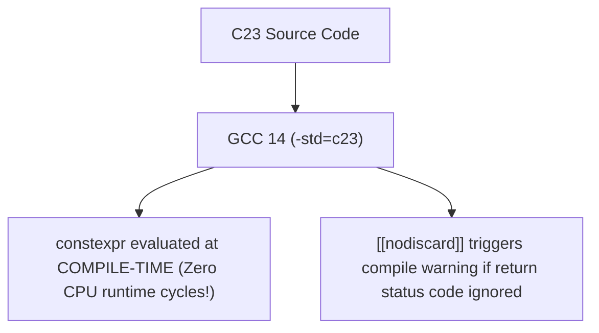

# Lesson 1.4 Modern C23 Features (`constexpr`, `typeof`, `auto`)

> **Course**: C Programming | **Module**: Module 1 | **Difficulty**: beginner

---

- **Estimated Time**: 45 Minutes (15m Reading | 20m Practice | 10m Quiz)
- **Difficulty Level**: ⭐⭐ Intermediate
- **Prerequisites**: C Syntax & Compilation
- **XP Reward**: +50 XP

### Learning Objectives
By the end of this lesson, you will be able to:
1. Define zero-overhead compile-time constants using C23 **`constexpr`**.
2. Perform type inference using **`auto`** and **`typeof`**.
3. Utilize standardized attributes (**`[[nodiscard]]`**, **`[[deprecated]]`**).
4. Native `bool`, `true`, and `false` built-in keywords without importing `<stdbool.h>`.

---

---

Ensure GCC 14+ or Clang 18+ is installed with C23 flag support (`-std=c23`).

---

---

### 3.1 The C23 Standard Evolution
ISO/IEC 9899:2024 (**C23**) is the newest modern revision of the C programming language. It modernizes low-level systems programming by incorporating features previously requiring compiler extensions or C++ parity:

```
┌─────────────────────────────────────────────────────────────────────────────┐
│                           C23 MODERN FEATURES MATRIX                        │
├─────────────────┬───────────────────────────────────────────────────────────┤
│ Keyword         │ C23 Feature Description                                   │
├─────────────────┼───────────────────────────────────────────────────────────┤
│ `constexpr`     │ Defines compile-time constant expressions (Zero runtime)  │
│ `auto`          │ Automatic type inference for variable declarations        │
│ `typeof(expr)`  │ Inspects and re-uses the static data type of an expression│
│ `[[nodiscard]]` │ Compiler warning if function return value is ignored      │
│ `bool`          │ Native primitive keyword (no `<stdbool.h>` required!)     │
└─────────────────┴───────────────────────────────────────────────────────────┘
```

---

---



---

---

```c
// C23 Modern Features (Compile with: gcc -std=c23 c23_demo.c -o c23_demo)

#include <stdio.stdio.h>

// 1. C23 Attribute: Warning if caller ignores return code!
[[nodiscard]] int initialize_sensor(int port) {
    if (port <= 0) return -1;
    return 0; // Success
}

int main(void) {
    // 2. C23 Native bool (No <stdbool.h> needed!)
    bool is_active = true;

    // 3. C23 constexpr (Compile-time evaluation!)
    constexpr int BUFFER_SIZE = 1024 * 4;
    constexpr double PI = 3.1415926535;

    // 4. C23 auto & typeof
    auto count = 42;             // Infers int
    typeof(count) copy_count = 10; // Infers type of count (int)

    printf("Buffer Size: %d bytes\n", BUFFER_SIZE);
    printf("Count: %d, Copy: %d\n", count, copy_count);

    // Initializing sensor (Compiler enforces checking return status!)
    int status = initialize_sensor(8080);
    if (status != 0) {
        printf("Sensor Init Failed!\n");
    }

    return 0;
}
```

---

---

- **Embedded Microcontroller Systems**: Using `constexpr` in C23 firmware places constants directly into read-only FLASH memory at compile time, saving precious RAM on bare-metal chips.

---

---

1. Save code as `c23_demo.c`.
2. Compile and run: `gcc -std=c23 c23_demo.c -o c23_demo && ./c23_demo`.

---

---

| Bug / Error | Root Cause | Engineering Solution |
| :--- | :--- | :--- |
| **`error: unknown type name 'constexpr'`** | Compiling C23 code using an older C11 compiler standard without `-std=c23`. | Upgrade GCC/Clang and pass `-std=c23` flag. |

---

---

- **Use `[[nodiscard]]` for Error Status Returns**: Prevents silent failure bugs in systems code.

---

---

### Q1: How does `constexpr` in C23 improve performance over standard `const` variables?
**Answer**: In C, a standard `const` variable is a read-only object allocated in memory at runtime. C23 `constexpr` guarantees that the value is evaluated entirely at compile time by the compiler, allowing it to be used in fixed-size array dimensions or placed directly into read-only flash memory with zero runtime memory overhead.

---

---

```json
{
  "quiz_title": "Lesson 1.4 C23 Features Assessment",
  "questions": [
    {
      "question_id": "Q1",
      "type": "multiple_choice",
      "question_text": "Which attribute triggers a compiler warning if a caller ignores a function's return value?",
      "options": ["[[deprecated]]", "[[nodiscard]]", "[[maybe_unused]]", "[[noreturn]]"],
      "correct_answer_index": 1,
      "explanation": "[[nodiscard]] warns callers if return values are ignored."
    }
  ]
}
```

---

---

Refactor a C11 bare-metal HAL driver to modern C23 using `constexpr` and `[[nodiscard]]`.

---

---

**Front**: Does C23 require `#include <stdbool.h>` to use `bool`, `true`, and `false`?
**Back**: No. `bool`, `true`, and `false` are native built-in keywords in C23.
<!-- flashcard:end -->

---

---

```c
constexpr int SIZE = 1024;
[[nodiscard]] int check_status(void);
```

---
