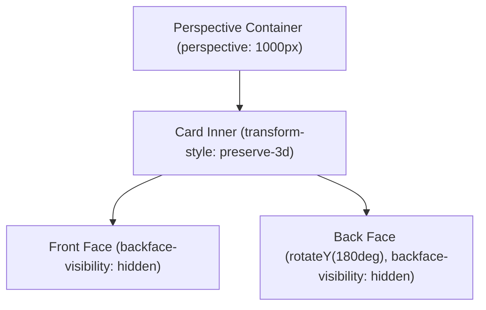

# 2D And 3D Transformations

> **Course**: Git Version Control | **Module**: Introduction | **Difficulty**: beginner

---

- **Estimated Time**: 55 Minutes (20m Reading | 25m Practice | 10m Quiz)
- **Difficulty Level**: ⭐⭐⭐ Advanced
- **Prerequisites**: [Lesson 5.1 CSS Transitions](file:///d:/My%20Drive/all%20files/PROJECT%20FILES/notes/docs/curriculum/_02_css3/_02_14_css_transitions.md)
- **XP Reward**: +70 XP

### Learning Objectives
By the end of this lesson, you will be able to:
1. Apply 2D transformation functions (`translate()`, `scale()`, `rotate()`, `skew()`).
2. Establish 3D spatial depth using `perspective` and `perspective-origin`.
3. Preserve 3D child hierarchy using `transform-style: preserve-3d`.
4. Build interactive 3D Card Flipping widgets using `rotateY(180deg)` and `backface-visibility: hidden`.
5. Adjust transform pivot centers using `transform-origin`.

---

---

Open VS Code and create `flip_card.html` to build a 3D card flipping component.

---

---

### 3.1 2D vs 3D Transform Functions

```
┌─────────────────────────────────────────────────────────────────────────────┐
│                          CSS TRANSFORM FUNCTIONS                            │
├─────────────────┬───────────────────────────────────────────────────────────┤
│ Function        │ Operation Description                                     │
├─────────────────┼───────────────────────────────────────────────────────────┤
│ `translate(x,y)`│ Moves element along X and Y axes (`translate(-50%, -50%)`).│
│ `scale(x, y)`   │ Scales element dimensions without affecting layout flow.  │
│ `rotate(deg)`   │ Rotates element 2D angle (e.g. `rotate(45deg)`).           │
│ `rotateY(deg)`  │ Rotates element 3D around vertical Y-axis.                │
│ `rotateX(deg)`  │ Rotates element 3D around horizontal X-axis.              │
└─────────────────┴───────────────────────────────────────────────────────────┘
```

### 3.2 3D Card Flipping Setup
To render 3D depth, the parent container requires `perspective: 1000px`, the card inner container requires `transform-style: preserve-3d`, and card faces use `backface-visibility: hidden`:

```css
.card-container { perspective: 1000px; }
.card-inner     { transform-style: preserve-3d; transition: transform 0.6s; }
.card-container:hover .card-inner { transform: rotateY(180deg); }
.card-front, .card-back { backface-visibility: hidden; position: absolute; top:0; left:0; }
.card-back      { transform: rotateY(180deg); }
```

---

---



---

---

```html
<!DOCTYPE html>
<html lang="en">
<head>
  <meta charset="UTF-8">
  <title>3D Card Flip Demo</title>
  <style>
    body { font-family: system-ui; padding: 4rem; background: #0f172a; color: #fff; }
    
    .scene { width: 300px; height: 200px; perspective: 1000px; }
    .card {
      width: 100%; height: 100%; position: relative;
      transform-style: preserve-3d; transition: transform 0.8s cubic-bezier(0.4, 0, 0.2, 1);
      cursor: pointer;
    }
    .scene:hover .card { transform: rotateY(180deg); }
    
    .face {
      position: absolute; width: 100%; height: 100%;
      backface-visibility: hidden; border-radius: 12px; padding: 20px;
      display: flex; align-items: center; justify-content: center; box-sizing: border-box;
    }
    .front { background: #1e293b; border: 2px solid #3b82f6; }
    .back  { background: #3b82f6; transform: rotateY(180deg); }
  </style>
</head>
<body>
  <div class="scene">
    <div class="card">
      <div class="face front"><h3>Front: Hover Me</h3></div>
      <div class="face back"><h3>Back: 3D Telemetry</h3></div>
    </div>
  </div>
</body>
</html>
```

---

---

- **Interactive 3D UI Flashcards**: E-learning platforms and dashboard widget panels use 3D card flips to show secondary metric details without taking extra page space.

---

---

1. Save code as `flip_card.html`.
2. Hover over card in Chrome $\rightarrow$ Observe smooth 3D Y-axis card flip!

---

---

| Bug / Error | Root Cause | Engineering Solution |
| :--- | :--- | :--- |
| **Back Face Visible Through Front** | Omitting `backface-visibility: hidden` on card faces. | Add `backface-visibility: hidden;` to both front and back faces. |

---

---

- **Use `perspective` on Parent**: Required for 3D depth perception.

---

---

### Q1: What does `transform-style: preserve-3d` do?
**Answer**: It instructs the browser to render child elements in true 3D space relative to their parent, rather than flattening children into a 2D plane.

---

---

```json
{
  "quiz_title": "Lesson 5.2 3D Transforms Assessment",
  "questions": [
    {
      "question_id": "Q1",
      "type": "multiple_choice",
      "question_text": "Which property hides the back side of a 3D rotated element from facing the viewer?",
      "options": ["backface-visibility: hidden", "display: none", "visibility: hidden", "opacity: 0"],
      "correct_answer_index": 0,
      "explanation": "backface-visibility: hidden prevents rendering the reverse side of 3D rotated nodes."
    }
  ]
}
```

---

---

Build a 3D rotating cube showcasing 6 data metrics on each face using CSS 3D transforms.

---

---

**Front**: What property sets the 3D depth distance for transform calculations?
**Back**: `perspective: 1000px;` (set on parent container).
<!-- flashcard:end -->

---

---

```css
.card { transform-style: preserve-3d; transition: transform 0.6s; }
.card:hover { transform: rotateY(180deg); }
```

---
