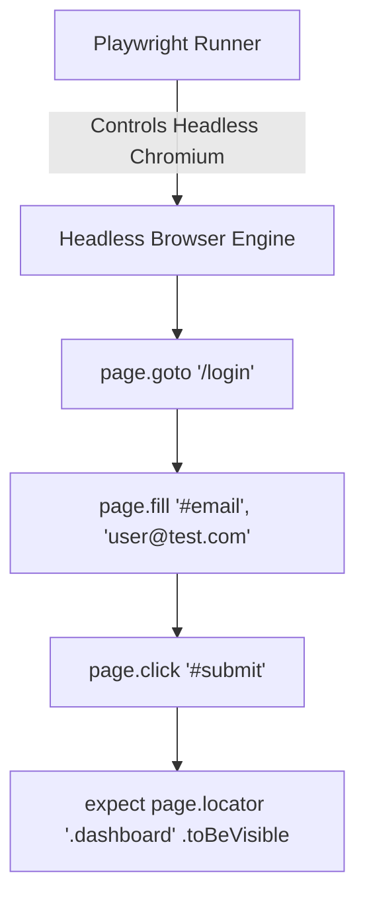

# E2E Testing With Playwright

> **Course**: Git Version Control | **Module**: Introduction | **Difficulty**: beginner

---

- **Estimated Time**: 55 Minutes (20m Reading | 25m Practice | 10m Quiz)
- **Difficulty Level**: ⭐⭐ Intermediate
- **Prerequisites**: [Lesson 12.4 Vitest](file:///d:/My%20Drive/all%20files/PROJECT%20FILES/notes/docs/curriculum/_03_javascript/_03_45_javascript_unit_testing_with_vitest.md)
- **XP Reward**: +60 XP

### Learning Objectives
By the end of this lesson, you will be able to:
1. Understand **End-to-End (E2E)** browser automation testing.
2. Configure **Playwright** test runners across Chrome, Firefox, and Safari engines.
3. Simulate user interactions (`page.goto()`, `page.click()`, `page.fill()`).
4. Perform web UI assertions using `expect(page.locator()).toBeVisible()`.

---

---

Open terminal with Node.js 18+.

---

---

### 3.1 Unit Testing vs End-to-End (E2E) Testing
While Unit Tests (Vitest) test isolated JavaScript functions in memory, **End-to-End (E2E) Testing** controls real headless browser engines to verify that the entire web application (UI, DOM, routing, APIs) works seamlessly from the end user's perspective.

```
┌─────────────────────────────────────────────────────────────────────────────┐
│                      UNIT TESTING VS E2E TESTING MATRIX                     │
├─────────────────┬──────────────────────────────────┬────────────────────────┤
│ Feature         │ Unit Testing (Vitest)            │ E2E Testing (Playwright)│
├─────────────────┼──────────────────────────────────┼────────────────────────┤
│ Scope           │ Single function / component      │ Full user workflow     │
│ Execution Speed │ Milliseconds                     │ Seconds                │
│ Browser Context │ Node.js / jsdom                  │ Chromium, Firefox, WebKit│
└─────────────────┴──────────────────────────────────┴────────────────────────┘
```

---

---



---

---

### Playwright Test Suite: `dashboard.spec.js`

```javascript
import { test, expect } from "@playwright/test";

test.describe("IoT Telemetry Dashboard E2E Tests", () => {
  test("should allow user to filter active sensor cards", async ({ page }) => {
    // 1. Navigate to Web Application
    await page.goto("http://localhost:3000");

    // 2. Interact with DOM Elements
    await page.fill("#search-input", "ESP32");
    await page.click("#btn-filter");

    // 3. Assert Visual & DOM State
    const card = page.locator(".sensor-card").first();
    await expect(card).toBeVisible();
    await expect(card).toContainText("ESP32");
  });
});
```

---

---

- **E-Commerce Checkout Testing**: Retailers run Playwright E2E suites before deployments to verify that users can add items to carts, enter shipping info, and process credit card payments without UI errors.

---

---

1. Run `npm init playwright@latest` in project directory.
2. Execute `npx playwright test --headed` $\to$ Watch Playwright automate browser clicks live!

---

---

| Bug / Error | Root Cause | Engineering Solution |
| :--- | :--- | :--- |
| **Flaky Tests (Timing Issues)** | Using hardcoded `setTimeout()` waiting for async DOM elements to load. | Rely on Playwright auto-waiting locators (`expect(locator).toBeVisible()`). |

---

---

- **Use User-Facing Locators**: Prefer `page.getByRole()` and `page.getByText()` over fragile CSS selectors.

---

---

### Q1: Why is Playwright preferred over older Selenium or Puppeteer testing frameworks?
**Answer**: Playwright supports all major browser engines (Chromium, Firefox, WebKit) out of the box with zero external drivers, features native auto-waiting (eliminating artificial sleep calls), runs tests in parallel using isolated browser contexts, and includes network request mocking.

---

---

```json
{
  "quiz_title": "Lesson 12.5 Playwright Assessment",
  "questions": [
    {
      "question_id": "Q1",
      "type": "multiple_choice",
      "question_text": "Which Playwright method simulates typing input into a form text field?",
      "options": ["page.type()", "page.fill()", "page.write()", "page.input()"],
      "correct_answer_index": 1,
      "explanation": "page.fill() inputs text into form fields."
    }
  ]
}
```

---

---

Build an E2E Playwright test verifying form validation and dynamic card creation.

---

---

**Front**: Does Playwright automatically wait for elements to be visible before clicking?
**Back**: Yes. Playwright features built-in auto-waiting for element visibility and stability.
<!-- flashcard:end -->

---

---

```javascript
await page.goto(url);
await page.click("#btn");
await expect(page.locator(".card")).toBeVisible();
```

---
