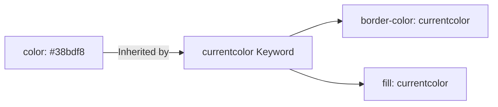

# Modern Css Color Systems

> **Course**: Git Version Control | **Module**: Introduction | **Difficulty**: beginner

---

- **Estimated Time**: 55 Minutes (20m Reading | 25m Practice | 10m Quiz)
- **Difficulty Level**: ⭐⭐ Intermediate
- **Prerequisites**: [Lesson 4.1 Advanced Typography](file:///d:/My%20Drive/all%20files/PROJECT%20FILES/notes/docs/curriculum/_02_css3/_02_10_advanced_typography_and_web_fonts.md)
- **XP Reward**: +60 XP

### Learning Objectives
By the end of this lesson, you will be able to:
1. Deconstruct Hexadecimal, RGB/RGBA, and HSL/HSLA color notations.
2. Utilize perceptually uniform modern color spaces (**`oklch()`** and `oklab()`).
3. Mix color spaces dynamically using the CSS **`color-mix()`** function.
4. Manage alpha channel transparency without affecting child element opacities.
5. Apply the **`currentcolor`** keyword for DRY, themeable icon styling.

---

---

Open VS Code and create `color_demo.html` to experiment with modern CSS color syntax.

---

---

### 3.1 Evolution of CSS Color Functions

```
Hex / RGB ──► HSL / HSLA ──► Modern Syntax rgb(r g b / a) ──► Perceptually Uniform oklch(L C H / a)
```

- **Hexadecimal**: `#0f172a` or `#0f172aff` (Includes 8-digit alpha).
- **HSL**: `hsl(217deg 91% 60% / 0.8)` (Hue, Saturation, Lightness, Alpha).
- **`oklch()`**: Perceptually uniform color space where lightness changes feel natural to human vision across all hues.

### 3.2 The `color-mix()` Function
`color-mix()` blends two colors in a specified color space dynamically in CSS:

```css
/* Mix 80% Blue with 20% White in OKLCH space */
.tinted-box {
  background-color: color-mix(in oklch, #3b82f6 80%, #ffffff);
}
```

### 3.3 The `currentcolor` Keyword
`currentcolor` acts as a dynamic CSS variable referencing the element's computed `color` property value:

```css
.btn {
  color: #38bdf8;
  border: 2px solid currentcolor; /* Automatically matches text color #38bdf8! */
}
```

---

---



---

---

```html
<!DOCTYPE html>
<html lang="en">
<head>
  <meta charset="UTF-8">
  <title>Modern Color Systems</title>
  <style>
    body { font-family: system-ui; padding: 2rem; background: #0f172a; color: #fff; }
    
    /* Modern oklch color */
    .oklch-card {
      background: oklch(0.3 0.1 250 / 0.9);
      border: 2px solid currentcolor;
      color: #38bdf8;
      padding: 1.5rem;
      border-radius: 8px;
    }
  </style>
</head>
<body>
  <div class="oklch-card">
    <h3>OKLCH Perceptual Color Card</h3>
    <p>Border color inherits matching text color via currentcolor keyword.</p>
  </div>
</body>
</html>
```

---

---

- **Themeable Icon Libraries**: SVG icons use `fill: currentcolor` so changing text color automatically recolors icons without extra CSS rules.

---

---

1. Save code as `color_demo.html`.
2. Inspect `.oklch-card` in Chrome DevTools $\rightarrow$ Change `color: #38bdf8` to `#22c55e` $\rightarrow$ Observe border updates instantly via `currentcolor`!

---

---

| Bug / Error | Root Cause | Engineering Solution |
| :--- | :--- | :--- |
| **Child Elements Become Transparent** | Using `opacity: 0.5` on parent container instead of alpha channel colors (`rgba` / `hsla` / `oklch`). | Use background alpha transparency (`background: rgb(0 0 0 / 0.5)`) instead of `opacity`. |

---

---

- **Use `currentcolor` for Borders & SVG Fills**: Keeps icon and border colors in sync.
- **Adopt `oklch()` for Color Palettes**: Guarantees consistent visual lightness across themes.

---

---

### Q1: What makes `oklch()` superior to traditional `hsl()`?
**Answer**: HSL is not perceptually uniform—yellow at 50% lightness appears much brighter than blue at 50% lightness. `oklch()` is engineered so 50% lightness appears identically bright to human eyes across all color hues, enabling predictable palette generation.

---

---

```json
{
  "quiz_title": "Lesson 4.2 Color Systems Assessment",
  "questions": [
    {
      "question_id": "Q1",
      "type": "multiple_choice",
      "question_text": "Which CSS keyword references the element's current computed `color` property value?",
      "options": ["inherit", "currentcolor", "color-self", "auto"],
      "correct_answer_index": 1,
      "explanation": "currentcolor evaluates to the computed color property value."
    }
  ]
}
```

---

---

Build a dynamically themed UI component set using `currentcolor` and `color-mix()`.

---

---

**Front**: What CSS function blends two colors dynamically in a specific color space?
**Back**: `color-mix(in oklch, color1 50%, color2)`
<!-- flashcard:end -->

---

---

```css
.card { color: #38bdf8; border: 2px solid currentcolor; }
```

---
