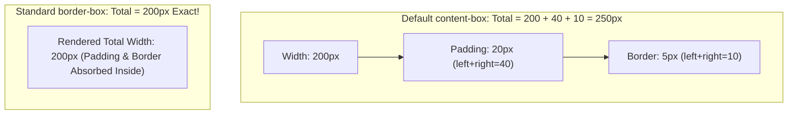

# The Css Box Model

> **Course**: Git Version Control | **Module**: Introduction | **Difficulty**: beginner

---

- **Estimated Time**: 45 Minutes (15m Reading | 20m Practice | 10m Quiz)
- **Difficulty Level**: ⭐ Beginner
- **Prerequisites**: [Lesson 1.1 CSS Syntax](file:///d:/My%20Drive/all%20files/PROJECT%20FILES/notes/docs/curriculum/_02_css3/_02_01_css_syntax_and_inclusion_methods.md)
- **XP Reward**: +50 XP

### Learning Objectives
By the end of this lesson, you will be able to:
1. Deconstruct an element into its four Box Model layers: Content, Padding, Border, and Margin.
2. Contrast `box-sizing: content-box` (default) with `box-sizing: border-box`.
3. Implement the Universal Box Sizing Reset pattern across all stylesheets.
4. Diagnose and prevent vertical **Margin Collapsing** bugs.

---

---

Inspect the interactive Box Model diagram in Chrome DevTools:
- Open DevTools (`F12`) $\rightarrow$ Click **Elements** tab $\rightarrow$ Scroll to bottom of **Styles** panel to see the live color-coded Box Model diagram.

---

---

### 3.1 The 4 Box Model Layers

```
┌─────────────────────────────────────────────────────────┐
│ MARGIN (Transparent space outside border)               │
│  ┌───────────────────────────────────────────────────┐  │
│  │ BORDER (Border surrounding padding)               │  │
│  │  ┌─────────────────────────────────────────────┐  │  │
│  │  │ PADDING (Space around content)              │  │  │
│  │  │  ┌───────────────────────────────────────┐  │  │  │
│  │  │  │ CONTENT (Inner text, images, inputs)   │  │  │  │
│  │  │  └───────────────────────────────────────┘  │  │  │
│  │  └─────────────────────────────────────────────┘  │  │
│  └───────────────────────────────────────────────────┘  │
└─────────────────────────────────────────────────────────┘
```

### 3.2 `content-box` vs `border-box`

- **`content-box` (Default)**: `width` sets content area size only. Total rendered width = `width` + `padding-left` + `padding-right` + `border-left` + `border-right`.
- **`border-box` (Production Standard)**: `width` sets total element width including padding and border!

```css
/* Universal Box Sizing Reset Pattern */
*, *::before, *::after {
  box-sizing: border-box;
}
```

### 3.3 Margin Collapsing Mechanics
Top and bottom margins of adjacent vertical block boxes collapse into a single margin equal to the **largest** of the two margins (e.g. 30px margin-bottom + 20px margin-top = 30px collapsed margin).

---

---



---

---

```html
<!DOCTYPE html>
<html lang="en">
<head>
  <meta charset="UTF-8">
  <title>Box Model Reset</title>
  <style>
    *, *::before, *::after { box-sizing: border-box; }
    .card { width: 300px; padding: 20px; border: 5px solid #3b82f6; background: #0f172a; color: #fff; }
  </style>
</head>
<body>
  <div class="card">Total rendered width is exactly 300px!</div>
</body>
</html>
```

---

---

- Every modern CSS framework (Tailwind, Bootstrap) applies `box-sizing: border-box` globally to prevent layout grid calculation bugs.

---

---

1. Save code as `box_demo.html` in Chrome.
2. Inspect `.card` in DevTools $\rightarrow$ Verify computed width is exactly 300px.

---

---

| Bug / Error | Root Cause | Engineering Solution |
| :--- | :--- | :--- |
| **Grid Items Overflow Container** | Forgetting to include universal `box-sizing: border-box` reset. | Add `*, *::before, *::after { box-sizing: border-box; }` at top of CSS file. |

---

---

- **Always Reset Box Sizing**: Apply `border-box` globally.

---

---

### Q1: Why is `box-sizing: border-box` preferred over `content-box`?
**Answer**: Under `content-box`, adding padding or borders increases element total rendered dimensions, breaking percentage-based grid layouts. `border-box` keeps total width fixed, simplifying layout math.

---

---

```json
{
  "quiz_title": "Lesson 2.1 Box Model Assessment",
  "questions": [
    {
      "question_id": "Q1",
      "type": "multiple_choice",
      "question_text": "Under `box-sizing: border-box`, what is the total width of an element with width: 200px, padding: 20px, border: 5px?",
      "options": ["200px", "225px", "250px", "210px"],
      "correct_answer_index": 0,
      "explanation": "border-box includes padding and border inside the declared 200px width."
    }
  ]
}
```

---

---

Build a 3-column card layout verified with 0 pixel calculation overflow using `border-box`.

---

---

**Front**: What property-value pair prevents padding from expanding element width?
**Back**: `box-sizing: border-box;`
<!-- flashcard:end -->

---

---

```css
*, *::before, *::after { box-sizing: border-box; }
```

---
