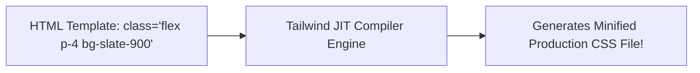

# Utility First Css And Tailwind Introduction

> **Course**: Git Version Control | **Module**: Introduction | **Difficulty**: beginner

---

- **Estimated Time**: 55 Minutes (20m Reading | 25m Practice | 10m Quiz)
- **Difficulty Level**: ⭐⭐ Intermediate
- **Prerequisites**: [Lesson 7.2 Modern CSS Architecture](file:///d:/My%20Drive/all%20files/PROJECT%20FILES/notes/docs/curriculum/_02_css3/_02_22_modern_css_architecture_and_methodologies.md)
- **XP Reward**: +60 XP

### Learning Objectives
By the end of this lesson, you will be able to:
1. Explain the architectural paradigm shift from Semantic BEM CSS to **Utility-First CSS**.
2. Configure Tailwind CSS using the standalone Tailwind CLI compiler.
3. Compose complex user interfaces directly in HTML using atomic utility classes.
4. Apply responsive modifier prefixes (`md:flex`, `lg:grid-cols-3`).
5. Extract reusable component classes using the `@apply` directive.

---

---

Initialize a Tailwind project using Node.js:
- Open Terminal $\rightarrow$ Run `npx tailwindcss init -p`.

---

---

### 3.1 Semantic CSS vs Utility-First CSS

```
┌─────────────────────────────────────────────────────────────────────────────┐
│                    SEMANTIC BEM VS UTILITY-FIRST TAILWIND                   │
├─────────────────┬──────────────────────────────────┬────────────────────────┤
│ Characteristic  │ Semantic CSS (BEM)               │ Utility-First (Tailwind)│
├─────────────────┼──────────────────────────────────┼────────────────────────┤
│ Naming Task     │ High (Inventing `.card__body`)   │ Zero (No class naming!)│
│ File Context    │ Constant context switching       │ Co-located inside HTML │
│ CSS File Size   │ Grows linearly with new pages    │ Caps out (reuses same utilities)│
└─────────────────┴──────────────────────────────────┴────────────────────────┘
```

### 3.2 Component Extraction (`@apply`)
When utility classes repeat frequently in HTML, extract them into custom CSS components using `@apply`:

```css
@layer components {
  .btn-primary {
    @apply bg-blue-600 hover:bg-blue-700 text-white font-bold py-2 px-4 rounded-lg transition;
  }
}
```

---

---



---

---

```html
<!DOCTYPE html>
<html lang="en">
<head>
  <meta charset="UTF-8">
  <meta name="viewport" content="width=device-width, initial-scale=1.0">
  <title>Tailwind Utility-First Demo</title>
  <script src="https://cdn.tailwindcss.com"></script>
</head>
<body class="bg-slate-900 text-slate-100 p-8 font-sans">

  <!-- Responsive Utility-First Card -->
  <div class="max-w-md mx-auto bg-slate-800 rounded-xl shadow-lg p-6 border border-slate-700 hover:border-sky-500 transition">
    <div class="flex items-center space-x-4">
      <div class="p-3 bg-sky-500/10 text-sky-400 rounded-lg">📟</div>
      <div>
        <h3 class="text-lg font-bold text-white">ESP32 Gateway Node</h3>
        <p class="text-sm text-slate-400">Status: Operational</p>
      </div>
    </div>
  </div>

</body>
</html>
```

---

---

- **Modern Web Development**: Companies like OpenAI, GitHub, and Vercel build frontend production UIs using Tailwind CSS for rapid iteration speed.

---

---

1. Save code as `tailwind_demo.html`.
2. Open in Chrome $\rightarrow$ Inspect element $\rightarrow$ Observe utility class composition styling the card!

---

---

| Bug / Error | Root Cause | Engineering Solution |
| :--- | :--- | :--- |
| **HTML Class Clutter** | Overusing long utility chains on identical repeated buttons. | Extract common button classes into `@apply` components inside CSS. |

---

---

- **Use Tailwind Play CDN for Prototypes**: Use Tailwind CLI in production.

---

---

### Q1: What is the main benefit of Utility-First CSS over traditional semantic CSS?
**Answer**: It eliminates context switching between HTML and CSS files, prevents CSS bundle sizes from growing continuously as new pages are built, and speeds up UI development by reusing standard design system tokens.

---

---

```json
{
  "quiz_title": "Lesson 8.1 Tailwind Assessment",
  "questions": [
    {
      "question_id": "Q1",
      "type": "multiple_choice",
      "question_text": "Which Tailwind directive extracts utility class combinations into reusable custom CSS rules?",
      "options": ["@apply", "@include", "@extend", "@use"],
      "correct_answer_index": 0,
      "explanation": "@apply extracts utility classes into CSS component classes."
    }
  ]
}
```

---

---

Rebuild a complex dashboard component using Tailwind CSS utility classes.

---

---

**Front**: How do you write an arbitrary value (e.g. 13px padding) in Tailwind CSS?
**Back**: `p-[13px]` (square brackets denote arbitrary values).
<!-- flashcard:end -->

---

---

```html
<div class="flex items-center justify-between p-4 bg-slate-900 text-white"></div>
```

---
