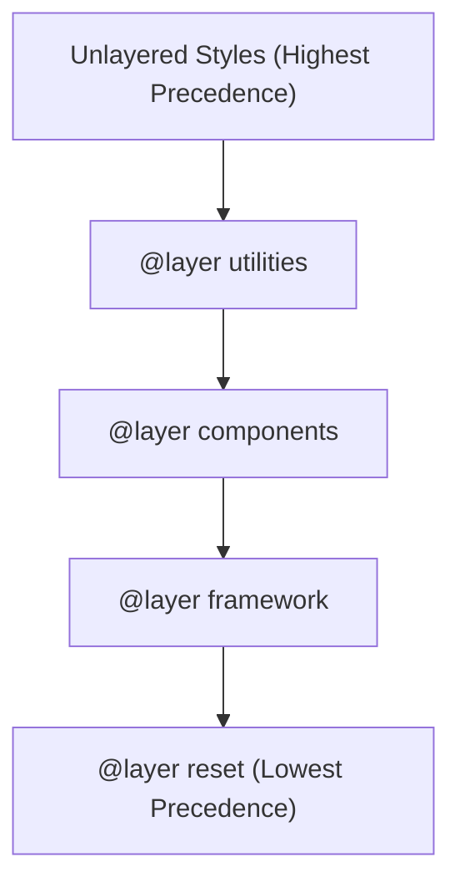

# Lesson 1.3 Cascade, Specificity, & Inheritance

> **Course**: Css3 | **Module**: Module 1 | **Difficulty**: beginner

---

- **Estimated Time**: 55 Minutes (20m Reading | 25m Practice | 10m Quiz)
- **Difficulty Level**: ⭐⭐⭐ Advanced
- **Prerequisites**: [Lesson 1.2 Comprehensive Selector Systems](file:///d:/My%20Drive/all%20files/PROJECT%20FILES/notes/docs/curriculum/_02_css3/_02_02_comprehensive_selector_systems.md)
- **XP Reward**: +70 XP

### Learning Objectives
By the end of this lesson, you will be able to:
1. Trace the 4-stage **Cascade Algorithm** (Origin/Importance $\to$ Layer $\to$ Specificity $\to$ Order of Appearance).
2. Calculate exact Specificity Score Vectors `(Inline, IDs, Classes/Attributes, Elements)`.
3. Evaluate the `!important` flag mechanics and refactor specificity anti-patterns.
4. Distinguish between Inherited and Non-Inherited CSS properties.
5. Apply explicit inheritance keywords (`inherit`, `initial`, `unset`, `revert`, `revert-layer`).
6. Architect scalable CSS using **Cascade Layers (`@layer`)** to eliminate specificity wars.

---

---

Inspect calculated specificity and inherited properties in Chrome DevTools:
- Open DevTools (`F12`) $\rightarrow$ Click **Elements** tab $\rightarrow$ Inspect **Computed** sub-panel.

---

---

### 3.1 The Cascade Algorithm
When multiple CSS rules target the same DOM element property, the browser resolves conflicts using the **Cascade Algorithm** precedence order:

1. **Origin & Importance**: User-Agent styles < Author styles < Author `!important` < User `!important` < User-Agent `!important`.
2. **Cascade Layer Precedence**: Unlayered styles override `@layer` styles; earlier `@layer` declarations yield to later `@layer` declarations.
3. **Specificity Score**: Highest vector score wins.
4. **Order of Appearance**: Last declared rule wins if specificity vector is equal.

### 3.2 Specificity Calculation Vector Matrix `(A, B, C, D)`

```
┌─────────────────────────────────────────────────────────────────────────────┐
│                       SPECIFICITY VECTOR SCORE MATRIX                       │
├───────────────┬────────────────────────────────────────┬────────────────────┤
│ Vector Column │ Target Selector Category               │ Example Score      │
├───────────────┼────────────────────────────────────────┼────────────────────┤
│ A (Inline)    │ Inline `style="..."` attribute         │ (1, 0, 0, 0)       │
├───────────────┼────────────────────────────────────────┼────────────────────┤
│ B (IDs)       │ ID Selectors (`#header`, `#nav`)       │ (0, 1, 0, 0)       │
├───────────────┼────────────────────────────────────────┼────────────────────┤
│ C (Classes)   │ Class (`.btn`), Attribute (`[type]`),   │ (0, 0, 1, 0)       │
│               │ Pseudo-classes (`:hover`, `:first-child`)                   │
├───────────────┼────────────────────────────────────────┼────────────────────┤
│ D (Elements)  │ Type/Element (`div`, `h1`),            │ (0, 0, 0, 1)       │
│               │ Pseudo-elements (`::before`, `::after`)│                    │
└───────────────┴────────────────────────────────────────┴────────────────────┘
```

#### Specificity Scoring Examples
- `h1`: `(0, 0, 0, 1)` = 1 point
- `h1.title`: `(0, 0, 1, 1)` = 11 points
- `#main-header .title`: `(0, 1, 1, 0)` = 110 points
- `#main-header div.card p.text`: `(0, 1, 2, 2)` = 122 points

> [!NOTE]
> Specificity is a vector, NOT a decimal system! Column B (IDs) can never be overcome by 100 Column C (Classes). `(0, 1, 0, 0)` beats `(0, 0, 99, 99)`.

### 3.3 Cascade Layers (`@layer`) Architecture
Modern CSS introduces `@layer` to isolate third-party library styles (e.g. Bootstrap) from custom application code without resorting to `!important`:

```css
/* Establish Layer Precedence Order (left = lowest, right = highest) */
@layer reset, framework, components, utilities;

@layer framework {
  .btn { background: blue; } /* Overridden by components layer regardless of specificity! */
}

@layer components {
  .btn { background: green; } /* Wins! */
}
```

---

---

### Cascade Layer Precedence Hierarchy


---

---

```html
<!DOCTYPE html>
<html lang="en">
<head>
  <meta charset="UTF-8">
  <title>Cascade & Layer Architecture</title>
  <style>
    /* 1. Define Layer Order */
    @layer base, theme;

    @layer base {
      /* Specificity (0, 1, 0, 0) */
      #btn-submit {
        background-color: #ef4444;
        color: #ffffff;
        padding: 12px 24px;
      }
    }

    @layer theme {
      /* Specificity (0, 0, 1, 0) - WINS over base layer despite lower specificity! */
      .primary-btn {
        background-color: #22c55e;
      }
    }
  </style>
</head>
<body>

  <button id="btn-submit" class="primary-btn">Submit Telemetry</button>

</body>
</html>
```

---

---

- **Overriding Third-Party Libraries**: `@layer` allows engineering teams to wrap legacy framework styles (e.g. Bootstrap) inside `@layer vendor` so local custom classes (`@layer app`) override framework styles without `!important`.

---

---

1. Save code as `cascade_demo.html`.
2. Open in Chrome $\rightarrow$ Inspect button $\rightarrow$ Observe `.primary-btn` in `@layer theme` wins over `#btn-submit`!

---

---

| Bug / Error | Root Cause | Engineering Solution |
| :--- | :--- | :--- |
| **`!important` Specificity Wars** | Overusing `!important` to force style overrides, locking out future utility styles. | Use `@layer` architecture to control precedence cleanly. |

---

---

- **Avoid `!important`**: Restrict `!important` to utility classes (`.hidden { display: none !important; }`).
- **Adopt `@layer` Architecture**: Define `@layer reset, vendor, components, utilities;`.

---

---

### Q1: How do `@layer` declarations alter standard specificity calculations?
**Answer**: Styles in a later-declared `@layer` take precedence over styles in earlier `@layer` declarations, **regardless** of selector specificity. Unlayered styles always override layered styles.

---

---

```json
{
  "quiz_title": "Lesson 1.3 Cascade Assessment",
  "questions": [
    {
      "question_id": "Q1",
      "type": "multiple_choice",
      "question_text": "Which specificity score vector represents an ID selector `#header`?",
      "options": ["(1, 0, 0, 0)", "(0, 1, 0, 0)", "(0, 0, 1, 0)", "(0, 0, 0, 1)"],
      "correct_answer_index": 1,
      "explanation": "ID selectors contribute 1 point to Column B (0, 1, 0, 0)."
    }
  ]
}
```

---

---

Refactor an legacy CSS codebase containing 10 `!important` flags into clean `@layer` architecture.

---

---

**Front**: Which takes precedence: unlayered CSS or styles inside an `@layer` block?
**Back**: Unlayered CSS always takes precedence over layered CSS.
<!-- flashcard:end -->

---

---

```css
@layer base, theme;
@layer theme { .btn { background: green; } }
```

---
