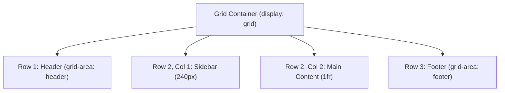

# Lesson 3.2 CSS Grid Layout System

> **Course**: Css3 | **Module**: Module 1 | **Difficulty**: beginner

---

- **Estimated Time**: 65 Minutes (25m Reading | 30m Practice | 10m Quiz)
- **Difficulty Level**: ⭐⭐⭐ Advanced
- **Prerequisites**: [Lesson 3.1 Flexible Box Layout](file:///d:/My%20Drive/all%20files/PROJECT%20FILES/notes/docs/curriculum/_02_css3/_02_08_flexible_box_layout_flexbox.md)
- **XP Reward**: +70 XP

### Learning Objectives
By the end of this lesson, you will be able to:
1. Define 2-dimensional grid layouts using `display: grid`.
2. Define flexible grid tracks using `grid-template-columns`, `grid-template-rows`, and fractional (`fr`) units.
3. Build responsive zero-media-query grids using `repeat(auto-fit, minmax(250px, 1fr))`.
4. Design visual page structures using Named Grid Areas (`grid-template-areas`).
5. Utilize CSS Subgrid (`grid-template-columns: subgrid`) to align nested card sub-elements across rows.

---

---

Inspect CSS Grid in Chrome DevTools:
- Open DevTools (`F12`) $\rightarrow$ Click **Elements** tab $\rightarrow$ Click **grid** badge on DOM nodes to view the line number overlay guides.

---

---

### 3.1 2D Grid vs 1D Flexbox

```
┌─────────────────────────────────────────────────────────────────────────────┐
│                          FLEXBOX VS GRID COMPARISON                         │
├─────────────────┬──────────────────────────────────┬────────────────────────┤
│ Feature         │ Flexbox                          │ CSS Grid               │
├─────────────────┼──────────────────────────────────┼────────────────────────┤
│ Dimensions      │ 1-Dimensional (Row OR Column)    │ 2-Dimensional (Rows AND Columns)│
│ Layout Approach │ Content-driven (Items shrink/grow│ Layout-driven (Strict grid tracks)│
│ Use Case        │ Navbars, toolbars, small components│ Whole-page layouts, dashboards│
└─────────────────┴──────────────────────────────────┴────────────────────────┘
```

### 3.2 Fractional Unit (`fr`) & `minmax()`
The `fr` unit represents a fraction of available free space in the grid container. Combining `repeat()`, `auto-fit`, and `minmax()` creates a responsive grid without media queries:

```css
/* Responsive Grid: Cards wrap automatically when width drops below 280px! */
.grid-container {
  display: grid;
  grid-template-columns: repeat(auto-fit, minmax(280px, 1fr));
  gap: 1.5rem;
}
```

### 3.3 Named Grid Areas (`grid-template-areas`)
Allows mapping CSS layout to a visual ASCII layout diagram:

```css
.dashboard-layout {
  display: grid;
  grid-template-areas:
    "header  header"
    "sidebar content"
    "footer  footer";
  grid-template-columns: 240px 1fr;
  grid-template-rows: auto 1fr auto;
}

.header  { grid-area: header; }
.sidebar { grid-area: sidebar; }
.content { grid-area: content; }
.footer  { grid-area: footer; }
```

---

---



---

---

```html
<!DOCTYPE html>
<html lang="en">
<head>
  <meta charset="UTF-8">
  <title>CSS Grid Portal</title>
  <style>
    body { font-family: system-ui; margin: 0; background: #0f172a; color: #fff; }
    .layout {
      display: grid;
      grid-template-areas:
        "nav nav"
        "aside main"
        "foot foot";
      grid-template-columns: 240px 1fr;
      min-height: 100vh;
      gap: 1rem;
      padding: 1rem;
    }
    nav { grid-area: nav; background: #1e293b; padding: 1rem; border-radius: 8px; }
    aside { grid-area: aside; background: #1e293b; padding: 1rem; border-radius: 8px; }
    main { grid-area: main; background: #1e293b; padding: 1rem; border-radius: 8px; }
    footer { grid-area: foot; background: #1e293b; padding: 1rem; border-radius: 8px; }
  </style>
</head>
<body>
  <div class="layout">
    <nav>Telemetry Dashboard Header</nav>
    <aside>Sidebar Controls</aside>
    <main>Main Telemetry Stream Data</main>
    <footer>Footer Info</footer>
  </div>
</body>
</html>
```

---

---

- **Full Application Shell Layouts**: Major SaaS applications (AWS Console, Grafana, Datadog) use `grid-template-areas` to anchor sidebars, headers, and central canvas feeds.

---

---

1. Save code as `grid_demo.html`.
2. Inspect layout in Chrome DevTools $\rightarrow$ Turn on **grid** overlay to view named areas!

---

---

| Bug / Error | Root Cause | Engineering Solution |
| :--- | :--- | :--- |
| **Grid Items Overflow Container** | Using fixed `px` column widths instead of `minmax()` or `fr` units. | Combine `repeat(auto-fit, minmax(250px, 1fr))` for responsive track sizing. |

---

---

- **Use Grid for 2D Layouts, Flexbox for 1D**: Use Grid for page shells and Flexbox for small component internals.

---

---

### Q1: What is the difference between `auto-fill` and `auto-fit` in CSS Grid?
**Answer**: `auto-fill` creates empty grid tracks if space permits, maintaining track counts. `auto-fit` collapses empty tracks to 0px, stretching existing grid items to absorb all available container width.

---

---

```json
{
  "quiz_title": "Lesson 3.2 CSS Grid Assessment",
  "questions": [
    {
      "question_id": "Q1",
      "type": "multiple_choice",
      "question_text": "Which unit represents a fraction of available free space inside a CSS Grid container?",
      "options": ["px", "em", "fr", "rem"],
      "correct_answer_index": 2,
      "explanation": "fr (fractional unit) allocates free available grid space."
    }
  ]
}
```

---

---

Build an enterprise dashboard grid layout using `grid-template-areas` and responsive `minmax()` cards.

---

---

**Front**: What is the CSS rule for responsive grids without media queries?
**Back**: `grid-template-columns: repeat(auto-fit, minmax(250px, 1fr));`
<!-- flashcard:end -->

---

---

```css
.grid { display: grid; grid-template-columns: repeat(auto-fit, minmax(250px, 1fr)); gap: 1rem; }
```

---
