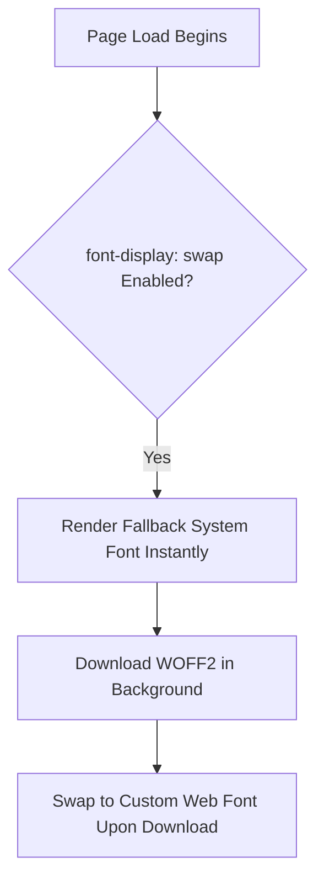

# Lesson 4.1 Advanced Typography & Web Fonts

> **Course**: Css3 | **Module**: Module 1 | **Difficulty**: beginner

---

- **Estimated Time**: 55 Minutes (20m Reading | 25m Practice | 10m Quiz)
- **Difficulty Level**: ⭐⭐ Intermediate
- **Prerequisites**: [Lesson 2.4 Sizing Units](file:///d:/My%20Drive/all%20files/PROJECT%20FILES/notes/docs/curriculum/_02_css3/_02_07_sizing_units_and_intrinsic_sizing.md)
- **XP Reward**: +60 XP

### Learning Objectives
By the end of this lesson, you will be able to:
1. Embed performant custom web fonts using `@font-face` and modern **WOFF2** formats.
2. Construct bulletproof font fallback stacks for system performance.
3. Fine-tune micro-typography (`line-height`, `letter-spacing`, `word-spacing`, `text-transform`).
4. Truncate multi-line text blocks using CSS line-clamping (`-webkit-line-clamp`).
5. Leverage Variable Fonts (`font-variation-settings`) to reduce HTTP font download sizes.

---

---

Open VS Code and create `typography_demo.html` to test font loading.

---

---

### 3.1 `@font-face` Syntax & WOFF2
WOFF2 (Web Open Font Format 2) provides 30%+ better compression than WOFF1 and is supported across 98%+ of modern browsers:

```css
@font-face {
  font-family: 'Inter';
  src: url('/fonts/inter-bold.woff2') format('woff2');
  font-weight: 700;
  font-style: normal;
  font-display: swap; /* Eliminates Flash of Invisible Text (FOIT) */
}
```

> [!TIP]
> **`font-display: swap`**: Instructs the browser to render text immediately using a fallback system font while the custom Web Font downloads, preventing Flash of Invisible Text (FOIT).

### 3.2 Micro-Typography & Line Clamping
- `line-height`: Ideal body text ratio is **1.5 to 1.7** for optimal readability.
- Multi-line Truncation:

```css
/* Truncate text to exactly 3 lines with ellipsis (...) */
.line-clamp-3 {
  display: -webkit-box;
  -webkit-line-clamp: 3;
  -webkit-box-orient: vertical;
  overflow: hidden;
}
```

---

---



---

---

```html
<!DOCTYPE html>
<html lang="en">
<head>
  <meta charset="UTF-8">
  <title>Advanced Typography Portal</title>
  <style>
    body {
      font-family: system-ui, -apple-system, BlinkMacSystemFont, "Segoe UI", Roboto, sans-serif;
      line-height: 1.6;
      padding: 2rem;
      background: #0f172a;
      color: #f8fafc;
    }
    .clamped-text {
      display: -webkit-box;
      -webkit-line-clamp: 2;
      -webkit-box-orient: vertical;
      overflow: hidden;
      max-width: 50ch;
      background: #1e293b;
      padding: 1rem;
      border-radius: 8px;
    }
  </style>
</head>
<body>
  <h2>Multi-Line Clamped Excerpt</h2>
  <p class="clamped-text">
    This is a long IoT sensor telemetry report paragraph that will automatically truncate with an ellipsis after exactly two lines of content without relying on JavaScript string manipulation techniques.
  </p>
</body>
</html>
```

---

---

- **News & Content Portals**: Line-clamping (`-webkit-line-clamp`) is used across cards on Medium, BBC, and news sites to force uniform card heights.

---

---

1. Save code as `typography_demo.html`.
2. Inspect `.clamped-text` in Chrome DevTools $\rightarrow$ Resize window to see ellipsis (`...`) appear dynamically!

---

---

| Bug / Error | Root Cause | Engineering Solution |
| :--- | :--- | :--- |
| **Flash of Invisible Text (FOIT)** | Omitting `font-display: swap` in `@font-face` definitions. | Add `font-display: swap;` to all `@font-face` rules. |

---

---

- **Use WOFF2**: Standardize on WOFF2 font files.
- **Set `font-display: swap`**: Improves FCP (First Contentful Paint) metrics.

---

---

### Q1: What is the purpose of `font-display: swap` in CSS?
**Answer**: It prevents Flash of Invisible Text (FOIT) by instructing the browser to draw text immediately using a fallback system font while the custom Web Font file is being fetched over the network.

---

---

```json
{
  "quiz_title": "Lesson 4.1 Typography Assessment",
  "questions": [
    {
      "question_id": "Q1",
      "type": "multiple_choice",
      "question_text": "Which modern font format offers the highest compression efficiency for Web Fonts?",
      "options": ["TTF", "OTF", "WOFF2", "SVG"],
      "correct_answer_index": 2,
      "explanation": "WOFF2 is the modern web standard font format with superior Brotli compression."
    }
  ]
}
```

---

---

Build a blog article typography stylesheet using local WOFF2 fonts and line-clamping.

---

---

**Front**: What CSS property truncates text after a specified number of lines?
**Back**: `-webkit-line-clamp: N;` (combined with `display: -webkit-box;` and `overflow: hidden;`).
<!-- flashcard:end -->

---

---

```css
@font-face { font-family: 'AppFont'; src: url('font.woff2') format('woff2'); font-display: swap; }
```

---
