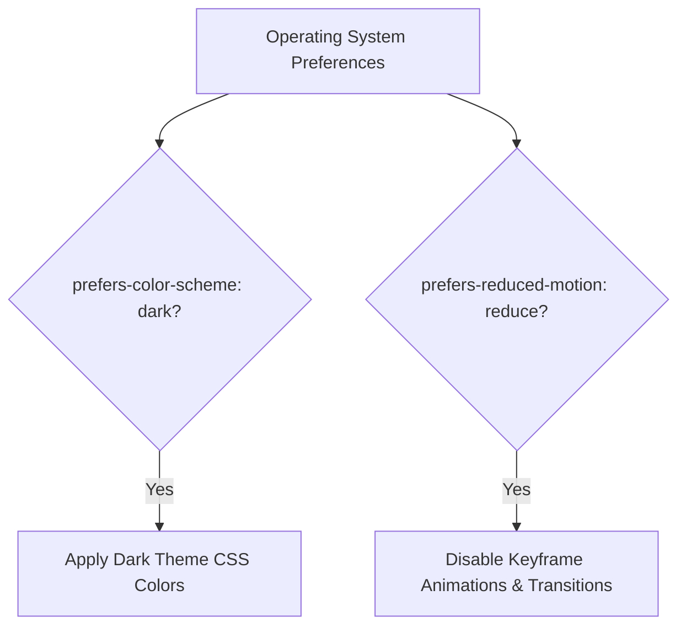

# Lesson 6.2 Media Queries

> **Course**: Css3 | **Module**: Module 1 | **Difficulty**: beginner

---

- **Estimated Time**: 55 Minutes (20m Reading | 25m Practice | 10m Quiz)
- **Difficulty Level**: ⭐⭐ Intermediate
- **Prerequisites**: [Lesson 6.1 Responsive Architecture](file:///d:/My%20Drive/all%20files/PROJECT%20FILES/notes/docs/curriculum/_02_css3/_02_17_responsive_architecture_principles.md)
- **XP Reward**: +60 XP

### Learning Objectives
By the end of this lesson, you will be able to:
1. Construct Media Queries for `screen` and `print` media types.
2. Utilize modern Media Queries Level 4 **Range Syntax** (`@media (600px <= width <= 1024px)`).
3. Implement native Dark Mode operating system themes using `prefers-color-scheme: dark`.
4. Respect user motion accessibility settings using `prefers-reduced-motion: reduce`.
5. Write custom print stylesheets to optimize physical page printing.

---

---

Emulate dark mode and reduced motion in Chrome DevTools:
- Open DevTools (`F12`) $\rightarrow$ Rendering tab $\rightarrow$ Emulate CSS media feature `prefers-color-scheme: dark` and `prefers-reduced-motion: reduce`.

---

---

### 3.1 Modern Range Syntax (Level 4)

```css
/* Legacy Syntax */
@media (min-width: 600px) and (max-width: 1024px) { ... }

/* Modern Range Syntax (Cleaner & Readable!) */
@media (600px <= width <= 1024px) { ... }
```

### 3.2 User Preference Media Features

```css
/* Dark Mode OS Theme Detection */
@media (prefers-color-scheme: dark) {
  body { background-color: #0f172a; color: #f8fafc; }
}

/* Accessible Motion Safety (Disables animations for users prone to motion sickness) */
@media (prefers-reduced-motion: reduce) {
  *, *::before, *::after {
    animation-duration: 0.01ms !important;
    transition-duration: 0.01ms !important;
  }
}
```

---

---



---

---

```html
<!DOCTYPE html>
<html lang="en">
<head>
  <meta charset="UTF-8">
  <meta name="viewport" content="width=device-width, initial-scale=1.0">
  <title>User Preferences & Range Syntax</title>
  <style>
    /* Default Light Theme */
    body { font-family: system-ui; padding: 2rem; background: #ffffff; color: #0f172a; }

    /* OS Dark Theme */
    @media (prefers-color-scheme: dark) {
      body { background: #0f172a; color: #f8fafc; }
    }

    /* Range Syntax for Tablet */
    @media (600px <= width <= 1024px) {
      body { border: 4px solid #3b82f6; }
    }

    /* Print Stylesheet */
    @media print {
      body { background: white; color: black; }
      nav, footer { display: none; }
    }
  </style>
</head>
<body>
  <h1>User Preference & Range Query Portal</h1>
</body>
</html>
```

---

---

- **Accessible Motion Compliance**: Enterprise applications (Slack, GitHub, Twitter) respect `prefers-reduced-motion` to meet WCAG 2.1 Level AA accessibility standards.

---

---

1. Save code as `media_demo.html`.
2. Open DevTools Rendering panel $\rightarrow$ Toggle `prefers-color-scheme: dark` to see instant theme switching!

---

---

| Bug / Error | Root Cause | Engineering Solution |
| :--- | :--- | :--- |
| **Animations Trigger Vestibular Nausea** | Ignoring `prefers-reduced-motion` preference setting. | Always provide a `@media (prefers-reduced-motion: reduce)` reset block in your CSS. |

---

---

- **Use Modern Range Syntax**: `@media (width >= 768px)`.
- **Implement `prefers-reduced-motion`**: Mandatory for accessible UI.

---

---

### Q1: What is `prefers-reduced-motion` and why is it important for accessibility?
**Answer**: It is a media query feature detecting if a user has requested reduced motion in their OS settings. It prevents UI animations that can trigger vestibular nausea or seizures for users with motion sensitivity.

---

---

```json
{
  "quiz_title": "Lesson 6.2 Media Queries Assessment",
  "questions": [
    {
      "question_id": "Q1",
      "type": "multiple_choice",
      "question_text": "Which media query detects an operating system dark theme preference?",
      "options": ["@media (dark-mode)", "@media (prefers-color-scheme: dark)", "@media (theme: dark)", "@media (color-mode: dark)"],
      "correct_answer_index": 1,
      "explanation": "prefers-color-scheme: dark detects dark mode settings."
    }
  ]
}
```

---

---

Build an automatic OS Dark/Light mode theme switcher with print stylesheet support.

---

---

**Front**: Write the modern CSS Level 4 Range Query for widths between 768px and 1200px.
**Back**: `@media (768px <= width <= 1200px)`
<!-- flashcard:end -->

---

---

```css
@media (prefers-color-scheme: dark) { body { background: #0f172a; } }
```

---
