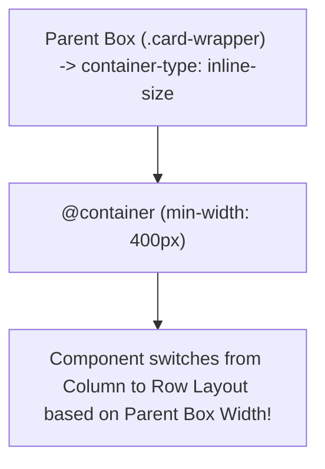

# Lesson 6.3 Container Queries

> **Course**: Css3 | **Module**: Module 1 | **Difficulty**: beginner

---

- **Estimated Time**: 55 Minutes (20m Reading | 25m Practice | 10m Quiz)
- **Difficulty Level**: ⭐⭐⭐ Advanced
- **Prerequisites**: [Lesson 6.2 Media Queries](file:///d:/My%20Drive/all%20files/PROJECT%20FILES/notes/docs/curriculum/_02_css3/_02_18_media_queries.md)
- **XP Reward**: +70 XP

### Learning Objectives
By the end of this lesson, you will be able to:
1. Explain the architectural paradigm shift from Viewport Media Queries to **Container Queries**.
2. Establish container query contexts using `container-type: inline-size` and `container-name`.
3. Write `@container` rules that query parent container width instead of global viewport width.
4. Utilize Container Query Units (`cqw`, `cqh`, `cqi`, `cqb`).
5. Construct modular, truly self-contained responsive Web Components.

---

---

Open VS Code and create `container_demo.html` to write Container Queries.

---

---

### 3.1 Media Queries vs Container Queries

```
┌─────────────────────────────────────────────────────────────────────────────┐
│                     MEDIA QUERIES VS CONTAINER QUERIES                      │
├─────────────────┬──────────────────────────────────┬────────────────────────┤
│ Feature         │ Media Queries (`@media`)         │ Container Queries (`@container`)│
├─────────────────┼──────────────────────────────────┼────────────────────────┤
│ Query Source    │ Global Viewport Window Width     │ Parent Container Width │
│ Modular Scope   │ Page-level layout control        │ Component-level self-contained layout│
│ Reusability     │ Low (Breaks if moved to sidebar) │ High (Adapts anywhere placed!)│
└─────────────────┴──────────────────────────────────┴────────────────────────┘
```

### 3.2 Setting Up Container Context
1. Mark parent element as a container: `container-type: inline-size;`.
2. Query parent width using `@container`:

```css
/* Parent Container Context */
.card-wrapper {
  container-type: inline-size;
  container-name: card-container;
}

/* Component responds to parent wrapper width, NOT window width! */
@container card-container (min-width: 400px) {
  .card {
    display: flex;
    flex-direction: row;
  }
}
```

---

---



---

---

```html
<!DOCTYPE html>
<html lang="en">
<head>
  <meta charset="UTF-8">
  <title>Container Queries Demo</title>
  <style>
    body { font-family: system-ui; padding: 2rem; background: #0f172a; color: #fff; }
    
    /* 1. Define Container Context */
    .widget-container {
      container-type: inline-size;
      background: #1e293b; padding: 1rem; border-radius: 8px; margin-bottom: 2rem;
    }
    
    /* Narrow Sidebar (300px) vs Wide Main (700px) Containers */
    .sidebar { width: 300px; }
    .main     { width: 700px; }

    /* Component Default (Mobile / Narrow) */
    .card { display: flex; flex-direction: column; gap: 1rem; }

    /* 2. Container Query: Triggers when PARENT exceeds 450px! */
    @container (min-width: 450px) {
      .card { flex-direction: row; align-items: center; }
    }
  </style>
</head>
<body>

  <h3>Inside 300px Sidebar Container (Stacked Layout)</h3>
  <div class="widget-container sidebar">
    <div class="card">
      <div class="icon">📟</div>
      <div class="info"><h4>Sensor Node A</h4><p>Battery: 98%</p></div>
    </div>
  </div>

  <h3>Inside 700px Main Container (Horizontal Row Layout)</h3>
  <div class="widget-container main">
    <div class="card">
      <div class="icon">📟</div>
      <div class="info"><h4>Sensor Node B</h4><p>Battery: 98%</p></div>
    </div>
  </div>

</body>
</html>
```

---

---

- **Modular Design Systems**: Components (e.g. `<user-card>`) automatically render as a stacked card in narrow sidebars and horizontal banners in wide main feeds using Container Queries without writing separate CSS classes.

---

---

1. Save code as `container_demo.html`.
2. Open in Chrome $\rightarrow$ Observe identical `.card` HTML component renders vertically in the sidebar and horizontally in main feed!

---

---

| Bug / Error | Root Cause | Engineering Solution |
| :--- | :--- | :--- |
| **`@container` Query Fails to Trigger** | Parent container missing `container-type: inline-size`. | Always add `container-type: inline-size` to parent wrapper elements. |

---

---

- **Use `container-type: inline-size`**: Standard container query context.

---

---

### Q1: What is the main problem Container Queries solve that Media Queries could not?
**Answer**: Media Queries can only query global viewport window width. A component placed inside a 300px sidebar on a 1920px screen would incorrectly trigger 1920px desktop media queries. Container Queries allow components to respond directly to their parent container's actual available width.

---

---

```json
{
  "quiz_title": "Lesson 6.3 Container Queries Assessment",
  "questions": [
    {
      "question_id": "Q1",
      "type": "multiple_choice",
      "question_text": "Which property turns an element into a container query ancestor context for its width?",
      "options": ["container-type: inline-size", "container-mode: width", "display: container", "context: inline"],
      "correct_answer_index": 0,
      "explanation": "container-type: inline-size establishes inline-direction container queries."
    }
  ]
}
```

---

---

Build a modular UI component library where cards adapt layout based on container width.

---

---

**Front**: What unit equals 1% of a container query ancestor's inline width?
**Back**: `1cqi` (or `1cqw`).
<!-- flashcard:end -->

---

---

```css
.wrapper { container-type: inline-size; }
@container (min-width: 400px) { .card { flex-direction: row; } }
```

---
