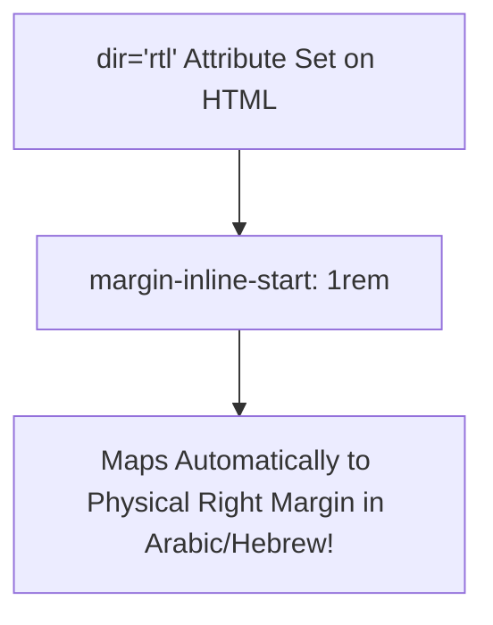

# Lesson 7.3 Native CSS Nesting & Logical Properties

> **Course**: Css3 | **Module**: Module 1 | **Difficulty**: beginner

---

- **Estimated Time**: 55 Minutes (20m Reading | 25m Practice | 10m Quiz)
- **Difficulty Level**: ⭐⭐⭐ Advanced
- **Prerequisites**: [Lesson 7.2 Modern CSS Architecture](file:///d:/My%20Drive/all%20files/PROJECT%20FILES/notes/docs/curriculum/_02_css3/_02_22_modern_css_architecture_and_methodologies.md)
- **XP Reward**: +70 XP

### Learning Objectives
By the end of this lesson, you will be able to:
1. Write clean hierarchy blocks using **Native CSS Nesting** and the `&` nesting selector.
2. Nest media queries and pseudo-classes directly inside CSS selector blocks.
3. Replace physical direction properties (`left`/`right`/`top`/`bottom`) with **Logical Properties** (`inline`/`block`).
4. Build bidirectional Right-to-Left (RTL) internationalized layouts without extra CSS overrides.

---

---

Open VS Code and create `nesting_demo.html` to write native CSS nesting and logical properties.

---

---

### 3.1 Native CSS Nesting (`&`)
Modern browsers natively support nesting rules without Sass/SCSS preprocessors:

```css
.card {
  background: #1e293b;
  padding-inline: 1.5rem; /* Logical Property: Left + Right */
  padding-block: 1rem;    /* Logical Property: Top + Bottom */

  /* Nesting Pseudo-Class */
  &:hover {
    background: #334155;
  }

  /* Nesting Child Element */
  & .card__title {
    color: #38bdf8;
  }

  /* Nested Media Query */
  @media (min-width: 768px) {
    padding-inline: 2.5rem;
  }
}
```

### 3.2 Physical vs Logical Properties Matrix

```
┌─────────────────────────────────────────────────────────────────────────────┐
│                    PHYSICAL VS LOGICAL PROPERTIES MATRIX                    │
├──────────────────┬──────────────────┬───────────────────────────────────────┤
│ Physical Name    │ Logical Name     │ Direction Mapping (LTR / RTL)         │
├──────────────────┼──────────────────┼───────────────────────────────────────┤
│ `margin-left` /  │ `margin-inline`  │ Horizontal start and end margins      │
│ `margin-right`   │                  │ (Adapts automatically for RTL Arabic!)│
├──────────────────┼──────────────────┼───────────────────────────────────────┤
│ `margin-top` /   │ `margin-block`   │ Vertical top and bottom margins       │
│ `margin-bottom`  │                  │                                       │
├──────────────────┼──────────────────┼───────────────────────────────────────┤
│ `left` / `right` │ `inset-inline`   │ Horizontal positioning offsets        │
├──────────────────┼──────────────────┼───────────────────────────────────────┤
│ `top` / `bottom` │ `inset-block`    │ Vertical positioning offsets          │
└──────────────────┴──────────────────┴───────────────────────────────────────┘
```

---

---



---

---

```html
<!DOCTYPE html>
<html lang="en">
<head>
  <meta charset="UTF-8">
  <title>Native Nesting & Logical Properties</title>
  <style>
    body { font-family: system-ui; background: #0f172a; color: #fff; padding: 2rem; }
    
    .card {
      background: #1e293b;
      padding-inline: 2rem; /* Left + Right */
      padding-block: 1.5rem; /* Top + Bottom */
      border-inline-start: 4px solid #3b82f6; /* Left border in LTR, Right border in RTL! */
      
      /* Native Nesting */
      & .card__title {
        color: #38bdf8;
        margin-block-end: 0.5rem;
      }

      &:hover {
        background: #334155;
      }
    }
  </style>
</head>
<body>
  <div class="card">
    <h3 class="card__title">Logical Properties Card</h3>
    <p>Border-inline-start adapts automatically when language direction changes.</p>
  </div>
</body>
</html>
```

---

---

- **Multilingual Platforms**: Tech platforms (Google, Microsoft) use Logical Properties (`margin-inline-start`) so their layouts flip seamlessly for Arabic and Hebrew users (`dir="rtl"`) without duplicate CSS code.

---

---

1. Save code as `nesting_demo.html`.
2. Inspect `.card` in Chrome DevTools $\rightarrow$ Add `dir="rtl"` to `<html>` tag $\rightarrow$ Observe `border-inline-start` flips instantly to the right side!

---

---

| Bug / Error | Root Cause | Engineering Solution |
| :--- | :--- | :--- |
| **RTL Layout Breakage** | Hardcoding physical `margin-left` and `padding-right` styles. | Replace physical properties with logical properties (`margin-inline-start`, `padding-inline-end`). |

---

---

- **Adopt Logical Properties**: Use `margin-inline` and `padding-block` for universal i18n support.

---

---

### Q1: What is the benefit of Logical Properties over Physical Properties in modern CSS?
**Answer**: Physical properties (`margin-left`) are tied to physical screen directions. Logical properties (`margin-inline-start`) are tied to writing mode and direction (`dir="ltr"` vs `dir="rtl"`), making layouts automatically bi-directional for internationalization.

---

---

```json
{
  "quiz_title": "Lesson 7.3 Logical Properties Assessment",
  "questions": [
    {
      "question_id": "Q1",
      "type": "multiple_choice",
      "question_text": "Which logical property replaces horizontal padding (`padding-left` + `padding-right`)?",
      "options": ["padding-block", "padding-inline", "padding-horizontal", "padding-side"],
      "correct_answer_index": 1,
      "explanation": "padding-inline sets both inline-start and inline-end (horizontal) padding."
    }
  ]
}
```

---

---

Refactor a physical property component library into native CSS nesting with logical properties.

---

---

**Front**: What logical property replaces physical `top` and `bottom` positioning offsets?
**Back**: `inset-block: top_val bottom_val;`
<!-- flashcard:end -->

---

---

```css
.card {
  padding-inline: 1.5rem;
  & .title { color: #38bdf8; }
}
```

---
