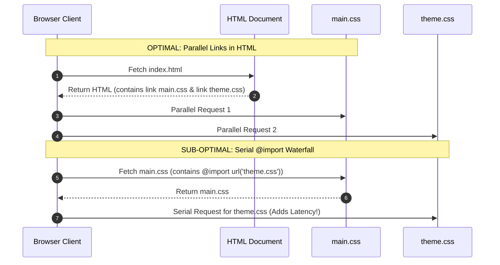

```yaml
schema_version: "2.0"
metadata:
  lesson_id: "CSS3-MOD01-LES01"
  course_slug: "course-02-css3"
  course_title: "Course 2: CSS3"
  module_slug: "mod-01-core-fundamentals-specificity"
  module_title: "Module 1 - Core Fundamentals, Syntax, & Specificity Architecture"
  lesson_slug: "css-syntax-and-inclusion-methods"
  lesson_title: "Lesson 1.1 CSS Syntax & Inclusion Methods"
  sort_order: 101

pedagogy:
  difficulty: "beginner"
  estimated_time:
    reading_minutes: 15
    practice_minutes: 25
    quiz_minutes: 10
    total_minutes: 50
  bloom_taxonomy_level: "Understand"
  xp_reward: 50

prerequisites:
  required_lesson_ids:
    - "HTML5-MOD01-LES03"
  required_skills:
    - "HTML Document Structure & Element Classification"

skills_acquired:
  - "CSS Syntax Rules (Selectors, Declarations, Properties, Values)"
  - "Evaluation of Inclusion Methods (Inline, Internal, External Style Sheets)"
  - "At-Rules Syntax (`@charset`, `@import`, `@namespace`)"
  - "CSS Parsing Engine Mechanics & Syntax Error Recovery"

dependencies:
  software:
    - "VS Code"
    - "Google Chrome DevTools (Styles Sub-panel)"
  hardware: []

seo_and_social:
  meta_title: "CSS3 Syntax Rules, Inclusion Methods & At-Rules Masterclass"
  meta_description: "Master CSS3 fundamentals: syntax rules, declaration blocks, inline vs internal vs external stylesheets, @import mechanics, and CSS parsing rules."
  keywords: ["CSS3 Syntax", "External Stylesheet", "Inline Styles", "@import", "CSS Declarations", "CSS Parsing Engine"]

assessment_config:
  has_quiz: true
  has_lab: true
  has_flashcards: true
  pass_score_percentage: 80
```

# Lesson 1.1 CSS Syntax & Inclusion Methods

## 1. Overview & Learning Objectives [id: overview]

- **Estimated Time**: 50 Minutes (15m Reading | 25m Practice | 10m Quiz)
- **Difficulty Level**: ⭐ Beginner
- **Prerequisites**: [Lesson 1.3 HTML Standards](file:///d:/My%20Drive/all%20files/PROJECT%20FILES/notes/docs/curriculum/_01_html5/_01_03_html_standards_and_document_structure.md)
- **XP Reward**: +50 XP

### Learning Objectives
By the end of this lesson, you will be able to:
1. Deconstruct CSS syntax into Selectors, Declaration Blocks, Properties, and Values.
2. Evaluate the pros, cons, and performance impacts of Inline, Internal, and External CSS inclusion methods.
3. Utilize CSS At-Rules (`@charset`, `@import`, `@namespace`, `@media`, `@layer`).
4. Trace how browser parsing engines process stylesheets and handle CSS syntax errors gracefully.

---

## 2. Environment & Prerequisites [id: prerequisites]

Inspect CSS declarations using the **Styles** panel in Chrome DevTools:
- Open DevTools (`F12`) $\rightarrow$ Click **Elements** tab $\rightarrow$ Inspect **Styles** sub-panel.

---

## 3. Theoretical Foundations [id: theory]

### 3.1 CSS Syntax Anatomy
Cascading Style Sheets (CSS) describe how HTML elements are rendered on screen:

```
  Selector      ┌────────────── Declaration Block ──────────────┐
┌──────────┐    │                                               │
h1, .title {    background-color: #0f172a;    color: #38bdf8;   }
                └───────┬────────┘└───┬───┘   └───┬─┘└───┬──┘
                    Property      Value     Property Value
                └───────── Declaration ──┘  └── Declaration ──┘
```

- **Selector**: Target HTML nodes in the DOM tree.
- **Declaration**: Property-value pair separated by a colon `:` and terminated by a semicolon `;`.
- **Declaration Block**: Group of declarations enclosed within curly braces `{}`.

### 3.2 Inclusion Methods Comparison

```
┌─────────────────────────────────────────────────────────────────────────────┐
│                       CSS INCLUSION METHODS COMPARISON                      │
├─────────────────┬──────────────────────────────────┬────────────────────────┤
│ Method          │ Syntax / Location                │ Engineering Trade-Offs │
├─────────────────┼──────────────────────────────────┼────────────────────────┤
│ Inline Styles   │ `<h1 style="color:red;">`        │ 🔴 Hard to maintain.   │
│                 │ (Inside HTML element tag)        │ Overrides external CSS.│
├─────────────────┼──────────────────────────────────┼────────────────────────┤
│ Internal Styles │ `<style> h1 { color:red; } </style>`│ 🟡 Single-page scope. │
│                 │ (Inside HTML `<head>`)           │ Increases HTML size.   │
├─────────────────┼──────────────────────────────────┼────────────────────────┤
│ External Styles │ `<link rel="stylesheet" href="...">`│ 🟢 Production Standard.│
│                 │ (Separate `.css` file)           │ Cached across pages!   │
└─────────────────┴──────────────────────────────────┴────────────────────────┘
```

> [!IMPORTANT]
> **Production Standard**: Always use External Stylesheets (`<link rel="stylesheet" href="styles.css">`). External CSS files are cached by browser HTTP caches, reducing server bandwidth and improving LCP page load times.

### 3.3 CSS At-Rules (`@`)
At-rules are special instructions imparting metadata or layout control:

- `@charset "UTF-8";`: Specifies character encoding (must be on line 1 of `.css` file).
- `@import url("reset.css");`: Imports another CSS file into the current stylesheet.
  - *Performance Caution*: `@import` creates serial HTTP request waterfalls; prefer multiple `<link rel="stylesheet">` tags in HTML!
- `@media (max-width: 768px) { ... }`: Conditional responsive breakpoints.
- `@layer base, components, utilities;`: Cascade Layer architecture.

---

## 4. Architecture & Diagram Visualizations [id: diagram]

### External CSS Loading vs `@import` Performance Waterfall


---

## 5. Code & Hardware Implementation [id: syntax]

### 5.1 External Stylesheet Architecture

#### HTML File (`index.html`)
```html
<!DOCTYPE html>
<html lang="en">
<head>
  <meta charset="UTF-8">
  <meta name="viewport" content="width=device-width, initial-scale=1.0">
  <title>CSS Syntax & Inclusion</title>

  <!-- External Production Stylesheet -->
  <link rel="stylesheet" href="/static/css/main.css">
</head>
<body>

  <header class="site-header">
    <h1 class="brand-title">IoT Full Stack Portal</h1>
  </header>

</body>
</html>
```

#### CSS File (`/static/css/main.css`)
```css
@charset "UTF-8";

/* Global Reset & Syntax Rules */
*, *::before, *::after {
  box-sizing: border-box;
  margin: 0;
  padding: 0;
}

body {
  font-family: system-ui, -apple-system, sans-serif;
  background-color: #0f172a;
  color: #f8fafc;
  line-height: 1.5;
}

.site-header {
  padding: 2rem;
  background-color: #1e293b;
  border-bottom: 2px solid #3b82f6;
}

.brand-title {
  color: #38bdf8;
  font-size: 1.75rem;
}
```

---

## 6. Enterprise Real-World Applications [id: examples]

### Avoiding HTTP Request Waterfalls
In production enterprise builds (Webpack, Vite, Tailwind CLI):
- Developers avoid `@import` inside CSS files. Build bundlers concatenate and minify all CSS assets into a single optimized `styles.min.css` file to eliminate network latency.

---

## 7. Guided Step-by-Step Hands-On Exercise [id: exercises]

1. Create `index.html` and `main.css` as shown in Section 5.1.
2. Open in Chrome $\rightarrow$ Inspect `h1.brand-title` in DevTools Styles panel.
3. Edit `color: #38bdf8` live in DevTools to test real-time style overrides!

---

## 8. Common Pitfalls & Troubleshooting [id: common_mistakes]

| Bug / Error | Root Cause | Engineering Solution |
| :--- | :--- | :--- |
| **Styles Missing / Page Unstyled** | Broken file path in `<link rel="stylesheet" href="...">`. | Use root-relative paths (`/static/css/main.css`) or verify relative path accuracy. |
| **`@import` Slowing Page Load** | Nesting multiple `@import` statements inside CSS stylesheets. | Use single compiled CSS files or multiple `<link rel="stylesheet">` tags in HTML `<head>`. |

---

## 9. Best Practices & Optimization [id: best_practices]

- **Use External CSS Files**: Maximizes browser HTTP caching.
- **Avoid `@import` in Production**: Eliminates serial network fetch waterfalls.
- **Minify Production CSS**: Reduce payload bytes using CSS minifiers.

---

## 10. Industry Interview Q&A [id: interview_qa]

### Q1: What are the performance disadvantages of using `@import` inside CSS files?
**Answer**: `@import` creates serial network request waterfalls. The browser must first download and parse the parent `.css` file before it discovers the `@import` statement and initiates the second HTTP request. Using `<link rel="stylesheet">` tags in HTML allows browsers to discover and download stylesheets in parallel.

---

## 11. Self-Assessment Quiz [id: quiz]

```json
{
  "quiz_title": "Lesson 1.1 CSS Syntax & Inclusion Assessment",
  "questions": [
    {
      "question_id": "Q1",
      "type": "multiple_choice",
      "question_text": "Which CSS inclusion method is the recommended production standard for multi-page web applications?",
      "options": ["Inline Styles", "Internal Style Tag", "External Stylesheets (<link>)", "@import"],
      "correct_answer_index": 2,
      "explanation": "External stylesheets allow CSS caching across multiple pages and separate presentation from HTML structure."
    }
  ]
}
```

---

## 12. Portfolio Assignment & Challenge [id: lab]

Build a production CSS directory structure with reset, variables, and main stylesheets linked via `<head>`.

---

## 13. Spaced Repetition Flashcards [id: flashcards]

**Front**: What is the mandatory line 1 statement for specifying character encoding in a CSS file?
**Back**: `@charset "UTF-8";`
<!-- flashcard:end -->

---

## 14. Summary & Cheat Sheet [id: summary]

```css
@charset "UTF-8";
h1 { color: #38bdf8; }
```
