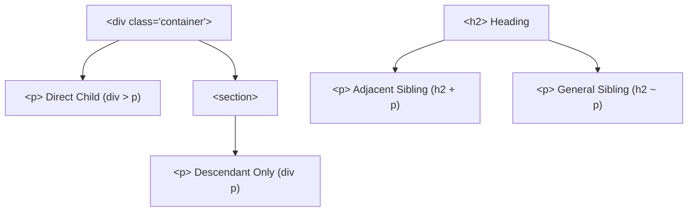

```yaml
schema_version: "2.0"
metadata:
  lesson_id: "CSS3-MOD01-LES02"
  course_slug: "course-02-css3"
  course_title: "Course 2: CSS3"
  module_slug: "mod-01-core-fundamentals-specificity"
  module_title: "Module 1 - Core Fundamentals, Syntax, & Specificity Architecture"
  lesson_slug: "comprehensive-selector-systems"
  lesson_title: "Lesson 1.2 Comprehensive Selector Systems"
  sort_order: 102

pedagogy:
  difficulty: "intermediate"
  estimated_time:
    reading_minutes: 20
    practice_minutes: 25
    quiz_minutes: 10
    total_minutes: 55
  bloom_taxonomy_level: "Apply"
  xp_reward: 60

prerequisites:
  required_lesson_ids:
    - "CSS3-MOD01-LES01"
  required_skills:
    - "CSS Declarations & Syntax Rules"

skills_acquired:
  - "Basic Selectors (Universal `*`, Type, Class `.`, ID `#`)"
  - "Attribute Matchers (`[attr]`, `[attr^=val]`, `[attr$=val]`, `[attr*=val]`)"
  - "Combinators (Descendant ` `, Child `>`, Adjacent Sibling `+`, General Sibling `~`)"
  - "Structural Pseudo-Classes (`:nth-child()`, `:nth-of-type()`, `:empty`)"
  - "State Pseudo-Classes (`:hover`, `:focus-visible`, `:has()` parent selector)"
  - "Pseudo-Elements (`::before`, `::after`, `::placeholder`, `::marker`)"

dependencies:
  software:
    - "VS Code"
  hardware: []

seo_and_social:
  meta_title: "CSS3 Comprehensive Selectors: Combinators, Pseudo-Classes & :has()"
  meta_description: "Master CSS3 selector systems: attribute matchers, combinators, structural pseudo-classes (:nth-child), state pseudo-classes (:focus-visible, :has), and pseudo-elements."
  keywords: ["CSS Selectors", "Combinators", "Attribute Selectors", "nth-child", "pseudo-classes", "pseudo-elements", "before after", "CSS :has"]

assessment_config:
  has_quiz: true
  has_lab: true
  has_flashcards: true
  pass_score_percentage: 80
```

# Lesson 1.2 Comprehensive Selector Systems

## 1. Overview & Learning Objectives [id: overview]

- **Estimated Time**: 55 Minutes (20m Reading | 25m Practice | 10m Quiz)
- **Difficulty Level**: ⭐⭐ Intermediate
- **Prerequisites**: [Lesson 1.1 CSS Syntax & Inclusion Methods](file:///d:/My%20Drive/all%20files/PROJECT%20FILES/notes/docs/curriculum/_02_css3/_02_01_css_syntax_and_inclusion_methods.md)
- **XP Reward**: +60 XP

### Learning Objectives
By the end of this lesson, you will be able to:
1. Target DOM nodes using Basic Selectors (Universal `*`, Type, Class `.`, ID `#`).
2. Utilize Attribute Selectors (`[attr]`, `^=`, `$=`, `*=`, `~=`, `|=`) for precise pattern matching.
3. Master Combinators: Descendant (` `), Child (`>`), Adjacent Sibling (`+`), and General Sibling (`~`).
4. Apply Structural Pseudo-Classes (`:nth-child()`, `:nth-of-type()`, `:empty`) and State Pseudo-Classes (`:hover`, `:focus-visible`, `:has()`).
5. Generate decorative content and custom styling using Pseudo-Elements (`::before`, `::after`, `::marker`).

---

## 2. Environment & Prerequisites [id: prerequisites]

Open VS Code and create `selectors_demo.html` to write interactive CSS selectors.

---

## 3. Theoretical Foundations [id: theory]

### 3.1 Attribute Selectors

```
┌─────────────────────────────────────────────────────────────────────────────┐
│                          ATTRIBUTE SELECTOR PATTERNS                        │
├─────────────────┬───────────────────────────────────────────────────────────┤
│ `[attr]`        │ Targets elements possessing the attribute.                 │
├─────────────────┼───────────────────────────────────────────────────────────┤
│ `[attr="val"]`  │ Exact value match.                                        │
├─────────────────┼───────────────────────────────────────────────────────────┤
│ `[attr^="val"]` │ Starts with "val" (e.g. `a[href^="https://"]`).           │
├─────────────────┼───────────────────────────────────────────────────────────┤
│ `[attr$="val"]` │ Ends with "val" (e.g. `a[href$=".pdf"]`).                  │
├─────────────────┼───────────────────────────────────────────────────────────┤
│ `[attr*="val"]` │ Contains substring "val" anywhere.                        │
└─────────────────┴───────────────────────────────────────────────────────────┘
```

### 3.2 Combinator Systems

```
┌─────────────────────────────────────────────────────────────────────────────┐
│                             CSS COMBINATORS SUMMARY                         │
├─────────────────┬─────────────────┬─────────────────────────────────────────┤
│ Combinator      │ Syntax          │ Target Match                            │
├─────────────────┼─────────────────┼─────────────────────────────────────────┤
│ Descendant      │ `div p`         │ ANY `<p>` inside `<div>` (any depth).    │
├─────────────────┼─────────────────┼─────────────────────────────────────────┤
│ Child           │ `div > p`       │ DIRECT child `<p>` immediately inside.  │
├─────────────────┼─────────────────┼─────────────────────────────────────────┤
│ Adjacent Sibling│ `h2 + p`        │ First `<p>` immediately following `<h2>`.│
├─────────────────┼─────────────────┼─────────────────────────────────────────┤
│ General Sibling │ `h2 ~ p`        │ ALL sibling `<p>` elements after `<h2>`.│
└─────────────────┴─────────────────┴─────────────────────────────────────────┘
```

### 3.3 Pseudo-Classes & Modern `:has()` Parent Selector
- `:nth-child(2n)` / `:nth-child(even)`: Selects even child rows.
- `:focus-visible`: Triggers focus outlines ONLY for keyboard users (suppresses focus ring on mouse clicks).
- `:has(selector)` (Parent Selector): Selects a parent element based on its children!

```css
/* Selects a card container ONLY IF it contains an error badge child! */
.card:has(.error-badge) {
  border-color: #ef4444;
  background-color: #fef2f2;
}
```

### 3.4 Pseudo-Elements (`::before` & `::after`)
Pseudo-elements insert cosmetic content nodes into the DOM tree without adding extra HTML tags:

```css
.required-label::after {
  content: " *";
  color: #ef4444;
}
```

---

## 4. Architecture & Diagram Visualizations [id: diagram]

### Combinator Target Matching Tree


---

## 5. Code & Hardware Implementation [id: syntax]

```html
<!DOCTYPE html>
<html lang="en">
<head>
  <meta charset="UTF-8">
  <title>Comprehensive Selectors</title>
  <style>
    /* 1. Attribute Matcher: PDF Icon indicator */
    a[href$=".pdf"]::after {
      content: " 📄 (PDF)";
      font-size: 0.8em;
      color: #ef4444;
    }

    /* 2. Child Combinator */
    ul.menu > li {
      display: inline-block;
      margin-right: 12px;
    }

    /* 3. Structural Pseudo-Class: Zebra Striping */
    tbody tr:nth-child(even) {
      background-color: #f1f5f9;
    }

    /* 4. Parent Selector :has() */
    .form-group:has(input:invalid) {
      color: #dc2626;
    }
  </style>
</head>
<body>

  <ul class="menu">
    <li><a href="/docs/guide.pdf">Download Guide</a></li>
    <li><a href="/about">About Us</a></li>
  </ul>

</body>
</html>
```

---

## 6. Enterprise Real-World Applications [id: examples]

- **Automatic File Type Icons**: Using `a[href$=".pdf"]` and `a[href^="https://"]` to automatically append PDF or external link icons via `::after` pseudo-elements.

---

## 7. Guided Step-by-Step Hands-On Exercise [id: exercises]

1. Save code as `selectors_demo.html`.
2. Inspect PDF link in Chrome $\rightarrow$ Observe `📄 (PDF)` appended automatically via `::after`.

---

## 8. Common Pitfalls & Troubleshooting [id: common_mistakes]

| Bug / Error | Root Cause | Engineering Solution |
| :--- | :--- | :--- |
| **Missing `content:""` Property** | `::before` or `::after` pseudo-element fails to render. | Always include `content: ""` inside `::before` / `::after` rules! |

---

## 9. Best Practices & Optimization [id: best_practices]

- **Use `:focus-visible`**: Prevents mouse click focus rings while maintaining accessibility.
- **Leverage `:has()`**: Eliminate extra JS classes for parent container styling.

---

## 10. Industry Interview Q&A [id: interview_qa]

### Q1: What is the difference between `:nth-child()` and `:nth-of-type()`?
**Answer**: `:nth-child(n)` counts ALL sibling nodes regardless of tag type. `:nth-of-type(n)` counts ONLY sibling nodes that share the exact target tag type.

---

## 11. Self-Assessment Quiz [id: quiz]

```json
{
  "quiz_title": "Lesson 1.2 Comprehensive Selectors Assessment",
  "questions": [
    {
      "question_id": "Q1",
      "type": "multiple_choice",
      "question_text": "Which attribute selector matches links starting with 'https://'?",
      "options": ["a[href='https://']", "a[href^='https://']", "a[href$='https://']", "a[href*='https://']"],
      "correct_answer_index": 1,
      "explanation": "[attr^='val'] matches attributes starting with the specified string."
    }
  ]
}
```

---

## 12. Portfolio Assignment & Challenge [id: lab]

Build a CSS-only interactive tab widget using `:checked` and general sibling `~` selectors.

---

## 13. Spaced Repetition Flashcards [id: flashcards]

**Front**: What CSS selector targets a parent element based on its child state?
**Back**: `:has(selector)` (e.g., `.card:has(.badge)`).
<!-- flashcard:end -->

---

## 14. Summary & Cheat Sheet [id: summary]

```css
a[href$=".pdf"]::after { content: " (PDF)"; }
```
