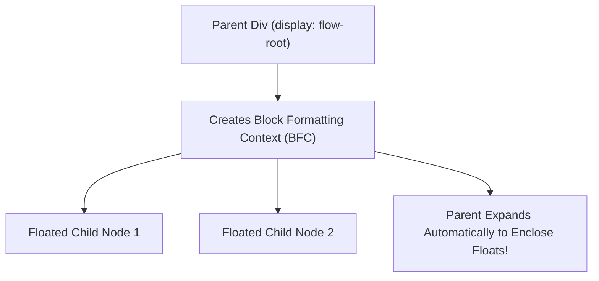

```yaml
schema_version: "2.0"
metadata:
  lesson_id: "CSS3-MOD02-LES02"
  course_slug: "course-02-css3"
  course_title: "Course 2: CSS3"
  module_slug: "mod-02-box-model-sizing-layout"
  module_title: "Module 2 - The Box Model, Sizing, & Layout Fundamentals"
  lesson_slug: "display-property-and-visual-formatting-model"
  lesson_title: "Lesson 2.2 Display Property & Visual Formatting Model"
  sort_order: 202

pedagogy:
  difficulty: "intermediate"
  estimated_time:
    reading_minutes: 20
    practice_minutes: 25
    quiz_minutes: 10
    total_minutes: 55
  bloom_taxonomy_level: "Apply"
  xp_reward: 60

prerequisites:
  required_lesson_ids:
    - "CSS3-MOD02-LES01"
  required_skills:
    - "CSS Box Model Layers & Geometry"

skills_acquired:
  - "Display Property Manipulation (`block`, `inline`, `inline-block`, `none`, `contents`)"
  - "Block Formatting Context (BFC) Triggers & Float Containment"
  - "Inline Formatting Context (IFC) Mechanics"
  - "Visibility (`visible`, `hidden`, `collapse`) vs `display: none` Audit"

dependencies:
  software:
    - "VS Code"
  hardware: []

seo_and_social:
  meta_title: "CSS3 Display Property, BFC (Block Formatting Context) & Visibility"
  meta_description: "Master CSS display modes (block, inline, inline-block, contents), Block Formatting Context (BFC) creation, and visibility:hidden vs display:none."
  keywords: ["CSS Display", "Block Formatting Context", "BFC", "display none vs visibility hidden", "display contents", "IFC"]

assessment_config:
  has_quiz: true
  has_lab: true
  has_flashcards: true
  pass_score_percentage: 80
```

# Lesson 2.2 Display Property & Visual Formatting Model

## 1. Overview & Learning Objectives [id: overview]

- **Estimated Time**: 55 Minutes (20m Reading | 25m Practice | 10m Quiz)
- **Difficulty Level**: ⭐⭐ Intermediate
- **Prerequisites**: [Lesson 2.1 The CSS Box Model](file:///d:/My%20Drive/all%20files/PROJECT%20FILES/notes/docs/curriculum/_02_css3/_02_04_the_css_box_model.md)
- **XP Reward**: +60 XP

### Learning Objectives
By the end of this lesson, you will be able to:
1. Configure `display` property modes (`block`, `inline`, `inline-block`, `none`, `contents`).
2. Trigger a **Block Formatting Context (BFC)** to contain floated elements and prevent margin collapsing.
3. Contrast `display: none` with `visibility: hidden` and `opacity: 0` for accessible rendering.

---

## 2. Environment & Prerequisites [id: prerequisites]

Open VS Code and create `bfc_demo.html` to test Block Formatting Context triggers.

---

## 3. Theoretical Foundations [id: theory]

### 3.1 Block Formatting Context (BFC) Triggers
A **Block Formatting Context (BFC)** is an isolated mini-layout environment in which block boxes are laid out. Creating a BFC solves two classic CSS layout problems:
1. **Contains Floated Children**: Automatically encloses floated child nodes without clearfix hacks.
2. **Prevents Margin Collapsing**: Prevents internal child margins from escaping parent boundaries.

#### Common BFC Triggers
- `display: flow-root` (Modern Recommended Way!)
- `display: flex` or `display: grid`
- `overflow: hidden` or `overflow: auto`
- `position: absolute` or `position: fixed`

```css
/* Modern BFC Container Reset */
.container {
  display: flow-root;
}
```

### 3.2 `display: none` vs `visibility: hidden` vs `opacity: 0`

```
┌─────────────────────────────────────────────────────────────────────────────┐
│                    HIDING ELEMENTS COMPARISON MATRIX                        │
├─────────────────┬─────────────────┬─────────────────┬───────────────────────┤
│ Property        │ Takes Space?    │ DOM Events?     │ Accessibility (a11y)  │
├─────────────────┼─────────────────┼─────────────────┼───────────────────────┤
│ `display: none` │ NO (Removed)    │ Blocked         │ Hidden from screen readers│
│ `visibility: hidden`│ YES (Reserved)│ Blocked         │ Hidden from screen readers│
│ `opacity: 0`    │ YES (Reserved)  │ ACTIVE (Clickable)│ SPOKEN by screen readers!│
└─────────────────┴─────────────────┴─────────────────┴───────────────────────┘
```

---

## 4. Architecture & Diagram Visualizations [id: diagram]



---

## 5. Code & Hardware Implementation [id: syntax]

```html
<!DOCTYPE html>
<html lang="en">
<head>
  <meta charset="UTF-8">
  <title>BFC & Display Demo</title>
  <style>
    /* BFC Container */
    .bfc-box { display: flow-root; background: #e2e8f0; padding: 10px; border: 2px solid #3b82f6; }
    .float-child { float: left; width: 100px; height: 100px; background: #0f172a; color: #fff; }
  </style>
</head>
<body>
  <div class="bfc-box">
    <div class="float-child">Float 1</div>
    <p>BFC prevents parent height collapse!</p>
  </div>
</body>
</html>
```

---

## 6. Enterprise Real-World Applications [id: examples]

- **`display: flow-root`**: Modern utility frameworks (Tailwind `.flow-root`) use this rule to contain floats cleanly without clearfix hacks.

---

## 7. Guided Step-by-Step Hands-On Exercise [id: exercises]

1. Save code as `bfc_demo.html`.
2. Inspect `.bfc-box` in DevTools; verify height encloses `.float-child`.

---

## 8. Common Pitfalls & Troubleshooting [id: common_mistakes]

| Bug / Error | Root Cause | Engineering Solution |
| :--- | :--- | :--- |
| **Accidentally Clickable Invisible Links** | Using `opacity: 0` to hide a modal or button. | Use `display: none` or `visibility: hidden` so clicks are blocked. |

---

## 9. Best Practices & Optimization [id: best_practices]

- **Use `display: flow-root` for BFC**: Cleanest way to contain floats.

---

## 10. Industry Interview Q&A [id: interview_qa]

### Q1: What is the modern standard property for creating a Block Formatting Context?
**Answer**: `display: flow-root`. It creates a BFC without unwanted side-effects like clipping content (`overflow: hidden`).

---

## 11. Self-Assessment Quiz [id: quiz]

```json
{
  "quiz_title": "Lesson 2.2 Display Assessment",
  "questions": [
    {
      "question_id": "Q1",
      "type": "multiple_choice",
      "question_text": "Which property removes an element completely from layout space AND accessibility trees?",
      "options": ["visibility: hidden", "opacity: 0", "display: none", "z-index: -1"],
      "correct_answer_index": 2,
      "explanation": "display: none removes the element from both layout and accessibility trees."
    }
  ]
}
```

---

## 12. Portfolio Assignment & Challenge [id: lab]

Build a float-based card layout contained using `display: flow-root`.

---

## 13. Spaced Repetition Flashcards [id: flashcards]

**Front**: How does `display: contents` affect an element's container box?
**Back**: It removes the container box itself, allowing its child nodes to participate directly in the parent's layout grid/flexbox.
<!-- flashcard:end -->

---

## 14. Summary & Cheat Sheet [id: summary]

```css
.container { display: flow-root; }
```
