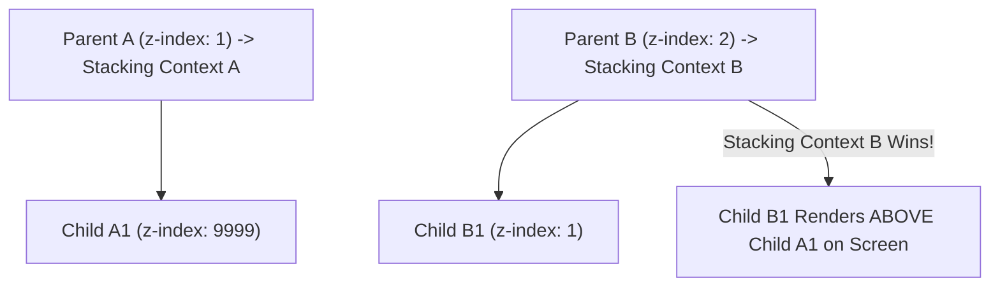

```yaml
schema_version: "2.0"
metadata:
  lesson_id: "CSS3-MOD02-LES03"
  course_slug: "course-02-css3"
  course_title: "Course 2: CSS3"
  module_slug: "mod-02-box-model-sizing-layout"
  module_title: "Module 2 - The Box Model, Sizing, & Layout Fundamentals"
  lesson_slug: "positioning-systems-and-stacking-contexts"
  lesson_title: "Lesson 2.3 Positioning Systems & Stacking Contexts"
  sort_order: 203

pedagogy:
  difficulty: "intermediate"
  estimated_time:
    reading_minutes: 20
    practice_minutes: 25
    quiz_minutes: 10
    total_minutes: 55
  bloom_taxonomy_level: "Apply"
  xp_reward: 60

prerequisites:
  required_lesson_ids:
    - "CSS3-MOD02-LES02"
  required_skills:
    - "Display Property & Visual Formatting"

skills_acquired:
  - "Normal Flow Layout Mechanics"
  - "Position Modes (`static`, `relative`, `absolute`, `fixed`, `sticky`)"
  - "Offset Property Operations (`top`, `right`, `bottom`, `left`)"
  - "Stacking Context Creation Rules (`opacity`, `transform`, `z-index`)"
  - "Z-Index Hierarchy Debugging"

dependencies:
  software:
    - "VS Code"
  hardware: []

seo_and_social:
  meta_title: "CSS3 Positioning Systems: Relative, Absolute, Sticky & Stacking Contexts"
  meta_description: "Master CSS positioning: static, relative, absolute, fixed, position:sticky, offset properties, z-index, and Stacking Context creation rules."
  keywords: ["CSS Position", "position relative", "position absolute", "position fixed", "position sticky", "z-index", "Stacking Context"]

assessment_config:
  has_quiz: true
  has_lab: true
  has_flashcards: true
  pass_score_percentage: 80
```

# Lesson 2.3 Positioning Systems & Stacking Contexts

## 1. Overview & Learning Objectives [id: overview]

- **Estimated Time**: 55 Minutes (20m Reading | 25m Practice | 10m Quiz)
- **Difficulty Level**: ⭐⭐ Intermediate
- **Prerequisites**: [Lesson 2.2 Display Property](file:///d:/My%20Drive/all%20files/PROJECT%20FILES/notes/docs/curriculum/_02_css3/_02_05_display_property_and_visual_formatting_model.md)
- **XP Reward**: +60 XP

### Learning Objectives
By the end of this lesson, you will be able to:
1. Distinguish between 5 CSS position modes (`static`, `relative`, `absolute`, `fixed`, `sticky`).
2. Position elements using offset properties (`top`, `right`, `bottom`, `left`).
3. Construct sticky navigation headers using `position: sticky`.
4. Identify rules that trigger new **Stacking Contexts** (`opacity < 1`, `transform`, `isolation: isolate`).
5. Debug $Z$-index stacking hierarchy conflicts.

---

## 2. Environment & Prerequisites [id: prerequisites]

Open VS Code and create `position_demo.html` to write positioning rules.

---

## 3. Theoretical Foundations [id: theory]

### 3.1 CSS Position Modes Matrix

```
┌─────────────────────────────────────────────────────────────────────────────┐
│                          CSS POSITION MODES MATRIX                          │
├───────────────┬─────────────────────────────────────────────────────────────┤
│ `static`      │ Default normal flow. Offset properties (`top`, `left`) IGNORED.│
├───────────────┼─────────────────────────────────────────────────────────────┤
│ `relative`    │ Positioned relative to ITS OWN NORMAL FLOW position.       │
│               │ Retains original space in layout flow.                      │
├───────────────┼─────────────────────────────────────────────────────────────┤
│ `absolute`    │ Removed from normal flow. Positioned relative to NEAREST    │
│               │ non-static ancestor (usually a `position: relative` parent).│
├───────────────┼─────────────────────────────────────────────────────────────┤
│ `fixed`       │ Removed from normal flow. Positioned relative to VIEWPORT. │
│               │ Stays fixed on screen during scrolling.                     │
├───────────────┼─────────────────────────────────────────────────────────────┤
│ `sticky`      │ Hybrid: Acts like `relative` until a scroll threshold is    │
│               │ reached, then sticks like `fixed` within parent boundary.   │
└───────────────┴─────────────────────────────────────────────────────────────┘
```

### 3.2 Stacking Contexts & $Z$-Index Rules
$Z$-index only applies to positioned elements (non-static) or flex/grid items.

A new **Stacking Context** is formed by:
- `position: relative/absolute` with non-auto `z-index`
- `position: fixed` or `position: sticky`
- `opacity < 1`
- `transform`, `filter`, `perspective` != none
- `isolation: isolate` (Recommended explicit trigger)

> [!CAUTION]
> Elements inside a lower Stacking Context (e.g. parent $Z$-index = 1) can NEVER stack above elements in a higher Stacking Context (parent $Z$-index = 2), regardless of child $Z$-index value (e.g. child $Z$-index = 9999)!

---

## 4. Architecture & Diagram Visualizations [id: diagram]



---

## 5. Code & Hardware Implementation [id: syntax]

```html
<!DOCTYPE html>
<html lang="en">
<head>
  <meta charset="UTF-8">
  <title>Sticky Header & Absolute Card</title>
  <style>
    body { height: 200vh; margin: 0; font-family: system-ui; }
    /* Sticky Header */
    nav { position: sticky; top: 0; background: #0f172a; color: #fff; padding: 16px; z-index: 10; }
    /* Absolute Badge Container */
    .card { position: relative; width: 300px; padding: 20px; background: #f8fafc; border: 1px solid #cbd5e1; margin: 40px; }
    .badge { position: absolute; top: -10px; right: -10px; background: #ef4444; color: #fff; padding: 4px 8px; border-radius: 999px; }
  </style>
</head>
<body>
  <nav>Sticky Navigation Bar</nav>
  <div class="card">
    <span class="badge">LIVE</span>
    <h3>ESP32 Gateway Node</h3>
  </div>
</body>
</html>
```

---

## 6. Enterprise Real-World Applications [id: examples]

- **Sticky Navigation**: Used across documentation portals and dashboards for persistent access to links.

---

## 7. Guided Step-by-Step Hands-On Exercise [id: exercises]

1. Save code as `position_demo.html`.
2. Scroll page in Chrome $\rightarrow$ Verify navigation bar sticks to top of screen!

---

## 8. Common Pitfalls & Troubleshooting [id: common_mistakes]

| Bug / Error | Root Cause | Engineering Solution |
| :--- | :--- | :--- |
| **`position: sticky` Fails to Stick** | Parent container has `overflow: hidden` or lacks explicit height. | Remove `overflow: hidden` from parent containers. |

---

## 9. Best Practices & Optimization [id: best_practices]

- **Use `isolation: isolate`**: Explicitly create Stacking Contexts without extra hacks.

---

## 10. Industry Interview Q&A [id: interview_qa]

### Q1: Why does a child with `z-index: 9999` fail to render above an element with `z-index: 2`?
**Answer**: Because the child is trapped inside a parent Stacking Context with a lower $Z$-index ranking. $Z$-index comparisons only occur between elements within the same Stacking Context.

---

## 11. Self-Assessment Quiz [id: quiz]

```json
{
  "quiz_title": "Lesson 2.3 Positioning Assessment",
  "questions": [
    {
      "question_id": "Q1",
      "type": "multiple_choice",
      "question_text": "What position mode keeps an element positioned relative to the browser VIEWPORT?",
      "options": ["relative", "absolute", "fixed", "static"],
      "correct_answer_index": 2,
      "explanation": "position: fixed anchors elements relative to the viewport window."
    }
  ]
}
```

---

## 12. Portfolio Assignment & Challenge [id: lab]

Build an interactive modal dialog with backdrop blur and $Z$-index stacking isolation.

---

## 13. Spaced Repetition Flashcards [id: flashcards]

**Front**: What property explicitly creates a new Stacking Context cleanly?
**Back**: `isolation: isolate;`
<!-- flashcard:end -->

---

## 14. Summary & Cheat Sheet [id: summary]

```css
.card { position: relative; }
.badge { position: absolute; top: 0; right: 0; }
```
