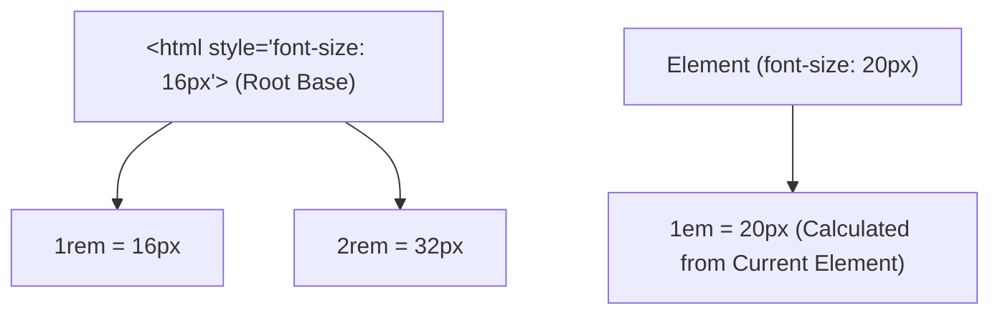

```yaml
schema_version: "2.0"
metadata:
  lesson_id: "CSS3-MOD02-LES04"
  course_slug: "course-02-css3"
  course_title: "Course 2: CSS3"
  module_slug: "mod-02-box-model-sizing-layout"
  module_title: "Module 2 - The Box Model, Sizing, & Layout Fundamentals"
  lesson_slug: "sizing-units-and-intrinsic-sizing"
  lesson_title: "Lesson 2.4 Sizing Units & Intrinsic Sizing"
  sort_order: 204

pedagogy:
  difficulty: "intermediate"
  estimated_time:
    reading_minutes: 20
    practice_minutes: 25
    quiz_minutes: 10
    total_minutes: 55
  bloom_taxonomy_level: "Apply"
  xp_reward: 60

prerequisites:
  required_lesson_ids:
    - "CSS3-MOD02-LES01"
  required_skills:
    - "CSS Box Model & Geometry"

skills_acquired:
  - "Absolute vs Relative Unit Selection (`px` vs `em` vs `rem`)"
  - "Viewport Units (`vw`, `vh`, `vmin`, `vmax`, `cqw`, `cqh`)"
  - "Character Units (`ch`) for Accessible Line Lengths"
  - "Intrinsic Sizing Keywords (`max-content`, `min-content`, `fit-content`)"
  - "Boundary Sizing (`min-width`, `max-width`, `min-height`, `max-height`)"

dependencies:
  software:
    - "VS Code"
  hardware: []

seo_and_social:
  meta_title: "CSS3 Sizing Units: rem vs em, Viewport Units & fit-content Intrinsic Sizing"
  meta_description: "Master CSS sizing units: rem, em, px, vw, vh, ch, intrinsic sizing keywords (min-content, max-content, fit-content), and max-width boundaries."
  keywords: ["CSS Units", "rem vs em", "viewport units vw vh", "ch unit", "fit-content", "min-content", "max-content", "max-width"]

assessment_config:
  has_quiz: true
  has_lab: true
  has_flashcards: true
  pass_score_percentage: 80
```

# Lesson 2.4 Sizing Units & Intrinsic Sizing

## 1. Overview & Learning Objectives [id: overview]

- **Estimated Time**: 55 Minutes (20m Reading | 25m Practice | 10m Quiz)
- **Difficulty Level**: ⭐⭐ Intermediate
- **Prerequisites**: [Lesson 2.1 The CSS Box Model](file:///d:/My%20Drive/all%20files/PROJECT%20FILES/notes/docs/curriculum/_02_css3/_02_04_the_css_box_model.md)
- **XP Reward**: +60 XP

### Learning Objectives
By the end of this lesson, you will be able to:
1. Distinguish between Absolute (`px`), Relative Font (`rem`, `em`, `ch`), and Viewport (`vw`, `vh`) units.
2. Calculate compounding `em` inheritance vs predictable root-based `rem` sizing.
3. Limit line lengths to accessible reading bounds (45–75 characters) using `ch` units.
4. Utilize Intrinsic Sizing Keywords (`max-content`, `min-content`, `fit-content`).
5. Enforce responsive layout boundaries using `min-width`, `max-width`, `min-height`, and `max-height`.

---

## 2. Environment & Prerequisites [id: prerequisites]

Open VS Code and create `units_demo.html` to write responsive unit layouts.

---

## 3. Theoretical Foundations [id: theory]

### 3.1 Unit Categories Matrix

```
┌─────────────────────────────────────────────────────────────────────────────┐
│                            CSS SIZING UNITS MATRIX                          │
├──────────────────┬─────────────────────────────────┬────────────────────────┤
│ Unit             │ Reference Base                  │ Primary Use Case       │
├──────────────────┼─────────────────────────────────┼────────────────────────┤
│ `px`             │ Absolute screen pixels          │ Borders, thin shadows  │
│ `rem`            │ Root element `<html>` font-size │ Typography, padding, margins│
│ `em`             │ Current element font-size       │ Component-relative sizing│
│ `ch`             │ Width of character '0'          │ Max text container width│
│ `vw` / `vh`      │ 1% of Viewport Width / Height   │ Hero sections, full modallayouts│
│ `%`              │ Percentage of Parent Box size   │ Fluid container widths │
└──────────────────┴─────────────────────────────────┴────────────────────────┘
```

> [!IMPORTANT]
> **Typography Best Practice**: Always use `rem` for `font-size`. If a visually impaired user increases default browser font size from 16px to 24px, `rem` typography scales gracefully; `px` typography breaks accessibility!

### 3.2 Intrinsic Sizing Keywords
- `max-content`: Element expands as wide as necessary to fit content without wrapping lines.
- `min-content`: Element shrinks to the narrowest possible width (wrapping text at every word break).
- `fit-content`: Element uses available space, but shrinks to `max-content` if available space exceeds content needs.

```css
/* Card shrinks to exactly fit button content width */
.button-container {
  width: fit-content;
}
```

---

## 4. Architecture & Diagram Visualizations [id: diagram]



---

## 5. Code & Hardware Implementation [id: syntax]

```html
<!DOCTYPE html>
<html lang="en">
<head>
  <meta charset="UTF-8">
  <title>Intrinsic Units Demo</title>
  <style>
    body { font-family: system-ui; padding: 2rem; background: #0f172a; color: #f8fafc; }
    
    /* Accessible Line Length (max 65 characters) */
    .article-body { max-width: 65ch; font-size: 1.125rem; line-height: 1.7; }
    
    /* Intrinsic Width Button */
    .badge { width: fit-content; background: #38bdf8; color: #000; padding: 0.5rem 1rem; border-radius: 999px; }
  </style>
</head>
<body>
  <div class="badge">Live Sensor Metric</div>
  <p class="article-body">
    Using the <code>ch</code> unit locks text container max-width to optimal line lengths (45 to 75 characters per line), maximizing reading comprehension across 4K displays and mobile viewports.
  </p>
</body>
</html>
```

---

## 6. Enterprise Real-World Applications [id: examples]

- **Accessible Typography Systems**: Enterprise CSS design systems (Tailwind, Material UI) use `rem` for all font sizes and `ch` for article paragraph max-widths.

---

## 7. Guided Step-by-Step Hands-On Exercise [id: exercises]

1. Save code as `units_demo.html`.
2. Inspect `.article-body` in Chrome DevTools $\rightarrow$ Verify max-width expands cleanly to 65 character widths.

---

## 8. Common Pitfalls & Troubleshooting [id: common_mistakes]

| Bug / Error | Root Cause | Engineering Solution |
| :--- | :--- | :--- |
| **Compounding `em` Font Escalation** | Nesting multiple `em`-based font-size declarations (`1.2em` inside `1.2em` inside `1.2em`). | Use `rem` for typography to anchor scale to root `<html>` font size. |

---

## 9. Best Practices & Optimization [id: best_practices]

- **Use `rem` for Typography & Spacing**: Supports browser accessibility zoom settings.
- **Use `max-width: 65ch` for Text**: Maintains optimal reading line lengths.

---

## 10. Industry Interview Q&A [id: interview_qa]

### Q1: What is the technical difference between `1rem` and `1em`?
**Answer**: `1rem` is relative to the root `<html>` element font size (usually 16px by default). `1em` is relative to the *current element's* computed font size (or parent font size if setting `font-size` itself).

---

## 11. Self-Assessment Quiz [id: quiz]

```json
{
  "quiz_title": "Lesson 2.4 Sizing Units Assessment",
  "questions": [
    {
      "question_id": "Q1",
      "type": "multiple_choice",
      "question_text": "Which unit is recommended for text max-width to enforce accessible reading line lengths?",
      "options": ["px", "rem", "ch", "vw"],
      "correct_answer_index": 2,
      "explanation": "ch represents character width '0' and is ideal for line length limits (45-75ch)."
    }
  ]
}
```

---

## 12. Portfolio Assignment & Challenge [id: lab]

Build a fully responsive card grid utilizing `rem`, `vw`, `max-width`, and `fit-content`.

---

## 13. Spaced Repetition Flashcards [id: flashcards]

**Front**: What does `width: fit-content` do?
**Back**: Expands to fit content width, but shrinks to available container space if container is smaller.
<!-- flashcard:end -->

---

## 14. Summary & Cheat Sheet [id: summary]

```css
p { max-width: 65ch; font-size: 1.125rem; }
```
