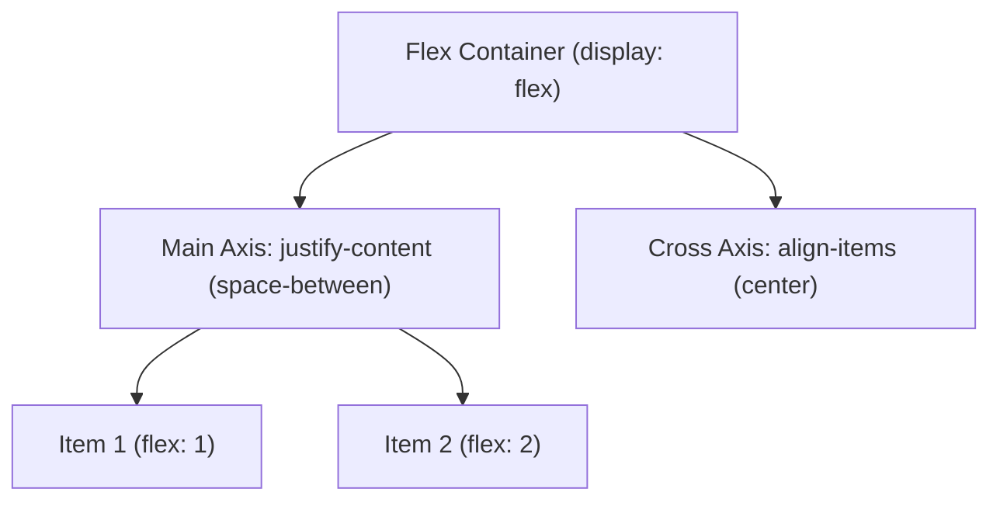

```yaml
schema_version: "2.0"
metadata:
  lesson_id: "CSS3-MOD03-LES01"
  course_slug: "course-02-css3"
  course_title: "Course 2: CSS3"
  module_slug: "mod-03-flexbox-and-grid"
  module_title: "Module 3 - Modern Layout Engine: Flexbox & CSS Grid"
  lesson_slug: "flexible-box-layout-flexbox"
  lesson_title: "Lesson 3.1 Flexible Box Layout (Flexbox)"
  sort_order: 301

pedagogy:
  difficulty: "intermediate"
  estimated_time:
    reading_minutes: 20
    practice_minutes: 25
    quiz_minutes: 10
    total_minutes: 55
  bloom_taxonomy_level: "Apply"
  xp_reward: 60

prerequisites:
  required_lesson_ids:
    - "CSS3-MOD02-LES02"
  required_skills:
    - "Display Property & Box Model Geometry"

skills_acquired:
  - "Flexbox Architecture (Container vs Items, Main Axis vs Cross Axis)"
  - "Flex Axis Alignment (`justify-content`, `align-items`, `align-content`)"
  - "Flex Item Distribution (`flex-grow`, `flex-shrink`, `flex-basis`, `flex` shorthand)"
  - "Item Reordering & Self Alignment (`align-self`, `order`)"
  - "Flexbox Gap Spacing (`gap`, `row-gap`, `column-gap`)"

dependencies:
  software:
    - "VS Code"
    - "Chrome DevTools Flexbox Inspector"
  hardware: []

seo_and_social:
  meta_title: "CSS3 Flexbox Layout Masterclass: Alignment, Axes & flex shorthand"
  meta_description: "Master CSS Flexbox: main vs cross axis, justify-content, align-items, flex-grow, flex-shrink, flex-basis, order, and gap properties."
  keywords: ["CSS Flexbox", "display flex", "justify-content", "align-items", "flex-grow", "flex-shrink", "flex-basis", "flex gap"]

assessment_config:
  has_quiz: true
  has_lab: true
  has_flashcards: true
  pass_score_percentage: 80
```

# Lesson 3.1 Flexible Box Layout (Flexbox)

## 1. Overview & Learning Objectives [id: overview]

- **Estimated Time**: 55 Minutes (20m Reading | 25m Practice | 10m Quiz)
- **Difficulty Level**: ⭐⭐ Intermediate
- **Prerequisites**: [Lesson 2.2 Display Property](file:///d:/My%20Drive/all%20files/PROJECT%20FILES/notes/docs/curriculum/_02_css3/_02_05_display_property_and_visual_formatting_model.md)
- **XP Reward**: +60 XP

### Learning Objectives
By the end of this lesson, you will be able to:
1. Deconstruct Flexbox layouts into Flex Container and Flex Item relationships.
2. Align items along Main Axis (`justify-content`) and Cross Axis (`align-items`, `align-content`).
3. Control item sizing dynamics using `flex-grow`, `flex-shrink`, `flex-basis`, and `flex` shorthand.
4. Reorder flex items using `order` and `align-self`.
5. Apply modern gap spacing (`gap: 1rem`).

---

## 2. Environment & Prerequisites [id: prerequisites]

Inspect Flexbox layouts in Chrome DevTools:
- Open DevTools (`F12`) $\rightarrow$ Click **Elements** tab $\rightarrow$ Click the **flex** badge on DOM nodes to reveal interactive grid overlay guides.

---

## 3. Theoretical Foundations [id: theory]

### 3.1 Flexbox Axes System
Flexbox is a 1-dimensional layout model operating on two orthogonal axes:
- **Main Axis**: Defined by `flex-direction` (`row` [horizontal] or `column` [vertical]).
- **Cross Axis**: Runs perpendicular to the Main Axis.

```
flex-direction: row ────►  Main Axis (Horizontal)
                              │
                              ▼  Cross Axis (Vertical)

flex-direction: column ──► Main Axis (Vertical)
                              │
                              ▼  Cross Axis (Horizontal)
```

### 3.2 Main Axis vs Cross Axis Alignment

```
┌─────────────────────────────────────────────────────────────────────────────┐
│                       FLEXBOX ALIGNMENT PROPERTIES                          │
├───────────────────┬───────────────────┬─────────────────────────────────────┤
│ Property          │ Axis Target       │ Values                              │
├───────────────────┼───────────────────┼─────────────────────────────────────┤
│ `justify-content` │ Main Axis         │ `flex-start`, `flex-end`, `center`, │
│                   │                   │ `space-between`, `space-around`,    │
│                   │                   │ `space-evenly`                      │
├───────────────────┼───────────────────┼─────────────────────────────────────┤
│ `align-items`     │ Cross Axis        │ `stretch`, `flex-start`, `flex-end`,│
│                   │                   │ `center`, `baseline`                │
├───────────────────┼───────────────────┼─────────────────────────────────────┤
│ `gap`             │ Main & Cross Gap  │ `1rem`, `16px 24px`                 │
└───────────────────┴───────────────────┴─────────────────────────────────────┘
```

### 3.3 Flex Item Sizing (`flex: grow shrink basis`)
- `flex-grow`: Ratio of extra available space item absorbs (default `0`).
- `flex-shrink`: Ratio item shrinks when container overflows (default `1`).
- `flex-basis`: Initial size before space distribution (default `auto`).

```css
/* Production Shorthand: flex: grow shrink basis */
.flex-item {
  flex: 1 1 0%; /* Fills equal width in flex row */
}
```

---

## 4. Architecture & Diagram Visualizations [id: diagram]



---

## 5. Code & Hardware Implementation [id: syntax]

```html
<!DOCTYPE html>
<html lang="en">
<head>
  <meta charset="UTF-8">
  <title>Flexbox Card Grid</title>
  <style>
    body { font-family: system-ui; padding: 2rem; background: #0f172a; color: #fff; }
    
    /* Flex Container */
    .card-grid {
      display: flex;
      flex-wrap: wrap;
      justify-content: space-between;
      align-items: stretch;
      gap: 1.5rem;
    }

    /* Flex Items */
    .card {
      flex: 1 1 280px; /* Grow=1, Shrink=1, Basis=280px */
      background: #1e293b;
      padding: 1.5rem;
      border-radius: 8px;
      border: 1px solid #3b82f6;
    }
  </style>
</head>
<body>
  <div class="card-grid">
    <div class="card"><h3>ESP32 Node 1</h3><p>Status: Active</p></div>
    <div class="card"><h3>ESP32 Node 2</h3><p>Status: Active</p></div>
    <div class="card"><h3>ESP32 Node 3</h3><p>Status: Offline</p></div>
  </div>
</body>
</html>
```

---

## 6. Enterprise Real-World Applications [id: examples]

- **Equal-Height Responsive Cards**: `align-items: stretch` ensures cards in a row expand to matching vertical heights regardless of content length.

---

## 7. Guided Step-by-Step Hands-On Exercise [id: exercises]

1. Save code as `flex_demo.html`.
2. Resize browser window $\rightarrow$ Observe cards wrapping gracefully via `flex-wrap: wrap` and `flex: 1 1 280px`.

---

## 8. Common Pitfalls & Troubleshooting [id: common_mistakes]

| Bug / Error | Root Cause | Engineering Solution |
| :--- | :--- | :--- |
| **Flex Items Squished / Compressed** | `flex-shrink` defaulted to `1`. | Add `flex-shrink: 0` or set `min-width` to prevent unwanted compression. |

---

## 9. Best Practices & Optimization [id: best_practices]

- **Use Shorthand `flex: 1 1 auto`**: Avoid writing `flex-grow`, `flex-shrink`, and `flex-basis` separately.

---

## 10. Industry Interview Q&A [id: interview_qa]

### Q1: What does `flex: 1` expand to in CSS?
**Answer**: `flex: 1` expands to `flex-grow: 1`, `flex-shrink: 1`, and `flex-basis: 0%`. It forces items to absorb equal shares of available container width.

---

## 11. Self-Assessment Quiz [id: quiz]

```json
{
  "quiz_title": "Lesson 3.1 Flexbox Assessment",
  "questions": [
    {
      "question_id": "Q1",
      "type": "multiple_choice",
      "question_text": "Which property aligns items along the Main Axis in Flexbox?",
      "options": ["align-items", "justify-content", "align-content", "flex-flow"],
      "correct_answer_index": 1,
      "explanation": "justify-content controls alignment along the Main Axis."
    }
  ]
}
```

---

## 12. Portfolio Assignment & Challenge [id: lab]

Build a responsive navigation header with left logo, centered links, and right call-to-action button using Flexbox.

---

## 13. Spaced Repetition Flashcards [id: flashcards]

**Front**: What Flexbox property changes the main axis from horizontal to vertical?
**Back**: `flex-direction: column;`
<!-- flashcard:end -->

---

## 14. Summary & Cheat Sheet [id: summary]

```css
.flex-container { display: flex; justify-content: space-between; gap: 1rem; }
```
