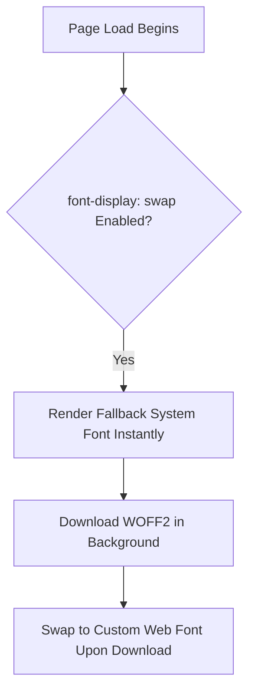

```yaml
schema_version: "2.0"
metadata:
  lesson_id: "CSS3-MOD04-LES01"
  course_slug: "course-02-css3"
  course_title: "Course 2: CSS3"
  module_slug: "mod-04-typography-colors-effects"
  module_title: "Module 4 - Typography, Colors, Backgrounds, & Visual Effects"
  lesson_slug: "advanced-typography-and-web-fonts"
  lesson_title: "Lesson 4.1 Advanced Typography & Web Fonts"
  sort_order: 401

pedagogy:
  difficulty: "intermediate"
  estimated_time:
    reading_minutes: 20
    practice_minutes: 25
    quiz_minutes: 10
    total_minutes: 55
  bloom_taxonomy_level: "Apply"
  xp_reward: 60

prerequisites:
  required_lesson_ids:
    - "CSS3-MOD02-LES04"
  required_skills:
    - "CSS Sizing Units & Typography Basics"

skills_acquired:
  - "Custom Font Embedding (`@font-face` Syntax & Formats WOFF2/WOFF)"
  - "Font Stacks & Fallback System Design"
  - "Typography Properties (`font-size`, `font-weight`, `line-height`, `letter-spacing`)"
  - "Text Truncation & Line-Clamping (`-webkit-line-clamp`)"
  - "Variable Fonts Integration (`font-variation-settings`)"

dependencies:
  software:
    - "VS Code"
    - "Google Fonts / Local WOFF2 Files"
  hardware: []

seo_and_social:
  meta_title: "CSS3 Advanced Typography: @font-face, WOFF2, Line-Clamping & Variable Fonts"
  meta_description: "Master CSS3 typography: @font-face custom fonts, WOFF2 formatting, font stacks, line-height, letter-spacing, line-clamping, and variable fonts."
  keywords: ["CSS Typography", "@font-face", "WOFF2", "Web Fonts", "font-weight", "line-height", "line-clamp", "Variable Fonts"]

assessment_config:
  has_quiz: true
  has_lab: true
  has_flashcards: true
  pass_score_percentage: 80
```

# Lesson 4.1 Advanced Typography & Web Fonts

## 1. Overview & Learning Objectives [id: overview]

- **Estimated Time**: 55 Minutes (20m Reading | 25m Practice | 10m Quiz)
- **Difficulty Level**: ⭐⭐ Intermediate
- **Prerequisites**: [Lesson 2.4 Sizing Units](file:///d:/My%20Drive/all%20files/PROJECT%20FILES/notes/docs/curriculum/_02_css3/_02_07_sizing_units_and_intrinsic_sizing.md)
- **XP Reward**: +60 XP

### Learning Objectives
By the end of this lesson, you will be able to:
1. Embed performant custom web fonts using `@font-face` and modern **WOFF2** formats.
2. Construct bulletproof font fallback stacks for system performance.
3. Fine-tune micro-typography (`line-height`, `letter-spacing`, `word-spacing`, `text-transform`).
4. Truncate multi-line text blocks using CSS line-clamping (`-webkit-line-clamp`).
5. Leverage Variable Fonts (`font-variation-settings`) to reduce HTTP font download sizes.

---

## 2. Environment & Prerequisites [id: prerequisites]

Open VS Code and create `typography_demo.html` to test font loading.

---

## 3. Theoretical Foundations [id: theory]

### 3.1 `@font-face` Syntax & WOFF2
WOFF2 (Web Open Font Format 2) provides 30%+ better compression than WOFF1 and is supported across 98%+ of modern browsers:

```css
@font-face {
  font-family: 'Inter';
  src: url('/fonts/inter-bold.woff2') format('woff2');
  font-weight: 700;
  font-style: normal;
  font-display: swap; /* Eliminates Flash of Invisible Text (FOIT) */
}
```

> [!TIP]
> **`font-display: swap`**: Instructs the browser to render text immediately using a fallback system font while the custom Web Font downloads, preventing Flash of Invisible Text (FOIT).

### 3.2 Micro-Typography & Line Clamping
- `line-height`: Ideal body text ratio is **1.5 to 1.7** for optimal readability.
- Multi-line Truncation:

```css
/* Truncate text to exactly 3 lines with ellipsis (...) */
.line-clamp-3 {
  display: -webkit-box;
  -webkit-line-clamp: 3;
  -webkit-box-orient: vertical;
  overflow: hidden;
}
```

---

## 4. Architecture & Diagram Visualizations [id: diagram]



---

## 5. Code & Hardware Implementation [id: syntax]

```html
<!DOCTYPE html>
<html lang="en">
<head>
  <meta charset="UTF-8">
  <title>Advanced Typography Portal</title>
  <style>
    body {
      font-family: system-ui, -apple-system, BlinkMacSystemFont, "Segoe UI", Roboto, sans-serif;
      line-height: 1.6;
      padding: 2rem;
      background: #0f172a;
      color: #f8fafc;
    }
    .clamped-text {
      display: -webkit-box;
      -webkit-line-clamp: 2;
      -webkit-box-orient: vertical;
      overflow: hidden;
      max-width: 50ch;
      background: #1e293b;
      padding: 1rem;
      border-radius: 8px;
    }
  </style>
</head>
<body>
  <h2>Multi-Line Clamped Excerpt</h2>
  <p class="clamped-text">
    This is a long IoT sensor telemetry report paragraph that will automatically truncate with an ellipsis after exactly two lines of content without relying on JavaScript string manipulation techniques.
  </p>
</body>
</html>
```

---

## 6. Enterprise Real-World Applications [id: examples]

- **News & Content Portals**: Line-clamping (`-webkit-line-clamp`) is used across cards on Medium, BBC, and news sites to force uniform card heights.

---

## 7. Guided Step-by-Step Hands-On Exercise [id: exercises]

1. Save code as `typography_demo.html`.
2. Inspect `.clamped-text` in Chrome DevTools $\rightarrow$ Resize window to see ellipsis (`...`) appear dynamically!

---

## 8. Common Pitfalls & Troubleshooting [id: common_mistakes]

| Bug / Error | Root Cause | Engineering Solution |
| :--- | :--- | :--- |
| **Flash of Invisible Text (FOIT)** | Omitting `font-display: swap` in `@font-face` definitions. | Add `font-display: swap;` to all `@font-face` rules. |

---

## 9. Best Practices & Optimization [id: best_practices]

- **Use WOFF2**: Standardize on WOFF2 font files.
- **Set `font-display: swap`**: Improves FCP (First Contentful Paint) metrics.

---

## 10. Industry Interview Q&A [id: interview_qa]

### Q1: What is the purpose of `font-display: swap` in CSS?
**Answer**: It prevents Flash of Invisible Text (FOIT) by instructing the browser to draw text immediately using a fallback system font while the custom Web Font file is being fetched over the network.

---

## 11. Self-Assessment Quiz [id: quiz]

```json
{
  "quiz_title": "Lesson 4.1 Typography Assessment",
  "questions": [
    {
      "question_id": "Q1",
      "type": "multiple_choice",
      "question_text": "Which modern font format offers the highest compression efficiency for Web Fonts?",
      "options": ["TTF", "OTF", "WOFF2", "SVG"],
      "correct_answer_index": 2,
      "explanation": "WOFF2 is the modern web standard font format with superior Brotli compression."
    }
  ]
}
```

---

## 12. Portfolio Assignment & Challenge [id: lab]

Build a blog article typography stylesheet using local WOFF2 fonts and line-clamping.

---

## 13. Spaced Repetition Flashcards [id: flashcards]

**Front**: What CSS property truncates text after a specified number of lines?
**Back**: `-webkit-line-clamp: N;` (combined with `display: -webkit-box;` and `overflow: hidden;`).
<!-- flashcard:end -->

---

## 14. Summary & Cheat Sheet [id: summary]

```css
@font-face { font-family: 'AppFont'; src: url('font.woff2') format('woff2'); font-display: swap; }
```
