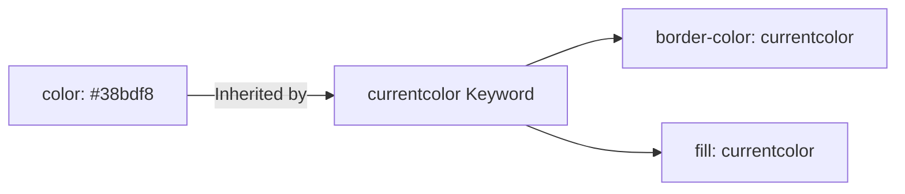

```yaml
schema_version: "2.0"
metadata:
  lesson_id: "CSS3-MOD04-LES02"
  course_slug: "course-02-css3"
  course_title: "Course 2: CSS3"
  module_slug: "mod-04-typography-colors-effects"
  module_title: "Module 4 - Typography, Colors, Backgrounds, & Visual Effects"
  lesson_slug: "modern-css-color-systems"
  lesson_title: "Lesson 4.2 Modern CSS Color Systems"
  sort_order: 402

pedagogy:
  difficulty: "intermediate"
  estimated_time:
    reading_minutes: 20
    practice_minutes: 25
    quiz_minutes: 10
    total_minutes: 55
  bloom_taxonomy_level: "Apply"
  xp_reward: 60

prerequisites:
  required_lesson_ids:
    - "CSS3-MOD04-LES01"
  required_skills:
    - "CSS Syntax & Declaration Blocks"

skills_acquired:
  - "Hexadecimal, RGB, RGBA, HSL, HSLA Color Functions"
  - "Perceptually Uniform Color Spaces (`oklch()`, `oklab()`)"
  - "Dynamic Color Mixing via `color-mix()`"
  - "Alpha Channel Transparency Management"
  - "The `currentcolor` Keyword Utility"

dependencies:
  software:
    - "VS Code"
  hardware: []

seo_and_social:
  meta_title: "Modern CSS Color Systems: HSL, oklch(), color-mix() & currentcolor"
  meta_description: "Master modern CSS color spaces: HEX, RGB, HSL, perceptually uniform oklch(), color-mix() function, alpha transparency, and currentcolor keyword."
  keywords: ["CSS Color", "HEX RGB HSL", "oklch", "color-mix", "currentcolor", "Alpha Channel", "CSS Color Spaces"]

assessment_config:
  has_quiz: true
  has_lab: true
  has_flashcards: true
  pass_score_percentage: 80
```

# Lesson 4.2 Modern CSS Color Systems

## 1. Overview & Learning Objectives [id: overview]

- **Estimated Time**: 55 Minutes (20m Reading | 25m Practice | 10m Quiz)
- **Difficulty Level**: ⭐⭐ Intermediate
- **Prerequisites**: [Lesson 4.1 Advanced Typography](file:///d:/My%20Drive/all%20files/PROJECT%20FILES/notes/docs/curriculum/_02_css3/_02_10_advanced_typography_and_web_fonts.md)
- **XP Reward**: +60 XP

### Learning Objectives
By the end of this lesson, you will be able to:
1. Deconstruct Hexadecimal, RGB/RGBA, and HSL/HSLA color notations.
2. Utilize perceptually uniform modern color spaces (**`oklch()`** and `oklab()`).
3. Mix color spaces dynamically using the CSS **`color-mix()`** function.
4. Manage alpha channel transparency without affecting child element opacities.
5. Apply the **`currentcolor`** keyword for DRY, themeable icon styling.

---

## 2. Environment & Prerequisites [id: prerequisites]

Open VS Code and create `color_demo.html` to experiment with modern CSS color syntax.

---

## 3. Theoretical Foundations [id: theory]

### 3.1 Evolution of CSS Color Functions

```
Hex / RGB ──► HSL / HSLA ──► Modern Syntax rgb(r g b / a) ──► Perceptually Uniform oklch(L C H / a)
```

- **Hexadecimal**: `#0f172a` or `#0f172aff` (Includes 8-digit alpha).
- **HSL**: `hsl(217deg 91% 60% / 0.8)` (Hue, Saturation, Lightness, Alpha).
- **`oklch()`**: Perceptually uniform color space where lightness changes feel natural to human vision across all hues.

### 3.2 The `color-mix()` Function
`color-mix()` blends two colors in a specified color space dynamically in CSS:

```css
/* Mix 80% Blue with 20% White in OKLCH space */
.tinted-box {
  background-color: color-mix(in oklch, #3b82f6 80%, #ffffff);
}
```

### 3.3 The `currentcolor` Keyword
`currentcolor` acts as a dynamic CSS variable referencing the element's computed `color` property value:

```css
.btn {
  color: #38bdf8;
  border: 2px solid currentcolor; /* Automatically matches text color #38bdf8! */
}
```

---

## 4. Architecture & Diagram Visualizations [id: diagram]



---

## 5. Code & Hardware Implementation [id: syntax]

```html
<!DOCTYPE html>
<html lang="en">
<head>
  <meta charset="UTF-8">
  <title>Modern Color Systems</title>
  <style>
    body { font-family: system-ui; padding: 2rem; background: #0f172a; color: #fff; }
    
    /* Modern oklch color */
    .oklch-card {
      background: oklch(0.3 0.1 250 / 0.9);
      border: 2px solid currentcolor;
      color: #38bdf8;
      padding: 1.5rem;
      border-radius: 8px;
    }
  </style>
</head>
<body>
  <div class="oklch-card">
    <h3>OKLCH Perceptual Color Card</h3>
    <p>Border color inherits matching text color via currentcolor keyword.</p>
  </div>
</body>
</html>
```

---

## 6. Enterprise Real-World Applications [id: examples]

- **Themeable Icon Libraries**: SVG icons use `fill: currentcolor` so changing text color automatically recolors icons without extra CSS rules.

---

## 7. Guided Step-by-Step Hands-On Exercise [id: exercises]

1. Save code as `color_demo.html`.
2. Inspect `.oklch-card` in Chrome DevTools $\rightarrow$ Change `color: #38bdf8` to `#22c55e` $\rightarrow$ Observe border updates instantly via `currentcolor`!

---

## 8. Common Pitfalls & Troubleshooting [id: common_mistakes]

| Bug / Error | Root Cause | Engineering Solution |
| :--- | :--- | :--- |
| **Child Elements Become Transparent** | Using `opacity: 0.5` on parent container instead of alpha channel colors (`rgba` / `hsla` / `oklch`). | Use background alpha transparency (`background: rgb(0 0 0 / 0.5)`) instead of `opacity`. |

---

## 9. Best Practices & Optimization [id: best_practices]

- **Use `currentcolor` for Borders & SVG Fills**: Keeps icon and border colors in sync.
- **Adopt `oklch()` for Color Palettes**: Guarantees consistent visual lightness across themes.

---

## 10. Industry Interview Q&A [id: interview_qa]

### Q1: What makes `oklch()` superior to traditional `hsl()`?
**Answer**: HSL is not perceptually uniform—yellow at 50% lightness appears much brighter than blue at 50% lightness. `oklch()` is engineered so 50% lightness appears identically bright to human eyes across all color hues, enabling predictable palette generation.

---

## 11. Self-Assessment Quiz [id: quiz]

```json
{
  "quiz_title": "Lesson 4.2 Color Systems Assessment",
  "questions": [
    {
      "question_id": "Q1",
      "type": "multiple_choice",
      "question_text": "Which CSS keyword references the element's current computed `color` property value?",
      "options": ["inherit", "currentcolor", "color-self", "auto"],
      "correct_answer_index": 1,
      "explanation": "currentcolor evaluates to the computed color property value."
    }
  ]
}
```

---

## 12. Portfolio Assignment & Challenge [id: lab]

Build a dynamically themed UI component set using `currentcolor` and `color-mix()`.

---

## 13. Spaced Repetition Flashcards [id: flashcards]

**Front**: What CSS function blends two colors dynamically in a specific color space?
**Back**: `color-mix(in oklch, color1 50%, color2)`
<!-- flashcard:end -->

---

## 14. Summary & Cheat Sheet [id: summary]

```css
.card { color: #38bdf8; border: 2px solid currentcolor; }
```
