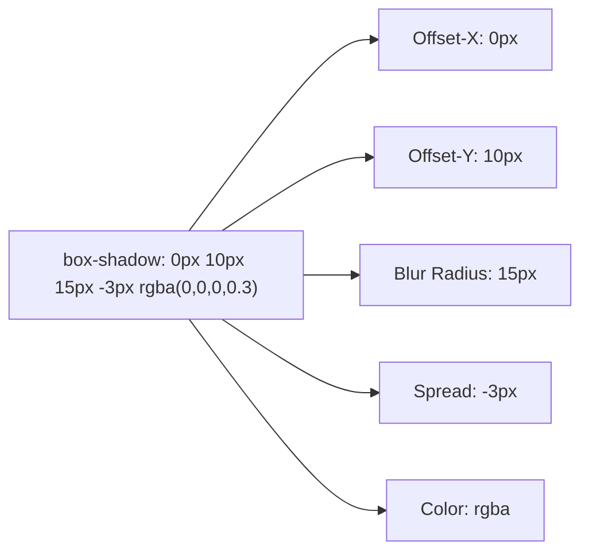

```yaml
schema_version: "2.0"
metadata:
  lesson_id: "CSS3-MOD04-LES03"
  course_slug: "course-02-css3"
  course_title: "Course 2: CSS3"
  module_slug: "mod-04-typography-colors-effects"
  module_title: "Module 4 - Typography, Colors, Backgrounds, & Visual Effects"
  lesson_slug: "backgrounds-borders-and-shadows"
  lesson_title: "Lesson 4.3 Backgrounds, Borders, & Shadows"
  sort_order: 403

pedagogy:
  difficulty: "intermediate"
  estimated_time:
    reading_minutes: 20
    practice_minutes: 25
    quiz_minutes: 10
    total_minutes: 55
  bloom_taxonomy_level: "Apply"
  xp_reward: 60

prerequisites:
  required_lesson_ids:
    - "CSS3-MOD04-LES02"
  required_skills:
    - "Modern CSS Color Systems"

skills_acquired:
  - "Background Images & Fitting (`background-size: cover | contain`)"
  - "Linear, Radial, & Conic Gradients"
  - "Advanced Borders (`border-radius`, `outline-offset`)"
  - "Box Shadow Effects (`box-shadow` inset, blur, spread)"
  - "Text Shadows (`text-shadow`)"

dependencies:
  software:
    - "VS Code"
  hardware: []

seo_and_social:
  meta_title: "CSS3 Backgrounds, Gradients, Borders & Box Shadows Guide"
  meta_description: "Master CSS3 backgrounds: background-size cover/contain, linear/radial/conic gradients, border-radius, outline-offset, and layered box-shadows."
  keywords: ["CSS Backgrounds", "Gradients", "linear-gradient", "conic-gradient", "border-radius", "box-shadow", "inset shadow"]

assessment_config:
  has_quiz: true
  has_lab: true
  has_flashcards: true
  pass_score_percentage: 80
```

# Lesson 4.3 Backgrounds, Borders, & Shadows

## 1. Overview & Learning Objectives [id: overview]

- **Estimated Time**: 55 Minutes (20m Reading | 25m Practice | 10m Quiz)
- **Difficulty Level**: ⭐⭐ Intermediate
- **Prerequisites**: [Lesson 4.2 Modern CSS Color Systems](file:///d:/My%20Drive/all%20files/PROJECT%20FILES/notes/docs/curriculum/_02_css3/_02_11_modern_css_color_systems.md)
- **XP Reward**: +60 XP

### Learning Objectives
By the end of this lesson, you will be able to:
1. Configure background fitting and positioning (`background-size: cover`, `background-attachment`).
2. Construct Linear, Radial, and Conic CSS Gradients.
3. Apply advanced border radius curves and accessibility `outline-offset`.
4. Layer realistic elevation `box-shadow` values (offset-x, offset-y, blur, spread, inset).

---

## 2. Environment & Prerequisites [id: prerequisites]

Open VS Code and create `shadow_demo.html` to write background and shadow code.

---

## 3. Theoretical Foundations [id: theory]

### 3.1 CSS Gradient Types
- **Linear Gradient**: Transitions color along a directional angle (`linear-gradient(135deg, #0f172a, #3b82f6)`).
- **Radial Gradient**: Transitions color outward from an origin point (`radial-gradient(circle, #38bdf8, #0f172a)`).
- **Conic Gradient**: Transitions color around a center pivot point (`conic-gradient(#ef4444, #22c55e, #3b82f6)`).

### 3.2 Box Shadow Layering (`box-shadow`)

```css
/* box-shadow: offset-x | offset-y | blur-radius | spread-radius | color */
.card {
  box-shadow: 0 10px 15px -3px rgba(0, 0, 0, 0.1), 0 4px 6px -4px rgba(0, 0, 0, 0.1);
}
```

---

## 4. Architecture & Diagram Visualizations [id: diagram]



---

## 5. Code & Hardware Implementation [id: syntax]

```html
<!DOCTYPE html>
<html lang="en">
<head>
  <meta charset="UTF-8">
  <title>Gradients and Shadows</title>
  <style>
    body { font-family: system-ui; padding: 2rem; background: #0f172a; }
    .hero-card {
      background: linear-gradient(135deg, #1e293b 0%, #0f172a 100%);
      border: 1px solid #38bdf8;
      border-radius: 12px;
      padding: 2rem;
      color: #fff;
      box-shadow: 0 20px 25px -5px rgba(0, 0, 0, 0.5);
    }
  </style>
</head>
<body>
  <div class="hero-card">
    <h2>Linear Gradient Card</h2>
    <p>Layered shadows create realistic visual elevation.</p>
  </div>
</body>
</html>
```

---

## 6. Enterprise Real-World Applications [id: examples]

- **Elevation Systems**: Modern UI kits (Material Design, Tailwind) define elevation shadow tiers (`shadow-sm`, `shadow-md`, `shadow-lg`, `shadow-xl`) using multi-layered `box-shadow` rules.

---

## 7. Guided Step-by-Step Hands-On Exercise [id: exercises]

1. Save code as `shadow_demo.html`.
2. Inspect `.hero-card` in Chrome DevTools $\rightarrow$ Toggle `box-shadow` on/off to observe depth removal!

---

## 8. Common Pitfalls & Troubleshooting [id: common_mistakes]

| Bug / Error | Root Cause | Engineering Solution |
| :--- | :--- | :--- |
| **Harsh Unnatural Shadows** | Using pure black `box-shadow: 0 5px 10px #000000;`. | Use soft semi-transparent black (`rgba(0, 0, 0, 0.15)`) or colored shadows. |

---

## 9. Best Practices & Optimization [id: best_practices]

- **Layer Shadows**: Combine two subtle `box-shadow` layers for smooth elevation.

---

## 10. Industry Interview Q&A [id: interview_qa]

### Q1: What is the difference between blur-radius and spread-radius in a `box-shadow` property?
**Answer**: Blur-radius controls the softness and spread of the shadow blur. Spread-radius expands or contracts the physical footprint size of the shadow before blur is applied.

---

## 11. Self-Assessment Quiz [id: quiz]

```json
{
  "quiz_title": "Lesson 4.3 Shadows Assessment",
  "questions": [
    {
      "question_id": "Q1",
      "type": "multiple_choice",
      "question_text": "Which gradient type rotates colors around a central 360 degree pivot point?",
      "options": ["linear-gradient", "radial-gradient", "conic-gradient", "repeating-gradient"],
      "correct_answer_index": 2,
      "explanation": "conic-gradient transitions colors around a center pivot point."
    }
  ]
}
```

---

## 12. Portfolio Assignment & Challenge [id: lab]

Build a 3D elevated card set with linear gradients and hover elevation state transitions.

---

## 13. Spaced Repetition Flashcards [id: flashcards]

**Front**: How do you create an inner inset box shadow in CSS?
**Back**: Add the `inset` keyword to the `box-shadow` property (`box-shadow: inset 0 2px 4px #000;`).
<!-- flashcard:end -->

---

## 14. Summary & Cheat Sheet [id: summary]

```css
.card { background: linear-gradient(135deg, #1e293b, #0f172a); box-shadow: 0 10px 15px rgba(0,0,0,0.3); }
```
