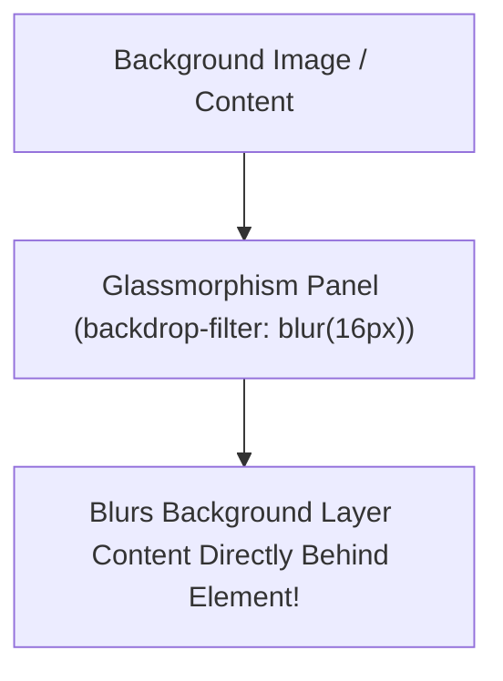

```yaml
schema_version: "2.0"
metadata:
  lesson_id: "CSS3-MOD04-LES04"
  course_slug: "course-02-css3"
  course_title: "Course 2: CSS3"
  module_slug: "mod-04-typography-colors-effects"
  module_title: "Module 4 - Typography, Colors, Backgrounds, & Visual Effects"
  lesson_slug: "visual-effects-filters-and-blending"
  lesson_title: "Lesson 4.4 Visual Effects, Filters, & Blending"
  sort_order: 404

pedagogy:
  difficulty: "advanced"
  estimated_time:
    reading_minutes: 20
    practice_minutes: 25
    quiz_minutes: 10
    total_minutes: 55
  bloom_taxonomy_level: "Apply"
  xp_reward: 70

prerequisites:
  required_lesson_ids:
    - "CSS3-MOD04-LES03"
  required_skills:
    - "CSS Backgrounds & Layering"

skills_acquired:
  - "CSS Filter Effects (`blur()`, `brightness()`, `drop-shadow()`)"
  - "Glassmorphism UI via `backdrop-filter: blur()`"
  - "Blend Modes (`mix-blend-mode`, `background-blend-mode`)"
  - "Custom Geometry Shaping via `clip-path: polygon()`"
  - "Masking Layers with `mask-image`"

dependencies:
  software:
    - "VS Code"
  hardware: []

seo_and_social:
  meta_title: "CSS3 Visual Effects: Glassmorphism (backdrop-filter), Filters & clip-path"
  meta_description: "Master CSS3 visual effects: CSS filters (blur, drop-shadow), backdrop-filter glassmorphism, mix-blend-mode, clip-path polygon shapes, and mask-image."
  keywords: ["CSS Filters", "backdrop-filter", "Glassmorphism", "mix-blend-mode", "clip-path", "mask-image", "CSS Effects"]

assessment_config:
  has_quiz: true
  has_lab: true
  has_flashcards: true
  pass_score_percentage: 80
```

# Lesson 4.4 Visual Effects, Filters, & Blending

## 1. Overview & Learning Objectives [id: overview]

- **Estimated Time**: 55 Minutes (20m Reading | 25m Practice | 10m Quiz)
- **Difficulty Level**: ⭐⭐⭐ Advanced
- **Prerequisites**: [Lesson 4.3 Backgrounds, Borders, & Shadows](file:///d:/My%20Drive/all%20files/PROJECT%20FILES/notes/docs/curriculum/_02_css3/_02_12_backgrounds_borders_and_shadows.md)
- **XP Reward**: +70 XP

### Learning Objectives
By the end of this lesson, you will be able to:
1. Apply CSS filter functions (`blur()`, `brightness()`, `contrast()`, `drop-shadow()`).
2. Construct modern **Glassmorphism** frosted-glass UI containers using `backdrop-filter: blur()`.
3. Blend background images and text elements using `mix-blend-mode` and `background-blend-mode`.
4. Clip elements into custom geometric shapes using `clip-path: polygon()`.

---

## 2. Environment & Prerequisites [id: prerequisites]

Open VS Code and create `glass_demo.html` to write Glassmorphism and filter effects.

---

## 3. Theoretical Foundations [id: theory]

### 3.1 Glassmorphism & `backdrop-filter`
`backdrop-filter` applies graphical effects (like blurring) to the area **behind** an element rather than to the element itself:

```css
/* Glassmorphism Card Effect */
.glass-panel {
  background: rgba(255, 255, 255, 0.1);
  backdrop-filter: blur(16px) saturate(180%);
  -webkit-backdrop-filter: blur(16px) saturate(180%);
  border: 1px solid rgba(255, 255, 255, 0.2);
  border-radius: 12px;
}
```

> [!NOTE]
> Always include `-webkit-backdrop-filter` for Safari browser compatibility!

### 3.2 Clipping Paths (`clip-path`)
`clip-path` cuts an element into custom geometric shapes (triangles, polygons, circles):

```css
/* Slanted Hero Section Header */
.slanted-header {
  clip-path: polygon(0 0, 100% 0, 100% 85%, 0 100%);
}
```

---

## 4. Architecture & Diagram Visualizations [id: diagram]



---

## 5. Code & Hardware Implementation [id: syntax]

```html
<!DOCTYPE html>
<html lang="en">
<head>
  <meta charset="UTF-8">
  <title>Glassmorphism Portal</title>
  <style>
    body {
      margin: 0; padding: 4rem; font-family: system-ui;
      background: linear-gradient(45deg, #3b82f6, #ec4899);
      min-height: 100vh;
    }
    .glass-card {
      background: rgba(255, 255, 255, 0.15);
      backdrop-filter: blur(12px);
      -webkit-backdrop-filter: blur(12px);
      border: 1px solid rgba(255, 255, 255, 0.3);
      padding: 2rem; border-radius: 16px; color: #fff; max-width: 400px;
      box-shadow: 0 8px 32px 0 rgba(0, 0, 0, 0.2);
    }
  </style>
</head>
<body>
  <div class="glass-card">
    <h2>Glassmorphism UI</h2>
    <p>Frosted glass effect constructed via backdrop-filter: blur().</p>
  </div>
</body>
</html>
```

---

## 6. Enterprise Real-World Applications [id: examples]

- **Apple macOS / iOS UI & Windows 11 Fluent Design**: Uses `backdrop-filter: blur()` extensively for translucent navigation bars and control panels.

---

## 7. Guided Step-by-Step Hands-On Exercise [id: exercises]

1. Save code as `glass_demo.html`.
2. Open in Chrome $\rightarrow$ Observe frosted glass effect blurring the background gradient behind the card!

---

## 8. Common Pitfalls & Troubleshooting [id: common_mistakes]

| Bug / Error | Root Cause | Engineering Solution |
| :--- | :--- | :--- |
| **`backdrop-filter` Fails in Safari** | Omitting `-webkit-` vendor prefix. | Always declare both `-webkit-backdrop-filter` and `backdrop-filter`. |

---

## 9. Best Practices & Optimization [id: best_practices]

- **Include `-webkit-` Prefix**: Required for Safari compatibility.

---

## 10. Industry Interview Q&A [id: interview_qa]

### Q1: How does `filter: blur()` differ from `backdrop-filter: blur()`?
**Answer**: `filter: blur()` blurs the target element itself (including its inner text and children). `backdrop-filter: blur()` blurs the content *behind* the target element, keeping inner text crisp.

---

## 11. Self-Assessment Quiz [id: quiz]

```json
{
  "quiz_title": "Lesson 4.4 Visual Effects Assessment",
  "questions": [
    {
      "question_id": "Q1",
      "type": "multiple_choice",
      "question_text": "Which property creates a Glassmorphism frosted-glass blur effect on content BEHIND an element?",
      "options": ["filter: blur()", "backdrop-filter: blur()", "background-blur", "box-shadow: blur"],
      "correct_answer_index": 1,
      "explanation": "backdrop-filter applies graphic effects to the area behind an element."
    }
  ]
}
```

---

## 12. Portfolio Assignment & Challenge [id: lab]

Build an interactive Glassmorphism login card over a live animated background.

---

## 13. Spaced Repetition Flashcards [id: flashcards]

**Front**: What CSS property clips an element into custom polygonal shapes?
**Back**: `clip-path: polygon(...)`
<!-- flashcard:end -->

---

## 14. Summary & Cheat Sheet [id: summary]

```css
.glass { background: rgba(255,255,255,0.1); backdrop-filter: blur(10px); }
```
