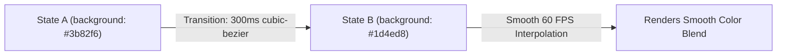

```yaml
schema_version: "2.0"
metadata:
  lesson_id: "CSS3-MOD05-LES01"
  course_slug: "course-02-css3"
  course_title: "Course 2: CSS3"
  module_slug: "mod-05-transitions-transforms-animations"
  module_title: "Module 5 - Transitions, 2D/3D Transforms, & Animations"
  lesson_slug: "css-transitions"
  lesson_title: "Lesson 5.1 CSS Transitions"
  sort_order: 501

pedagogy:
  difficulty: "intermediate"
  estimated_time:
    reading_minutes: 15
    practice_minutes: 20
    quiz_minutes: 10
    total_minutes: 45
  bloom_taxonomy_level: "Apply"
  xp_reward: 50

prerequisites:
  required_lesson_ids:
    - "CSS3-MOD04-LES04"
  required_skills:
    - "CSS Declarations & State Pseudo-Classes"

skills_acquired:
  - "Transition Property Configuration (`transition-property`, `transition-duration`)"
  - "Timing Functions (`ease`, `linear`, `cubic-bezier()`)"
  - "Transition Delay Management (`transition-delay`)"
  - "Hardware Accelerated Property Selection (`opacity`, `transform`)"
  - "Transition Shorthand Syntax"

dependencies:
  software:
    - "VS Code"
    - "Chrome DevTools Animations Panel"
  hardware: []

seo_and_social:
  meta_title: "CSS3 Transitions Masterclass: Easing Functions & GPU Acceleration"
  meta_description: "Master CSS3 transitions: transition property, duration, cubic-bezier timing functions, hardware acceleration (GPU), and state transitions."
  keywords: ["CSS Transitions", "transition shorthand", "cubic-bezier", "ease-in-out", "GPU Acceleration", "transition-delay"]

assessment_config:
  has_quiz: true
  has_lab: true
  has_flashcards: true
  pass_score_percentage: 80
```

# Lesson 5.1 CSS Transitions

## 1. Overview & Learning Objectives [id: overview]

- **Estimated Time**: 45 Minutes (15m Reading | 20m Practice | 10m Quiz)
- **Difficulty Level**: ⭐⭐ Intermediate
- **Prerequisites**: [Lesson 4.4 Visual Effects](file:///d:/My%20Drive/all%20files/PROJECT%20FILES/notes/docs/curriculum/_02_css3/_02_13_visual_effects_filters_and_blending.md)
- **XP Reward**: +50 XP

### Learning Objectives
By the end of this lesson, you will be able to:
1. Interpolate CSS property state changes smoothly using CSS Transitions.
2. Configure timing functions (`ease`, `linear`, `ease-in-out`, `cubic-bezier()`).
3. Manage transition delays and property-specific timing rules.
4. Target GPU-accelerated properties (`opacity`, `transform`) to achieve 60 FPS animations.

---

## 2. Environment & Prerequisites [id: prerequisites]

Inspect animations in Chrome DevTools:
- Open DevTools (`F12`) $\rightarrow$ Click 3 dots menu $\rightarrow$ More tools $\rightarrow$ **Animations**.

---

## 3. Theoretical Foundations [id: theory]

### 3.1 Transition Properties & Shorthand
Transitions interpolate state changes between two CSS values (e.g. `:hover`, `:focus`):

```css
/* transition: property | duration | timing-function | delay */
.button {
  background-color: #3b82f6;
  transition: background-color 0.3s cubic-bezier(0.4, 0, 0.2, 1) 0s;
}

.button:hover {
  background-color: #1d4ed8;
}
```

> [!CAUTION]
> **Performance Rule**: ONLY animate `opacity` and `transform`! Animating layout dimensions (`width`, `height`, `margin`, `top`) triggers expensive browser **Reflows/Layout recalculations** on every frame, causing UI stutter (jank).

---

## 4. Architecture & Diagram Visualizations [id: diagram]



---

## 5. Code & Hardware Implementation [id: syntax]

```html
<!DOCTYPE html>
<html lang="en">
<head>
  <meta charset="UTF-8">
  <title>CSS Transition Demo</title>
  <style>
    body { font-family: system-ui; padding: 2rem; background: #0f172a; color: #fff; }
    .card {
      background: #1e293b;
      padding: 1.5rem;
      border-radius: 8px;
      border: 1px solid #3b82f6;
      /* GPU Accelerated Properties */
      transition: transform 0.2s cubic-bezier(0.4, 0, 0.2, 1), box-shadow 0.2s ease;
    }
    .card:hover {
      transform: translateY(-4px);
      box-shadow: 0 12px 20px rgba(59, 130, 246, 0.3);
    }
  </style>
</head>
<body>
  <div class="card">
    <h3>Interactive Sensor Card</h3>
    <p>Hover to trigger GPU-accelerated lift transition.</p>
  </div>
</body>
</html>
```

---

## 6. Enterprise Real-World Applications [id: examples]

- **UI Hover States**: All modern design systems use `0.2s` to `0.3s` ease-out transitions for buttons, input borders, and card lifts.

---

## 7. Guided Step-by-Step Hands-On Exercise [id: exercises]

1. Save code as `transition_demo.html`.
2. Hover over `.card` in Chrome $\rightarrow$ Verify smooth 60 FPS vertical lift without layout reflows!

---

## 8. Common Pitfalls & Troubleshooting [id: common_mistakes]

| Bug / Error | Root Cause | Engineering Solution |
| :--- | :--- | :--- |
| **UI Animation Stutter (Jank)** | Animating `width`, `height`, or `margin` properties during transitions. | Replace layout property animations with `transform: scale()` or `transform: translate()`. |

---

## 9. Best Practices & Optimization [id: best_practices]

- **Animate `transform` and `opacity`**: Ensures 60 FPS GPU hardware acceleration.

---

## 10. Industry Interview Q&A [id: interview_qa]

### Q1: Why should you avoid animating `height` or `margin` properties?
**Answer**: Modifying `height` or `margin` forces the browser to recalculate element geometry for the entire page (**Reflow/Layout phase**). Animating `transform` or `opacity` bypasses Layout and Paint, running directly on the GPU (**Compositing phase**) for 60 FPS.

---

## 11. Self-Assessment Quiz [id: quiz]

```json
{
  "quiz_title": "Lesson 5.1 Transitions Assessment",
  "questions": [
    {
      "question_id": "Q1",
      "type": "multiple_choice",
      "question_text": "Which pair of CSS properties are GPU hardware-accelerated for smooth 60 FPS animations?",
      "options": ["width & height", "margin & padding", "opacity & transform", "top & left"],
      "correct_answer_index": 2,
      "explanation": "opacity and transform run on the GPU compositor thread without triggering layout reflows."
    }
  ]
}
```

---

## 12. Portfolio Assignment & Challenge [id: lab]

Build a smooth button state transition set with custom `cubic-bezier` timing functions.

---

## 13. Spaced Repetition Flashcards [id: flashcards]

**Front**: What cubic-bezier timing function mimics natural ease-out physics?
**Back**: `cubic-bezier(0, 0, 0.2, 1)` (or `ease-out`).
<!-- flashcard:end -->

---

## 14. Summary & Cheat Sheet [id: summary]

```css
.card { transition: transform 0.2s ease, opacity 0.2s ease; }
```
