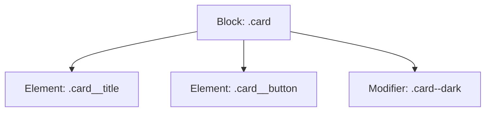

```yaml
schema_version: "2.0"
metadata:
  lesson_id: "CSS3-MOD07-LES02"
  course_slug: "course-02-css3"
  course_title: "Course 2: CSS3"
  module_slug: "mod-07-advanced-css-architecture"
  module_title: "Module 7 - Advanced CSS Architecture & Modern Specifications"
  lesson_slug: "modern-css-architecture-and-methodologies"
  lesson_title: "Lesson 7.2 Modern CSS Architecture & Methodologies"
  sort_order: 702

pedagogy:
  difficulty: "intermediate"
  estimated_time:
    reading_minutes: 20
    practice_minutes: 25
    quiz_minutes: 10
    total_minutes: 55
  bloom_taxonomy_level: "Apply"
  xp_reward: 60

prerequisites:
  required_lesson_ids:
    - "CSS3-MOD07-LES01"
  required_skills:
    - "CSS Variables & Specificity"

skills_acquired:
  - "BEM Methodology (Block, Element, Modifier) Naming Rules"
  - "Object-Oriented CSS (OOCSS) Separation Principles"
  - "SMACSS Architecture Layers"
  - "ITCSS (Inverted Triangle CSS) Directory Structuring"

dependencies:
  software:
    - "VS Code"
  hardware: []

seo_and_social:
  meta_title: "Modern CSS Architecture: BEM Methodology, OOCSS & ITCSS"
  meta_description: "Master CSS architecture methodologies: BEM (Block__element--modifier), OOCSS separation, SMACSS layers, and ITCSS directory structures."
  keywords: ["BEM Methodology", "Block Element Modifier", "OOCSS", "ITCSS", "SMACSS", "CSS Architecture"]

assessment_config:
  has_quiz: true
  has_lab: true
  has_flashcards: true
  pass_score_percentage: 80
```

# Lesson 7.2 Modern CSS Architecture & Methodologies

## 1. Overview & Learning Objectives [id: overview]

- **Estimated Time**: 55 Minutes (20m Reading | 25m Practice | 10m Quiz)
- **Difficulty Level**: ⭐⭐ Intermediate
- **Prerequisites**: [Lesson 7.1 CSS Variables](file:///d:/My%20Drive/all%20files/PROJECT%20FILES/notes/docs/curriculum/_02_css3/_02_21_css_custom_properties_variables.md)
- **XP Reward**: +60 XP

### Learning Objectives
By the end of this lesson, you will be able to:
1. Implement the **BEM (Block, Element, Modifier)** class naming methodology (`.block__element--modifier`).
2. Apply **OOCSS** separation of structure from skin and container from content.
3. Structure modular production CSS using **ITCSS (Inverted Triangle CSS)** layers.
4. Prevent class name collisions and specificity wars in large team codebases.

---

## 2. Environment & Prerequisites [id: prerequisites]

Open VS Code and create `bem_demo.html` to write BEM CSS selectors.

---

## 3. Theoretical Foundations [id: theory]

### 3.1 BEM Naming Convention Syntax
- **Block**: Standalone entity (`.card`, `.btn`, `.navbar`).
- **Element**: Component tied to block (`.card__title`, `.card__img`, `.btn__icon`).
- **Modifier**: Variant flag altering state or style (`.card--featured`, `.btn--primary`, `.btn--disabled`).

```css
/* Block */
.card {}

/* Element (Double Underscore __) */
.card__title { font-size: 1.25rem; }
.card__body { padding: 1rem; }

/* Modifier (Double Hyphen --) */
.card--featured { border: 2px solid #38bdf8; }
```

### 3.2 ITCSS (Inverted Triangle CSS) Layers

```
┌─────────────────────────────────────────────────────────────────────────────┐
│                            ITCSS LAYERED PIPELINE                           │
├───────────────┬─────────────────────────────────────────────────────────────┤
│ 1. Settings   │ Global variables, color palettes, font definitions.         │
│ 2. Tools      │ Mixins and functions.                                       │
│ 3. Generic    │ CSS resets (`box-sizing: border-box`, Normalize.css).       │
│ 4. Elements   │ Unclassed HTML tags (`h1`, `a`, `body`).                     │
│ 5. Objects    │ OOCSS layout wrappers (`.grid`, `.container`).              │
│ 6. Components │ BEM components (`.card`, `.navbar`, `.btn`).                │
│ 7. Trumps     │ High-specificity utility overrides (`.u-hidden`).          │
└───────────────┴─────────────────────────────────────────────────────────────┘
```

---

## 4. Architecture & Diagram Visualizations [id: diagram]



---

## 5. Code & Hardware Implementation [id: syntax]

```html
<!DOCTYPE html>
<html lang="en">
<head>
  <meta charset="UTF-8">
  <title>BEM Architecture Demo</title>
  <style>
    /* BEM Card Component */
    .card { background: #1e293b; border-radius: 8px; padding: 1.5rem; color: #fff; }
    .card__header { margin-bottom: 1rem; }
    .card__title { font-size: 1.25rem; color: #38bdf8; }
    .card__body { font-size: 1rem; }
    
    /* BEM Modifiers */
    .card--active { border-left: 4px solid #22c55e; }
    .card--warning { border-left: 4px solid #ef4444; }
  </style>
</head>
<body>
  <div class="card card--active">
    <div class="card__header">
      <h3 class="card__title">ESP32 Gateway Node A</h3>
    </div>
    <div class="card__body">
      Status: Operational
    </div>
  </div>
</body>
</html>
```

---

## 6. Enterprise Real-World Applications [id: examples]

- **Large Enterprise Codebases**: Companies like Yandex, BBC, and Shopify mandate BEM naming to ensure component classes remain predictable and isolated.

---

## 7. Guided Step-by-Step Hands-On Exercise [id: exercises]

1. Save code as `bem_demo.html`.
2. Inspect `.card--active` in Chrome DevTools $\rightarrow$ Observe single-class flat specificity `(0, 0, 1, 0)`.

---

## 8. Common Pitfalls & Troubleshooting [id: common_mistakes]

| Bug / Error | Root Cause | Engineering Solution |
| :--- | :--- | :--- |
| **Deep BEM Nesting Anti-Pattern** | Writing `.card__body__title__text`. | Keep element depth single-level: `.card__text`. |

---

## 9. Best Practices & Optimization [id: best_practices]

- **Use Flat Selectors**: Avoid nesting BEM selectors in CSS (`.card__title` instead of `.card .card__title`).

---

## 10. Industry Interview Q&A [id: interview_qa]

### Q1: What does BEM stand for and what are its advantages?
**Answer**: Block, Element, Modifier. It provides strict class naming rules that maintain flat single-class specificity, preventing class name collisions and specificity wars in large engineering teams.

---

## 11. Self-Assessment Quiz [id: quiz]

```json
{
  "quiz_title": "Lesson 7.2 BEM Assessment",
  "questions": [
    {
      "question_id": "Q1",
      "type": "multiple_choice",
      "question_text": "In BEM syntax, what separator denotes an Element inside a Block?",
      "options": ["Single underscore (_)", "Double underscore (__)", "Double hyphen (--)", "Single hyphen (-)"],
      "correct_answer_index": 1,
      "explanation": "Double underscore (__) denotes an element (.block__element)."
    }
  ]
}
```

---

## 12. Portfolio Assignment & Challenge [id: lab]

Architect a BEM component library containing cards, badges, and buttons.

---

## 13. Spaced Repetition Flashcards [id: flashcards]

**Front**: In BEM, what separator denotes a Modifier?
**Back**: Double hyphen (`--`) (e.g. `.btn--primary`).
<!-- flashcard:end -->

---

## 14. Summary & Cheat Sheet [id: summary]

```css
.card {}
.card__title {}
.card--active {}
```
