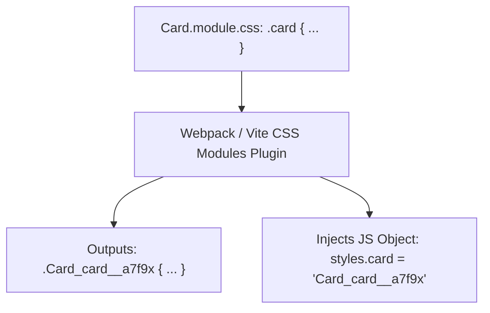

```yaml
schema_version: "2.0"
metadata:
  lesson_id: "CSS3-MOD08-LES02"
  course_slug: "course-02-css3"
  course_title: "Course 2: CSS3"
  module_slug: "mod-08-frameworks-and-performance"
  module_title: "Module 8 - CSS Frameworks Intro & Production Performance"
  lesson_slug: "component-frameworks-and-component-styling"
  lesson_title: "Lesson 8.2 Component Frameworks & Component Styling"
  sort_order: 802

pedagogy:
  difficulty: "intermediate"
  estimated_time:
    reading_minutes: 20
    practice_minutes: 25
    quiz_minutes: 10
    total_minutes: 55
  bloom_taxonomy_level: "Apply"
  xp_reward: 60

prerequisites:
  required_lesson_ids:
    - "CSS3-MOD08-LES01"
  required_skills:
    - "Modern CSS Architecture & Tailwind"

skills_acquired:
  - "CSS Modules Architecture (`style.module.css`)"
  - "Unique Class Name Hashing & Local Scoping"
  - "CSS-in-JS Concepts (Styled Components, Emotion)"
  - "Zero-Runtime CSS-in-JS Engine Mechanics"
  - "Framework Styling Integration (React / Next.js / Vue)"

dependencies:
  software:
    - "VS Code"
  hardware: []

seo_and_social:
  meta_title: "Component-Scoped CSS: CSS Modules, CSS-in-JS & Next.js Styling"
  meta_description: "Master Component-Scoped CSS: CSS Modules (.module.css), class hashing, CSS-in-JS (Styled-Components), and zero-runtime CSS in React & Next.js."
  keywords: ["CSS Modules", ".module.css", "CSS-in-JS", "Styled-Components", "Component Scoped CSS", "Next.js CSS"]

assessment_config:
  has_quiz: true
  has_lab: true
  has_flashcards: true
  pass_score_percentage: 80
```

# Lesson 8.2 Component Frameworks & Component Styling

## 1. Overview & Learning Objectives [id: overview]

- **Estimated Time**: 55 Minutes (20m Reading | 25m Practice | 10m Quiz)
- **Difficulty Level**: ⭐⭐ Intermediate
- **Prerequisites**: [Lesson 8.1 Utility-First CSS](file:///d:/My%20Drive/all%20files/PROJECT%20FILES/notes/docs/curriculum/_02_css3/_02_24_utility_first_css_and_tailwind_introduction.md)
- **XP Reward**: +60 XP

### Learning Objectives
By the end of this lesson, you will be able to:
1. Explain how **CSS Modules** achieve local class scope by hashing class names at compile time.
2. Implement CSS Modules inside React and Next.js applications (`styles.title`).
3. Contrast Runtime CSS-in-JS (Styled Components) with Zero-Runtime CSS engines (Vanilla Extract, Pigment CSS).
4. Evaluate trade-offs between Tailwind CSS, CSS Modules, and CSS-in-JS for enterprise applications.

---

## 2. Environment & Prerequisites [id: prerequisites]

Open VS Code and create `Card.module.css` to build CSS Modules scoping.

---

## 3. Theoretical Foundations [id: theory]

### 3.1 CSS Modules Hashing Mechanism
CSS Modules automatically append unique hashes to class names during build bundling (e.g. `.card` $\to$ `.Card_card__a7f9x`), completely eliminating global style leakages!

```css
/* Card.module.css */
.card {
  background-color: #1e293b;
  padding: 1.5rem;
  border-radius: 8px;
}

.title {
  color: #38bdf8;
}
```

```jsx
// React Component (Card.jsx)
import styles from './Card.module.css';

export function Card() {
  return (
    <div className={styles.card}>
      <h3 className={styles.title}>Scoped Title</h3>
    </div>
  );
}
```

---

## 4. Architecture & Diagram Visualizations [id: diagram]



---

## 5. Code & Hardware Implementation [id: syntax]

```html
<!DOCTYPE html>
<html lang="en">
<head>
  <meta charset="UTF-8">
  <title>CSS Modules Concept Simulation</title>
  <style>
    /* Hashed CSS Output Simulated */
    .Card_card__a7f9x {
      background: #1e293b;
      padding: 1.5rem;
      border-radius: 8px;
      color: #fff;
    }
    .Card_title__b3x2z {
      color: #38bdf8;
      margin: 0;
    }
  </style>
</head>
<body>

  <!-- Simulated Compiled Output -->
  <div class="Card_card__a7f9x">
    <h3 class="Card_title__b3x2z">CSS Modules Local Scoping</h3>
    <p>Unique class hashing guarantees zero global selector collisions.</p>
  </div>

</body>
</html>
```

---

## 6. Enterprise Real-World Applications [id: examples]

- **Next.js & React Applications**: CSS Modules are built into Next.js out of the box (`page.module.css`) to provide scoped styling for component libraries.

---

## 7. Guided Step-by-Step Hands-On Exercise [id: exercises]

1. Save code as `modules_demo.html`.
2. Inspect `h3` element in Chrome DevTools $\rightarrow$ Observe unique class name `.Card_title__b3x2z`!

---

## 8. Common Pitfalls & Troubleshooting [id: common_mistakes]

| Bug / Error | Root Cause | Engineering Solution |
| :--- | :--- | :--- |
| **`styles.title is undefined`** | Hyphenated class names in CSS (`.card-title`) accessed via dot notation (`styles.card-title`). | Use camelCase in CSS Modules (`.cardTitle`) or bracket notation (`styles['card-title']`). |

---

## 9. Best Practices & Optimization [id: best_practices]

- **Use camelCase in CSS Modules**: Allows clean `styles.cardTitle` JS property access.

---

## 10. Industry Interview Q&A [id: interview_qa]

### Q1: How do CSS Modules prevent global CSS class name collisions?
**Answer**: During build bundling, the CSS Modules compiler transforms local class names into globally unique hashed strings (e.g., `.title` becomes `.Card_title__x9z1a`), ensuring styles only apply to the importing component.

---

## 11. Self-Assessment Quiz [id: quiz]

```json
{
  "quiz_title": "Lesson 8.2 CSS Modules Assessment",
  "questions": [
    {
      "question_id": "Q1",
      "type": "multiple_choice",
      "question_text": "What naming convention allows importing CSS Modules directly into React via dot notation (`styles.cardTitle`)?",
      "options": ["snake_case", "kebab-case", "camelCase", "PascalCase"],
      "correct_answer_index": 2,
      "explanation": "camelCase enables standard JavaScript object dot notation access."
    }
  ]
}
```

---

## 12. Portfolio Assignment & Challenge [id: lab]

Build a React component styled with CSS Modules and hashed class names.

---

## 13. Spaced Repetition Flashcards [id: flashcards]

**Front**: What extension must a CSS file have to be processed as a CSS Module in Next.js?
**Back**: `.module.css` (e.g., `Header.module.css`).
<!-- flashcard:end -->

---

## 14. Summary & Cheat Sheet [id: summary]

```jsx
import styles from './Card.module.css';
<div className={styles.card}></div>
```
