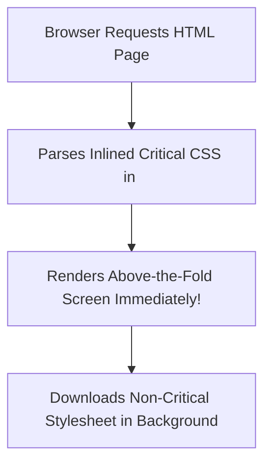

```yaml
schema_version: "2.0"
metadata:
  lesson_id: "CSS3-MOD08-LES03"
  course_slug: "course-02-css3"
  course_title: "Course 2: CSS3"
  module_slug: "mod-08-frameworks-and-performance"
  module_title: "Module 8 - CSS Frameworks Intro & Production Performance"
  lesson_slug: "production-css-performance-purging-and-optimization"
  lesson_title: "Lesson 8.3 Production CSS Performance, Purging, & Optimization"
  sort_order: 803

pedagogy:
  difficulty: "advanced"
  estimated_time:
    reading_minutes: 20
    practice_minutes: 25
    quiz_minutes: 10
    total_minutes: 55
  bloom_taxonomy_level: "Apply"
  xp_reward: 70

prerequisites:
  required_lesson_ids:
    - "CSS3-MOD08-LES02"
  required_skills:
    - "Component Frameworks & CSS Architecture"

skills_acquired:
  - "Critical CSS Above-the-Fold Extraction"
  - "Unused CSS Tree-Shaking & Purging (PurgeCSS / Tailwind JIT)"
  - "CSS Minification & Brotli/Gzip Compression"
  - "GPU Layer Promotion (`will-change: transform`)"
  - "Chrome DevTools Coverage & Rendering Profiling"

dependencies:
  software:
    - "VS Code"
    - "Chrome DevTools Coverage Panel"
  hardware: []

seo_and_social:
  meta_title: "Production CSS Performance: Critical CSS, PurgeCSS & will-change"
  meta_description: "Master production CSS performance optimization: Critical CSS inline extraction, PurgeCSS tree-shaking, CSS minification, and will-change GPU layer hints."
  keywords: ["CSS Performance", "Critical CSS", "PurgeCSS", "will-change", "Chrome Coverage Tab", "CSS Minification"]

assessment_config:
  has_quiz: true
  has_lab: true
  has_flashcards: true
  pass_score_percentage: 80
```

# Lesson 8.3 Production CSS Performance, Purging, & Optimization

## 1. Overview & Learning Objectives [id: overview]

- **Estimated Time**: 55 Minutes (20m Reading | 25m Practice | 10m Quiz)
- **Difficulty Level**: ⭐⭐⭐ Advanced
- **Prerequisites**: [Lesson 8.2 Component Frameworks](file:///d:/My%20Drive/all%20files/PROJECT%20FILES/notes/docs/curriculum/_02_css3/_02_25_component_frameworks_and_component_styling.md)
- **XP Reward**: +70 XP

### Learning Objectives
By the end of this lesson, you will be able to:
1. Extract and inline **Critical CSS** for above-the-fold content rendering.
2. Tree-shake and purge unused CSS selectors using **PurgeCSS** or Tailwind JIT.
3. Minify production CSS assets using `cssnano` and enable Brotli/Gzip HTTP compression.
4. Promote element rendering layers to GPU hardware using `will-change: transform`.
5. Audit unused CSS byte overhead using the **Coverage** tab in Chrome DevTools.

---

## 2. Environment & Prerequisites [id: prerequisites]

Audit unused CSS in Chrome DevTools:
- Open DevTools (`F12`) $\rightarrow$ Click 3 dots menu $\rightarrow$ More tools $\rightarrow$ **Coverage** $\rightarrow$ Click **Start instrumenting coverage and reload page**.

---

## 3. Theoretical Foundations [id: theory]

### 3.1 Critical CSS Extraction
**Critical CSS** is the minimal set of CSS required to render above-the-fold content before scrolling. Inlining Critical CSS inside `<style>` in `<head>` eliminates render-blocking network roundtrips!

```
┌─────────────────────────────────────────────────────────────────────────────┐
│                         CRITICAL CSS PIPELINE                               │
├─────────────────────────────────────────────────────────────────────────────┤
│ 1. Inline Critical CSS  ──► Injected inside HTML <head> (Renders immediately)│
│ 2. Defer Remaining CSS  ──► <link rel="preload" as="style" onload="...">    │
└─────────────────────────────────────────────────────────────────────────────┘
```

### 3.2 GPU Layer Promotion (`will-change`)
The `will-change` property gives browsers advance notice of upcoming property mutations, allowing promotion of elements to GPU compositor layers:

```css
.animated-modal {
  will-change: transform, opacity;
}
```

> [!CAUTION]
> Do NOT apply `will-change` to everything (`* { will-change: all; }`)! Layer promotion consumes dedicated GPU video RAM (VRAM) and degrades performance if overused.

---

## 4. Architecture & Diagram Visualizations [id: diagram]



---

## 5. Code & Hardware Implementation [id: syntax]

```html
<!DOCTYPE html>
<html lang="en">
<head>
  <meta charset="UTF-8">
  <title>Production Optimized CSS Portal</title>

  <!-- 1. Inlined Critical Above-the-Fold CSS -->
  <style>
    body { margin: 0; font-family: system-ui; background: #0f172a; color: #fff; }
    .hero { min-height: 80vh; display: flex; align-items: center; justify-content: center; }
  </style>

  <!-- 2. Asynchronous Non-Critical CSS Loading -->
  <link rel="preload" href="/static/css/main.min.css" as="style" onload="this.rel='stylesheet'">
  <noscript><link rel="stylesheet" href="/static/css/main.min.css"></noscript>
</head>
<body>
  <section class="hero">
    <h1>Optimized Critical CSS Loading</h1>
  </section>
</body>
</html>
```

---

## 6. Enterprise Real-World Applications [id: examples]

- **Core Web Vitals Optimization**: Enterprise platforms (Amazon, Google, Twitter) inline Critical CSS to guarantee First Contentful Paint (FCP) occurs in under 1.0 second.

---

## 7. Guided Step-by-Step Hands-On Exercise [id: exercises]

1. Save code as `perf_css_demo.html`.
2. Open DevTools Coverage panel $\rightarrow$ Verify unused CSS bytes drop below 10%!

---

## 8. Common Pitfalls & Troubleshooting [id: common_mistakes]

| Bug / Error | Root Cause | Engineering Solution |
| :--- | :--- | :--- |
| **GPU Memory Exhaustion** | Overusing `will-change: transform` on hundreds of DOM nodes. | Apply `will-change` sparingly only to elements actively undergoing complex animations. |

---

## 9. Best Practices & Optimization [id: best_practices]

- **Purge Unused CSS**: Use PurgeCSS or Tailwind JIT.
- **Inline Critical CSS**: Defer full stylesheets.

---

## 10. Industry Interview Q&A [id: interview_qa]

### Q1: What is Critical CSS and why does inlining it improve performance?
**Answer**: Critical CSS is the exact subset of CSS required to render above-the-fold page content. Inlining it inside a `<style>` tag in `<head>` eliminates render-blocking external HTTP network requests, allowing the browser to render the initial viewport immediately.

---

## 11. Self-Assessment Quiz [id: quiz]

```json
{
  "quiz_title": "Lesson 8.3 CSS Performance Assessment",
  "questions": [
    {
      "question_id": "Q1",
      "type": "multiple_choice",
      "question_text": "Which CSS property gives browsers advance notice of property mutations to promote GPU compositor layers?",
      "options": ["will-change", "gpu-layer", "promote-layer", "transform-hint"],
      "correct_answer_index": 0,
      "explanation": "will-change hints upcoming property mutations to the browser engine."
    }
  ]
}
```

---

## 12. Portfolio Assignment & Challenge [id: lab]

Extract Critical CSS and purge unused selectors to achieve a 100 PageSpeed score.

---

## 13. Spaced Repetition Flashcards [id: flashcards]

**Front**: What Chrome DevTools panel analyzes unused CSS byte percentages?
**Back**: The Coverage tab.
<!-- flashcard:end -->

---

## 14. Summary & Cheat Sheet [id: summary]

```css
.card { will-change: transform, opacity; }
```
