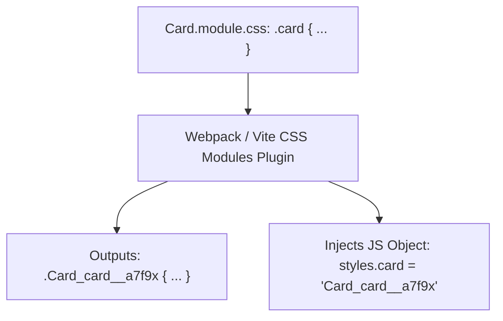

# Component Frameworks And Component Styling

> **Course**: Git Version Control | **Module**: Introduction | **Difficulty**: beginner

---

- **Estimated Time**: 55 Minutes (20m Reading | 25m Practice | 10m Quiz)
- **Difficulty Level**: ⭐⭐ Intermediate
- **Prerequisites**: [Lesson 8.1 Utility-First CSS](file:///d:/My%20Drive/all%20files/PROJECT%20FILES/notes/docs/curriculum/_02_css3/_02_24_utility_first_css_and_tailwind_introduction.md)
- **XP Reward**: +60 XP

### Learning Objectives
By the end of this lesson, you will be able to:
1. Explain how **CSS Modules** achieve local class scope by hashing class names at compile time.
2. Implement CSS Modules inside React and Next.js applications (`styles.title`).
3. Contrast Runtime CSS-in-JS (Styled Components) with Zero-Runtime CSS engines (Vanilla Extract, Pigment CSS).
4. Evaluate trade-offs between Tailwind CSS, CSS Modules, and CSS-in-JS for enterprise applications.

---

---

Open VS Code and create `Card.module.css` to build CSS Modules scoping.

---

---

### 3.1 CSS Modules Hashing Mechanism
CSS Modules automatically append unique hashes to class names during build bundling (e.g. `.card` $\to$ `.Card_card__a7f9x`), completely eliminating global style leakages!

```css
/* Card.module.css */
.card {
  background-color: #1e293b;
  padding: 1.5rem;
  border-radius: 8px;
}

.title {
  color: #38bdf8;
}
```

```jsx
// React Component (Card.jsx)
import styles from './Card.module.css';

export function Card() {
  return (
    <div className={styles.card}>
      <h3 className={styles.title}>Scoped Title</h3>
    </div>
  );
}
```

---

---



---

---

```html
<!DOCTYPE html>
<html lang="en">
<head>
  <meta charset="UTF-8">
  <title>CSS Modules Concept Simulation</title>
  <style>
    /* Hashed CSS Output Simulated */
    .Card_card__a7f9x {
      background: #1e293b;
      padding: 1.5rem;
      border-radius: 8px;
      color: #fff;
    }
    .Card_title__b3x2z {
      color: #38bdf8;
      margin: 0;
    }
  </style>
</head>
<body>

  <!-- Simulated Compiled Output -->
  <div class="Card_card__a7f9x">
    <h3 class="Card_title__b3x2z">CSS Modules Local Scoping</h3>
    <p>Unique class hashing guarantees zero global selector collisions.</p>
  </div>

</body>
</html>
```

---

---

- **Next.js & React Applications**: CSS Modules are built into Next.js out of the box (`page.module.css`) to provide scoped styling for component libraries.

---

---

1. Save code as `modules_demo.html`.
2. Inspect `h3` element in Chrome DevTools $\rightarrow$ Observe unique class name `.Card_title__b3x2z`!

---

---

| Bug / Error | Root Cause | Engineering Solution |
| :--- | :--- | :--- |
| **`styles.title is undefined`** | Hyphenated class names in CSS (`.card-title`) accessed via dot notation (`styles.card-title`). | Use camelCase in CSS Modules (`.cardTitle`) or bracket notation (`styles['card-title']`). |

---

---

- **Use camelCase in CSS Modules**: Allows clean `styles.cardTitle` JS property access.

---

---

### Q1: How do CSS Modules prevent global CSS class name collisions?
**Answer**: During build bundling, the CSS Modules compiler transforms local class names into globally unique hashed strings (e.g., `.title` becomes `.Card_title__x9z1a`), ensuring styles only apply to the importing component.

---

---

```json
{
  "quiz_title": "Lesson 8.2 CSS Modules Assessment",
  "questions": [
    {
      "question_id": "Q1",
      "type": "multiple_choice",
      "question_text": "What naming convention allows importing CSS Modules directly into React via dot notation (`styles.cardTitle`)?",
      "options": ["snake_case", "kebab-case", "camelCase", "PascalCase"],
      "correct_answer_index": 2,
      "explanation": "camelCase enables standard JavaScript object dot notation access."
    }
  ]
}
```

---

---

Build a React component styled with CSS Modules and hashed class names.

---

---

**Front**: What extension must a CSS file have to be processed as a CSS Module in Next.js?
**Back**: `.module.css` (e.g., `Header.module.css`).
<!-- flashcard:end -->

---

---

```jsx
import styles from './Card.module.css';
<div className={styles.card}></div>
```

---
