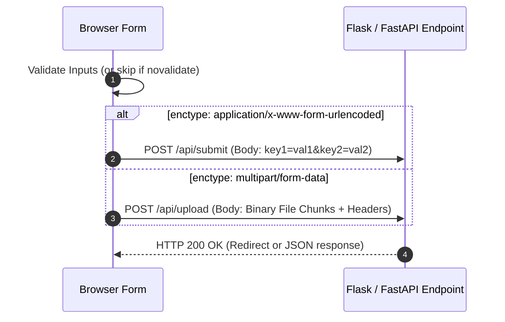

# Form Architecture And Submissions

> **Course**: Git Version Control | **Module**: Introduction | **Difficulty**: beginner

---

- **Estimated Time**: 55 Minutes (20m Reading | 25m Practice | 10m Quiz)
- **Difficulty Level**: ⭐ Beginner
- **Prerequisites**: [Lesson 1.1 Web Architecture & Protocols](file:///d:/My%20Drive/all%20files/PROJECT%20FILES/notes/docs/curriculum/_01_html5/_01_01_web_architecture_and_protocols.md)
- **XP Reward**: +50 XP

### Learning Objectives
By the end of this lesson, you will be able to:
1. Configure `<form>` element attributes (`action`, `method`, `target`, `enctype`, `autocomplete`, `novalidate`).
2. Evaluate when to use `GET` vs `POST` HTTP methods for form submissions.
3. Select appropriate form encoding types (`application/x-www-form-urlencoded`, `multipart/form-data`, `text/plain`).
4. Handle file uploads using `multipart/form-data`.
5. Bypassing or enabling browser autocomplete and native validation engines.

---

---

Inspect form payload submissions in Chrome DevTools:
- Open DevTools (`F12`) $\rightarrow$ Click **Network** tab $\rightarrow$ Filter by **Fetch/XHR** or **Doc**.

---

---

### 3.1 Form Architecture
The `<form>` element acts as an interactive container mapping user inputs to HTTP request payloads sent to a server endpoint.

```html
<form action="/api/v1/telemetry" method="POST" enctype="multipart/form-data">
  <!-- Form controls go here -->
</form>
```

### 3.2 Key `<form>` Attributes

| Attribute | Purpose | Valid Values |
| :--- | :--- | :--- |
| `action` | Target URL endpoint that receives form data payload. | `/submit`, `https://api.com/post` |
| `method` | HTTP protocol method used for submission. | `GET` (default), `POST` |
| `enctype` | Encoding format for request payload. | `application/x-www-form-urlencoded`, `multipart/form-data`, `text/plain` |
| `target` | Browsing context where response is displayed. | `_self` (default), `_blank` |
| `autocomplete` | Controls browser auto-fill suggestions. | `on` (default), `off` |
| `novalidate` | Disables native browser HTML5 validation engine. | Boolean flag (`novalidate`) |

### 3.3 HTTP Submission Methods: GET vs POST

```
┌─────────────────────────────────────────────────────────────────────────────┐
│                           GET VS POST FORM SUBMISSION                       │
├─────────────────┬───────────────────────────────────────────────────────────┤
│ GET Method      │ Appends input data to URL as Query Parameters             │
│                 │ (`/search?q=esp32&page=1`).                               │
│                 │ Use Case: Read-only search forms. Bookmarks supported.   │
│                 │ WARNING: Never send passwords/tokens via GET!             │
├─────────────────┼───────────────────────────────────────────────────────────┤
│ POST Method     │ Encloses input data inside HTTP Request Body.             │
│                 │ Use Case: Form submissions, logins, file uploads, mutations│
│                 │ Bookmarks NOT supported. Secure payload transmission.     │
└─────────────────┴───────────────────────────────────────────────────────────┘
```

### 3.4 Encoding Types (`enctype`)
1. `application/x-www-form-urlencoded` (Default): Converts characters into percent-encoded key-value strings (`name=John+Doe&age=25`).
2. `multipart/form-data`: Required whenever a form contains `<input type="file">`. Packages payload as multi-part binary MIME chunks.
3. `text/plain`: Plaintext formatting without URL encoding (used primarily for legacy debugging).

---

---

### Form Submission Payload Pipeline


---

---

### 5.1 File Upload & Search Form Examples

```html
<!DOCTYPE html>
<html lang="en">
<head>
  <meta charset="UTF-8">
  <title>Form Architecture Demo</title>
  <style>
    body { font-family: system-ui; padding: 20px; }
    form { background: #f8fafc; border: 1px solid #cbd5e1; padding: 20px; border-radius: 8px; max-width: 500px; margin-bottom: 20px; }
    .form-group { margin-bottom: 16px; }
    label { display: block; font-weight: bold; margin-bottom: 6px; }
    input[type="text"], input[type="search"] { width: 100%; padding: 8px; border: 1px solid #94a3b8; border-radius: 4px; }
    button { background: #3b82f6; color: #fff; border: none; padding: 10px 16px; border-radius: 4px; cursor: pointer; }
  </style>
</head>
<body>

  <!-- 1. GET Search Form -->
  <h2>Search Documentation (GET)</h2>
  <form action="/search" method="GET" autocomplete="on">
    <div class="form-group">
      <label for="search-query">Search Term</label>
      <input type="search" id="search-query" name="q" placeholder="e.g., ESP32 pinout">
    </div>
    <button type="submit">Search</button>
  </form>

  <!-- 2. POST File Upload Form -->
  <h2>Upload Firmware Binary (POST & multipart/form-data)</h2>
  <form action="/upload-firmware" method="POST" enctype="multipart/form-data">
    <div class="form-group">
      <label for="device-name">Device Name</label>
      <input type="text" id="device-name" name="device_name" required>
    </div>
    
    <div class="form-group">
      <label for="firmware-file">Select .bin File</label>
      <input type="file" id="firmware-file" name="firmware_bin" accept=".bin" required>
    </div>

    <button type="submit">Upload Firmware</button>
  </form>

</body>
</html>
```

---

---

### Firmware Uploads & Cloud API Integration
When uploading firmware binaries to IoT cloud portals (AWS IoT, Balena, OTA gateways):
- Forms MUST set `enctype="multipart/form-data"` to stream large `.bin` or `.hex` files without corruption.

---

---

### Task: Inspect Payload Formats in Chrome DevTools

1. Open Section 5.1 HTML in Chrome.
2. Open DevTools (`F12`) $\rightarrow$ **Network** tab.
3. Submit the search form $\rightarrow$ Observe query string in URL (`/search?q=...`).
4. Select a file and submit the upload form $\rightarrow$ Observe `Content-Type: multipart/form-data; boundary=...` header in Network tab payload!

---

---

| Bug / Error | Root Cause | Engineering Solution |
| :--- | :--- | :--- |
| **File Upload Receives Empty Filename on Server** | Missing `enctype="multipart/form-data"` on `<form>`. | Always add `enctype="multipart/form-data"` whenever `<input type="file">` is present. |
| **Form Data Not Submitted** | Missing `name` attribute on `<input>` elements. | Inputs without a `name` attribute are ignored during payload serialization! |

---

---

- **Always Provide `name` Attributes**: Unnamed inputs are not submitted in payloads.
- **Set `enctype` for Files**: Use `multipart/form-data` for file uploads.
- **Never Use GET for Passwords**: Transmitting credentials via URL query parameters exposes them in browser history and server logs.

---

---

### Q1: What happens if a developer omits `enctype="multipart/form-data"` on a form containing a file input?
**Answer**:
The browser defaults to `application/x-www-form-urlencoded`, submitting only the string filename of the file (e.g. `firmware.bin`) instead of streaming the actual binary contents to the server.

---

---

```json
{
  "quiz_title": "Lesson 5.1 Form Architecture & Submissions Assessment",
  "questions": [
    {
      "question_id": "Q1",
      "type": "multiple_choice",
      "question_text": "Which `enctype` value MUST be configured on a `<form>` to upload binary files?",
      "options": ["application/json", "application/x-www-form-urlencoded", "multipart/form-data", "text/plain"],
      "correct_answer_index": 2,
      "explanation": "multipart/form-data is required for binary file uploads."
    },
    {
      "question_id": "Q2",
      "type": "multiple_choice",
      "question_text": "What happens to form inputs that do NOT have a `name` attribute upon submission?",
      "options": [
        "They are submitted with numeric keys",
        "They are completely ignored and omitted from the HTTP payload",
        "The browser throws a JS runtime error",
        "They are assigned random IDs"
      ],
      "correct_answer_index": 1,
      "explanation": "Inputs without a name attribute are omitted from the form submission payload."
    }
  ]
}
```

---

---

Build a secure user registration and avatar upload form with `POST` submission and `multipart/form-data` encoding.

---

---

**Front**: Why is `GET` unsuitable for submitting login forms?
**Back**: `GET` appends form input values to the URL query string, exposing sensitive credentials in browser history and server logs.
<!-- flashcard:end -->

---

---

```html
<form action="/upload" method="POST" enctype="multipart/form-data">
  <input type="file" name="doc" required>
  <button type="submit">Upload</button>
</form>
```

---
