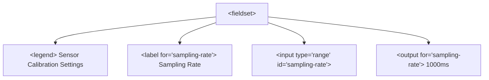

# Form Controls And Input Types

> **Course**: Git Version Control | **Module**: Introduction | **Difficulty**: beginner

---

- **Estimated Time**: 55 Minutes (20m Reading | 25m Practice | 10m Quiz)
- **Difficulty Level**: ⭐⭐ Intermediate
- **Prerequisites**: [Lesson 5.1 Form Architecture & Submissions](file:///d:/My%20Drive/all%20files/PROJECT%20FILES/notes/docs/curriculum/_01_html5/_01_11_form_architecture_and_submissions.md)
- **XP Reward**: +60 XP

### Learning Objectives
By the end of this lesson, you will be able to:
1. Bind labels to form controls explicitly using `<label for="id">` for accessibility compliance.
2. Select appropriate HTML5 input types (`email`, `url`, `tel`, `number`, `range`, `color`).
3. Implement native date and time controls (`date`, `time`, `datetime-local`).
4. Build grouped selection dropdowns (`<select>`, `<option>`, `<optgroup>`) and autocomplete data lists (`<datalist>`).
5. Group related form controls using `<fieldset>` and `<legend>`.
6. Visualize values using `<progress>`, `<meter>`, and `<output>` elements.

---

---

Open VS Code and create `form_controls.html` to build comprehensive form controls.

---

---

### 3.1 Label Association (`<label>`)
Labels provide the accessible name for form controls:
- **Explicit Labeling (Recommended)**: `<label for="user-email">Email</label><input id="user-email">`
- **Implicit Labeling**: `<label>Email <input></label>`

> [!IMPORTANT]
> Clicking a `<label>` automatically transfers keyboard focus to its associated input control!

### 3.2 Form Controls Classification Matrix

```
┌─────────────────────────────────────────────────────────────────────────────┐
│                        HTML5 FORM CONTROL TYPES                             │
├───────────────────┬─────────────────────────────────────────────────────────┤
│ Text & Specialty  │ `text`, `password`, `email`, `url`, `tel`, `search`     │
│                   │ Enforces specialized mobile soft-keyboards.            │
├───────────────────┼─────────────────────────────────────────────────────────┤
│ Numeric & Range   │ `number` (min, max, step), `range` (slider widget)      │
├───────────────────┼─────────────────────────────────────────────────────────┤
│ Date & Time       │ `date`, `time`, `datetime-local`, `month`, `week`       │
├───────────────────┼─────────────────────────────────────────────────────────┤
│ Choices & Colors  │ `checkbox` (multi), `radio` (single choice), `color`    │
├───────────────────┼─────────────────────────────────────────────────────────┤
│ Selections        │ `<select>` + `<optgroup>` + `<option>`, `<datalist>`    │
├───────────────────┼─────────────────────────────────────────────────────────┤
│ Indicators & State│ `<progress>`, `<meter>`, `<output>`, `<input type="hidden">`│
└───────────────────┴─────────────────────────────────────────────────────────┘
```

### 3.3 Form Grouping & Visual Metering
- `<fieldset>` & `<legend>`: Groups related form controls (e.g. Shipping Address) and provides an accessible legend header.
- `<progress>`: Displays task completion progress (e.g. file upload percentage).
- `<meter>`: Displays scalar measurements within a known range (e.g. disk usage, battery level, RSSI signal strength).

```html
<!-- Signal Strength Meter -->
<label for="signal">Sensor Signal Strength</label>
<meter id="signal" min="-100" max="0" low="-80" high="-50" optimum="-30" value="-42">-42 dBm</meter>
```

---

---

### Accessible Form Fieldset Hierarchy


---

---

### 5.1 IoT Device Configuration Form (`iot_config_form.html`)

```html
<!DOCTYPE html>
<html lang="en">
<head>
  <meta charset="UTF-8">
  <title>IoT Device Config Form</title>
  <style>
    body { font-family: system-ui; padding: 20px; }
    form { max-width: 600px; background: #f8fafc; padding: 20px; border-radius: 8px; border: 1px solid #cbd5e1; }
    fieldset { border: 1px solid #94a3b8; border-radius: 6px; padding: 16px; margin-bottom: 16px; }
    legend { font-weight: bold; padding: 0 6px; }
    .form-row { margin-bottom: 12px; }
    label { display: block; font-weight: 600; margin-bottom: 4px; }
    input[type="text"], input[type="email"], select, textarea { width: 100%; padding: 8px; border: 1px solid #cbd5e1; border-radius: 4px; }
  </style>
</head>
<body>

  <h1>ESP32 Telemetry Configuration</h1>

  <form action="/api/config" method="POST">
    
    <!-- Group 1: Hardware Details -->
    <fieldset>
      <legend>Device Identification</legend>

      <div class="form-row">
        <label for="device-id">Device ID</label>
        <input type="text" id="device-id" name="device_id" value="ESP32-NODE-101" readonly>
      </div>

      <div class="form-row">
        <label for="admin-email">Admin Alert Email</label>
        <input type="email" id="admin-email" name="admin_email" placeholder="admin@iot.com" required>
      </div>

      <div class="form-row">
        <label for="sensor-type">Select Sensor Module</label>
        <select id="sensor-type" name="sensor_type">
          <optgroup label="Environmental Sensors">
            <option value="dht22">DHT22 Temperature & Humidity</option>
            <option value="bme280">BME280 Pressure Sensor</option>
          </optgroup>
          <optgroup label="Motion Sensors">
            <option value="mpu6050">MPU6050 Accelerometer</option>
          </optgroup>
        </select>
      </div>
    </fieldset>

    <!-- Group 2: Thresholds & Autocomplete Datalist -->
    <fieldset>
      <legend>Operating Thresholds</legend>

      <div class="form-row">
        <label for="network-ssid">Wi-Fi Network (Datalist Autocomplete)</label>
        <input type="text" id="network-ssid" name="wifi_ssid" list="ssid-options">
        <datalist id="ssid-options">
          <option value="IoT_Lab_5GHz">
          <option value="IoT_Lab_2.4GHz">
          <option value="Guest_Network">
        </datalist>
      </div>

      <div class="form-row">
        <label for="rate-range">Telemetry Rate: <output id="rate-val">1000</output> ms</label>
        <input type="range" id="rate-range" name="rate" min="100" max="5000" step="100" value="1000"
               oninput="document.getElementById('rate-val').value = this.value">
      </div>

      <div class="form-row">
        <label for="battery-meter">Battery Charge Level</label>
        <meter id="battery-meter" min="0" max="100" low="20" high="80" optimum="90" value="85">85%</meter>
      </div>
    </fieldset>

    <button type="submit">Save Configuration</button>
  </form>

</body>
</html>
```

---

---

### Soft-Keyboards & Mobile Optimization
Selecting proper `type="..."` properties triggers specialized touch keyboards on mobile devices:
- `type="email"`: Displays `@` and `.com` soft keys.
- `type="tel"`: Displays numeric telephone keypad.
- `type="number"`: Displays numeric keypad with decimal support.

---

---

1. Save Section 5.1 code as `iot_config_form.html`.
2. Open in Chrome. Move the **Telemetry Rate** range slider.
3. Observe the `<output>` element update dynamically via the `oninput` handler.

---

---

| Bug / Error | Root Cause | Engineering Solution |
| :--- | :--- | :--- |
| **Label Click Does Not Focus Input** | Mismatch between `<label for="XXX">` and `<input id="YYY">`. | Ensure `for` attribute on `<label>` matches exact `id` attribute on `<input>`. |
| **Radio Buttons Allow Multiple Selections** | Missing or mismatched `name` attributes on `<input type="radio">`. | Radio buttons MUST share the exact same `name` attribute value to form a single choice group! |

---

---

- **Always Bind Labels**: Match `<label for="...">` to `<input id="...">`.
- **Group Radio Buttons**: Use shared `name="..."` attributes.
- **Group Fields with `<fieldset>`**: Wrap complex form sections with `<fieldset>` and `<legend>`.

---

---

### Q1: What is the difference between `<select>` dropdowns and `<datalist>` autocomplete inputs?
**Answer**:
- `<select>` forces the user to pick ONLY from a pre-defined list of `<option>` choices.
- `<datalist>` provides autocomplete suggestions while still allowing the user to type arbitrary custom text into the `<input>`.

---

---

```json
{
  "quiz_title": "Lesson 5.2 Form Controls & Input Types Assessment",
  "questions": [
    {
      "question_id": "Q1",
      "type": "multiple_choice",
      "question_text": "Which HTML tag groups related form controls and provides a legend header for screen readers?",
      "options": ["<optgroup>", "<fieldset>", "<section>", "<datalist>"],
      "correct_answer_index": 1,
      "explanation": "<fieldset> combined with <legend> groups related form fields."
    },
    {
      "question_id": "Q2",
      "type": "multiple_choice",
      "question_text": "Which element provides autocomplete options to an `<input>` while allowing custom text entry?",
      "options": ["<select>", "<optgroup>", "<datalist>", "<option>"],
      "correct_answer_index": 2,
      "explanation": "<datalist> provides non-restrictive autocomplete suggestions."
    }
  ]
}
```

---

---

Build a complete IoT gateway setup form using text, number, range, date, radio groups, select optgroups, and datalists.

---

---

**Front**: What element defines a scalar measurement within a known range (e.g. disk space or battery level)?
**Back**: `<meter>`
<!-- flashcard:end -->

---

---

```html
<label for="email">Email</label>
<input type="email" id="email" name="email" required>
```

---
