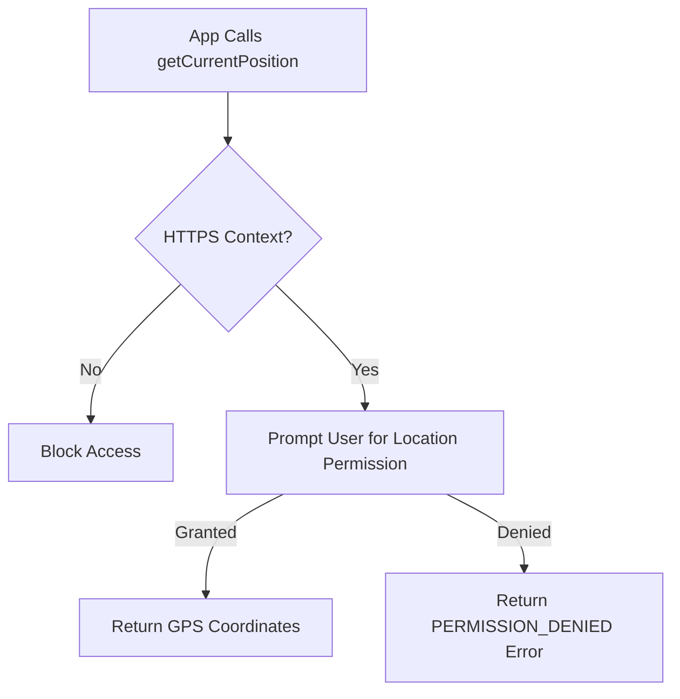

# Geolocation And Device Apis

> **Course**: Git Version Control | **Module**: Introduction | **Difficulty**: beginner

---

- **Estimated Time**: 45 Minutes (15m Reading | 20m Practice | 10m Quiz)
- **Difficulty Level**: ⭐⭐ Intermediate
- **Prerequisites**: [Lesson 7.1 Web Storage](file:///d:/My%20Drive/all%20files/PROJECT%20FILES/notes/docs/curriculum/_01_html5/_01_17_web_storage_and_indexeddb.md)
- **XP Reward**: +60 XP

### Learning Objectives
By the end of this lesson, you will be able to:
1. Retrieve physical device coordinates using `navigator.geolocation.getCurrentPosition()`.
2. Track real-time position updates using `watchPosition()` and `clearWatch()`.
3. Handle permission models and error codes (`PERMISSION_DENIED`, `POSITION_UNAVAILABLE`, `TIMEOUT`).
4. Read accelerometer and gyroscope sensors via `DeviceOrientationEvent`.

---

---

Geolocation requires an **HTTPS** connection (or `localhost` for development).

---

---

### 3.1 Geolocation API
Exposed via `navigator.geolocation`:

```javascript
navigator.geolocation.getCurrentPosition(
  (position) => {
    console.log(`Lat: ${position.coords.latitude}, Lng: ${position.coords.longitude}`);
    console.log(`Accuracy: ${position.coords.accuracy} meters`);
  },
  (error) => console.error(`Error Code: ${error.code}`),
  { enableHighAccuracy: true, timeout: 5000, maximumAge: 0 }
);
```

### 3.2 Position & Error Objects
- **Coordinates**: `latitude`, `longitude`, `accuracy`, `altitude`, `speed`, `heading`.
- **Error Codes**:
  - `1`: `PERMISSION_DENIED`
  - `2`: `POSITION_UNAVAILABLE`
  - `3`: `TIMEOUT`

---

---

### Geolocation Permission Loop


---

---

```html
<!DOCTYPE html>
<html lang="en">
<head>
  <meta charset="UTF-8">
  <title>Geolocation Test</title>
</head>
<body>
  <button id="loc-btn">Get GPS Location</button>
  <p id="output"></p>

  <script>
    document.getElementById('loc-btn').addEventListener('click', () => {
      if ('geolocation' in navigator) {
        navigator.geolocation.getCurrentPosition((pos) => {
          document.getElementById('output').textContent = 
            `Latitude: ${pos.coords.latitude}, Longitude: ${pos.coords.longitude}`;
        });
      }
    });
  </script>
</body>
</html>
```

---

---

- **Fleet Management & Asset Tracking**: Uses `watchPosition()` to monitor vehicle location in real time.

---

---

1. Open code in Chrome $\rightarrow$ Click **Get GPS Location** $\rightarrow$ Allow browser permission.

---

---

| Bug / Error | Root Cause | Engineering Solution |
| :--- | :--- | :--- |
| **Geolocation Fails** | Origin is unencrypted HTTP. | Geolocation requires HTTPS in production. |

---

---

- **Set `enableHighAccuracy: true`**: Recommended for hardware tracking apps.

---

---

### Q1: Why does Geolocation require HTTPS?
**Answer**: To protect user privacy and prevent MitM attackers from intercepting physical location data.

---

---

```json
{
  "quiz_title": "Lesson 7.2 Geolocation Assessment",
  "questions": [
    {
      "question_id": "Q1",
      "type": "multiple_choice",
      "question_text": "Which method tracks continuous real-time location updates?",
      "options": ["getCurrentPosition()", "watchPosition()", "trackPosition()", "getPosition()"],
      "correct_answer_index": 1,
      "explanation": "watchPosition() continuously monitors location changes."
    }
  ]
}
```

---

---

Build a real-time GPS tracking dashboard with Leaflet.js maps.

---

---

**Front**: What method stops a continuous `watchPosition()` tracker?
**Back**: `navigator.geolocation.clearWatch(watchId)`
<!-- flashcard:end -->

---

---

```javascript
navigator.geolocation.getCurrentPosition((pos) => console.log(pos.coords));
```

---
