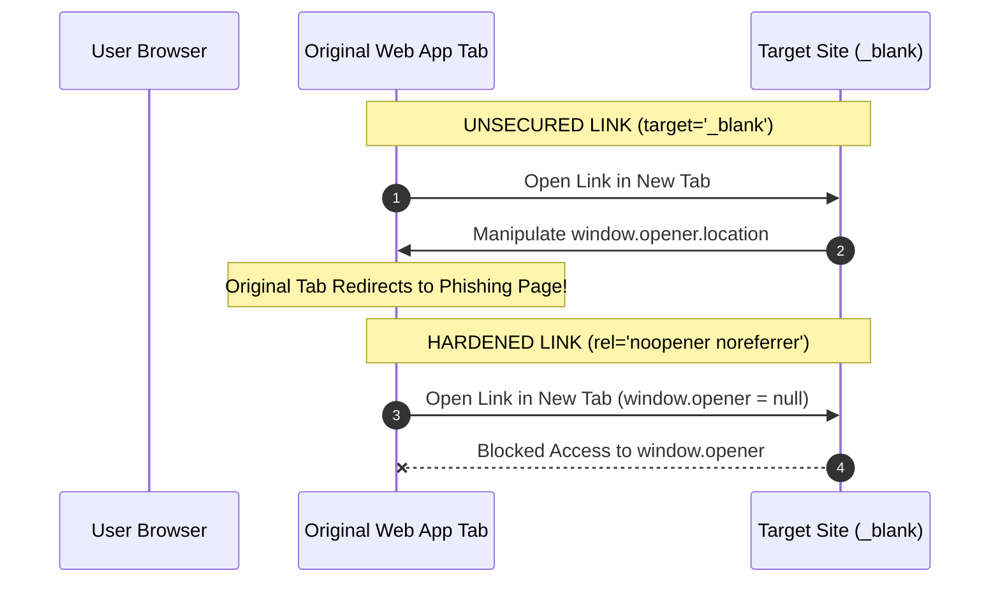

# Hyperlinks And Anchor Navigation

> **Course**: Git Version Control | **Module**: Introduction | **Difficulty**: beginner

---

- **Estimated Time**: 55 Minutes (20m Reading | 25m Practice | 10m Quiz)
- **Difficulty Level**: ⭐ Beginner
- **Prerequisites**: [Lesson 2.1 Syntax Rules & Element Classification](file:///d:/My%20Drive/all%20files/PROJECT%20FILES/notes/docs/curriculum/_01_html5/_01_04_html_syntax_rules_and_element_classification.md)
- **XP Reward**: +60 XP

### Learning Objectives
By the end of this lesson, you will be able to:
1. Construct hyperlinks using the Anchor element (`<a>`) and `href` attribute.
2. Differentiate between Absolute URLs, Relative URLs, and Root-Relative paths.
3. Implement in-page smooth navigation using Fragment Identifiers (`#section-id`).
4. Apply critical link security attributes (`rel="noopener"`, `rel="noreferrer"`) when targeting new tabs (`target="_blank"`).
5. Trigger device protocols (`mailto:`, `tel:`, `sms:`) and force browser file downloads (`download` attribute).
6. Optimize network performance using resource hint attributes (`dns-prefetch`, `preconnect`, `prefetch`, `preload`).

---

---

Create a local multi-page navigation project folder `nav-demo/` with `index.html`, `about.html`, and `contact.html`.

---

---

### 3.1 Anchor Element Architecture
The Anchor element (`<a>`) transforms static text or graphics into interactive hyperlinks:

```html
<a href="https://example.com" target="_blank" rel="noopener noreferrer">Visit Portal</a>
```

### 3.2 URL Types & Path Resolution Rules

```
┌─────────────────────────────────────────────────────────────────────────────┐
│                           URL RESOLUTION PATTERNS                           │
├──────────────────┬──────────────────────────────────────────────────────────┤
│ Absolute URL     │ Full address including scheme and host.                  │
│                  │ Example: `https://api.iot.com/v1/sensors`                │
├──────────────────┼──────────────────────────────────────────────────────────┤
│ Relative URL     │ Resolved relative to CURRENT directory path.             │
│                  │ Example: `docs/guide.html` or `../about.html`           │
├──────────────────┼──────────────────────────────────────────────────────────┤
│ Root-Relative    │ Starts with `/`; resolved relative to DOMAIN ROOT.       │
│                  │ Example: `/static/css/styles.css`                        │
└──────────────────┴──────────────────────────────────────────────────────────┘
```

#### Relative Path Notation Cheat Sheet
- `./page.html`: File in current directory.
- `page.html`: Same as `./page.html`.
- `../page.html`: Move UP one parent directory level.
- `../../page.html`: Move UP two parent directory levels.

### 3.3 Fragment Identifiers & In-Page Jumping
Fragment identifiers allow jumping directly to specific DOM elements containing a matching `id` attribute:

```html
<!-- Navigation Link -->
<a href="#telemetry-section">Jump to Telemetry Section</a>

<!-- Target Element -->
<section id="telemetry-section">
  <h2>Real-Time Telemetry</h2>
</section>
```

> [!TIP]
> Use `href="#"` to jump to the top of the page. Use CSS `html { scroll-behavior: smooth; }` for smooth animated scrolling.

### 3.4 Link Targets & Vulnerability Hardening (`tabnabbing`)

#### Target Attributes (`target="..."`)
- `_self` (Default): Opens link in current tab/window.
- `_blank`: Opens link in a NEW tab or window.
- `_parent`: Opens link in parent frame context.
- `_top`: Opens link in top-level browser window context (breaks out of iframes).

#### Security Vulnerability: Reverse Tabnabbing
When using `target="_blank"`, the newly opened page gains access to the originating page's `window.opener` object. Malicious third-party sites can redirect your application tab to a phishing URL via `window.opener.location = "https://phishing.com"`.

```
┌─────────────────────────────────────────────────────────────────────────────┐
│                          TABNABBING SECURITY HARDENING                      │
├───────────────────┬─────────────────────────────────────────────────────────┤
│ `rel="noopener"`  │ Disables `window.opener` object reference in target tab.│
│                   │ Prevents target site from controlling origin tab.        │
├───────────────────┼─────────────────────────────────────────────────────────┤
│ `rel="noreferrer"`│ Suppresses `Referer` HTTP header; includes `noopener`    │
│                   │ behavior implicitly in modern browsers.                 │
├───────────────────┼─────────────────────────────────────────────────────────┤
│ `rel="nofollow"`  │ Instructs search engine web crawlers NOT to pass SEO    │
│                   │ PageRank / link equity to target URL (e.g. ad links).    │
└───────────────────┴─────────────────────────────────────────────────────────┘
```

```html
<!-- SECURE EXTERNAL LINK PATTERN -->
<a href="https://external-site.com" target="_blank" rel="noopener noreferrer">
  External Secure Site
</a>
```

### 3.5 Non-HTML Protocols & Devices Integration
Anchors trigger native device handlers using custom protocol schemes:

```html
<!-- Email Client Protocol -->
<a href="mailto:support@example.com?subject=IoT%20Issue&body=Device%20ID%3A%20101">Email Support</a>

<!-- Telephone Dialer Protocol -->
<a href="tel:+18005550199">Call Support Center</a>

<!-- SMS Protocol -->
<a href="sms:+18005550199?body=Help">Send SMS</a>
```

### 3.6 Download Attribute & Resource Hints

#### Force File Download (`download`)
The `download` attribute forces the browser to download the target file rather than navigating to or inline-rendering it:

```html
<!-- Custom Filename Download -->
<a href="/files/sensor-manual-v2.pdf" download="ESP32_User_Manual.pdf">
  Download Manual (PDF)
</a>
```

#### Network Performance Resource Hints
Configured in `<head>` via `<link rel="...">` to speed up future anchor navigation:

```html
<!-- DNS Lookup Speculation -->
<link rel="dns-prefetch" href="https://api.iotplatform.com">

<!-- Pre-connect TCP + TLS Handshake -->
<link rel="preconnect" href="https://fonts.googleapis.com" crossorigin>

<!-- Prefetch Next Page Asset in Idle Time -->
<link rel="prefetch" href="/next-lesson.html">
```

---

---

### Reverse Tabnabbing Attack vs Hardened Fix


---

---

### 5.1 Comprehensive Navigation Portal (`navigation_demo.html`)

```html
<!DOCTYPE html>
<html lang="en">
<head>
  <meta charset="UTF-8">
  <title>Navigation & Protocol Portal</title>
  <style>
    html { scroll-behavior: smooth; font-family: system-ui; }
    body { margin: 0; padding: 20px; line-height: 1.6; }
    nav { background: #0f172a; padding: 12px; position: sticky; top: 0; }
    nav a { color: #38bdf8; margin-right: 16px; text-decoration: none; font-weight: bold; }
    section { height: 80vh; padding: 40px 20px; border-bottom: 2px dashed #cbd5e1; }
    .btn { display: inline-block; padding: 10px 20px; background: #3b82f6; color: #fff; border-radius: 6px; text-decoration: none; }
  </style>
</head>
<body>

  <!-- Sticky In-Page Navigation Bar -->
  <nav>
    <a href="#overview">Overview</a>
    <a href="#telemetry">Telemetry</a>
    <a href="#protocols">Protocols</a>
    <a href="#downloads">Downloads</a>
  </nav>

  <!-- Section 1 -->
  <section id="overview">
    <h1>1. System Overview</h1>
    <p>Welcome to the Navigation & Anchor testbed.</p>
    <!-- External Secure Link -->
    <p>
      Visit external docs:
      <a href="https://docs.espressif.com" target="_blank" rel="noopener noreferrer">
        Espressif Documentation (External)
      </a>
    </p>
  </section>

  <!-- Section 2 -->
  <section id="telemetry">
    <h1>2. Sensor Telemetry</h1>
    <p>Live data monitoring panel.</p>
    <a href="#overview" class="btn">Back to Top</a>
  </section>

  <!-- Section 3 -->
  <section id="protocols">
    <h1>3. Device Protocols</h1>
    <ul>
      <li>Email: <a href="mailto:support@iot.com?subject=Sensor%20Alert">support@iot.com</a></li>
      <li>Phone: <a href="tel:+18005550199">+1 (800) 555-0199</a></li>
      <li>SMS: <a href="sms:+18005550199?body=STATUS">Check Device Status via SMS</a></li>
    </ul>
  </section>

  <!-- Section 4 -->
  <section id="downloads">
    <h1>4. Resource Downloads</h1>
    <a href="/assets/firmware-v1.bin" download="ESP32_Firmware_v1.0.bin" class="btn">
      Download Firmware Binary
    </a>
  </section>

</body>
</html>
```

---

---

### Multi-Tenant SaaS & IoT Gateway Navigation
In enterprise SaaS platforms (AWS, Azure IoT, Datadog):
- **Deep-linking In-Page Fragment Anchors**: Shares direct URLs (`https://app.datadog.com/dashboard#cpu-metrics`) to instantly highlight relevant metric graphs during live incident response.
- **Resource Prefetching**: Prefetches chunked JS bundles for expected next-page routes during idle periods, reducing page load latency from 1.2s to <50ms.

---

---

### Task: Test Reverse Tabnabbing Security in Browser Console

#### Step 1: Open Navigation Portal
1. Open `navigation_demo.html` in Chrome.
2. Click the **Espressif Documentation (External)** link.

#### Step 2: Test Opener Reference in DevTools
1. In the newly opened tab, press `F12` $\rightarrow$ Open **Console**.
2. Type: `window.opener`
3. Verify output: `null` (*Confirms `rel="noopener"` successfully severed origin tab access*).

---

---

| Symptom / Error | Root Cause | Engineering Solution |
| :--- | :--- | :--- |
| **Tabnabbing Security Vulnerability** | Omitting `rel="noopener noreferrer"` when using `target="_blank"`. | Always add `rel="noopener noreferrer"` to external links opening in new tabs. |
| **Broken Relative Link (`404 Not Found`)** | Using `./` or missing `/` when navigating across nested directory subfolders. | Use root-relative paths (`/about.html`) for consistent domain-level routing. |
| **Fragment Jump Covered by Sticky Header** | Target section header scrolls behind fixed/sticky navigation bar. | Add CSS `scroll-margin-top: 80px;` to target section elements. |

---

---

- **Always Secure `target="_blank"`**: Use `rel="noopener noreferrer"` on all external links.
- **Use Meaningful Link Text**: Avoid generic "click here"; use descriptive anchor text (e.g., "Download ESP32 Datasheet PDF").
- **Fix Sticky Header Overlap**: Apply `scroll-margin-top` to target anchor elements.
- **Use `rel="nofollow"` for Paid Links**: Prevent search engines from penalizing site rank for untrusted external links.

---

---

### Q1: What security risk is introduced by `target="_blank"`, and how does `rel="noopener"` fix it?
**Answer**:
Opening a link with `target="_blank"` allows the new tab to access the originating window's `window.opener` object. The target page can execute `window.opener.location = "https://phishing.com"`, silently redirecting the user's original tab to a malicious site without their knowledge (Reverse Tabnabbing). Adding `rel="noopener"` ensures `window.opener` is set to `null`, completely isolating the two browsing contexts.

### Q2: What is the difference between `<link rel="prefetch">` and `<link rel="preload">`?
**Answer**:
- `preload` is a high-priority directive for resources needed for the **current page** rendering (e.g., critical fonts, hero images).
- `prefetch` is a low-priority directive for resources likely needed for **future page** navigations (e.g., the next lesson page). The browser downloads prefetched assets in the background during idle periods.

---

---

```json
{
  "quiz_title": "Lesson 2.3 Hyperlinks & Anchor Navigation Assessment",
  "questions": [
    {
      "question_id": "Q1",
      "type": "multiple_choice",
      "question_text": "Which security attribute combination prevents Reverse Tabnabbing when opening external links in a new tab?",
      "options": ["target='_self'", "rel='noopener noreferrer'", "rel='author'", "download='secure'"],
      "correct_answer_index": 1,
      "explanation": "rel='noopener noreferrer' severs access to the originating tab's window.opener object."
    },
    {
      "question_id": "Q2",
      "type": "multiple_choice",
      "question_text": "Which URI scheme triggers the native mobile telephone dialer app?",
      "options": ["phone:", "call:", "tel:", "mobile:"],
      "correct_answer_index": 2,
      "explanation": "tel: (e.g., tel:+18005550199) triggers the native phone dialer."
    },
    {
      "question_id": "Q3",
      "type": "multiple_choice",
      "question_text": "How do you jump to an element with `id='section-2'` on the same HTML page?",
      "options": ["<a href='section-2'>", "<a href='#section-2'>", "<a href='?section-2'>", "<a href='//section-2'>"],
      "correct_answer_index": 1,
      "explanation": "In-page fragment identifiers use the hash (#) prefix."
    },
    {
      "question_id": "Q4",
      "type": "multiple_choice",
      "question_text": "What does the `download` attribute on an `<a>` element do?",
      "options": [
        "Opens the file in an iframe",
        "Instructs the browser to download the linked file instead of navigating to it",
        "Deletes the file from the server",
        "Encrypts the file download"
      ],
      "correct_answer_index": 1,
      "explanation": "download forces file download behavior and can specify a default target filename."
    },
    {
      "question_id": "Q5",
      "type": "multiple_choice",
      "question_text": "Which relative path notation moves UP two parent directory levels?",
      "options": ["./../", "../../", "//", "root/"],
      "correct_answer_index": 1,
      "explanation": "../../ moves up two directory steps in relative path resolution."
    }
  ]
}
```

---

---

### Objective
Create a hardened, accessible documentation navigation sidebar containing in-page fragment links, external hardened links, and a resource download button.

---

---

**Front**: Why is `href="#"` used for top-of-page jumps?
**Back**: In HTML, an empty fragment identifier `#` scrolls the viewport to the top of the current document.
<!-- flashcard:end -->

**Front**: What is the function of `rel="nofollow"`?
**Back**: Tells search engines not to endorse or transfer SEO PageRank to the target URL.
<!-- flashcard:end -->

**Front**: What protocol triggers an email composer window with prefilled subject lines?
**Back**: `mailto:address@example.com?subject=Topic`
<!-- flashcard:end -->

---

---

### Key Takeaways
- **URL Resolution**: Use relative paths for local assets, absolute paths for external domains.
- **Link Hardening**: Always use `rel="noopener noreferrer"` with `target="_blank"`.
- **Custom Protocols**: Use `mailto:`, `tel:`, `sms:`, and `download` for interactive native behaviors.

### Quick Syntax Reference

```html
<!-- Secure External Link -->
<a href="https://external.com" target="_blank" rel="noopener noreferrer">Visit Site</a>

<!-- In-Page Fragment Jumper -->
<a href="#section-2">Go to Section 2</a>

<!-- Force Download -->
<a href="/file.pdf" download="Manual.pdf">Download PDF</a>
```

### Official References
- [WHATWG HTML Specification: The A Element](https://html.spec.whatwg.org/multipage/text-level-semantics.html#the-a-element)
- [MDN Web Docs: Link Types & rel Attributes](https://developer.mozilla.org/en-US/docs/Web/HTML/Attributes/rel)

---
