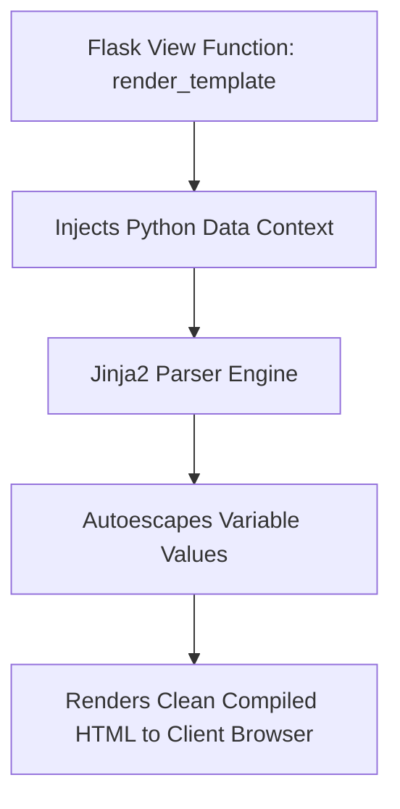

# Jinja2 Syntax Control Flow And Macros

> **Course**: Git Version Control | **Module**: Introduction | **Difficulty**: beginner

---

- **Estimated Time**: 45 Minutes (15m Reading | 20m Practice | 10m Quiz)
- **Difficulty Level**: ⭐ Beginner
- **Prerequisites**: [Lesson 2.2 Request/Response](file:///d:/My%20Drive/all%20files/PROJECT%20FILES/notes/docs/curriculum/_04_flask/_04_04_flask_request_response_objects.md)
- **XP Reward**: +50 XP

### Learning Objectives
By the end of this lesson, you will be able to:
1. Identify Jinja2 delimiter syntaxes (`{{ expression }}`, ``, `{# comment #}`).
2. Pass dynamic Python context data to HTML templates via `render_template()`.
3. Implement template logic using `` loops and `` conditionals.
4. Construct reusable UI component functions using Jinja2 **Macros (``)**.

---

---

Open Python REPL or VS Code.

---

---

### 3.1 Jinja2 Delimiter Syntax
Jinja2 is Flask's built-in Pythonic templating engine that compiles HTML templates into optimized Python bytecode:

```
┌─────────────────────────────────────────────────────────────────────────────┐
│                          JINJA2 DELIMITER SYNTAX MATRIX                     │
├─────────────────┬──────────────────────────────────┬────────────────────────┤
│ Delimiter       │ Purpose                          │ Example                │
├─────────────────┼──────────────────────────────────┼────────────────────────┤
│ `{{ ... }}`     │ Variable expression output       │ `{{ user.name }}`      │
│ ``     │ Logic control flow & statements  │ ``   │
│ `{# ... #}`     │ Server-side comments (not in HTML)│ `{# Internal note #}`  │
└─────────────────┴──────────────────────────────────┴────────────────────────┘
```

> [!NOTE]
> **Automatic XSS Protection**: Jinja2 automatically HTML-escapes all variable values passed inside `{{ ... }}` expressions, preventing XSS injection attacks.

---

---



---

---

### File 1: `templates/macros/card.html` (Jinja2 Reusable Macro)

```html

<div class="sensor-card">
  <h3>Node: {{ sensor.id }}</h3>
  <p>Location: {{ sensor.location }}</p>
  
    <span class="badge warning">HIGH TEMP: {{ sensor.temp }}°C</span>
  
    <span class="badge normal">Normal: {{ sensor.temp }}°C</span>
  
</div>

```

### File 2: `templates/dashboard.html` (Main Page)

```html

<!DOCTYPE html>
<html lang="en">
<head>
  <title>IoT Telemetry Monitor</title>
</head>
<body>
  <h1>Active Sensor Fleet</h1>
  <div class="card-grid">
    
      {{ render_sensor_card(sensor) }}
    
      <p>No active sensors detected.</p>
    
  </div>
</body>
</html>
```

### File 3: `app.py` (Python View Function)

```python
from flask import Flask, render_template

app = Flask(__name__)

@app.route("/dashboard")
def dashboard():
    mock_sensors = [
        {"id": "ESP32-A1", "location": "Lab 1", "temp": 24.2},
        {"id": "ESP32-B2", "location": "Server Room", "temp": 38.5},
        {"id": "ESP32-C3", "location": "Warehouse", "temp": 19.8}
    ]
    return render_template("dashboard.html", sensors=mock_sensors)
```

---

---

- **Server-Side Rendered (SSR) Dashboards**: Administrative monitoring tools render real-time database state directly on the server, serving lightweight pre-compiled HTML to mobile browsers.

---

---

1. Create `templates/` directory and save files.
2. Run `python app.py` $\to$ Navigate to `http://127.0.0.1:5000/dashboard` in browser!

---

---

| Bug / Error | Root Cause | Engineering Solution |
| :--- | :--- | :--- |
| **`TemplateNotFound: dashboard.html`** | Saving HTML templates outside the `templates/` directory. | Flask expects template files inside a directory named `templates/` relative to the app module. |

---

---

- **Use Jinja2 Macros for Repeated UI Elements**: Macros act like functions for HTML layout components.

---

---

### Q1: How does Jinja2 prevent Cross-Site Scripting (XSS) attacks when rendering dynamic variables?
**Answer**: Jinja2 automatically HTML-escapes all string variables rendered inside `{{ ... }}` delimiters, replacing characters like `<`, `>`, `&`, and `"` with safe HTML entity codes (`&lt;`, `&gt;`).

---

---

```json
{
  "quiz_title": "Lesson 3.1 Jinja2 Syntax Assessment",
  "questions": [
    {
      "question_id": "Q1",
      "type": "multiple_choice",
      "question_text": "Which Jinja2 delimiter is used to execute control flow logic (if/for)?",
      "options": ["{{ ... }}", "", "{# ... #}", "<% ... %>"],
      "correct_answer_index": 1,
      "explanation": " executes control flow logic statements."
    }
  ]
}
```

---

---

Build a Jinja2 template iterating over a list of 10 device status objects with conditional status badges.

---

---

**Front**: What is the purpose of `` inside a Jinja2 `` loop?
**Back**: It executes if the target iteration list is empty or `None`.
<!-- flashcard:end -->

---

---

```html

  <p>{{ item.name }}</p>

```

---
