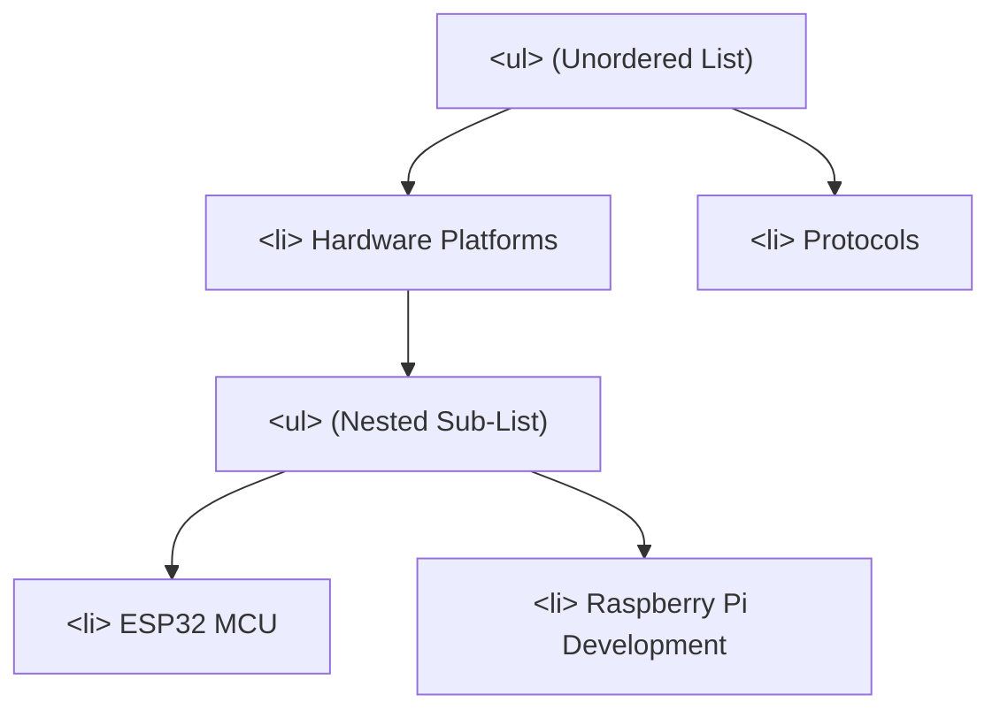

# List Elements And Structure

> **Course**: Git Version Control | **Module**: Introduction | **Difficulty**: beginner

---

- **Estimated Time**: 45 Minutes (15m Reading | 20m Practice | 10m Quiz)
- **Difficulty Level**: ⭐ Beginner
- **Prerequisites**: [Lesson 2.1 Syntax Rules](file:///d:/My%20Drive/all%20files/PROJECT%20FILES/notes/docs/curriculum/_01_html5/_01_04_html_syntax_rules_and_element_classification.md)
- **XP Reward**: +50 XP

### Learning Objectives
By the end of this lesson, you will be able to:
1. Construct ordered lists (`<ol>`) using `type`, `start`, and `reversed` attributes.
2. Structure unordered lists (`<ul>`) and list items (`<li>`) for itemized content.
3. Build key-value definition structures using Description Lists (`<dl>`, `<dt>`, `<dd>`).
4. Build valid multi-level nested list trees without breaking HTML parser nesting rules.
5. Apply list semantics to build accessible navigation menus (`<nav><ul><li>...`).

---

---

Open VS Code and create `lists_demo.html` to execute list markup examples.

---

---

### 3.1 Unordered Lists (`<ul>`) & Ordered Lists (`<ol>`)
- **Unordered List (`<ul>`)**: Used when item order is non-sequential (bullet points).
- **Ordered List (`<ol>`)**: Used when sequential ordering matters (step-by-step algorithms, rankings).

#### Special `<ol>` Attributes
- `type="1|a|A|i|I"`: Specifies numbering style (arabic numerals, lowercase/uppercase letters, Roman numerals).
- `start="5"`: Sets custom starting integer.
- `reversed`: Boolean attribute causing numbers to count down (e.g., 5, 4, 3, 2, 1).

```html
<!-- Counting Down Top 3 IoT Protocols -->
<ol reversed type="1" start="3">
  <li>CoAP (Constrained Application Protocol)</li>
  <li>HTTP/REST Web APIs</li>
  <li>MQTT (Message Queuing Telemetry Transport)</li>
</ol>
```

### 3.2 Description Lists (`<dl>`, `<dt>`, `<dd>`)
Used for key-value pairings, glossary terms, or metadata dictionaries:
- `<dl>`: Description List wrapper container.
- `<dt>`: Description Term (the key/name).
- `<dd>`: Description Details (the value/definition).

```html
<dl>
  <dt>MQTT</dt>
  <dd>Lightweight publish-subscribe network protocol for IoT devices.</dd>
  <dt>GPIO</dt>
  <dd>General Purpose Input/Output pin on a microcontroller.</dd>
</dl>
```

### 3.3 Nesting Rules for Lists
A common developer mistake is placing nested lists directly inside `<ul>` or `<ol>`.

> [!CRITICAL]
> The ONLY direct child permitted inside `<ul>` or `<ol>` is `<li>`! A nested sub-list MUST be placed **inside** an `<li>` element!

```html
<!-- CORRECT NESTED LIST ARCHITECTURE -->
<ul>
  <li>Hardware Platforms
    <!-- Sub-list nested inside <li> -->
    <ul>
      <li>ESP32</li>
      <li>STM32</li>
    </ul>
  </li>
  <li>Software Stacks</li>
</ul>
```

---

---

### List Tree DOM Structure


---

---

### 5.1 Semantic Navigation & Metadata Lists

```html
<!DOCTYPE html>
<html lang="en">
<head>
  <meta charset="UTF-8">
  <title>List Architecture Demo</title>
  <style>
    body { font-family: system-ui; padding: 20px; }
    nav ul { list-style: none; padding: 0; display: flex; gap: 16px; background: #0f172a; padding: 12px; }
    nav a { color: #38bdf8; text-decoration: none; font-weight: bold; }
    dl { background: #f8fafc; padding: 16px; border-left: 4px solid #3b82f6; }
    dt { font-weight: bold; color: #0f172a; margin-top: 8px; }
    dd { margin-left: 0; color: #475569; }
  </style>
</head>
<body>

  <!-- Semantic Navigation List -->
  <nav aria-label="Main Navigation">
    <ul>
      <li><a href="#overview">Overview</a></li>
      <li><a href="#features">Features</a></li>
      <li><a href="#docs">Docs</a></li>
    </ul>
  </nav>

  <!-- Description List for IoT Device State -->
  <h2>Device Status Metadata</h2>
  <dl>
    <dt>Device Name</dt>
    <dd>Sensor Gateway Alpha</dd>
    <dt>IP Address</dt>
    <dd><code>192.168.1.105</code></dd>
    <dt>Firmware Version</dt>
    <dd>v2.4.1 (Stable)</dd>
  </dl>

</body>
</html>
```

---

---

### Accessible Navigation Menus
Screen readers announce `<ul>` elements inside `<nav>` as *"Navigation region, list of 3 items"*, enabling blind users to jump through links or skip navigation entirely using list navigation hotkeys.

---

---

### Task: Build a Nested IoT Setup Procedure List
Create `setup.html` containing an `<ol>` step-by-step guide where Step 2 contains a sub-`<ul>` listing required tools.

---

---

| Bug / Error | Root Cause | Engineering Solution |
| :--- | :--- | :--- |
| **Invalid HTML Nesting** | Placing `<ul>` as a direct child of another `<ul>` (`<ul><ul>...</ul></ul>`). | Move nested `<ul>` inside a parent `<li>` tag. |
| **Omitting `list-style: none` Reset** | Browsers adding bullet points to navigation links. | Apply `list-style: none; padding: 0;` to navigation `<ul>` elements in CSS. |

---

---

- **Wrap Navigation Menus in `<ul>`**: Use `<nav><ul><li><a>` for main menus.
- **Use `<dl>` for Key-Value Pairs**: Ideal for technical specifications, product features, and key-value metadata.
- **Use `reversed` for Top Rankings**: Use `<ol reversed>` for countdown lists.

---

---

### Q1: When should you use a Description List (`<dl>`) instead of an Unordered List (`<ul>`)?
**Answer**: Use `<dl>` when data consists of explicit term/definition or key/value pairs (e.g. metadata dictionaries, glossaries, product specs). Use `<ul>` for simple itemized lists where items do not have associated term definitions.

---

---

```json
{
  "quiz_title": "Lesson 4.1 List Elements & Structure Assessment",
  "questions": [
    {
      "question_id": "Q1",
      "type": "multiple_choice",
      "question_text": "What is the ONLY valid direct child element of a `<ul>` or `<ol>` list container?",
      "options": ["<div>", "<span>", "<li>", "<dl>"],
      "correct_answer_index": 2,
      "explanation": "HTML specification mandates that only <li> elements can be direct children of <ul> or <ol>."
    },
    {
      "question_id": "Q2",
      "type": "multiple_choice",
      "question_text": "Which `<ol>` attribute causes numbers to count down sequentially?",
      "options": ["descending", "reversed", "countdown", "invert"],
      "correct_answer_index": 1,
      "explanation": "reversed is a boolean attribute that counts down numbers in an ordered list."
    },
    {
      "question_id": "Q3",
      "type": "multiple_choice",
      "question_text": "In a Description List (`<dl>`), which tag defines the value or definition corresponding to a term?",
      "options": ["<dt>", "<dd>", "<dfn>", "<li>"],
      "correct_answer_index": 1,
      "explanation": "<dt> defines the term (key); <dd> defines the description details (value)."
    }
  ]
}
```

---

---

Build a multi-level product specification sheet using `<dl>`, `<ol>`, and nested `<ul>` elements.

---

---

**Front**: What tag defines a term inside a Description List (`<dl>`)?
**Back**: `<dt>` (Description Term).
<!-- flashcard:end -->

**Front**: Where must a nested sub-list `<ul>` be placed inside a parent list?
**Back**: Inside an `<li>` item of the parent list.
<!-- flashcard:end -->

---

---

```html
<!-- Ordered List Countdown -->
<ol reversed start="3">
  <li>First</li>
  <li>Second</li>
  <li>Third</li>
</ol>

<!-- Key-Value Metadata -->
<dl>
  <dt>Status</dt>
  <dd>Online</dd>
</dl>
```

---
