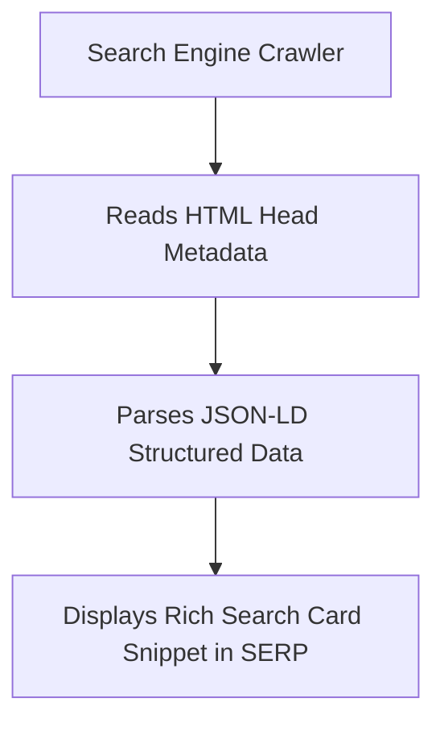

# Search Engine Optimization And Microdata

> **Course**: Git Version Control | **Module**: Introduction | **Difficulty**: beginner

---

- **Estimated Time**: 55 Minutes (20m Reading | 25m Practice | 10m Quiz)
- **Difficulty Level**: ⭐⭐ Intermediate
- **Prerequisites**: [Lesson 1.3 HTML Standards](file:///d:/My%20Drive/all%20files/PROJECT%20FILES/notes/docs/curriculum/_01_html5/_01_03_html_standards_and_document_structure.md)
- **XP Reward**: +60 XP

### Learning Objectives
By the end of this lesson, you will be able to:
1. Implement essential On-Page SEO elements (title, meta description, heading structure, canonical URLs).
2. Contrast Microdata (`itemscope`, `itemtype`, `itemprop`) with **JSON-LD** structured data.
3. Construct Schema.org JSON-LD scripts for Tech Articles, Courses, and Products.
4. Configure crawler instructions using `<meta name="robots">` and `robots.txt`.

---

---

Validate structured data using [Google Rich Results Test](https://search.google.com/test/rich-results).

---

---

### 3.1 JSON-LD vs Microdata
Structured data enables search engines to display rich snippets (star ratings, course details, prices) in search results.

```
┌─────────────────────────────────────────────────────────────────────────────┐
│                       JSON-LD VS MICRODATA COMPARISON                       │
├─────────────────┬──────────────────────────────────┬────────────────────────┤
│ Feature         │ JSON-LD (Recommended by Google)  │ Microdata              │
├─────────────────┼──────────────────────────────────┼────────────────────────┤
│ Syntax          │ Script tag containing JSON       │ Inline HTML attributes │
│ Maintenance     │ High (Clean, decoupled from DOM) │ Low (Clutters markup)  │
│ Position        │ Placed inside `<head>` or `<body>│ Attached to HTML tags  │
└─────────────────┴──────────────────────────────────┴────────────────────────┘
```

### 3.2 JSON-LD Implementation Example
```html
<script type="application/ld+json">
{
  "@context": "https://schema.org",
  "@type": "Course",
  "name": "Course 1: HTML5 Masterclass",
  "description": "Comprehensive HTML5 web architecture and IoT full stack engineering.",
  "provider": {
    "@type": "Organization",
    "name": "Bytes and Boards Solutions"
  }
}
</script>
```

---

---



---

---

```html
<!DOCTYPE html>
<html lang="en">
<head>
  <meta charset="UTF-8">
  <title>SEO & JSON-LD Portal</title>
  <link rel="canonical" href="https://example.com/course-html5">
  <meta name="robots" content="index, follow">

  <!-- Schema.org JSON-LD -->
  <script type="application/ld+json">
  {
    "@context": "https://schema.org",
    "@type": "TechArticle",
    "headline": "HTML5 Web Architecture & Protocols",
    "author": "Bytes and Boards Solutions",
    "datePublished": "2026-07-28"
  }
  </script>
</head>
<body>
  <h1>HTML5 Web Architecture</h1>
</body>
</html>
```

---

---

- **E-Commerce & Learning Portals**: Uses JSON-LD to display price ranges, course duration, and review stars in Google search results.

---

---

1. Save code as `seo_demo.html`.
2. Copy code into Google Rich Results Test $\rightarrow$ Verify zero syntax errors!

---

---

| Bug / Error | Root Cause | Engineering Solution |
| :--- | :--- | :--- |
| **Duplicate Content Penalty** | Missing `<link rel="canonical">` tag across HTTP/HTTPS or trailing slash variations. | Always specify a canonical URL. |

---

---

- **Use JSON-LD**: Google's preferred structured data format.

---

---

### Q1: Why is JSON-LD preferred over Microdata for SEO?
**Answer**: JSON-LD is decoupled from HTML presentation markup inside a single `<script type="application/ld+json">` block, making it cleaner to maintain and generate programmatically.

---

---

```json
{
  "quiz_title": "Lesson 9.2 SEO Assessment",
  "questions": [
    {
      "question_id": "Q1",
      "type": "multiple_choice",
      "question_text": "Which script type is used to insert JSON-LD structured data?",
      "options": ["text/json", "application/ld+json", "application/schema", "text/javascript"],
      "correct_answer_index": 1,
      "explanation": "application/ld+json specifies JSON-LD structured data."
    }
  ]
}
```

---

---

Add JSON-LD Course metadata to an educational portal landing page.

---

---

**Front**: What is the purpose of `<link rel="canonical">`?
**Back**: Prevents duplicate content penalties by specifying the primary authoritative URL for a page.
<!-- flashcard:end -->

---

---

```html
<script type="application/ld+json">{"@context":"https://schema.org","@type":"WebPage"}</script>
```

---
