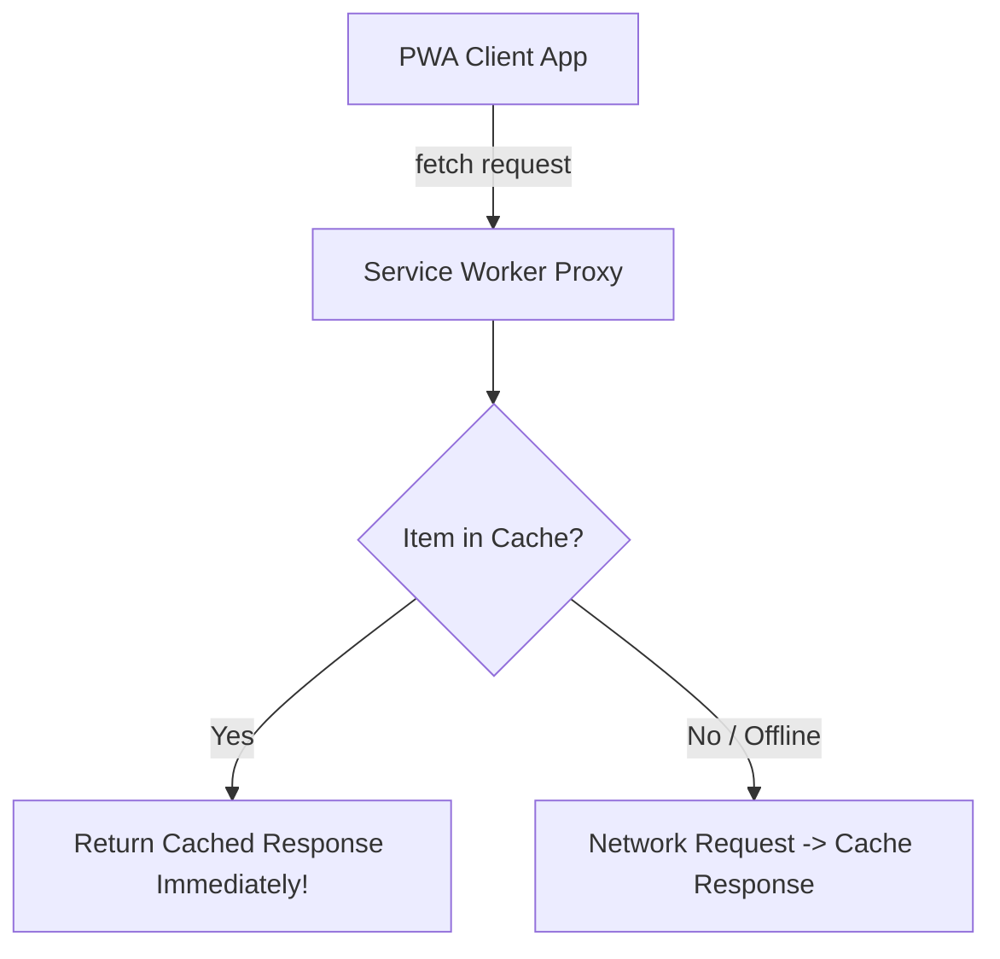

# Service Workers And Offline Pwa Caching

> **Course**: Git Version Control | **Module**: Introduction | **Difficulty**: beginner

---

- **Estimated Time**: 55 Minutes (20m Reading | 25m Practice | 10m Quiz)
- **Difficulty Level**: ⭐⭐⭐ Advanced
- **Prerequisites**: [Lesson 12.2 Web Workers](file:///d:/My%20Drive/all%20files/PROJECT%20FILES/notes/docs/curriculum/_03_javascript/_03_43_web_workers_and_multithreaded_javascript.md)
- **XP Reward**: +70 XP

### Learning Objectives
By the end of this lesson, you will be able to:
1. Explain the **Service Worker** background proxy lifecycle (`install` $\to$ `activate` $\to$ `fetch`).
2. Manage offline network assets using the **Cache Storage API**.
3. Implement 3 core caching strategies: **Cache-First**, **Network-First**, and **Stale-While-Revalidate**.
4. Transform web applications into offline-capable **Progressive Web Apps (PWAs)**.

---

---

Open Browser DevTools Application Tab $\to$ Select Service Workers.

---

---

### 3.1 Service Worker Proxy Architecture
A **Service Worker** is a programmable network proxy running in a background thread between your web application and the network. It intercepts outgoing `fetch` network requests, allowing you to serve cached responses when offline:

```
┌─────────────────────────────────────────────────────────────────────────────┐
│                     3 CORE PWA OFFLINE CACHING STRATEGIES                   │
├────────────────────────┬────────────────────────────────────────────────────┤
│ Strategy               │ Description & Ideal Use Case                       │
├────────────────────────┼────────────────────────────────────────────────────┤
│ **Cache-First**        │ Checks Cache first; falls back to Network.         │
│                        │ Ideal for static assets (images, fonts, CSS).      │
├────────────────────────┼────────────────────────────────────────────────────┤
│ **Network-First**      │ Fetches from Network; falls back to Cache offline.│
│                        │ Ideal for real-time dynamic API data.              │
├────────────────────────┼────────────────────────────────────────────────────┤
│ **Stale-While-Revalidate**│ Returns Cached response immediately, then fetches │
│                        │ fresh copy in background to update cache!          │
└────────────────────────┴────────────────────────────────────────────────────┘
```

---

---



---

---

### File 1: `sw.js` (Service Worker Script)

```javascript
const CACHE_NAME = "telemetry-pwa-v1";
const STATIC_ASSETS = ["/", "/index.html", "/styles.css", "/app.js"];

// 1. Install Event: Cache Static App Shell Assets
self.addEventListener("install", (event) => {
  event.waitUntil(
    caches.open(CACHE_NAME).then((cache) => cache.addAll(STATIC_ASSETS))
  );
  self.skipWaiting();
});

// 2. Activate Event: Clean Up Old Cache Versions
self.addEventListener("activate", (event) => {
  event.waitUntil(
    caches.keys().then((keys) =>
      Promise.all(keys.filter((key) => key !== CACHE_NAME).map((key) => caches.delete(key)))
    )
  );
  self.clients.claim();
});

// 3. Fetch Event: Cache-First Strategy with Network Fallback
self.addEventListener("fetch", (event) => {
  event.respondWith(
    caches.match(event.request).then((cachedResponse) => {
      if (cachedResponse) {
        return cachedResponse; // Cache Hit!
      }
      return fetch(event.request); // Cache Miss -> Fetch Network
    })
  );
});
```

### File 2: `app.js` (Register Service Worker)

```javascript
if ("serviceWorker" in navigator) {
  window.addEventListener("load", () => {
    navigator.serviceWorker.register("/sw.js")
      .then((reg) => console.log("[Service Worker Registered] Scope:", reg.scope))
      .catch((err) => console.error("[SW Registration Failed]:", err));
  });
}
```

---

---

- **Mobile First Progressive Web Apps**: Twitter Lite and Starbucks PWA use Service Workers to load instantly on 2G networks and work 100% offline.

---

---

1. Serve files over `http://localhost:3000`.
2. Open DevTools Application Tab $\to$ Check "Offline" checkbox $\to$ Reload page to verify offline PWA loading!

---

---

| Bug / Error | Root Cause | Engineering Solution |
| :--- | :--- | :--- |
| **Service Worker Registration Fails** | Attempting to register a Service Worker over insecure `http://` (non-localhost). | Service Workers strictly require HTTPS or `localhost` for security. |

---

---

- **Version Cache Names**: Increment `CACHE_NAME` (`v1` $\to$ `v2`) to trigger activation cleanups on code updates.

---

---

### Q1: How does the Stale-While-Revalidate caching strategy work?
**Answer**: Stale-While-Revalidate returns the cached response to the client immediately for zero-latency rendering, while simultaneously firing a background network request to fetch the latest version and update the cache for future visits.

---

---

```json
{
  "quiz_title": "Lesson 12.3 Service Workers Assessment",
  "questions": [
    {
      "question_id": "Q1",
      "type": "multiple_choice",
      "question_text": "Which event fires in a Service Worker when static assets are pre-cached during setup?",
      "options": ["install", "activate", "fetch", "sync"],
      "correct_answer_index": 0,
      "explanation": "The install event handles pre-caching static assets."
    }
  ]
}
```

---

---

Build an offline PWA caching static HTML/CSS shell assets.

---

---

**Front**: What property method registers a Service Worker in modern browsers?
**Back**: `navigator.serviceWorker.register('/sw.js')`.
<!-- flashcard:end -->

---

---

```javascript
self.addEventListener("fetch", e => {
  e.respondWith(caches.match(e.request) || fetch(e.request));
});
```

---
