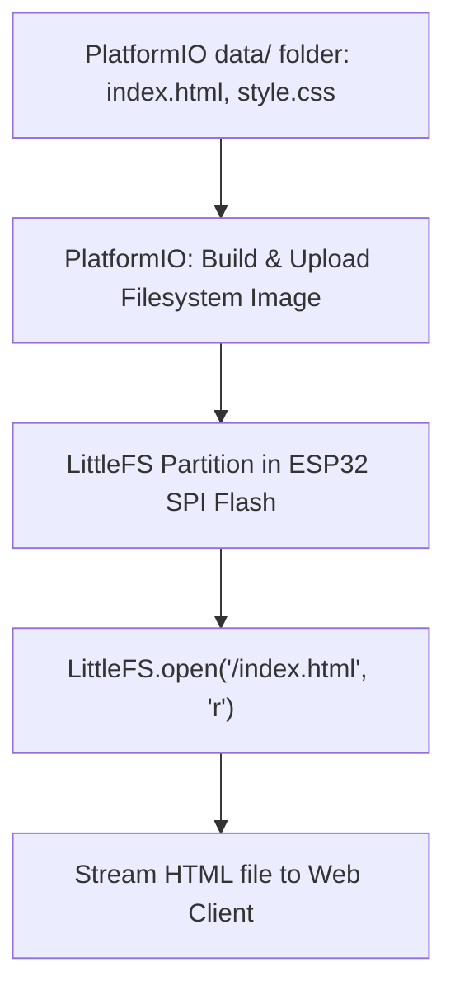

# Spiffs Littlefs And Static File Serving

> **Course**: Git Version Control | **Module**: Introduction | **Difficulty**: beginner

---

- **Estimated Time**: 45 Minutes (15m Reading | 20m Practice | 10m Quiz)
- **Difficulty Level**: ⭐⭐ Intermediate
- **Prerequisites**: [Lesson 8.2 Secure Boot & Partitions](file:///d:/My%20Drive/all%20files/PROJECT%20FILES/notes/docs/curriculum/_06_iot_hardware/_06_18_secure_boot_flash_encryption_partitions.md)
- **XP Reward**: +50 XP

### Learning Objectives
By the end of this lesson, you will be able to:
1. Explain the architectural differences between **SPIFFS** and **LittleFS**.
2. Upload static web assets (`index.html`, `style.css`, `app.js`) to ESP32 Flash memory using PlatformIO.
3. Perform embedded file reads and writes using **`LittleFS.open()`**.
4. Understand flash wear leveling and file corruption mitigation.

---

---

Open PlatformIO in VS Code.

---

---

### 3.1 SPIFFS vs LittleFS
To serve rich web interfaces directly from an ESP32 without embedding long HTML string literals in C++ code, static web assets are stored in a dedicated data partition in SPI Flash.

```
┌─────────────────────────────────────────────────────────────────────────────┐
│                          EMBEDDED FILESYSTEM COMPARISON                     │
├──────────────────┬─────────────────────────────┬────────────────────────────┤
│ Filesystem       │ Key Features                │ Status                     │
├──────────────────┼─────────────────────────────┼────────────────────────────┤
│ **SPIFFS**       │ Original SPI Flash File System;│ Deprecated in ESP-IDF v5+  │
│                  │ slow directory indexing     │ (High RAM overhead)        │
├──────────────────┼─────────────────────────────┼────────────────────────────┤
│ **LittleFS**     │ Faster tree indexing;       │ **RECOMMENDED STANDARD**   │
│                  │ fail-safe power-loss recovery│ (Low RAM, Wear Leveling)   │
└──────────────────┴─────────────────────────────┴────────────────────────────┘
```

---

---



---

---

### File: `data/index.html` (Static Web Asset in PlatformIO `data/` Directory)

```html
<!DOCTYPE html>
<html lang="en">
<head>
  <meta charset="UTF-8">
  <title>ESP32 LittleFS Portal</title>
  <style>
    body { font-family: Arial, sans-serif; background: #121212; color: #fff; text-align: center; padding: 50px; }
    .card { background: #1e1e1e; padding: 20px; border-radius: 12px; display: inline-block; }
    h1 { color: #00e676; }
  </style>
</head>
<body>
  <div class="card">
    <h1>ESP32 LittleFS Web Portal</h1>
    <p>This static HTML file is served directly from ESP32 SPI Flash!</p>
  </div>
</body>
</html>
```

### File: `src/main.cpp` (Mounting LittleFS & File I/O)

```cpp
// ESP32 LittleFS Initialization & File Reading (main.cpp)
#include <Arduino.h>
#include <LittleFS.h>

void setup() {
  Serial.begin(115200);
  delay(1000);

  Serial.println("[LittleFS Test]: Mounting embedded filesystem...");

  // 1. Mount LittleFS (Format automatically if unformatted)
  if (!LittleFS.begin(true)) {
    Serial.println("[LittleFS Error]: Failed to mount filesystem!");
    return;
  }

  Serial.println("[LittleFS Success]: Mounted successfully.");
  Serial.printf("  -> Total Bytes: %u | Used Bytes: %u\n",
                LittleFS.totalBytes(), LittleFS.usedBytes());

  // 2. Read Static File served from Flash
  if (LittleFS.exists("/index.html")) {
    File file = LittleFS.open("/index.html", "r");
    if (file) {
      Serial.println("\n--- [/index.html File Contents] ---");
      while (file.available()) {
        Serial.write(file.read());
      }
      file.close();
      Serial.println("\n--- [End of File] ---\n");
    }
  } else {
    Serial.println("[Error]: /index.html not found! Run 'Upload Filesystem Image' in PlatformIO.");
  }
}

void loop() {
  delay(10000);
}
```

---

---

- **Embedded Industrial HMI Touchscreens & Web Interfaces**: Industrial HVAC controllers store multi-page configuration dashboards, CSS stylesheets, and SVG graphics inside the LittleFS partition, delivering self-contained web portals without requiring external internet access.

---

---

1. Create a `data/` directory in your PlatformIO project and place `index.html` inside it.
2. In PlatformIO, click **PlatformIO Project Tasks $\to$ Platform $\to$ Build Filesystem Image** and **Upload Filesystem Image**.
3. Upload `main.cpp` $\to$ Inspect `/index.html` contents printed in Serial Monitor!

---

---

| Bug / Error | Root Cause | Engineering Solution |
| :--- | :--- | :--- |
| **`file.open()` Returns Null / File Not Found** | Forgetting to execute PlatformIO's "Upload Filesystem Image" task after adding files to the `data/` folder. | Always run PlatformIO "Upload Filesystem Image" task whenever files inside `data/` are modified. |

---

---

- **Use LittleFS Over SPIFFS**: Standardize on LittleFS for all new ESP32 embedded designs due to its power-loss safety and superior speed.

---

---

### Q1: Why is LittleFS preferred over SPIFFS for modern ESP32 embedded applications?
**Answer**: SPIFFS is a legacy filesystem deprecated in recent ESP-IDF releases because it requires scanning the entire flash chip upon mounting (consuming high RAM and causing long boot delays) and lacks subdirectory support. LittleFS uses efficient B-tree directory indexing, consumes significantly less RAM, provides wear leveling, and features power-loss resilient atomic write operations.

---

---

```json
{
  "quiz_title": "Lesson 9.1 LittleFS Assessment",
  "questions": [
    {
      "question_id": "Q1",
      "type": "multiple_choice",
      "question_text": "Which PlatformIO project directory stores static web assets (HTML, CSS, JS) intended for filesystem upload?",
      "options": ["src/", "data/", "include/", "lib/"],
      "correct_answer_index": 1,
      "explanation": "The data/ directory holds files for LittleFS/SPIFFS uploads."
    }
  ]
}
```

---

---

Upload `index.html` and `style.css` to LittleFS and print file sizes in Serial Monitor.

---

---

**Front**: What function mounts the LittleFS filesystem on the ESP32?
**Back**: `LittleFS.begin(true)` (passing `true` formats if unformatted).
<!-- flashcard:end -->

---

---

```cpp
LittleFS.begin(true);
File f = LittleFS.open("/config.json", "r");
```

---
