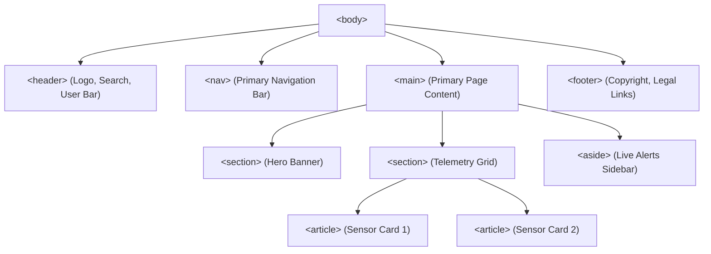

# Structural Semantic Elements

> **Course**: Git Version Control | **Module**: Introduction | **Difficulty**: beginner

---

- **Estimated Time**: 55 Minutes (20m Reading | 25m Practice | 10m Quiz)
- **Difficulty Level**: ⭐⭐ Intermediate
- **Prerequisites**: [Lesson 2.2 Text Content & Formatting Elements](file:///d:/My%20Drive/all%20files/PROJECT%20FILES/notes/docs/curriculum/_01_html5/_01_05_text_content_and_formatting_elements.md)
- **XP Reward**: +60 XP

### Learning Objectives
By the end of this lesson, you will be able to:
1. Explain the philosophy of the Semantic Web and its impact on SEO, accessibility, and maintenance.
2. Structure web page layouts using HTML5 structural landmarks (`<header>`, `<nav>`, `<main>`, `<footer>`).
3. Differentiate between content sectioning tags (`<article>`, `<section>`, `<aside>`) to build self-contained modular layouts.
4. Implement native interactive disclosures (`<details>`, `<summary>`) and modal dialogs (`<dialog>`) without heavy JavaScript libraries.
5. Format machine-readable dates and timestamps using the `<time>` element and ISO-8601 `datetime` attributes.

---

---

Inspect accessibility roles in Chrome DevTools:

```bash
# Open DevTools -> Elements -> Accessibility Panel -> Computed Properties
```

---

---

### 3.1 The Semantic Web Philosophy
Before HTML5, web pages were constructed using generic "div soup" (`<div id="header">`, `<div class="nav">`, `<div class="footer">`). Generic `<div>` containers carry **zero semantic meaning** to web crawlers and screen readers.

**Semantic HTML5** introduces tags that describe their content's purpose to both browsers and developer tooling:
- **SEO Benefits**: Search crawlers prioritize content inside `<main>` and `<article>` tags.
- **Accessibility (a11y)**: Screen readers navigate directly to landmark regions via keyboard shortcuts.
- **Maintainability**: Standardized classless structural markup improves codebase readability.

```
┌─────────────────────────────────────────────────────────────────────────────┐
│                    GENERIC "DIV SOUP" VS SEMANTIC HTML5                     │
├──────────────────────────────────────┬──────────────────────────────────────┤
│ Legacy <div> Soup (No Semantics)     │ Modern HTML5 Semantic Architecture   │
├──────────────────────────────────────┼──────────────────────────────────────┤
│ `<div id="header">`                  │ `<header>`                           │
│ `<div id="nav">`                     │ `<nav>`                              │
│ `<div id="main-content">`            │ `<main>`                             │
│ `<div class="post">`                 │ `<article>`                          │
│ `<div class="sidebar">`              │ `<aside>`                            │
│ `<div id="footer">`                  │ `<footer>`                           │
└──────────────────────────────────────┴──────────────────────────────────────┘
```

### 3.2 Structural Landmark Elements
1. `<header>`: Represents introductory content, branding logos, search bars, or author metadata. Can be used as page header or article header.
2. `<nav>`: Contains major navigation blocks. (Reserve `<nav>` for primary site navigation, not secondary footer links).
3. `<main>`: Contains the unique primary content of the document body. **Rule**: Exactly ONE `<main>` element per document.
4. `<footer>`: Contains footer metadata, copyright disclaimers, privacy policy links, or contact info.

### 3.3 Content Sectioning Elements

```
┌─────────────────────────────────────────────────────────────────────────────┐
│                      ARTICLE VS SECTION VS ASIDE RULES                      │
├──────────────┬──────────────────────────────────────────────────────────────┤
│ `<article>`  │ Self-contained, reusable composition that makes sense        │
│              │ independently (e.g. blog post, news article, forum comment). │
├──────────────┼──────────────────────────────────────────────────────────────┤
│ `<section>`  │ Thematic grouping of content, typically with a heading.      │
│              │ Used to break up a page or article into logical chapters.     │
├──────────────┼──────────────────────────────────────────────────────────────┤
│ `<aside>`    │ Indirectly related content (sidebar, callout box, advertising,│
│              │ related links) separate from the main flow.                 │
└──────────────┴──────────────────────────────────────────────────────────────┘
```

### 3.4 Interactive Native Components

#### Disclosure Widget (`<details>` & `<summary>`)
Creates a native expand/collapse accordion widget without requiring JavaScript:

```html
<details>
  <summary>View System Status Requirements</summary>
  <p>Requires Node.js 20+ and Python 3.12+.</p>
</details>
```

#### Native Modal Dialog (`<dialog>`)
Represents a native modal or popup window with backdrop dimming:

```html
<dialog id="sensor-modal">
  <h2>Sensor Calibrated</h2>
  <p>Calibration complete for Node 101.</p>
  <button id="close-btn">Close</button>
</dialog>
```

### 3.5 Figures, Captions & Machine-Readable Time
- `<figure>` & `<figcaption>`: Encapsulates self-contained media (diagrams, code snippets, charts, photos) with a visible caption.
- `<time datetime="...">`: Formats human-readable text alongside ISO-8601 machine-readable strings for calendar indexers and search engines:

```html
<time datetime="2026-07-28T15:52:00Z">July 28, 2026</time>
```

---

---

### Complete Semantic HTML5 Web Page Layout


---

---

### 5.1 Semantic Web Page Implementation (`semantic_layout.html`)

```html
<!DOCTYPE html>
<html lang="en">
<head>
  <meta charset="UTF-8">
  <meta name="viewport" content="width=device-width, initial-scale=1.0">
  <title>IoT Telemetry Portal — Semantic Architecture</title>
  <style>
    body { font-family: system-ui; margin: 0; display: flex; flex-direction: column; min-height: 100vh; }
    header, nav, footer { background: #0f172a; color: #fff; padding: 16px; }
    nav a { color: #38bdf8; margin-right: 16px; text-decoration: none; }
    .layout { display: flex; flex: 1; gap: 20px; padding: 20px; }
    main { flex: 3; }
    aside { flex: 1; background: #f8fafc; padding: 16px; border-radius: 8px; }
    article { background: #fff; border: 1px solid #e2e8f0; padding: 16px; margin-bottom: 16px; border-radius: 8px; }
    dialog::backdrop { background: rgba(0,0,0,0.6); }
  </style>
</head>
<body>

  <!-- Site Header Landmark -->
  <header>
    <h1>Enterprise IoT Control Center</h1>
  </header>

  <!-- Primary Navigation Landmark -->
  <nav>
    <a href="#dashboard">Dashboard</a>
    <a href="#devices">Devices</a>
    <a href="#analytics">Analytics</a>
  </nav>

  <!-- Main Content Area -->
  <div class="layout">
    <main>
      <section id="dashboard">
        <h2>Live Sensor Feeds</h2>
        
        <!-- Independent Reusable Article Card -->
        <article>
          <header>
            <h3>Node 101: Temperature Monitor</h3>
            <p>Posted on <time datetime="2026-07-28T15:52:00+05:30">July 28, 2026</time></p>
          </header>
          <p>Current Temperature: <strong>24.5&deg;C</strong></p>
          
          <!-- Native Accordion Widget -->
          <details>
            <summary>View Technical Hardware Logs</summary>
            <p>ESP32 MAC: <code>24:0A:C4:00:01:10</code> | Battery: 98%</p>
          </details>
        </article>

        <!-- Media Diagram Figure -->
        <figure>
          
          <figcaption>Figure 1: ESP32 to DHT22 Pinout Wiring Diagram</figcaption>
        </figure>
      </section>
    </main>

    <!-- Sidebar Landmark -->
    <aside>
      <h3>System Health Alerts</h3>
      <p>All 42 IoT gateway nodes operating normally.</p>
      <button id="modal-btn">Show Alert Settings</button>
    </aside>
  </div>

  <!-- Native Modal Dialog -->
  <dialog id="settings-dialog">
    <h2>Alert Notifications</h2>
    <p>Select threshold trigger limits for SMS alerts.</p>
    <button id="close-dialog-btn">Close Modal</button>
  </dialog>

  <!-- Footer Landmark -->
  <footer>
    <p>&copy; 2026 Bytes and Boards Solutions. All rights reserved.</p>
  </footer>

  <script>
    // Native Dialog Control API
    const dialog = document.getElementById('settings-dialog');
    document.getElementById('modal-btn').addEventListener('click', () => dialog.showModal());
    document.getElementById('close-dialog-btn').addEventListener('click', () => dialog.close());
  </script>

</body>
</html>
```

---

---

### Native Dialog Modals vs Heavy JS Libraries
Historically, developers imported 100KB+ JavaScript libraries (Bootstrap Modal, jQuery UI) to render popup windows.

With HTML5 `<dialog>`:
- `dialog.showModal()` opens a native accessible modal with automatic **focus trapping** and keyboard Esc key closing support.
- `dialog::backdrop` styles the backdrop overlay using CSS without extra `div` layers.

---

---

### Task: Test Native Dialog & Details Accordion

#### Step 1: Open `semantic_layout.html`
Save and launch the code from Section 5.1 in Chrome.

#### Step 2: Test `<details>` Expansion
Click **View Technical Hardware Logs**. Verify text expands without triggering a page reload or JavaScript execution.

#### Step 3: Test `<dialog>` Modal
1. Click **Show Alert Settings**.
2. Verify native backdrop overlay dims the background page.
3. Press <kbd>Esc</kbd> key on your keyboard. Observe the modal closes automatically via browser accessibility standards.

---

---

| Symptom / Bug | Root Cause | Engineering Solution |
| :--- | :--- | :--- |
| **Multiple `<main>` Tags Error** | Including `<main>` inside both page body and header/article templates. | Maintain strictly ONE `<main>` tag per document. |
| **`<section>` Used Without Heading** | Using `<section>` as a generic styling wrapper instead of `<div>`. | Use `<section>` ONLY when the group contains an `<h2>`–`<h6>` heading; use `<div>` for pure CSS styling wrappers. |
| **Modal Displays Non-Modally** | Calling `dialog.show()` instead of `dialog.showModal()`. | Use `dialog.showModal()` to enable backdrop dimming and focus trapping. |

---

---

- **Use `<main>` Once**: Reserve `<main>` for the core content of the document.
- **Use `<article>` for Self-Contained Units**: If content can be syndicated or shared independently, use `<article>`.
- **ISO-8601 Timestamps**: Always include `datetime="YYYY-MM-DDThh:mm:ss"` on `<time>` tags.
- **Pair `<figure>` with `<figcaption>`**: Wrap images, charts, and code samples in `<figure>` with a `<figcaption>` label.

---

---

### Q1: What is the exact semantic distinction between an `<article>` and a `<section>`?
**Answer**:
- An `<article>` is a self-contained, independent composition intended to be reusable or distributable on its own (e.g., a blog post, news story, forum comment, or product card).
- A `<section>` is a thematic grouping of content, typically introduced with a heading, used to divide a document or article into logical chapters. An `<article>` can contain multiple `<section>` elements, and a `<section>` can contain multiple `<article>` elements.

### Q2: How does the native HTML5 `<dialog>` element improve accessibility over custom `<div>` modals?
**Answer**:
When opened with `.showModal()`, `<dialog>` provides native accessibility benefits:
1. **Focus Trapping**: Keyboard focus is trapped inside the modal so users cannot tab into off-screen elements.
2. **Esc Key Handler**: Native keyboard dismissal on <kbd>Esc</kbd>.
3. **Screen Reader Role**: Automatically exposes `dialog` ARIA landmark roles to assistive technology.

---

---

```json
{
  "quiz_title": "Lesson 3.1 Structural Semantic Elements Assessment",
  "questions": [
    {
      "question_id": "Q1",
      "type": "multiple_choice",
      "question_text": "Which HTML5 landmark tag is restricted to exactly ONE instance per document?",
      "options": ["<header>", "<section>", "<main>", "<article>"],
      "correct_answer_index": 2,
      "explanation": "<main> represents the unique primary content and must appear only once per document."
    },
    {
      "question_id": "Q2",
      "type": "multiple_choice",
      "question_text": "Which native HTML5 element creates an interactive expand/collapse accordion widget without JavaScript?",
      "options": ["<dialog>", "<details>", "<aside>", "<summary>"],
      "correct_answer_index": 1,
      "explanation": "<details> combined with <summary> creates native zero-JS expand/collapse widgets."
    },
    {
      "question_id": "Q3",
      "type": "multiple_choice",
      "question_text": "What JavaScript method opens a `<dialog>` element as a true modal with backdrop dimming and focus trapping?",
      "options": ["dialog.open()", "dialog.show()", "dialog.showModal()", "dialog.popup()"],
      "correct_answer_index": 2,
      "explanation": "showModal() opens the dialog modally with backdrop dimming and focus trapping."
    },
    {
      "question_id": "Q4",
      "type": "multiple_choice",
      "question_text": "Which element should be used to encapsulate a code snippet or diagram alongside its caption?",
      "options": ["<aside>", "<section>", "<figure>", "<details>"],
      "correct_answer_index": 2,
      "explanation": "<figure> combined with <figcaption> encapsulates media and code samples with captions."
    },
    {
      "question_id": "Q5",
      "type": "multiple_choice",
      "question_text": "Which attribute on the `<time>` tag provides machine-readable ISO-8601 date values for search engines?",
      "options": ["date", "datetime", "timestamp", "iso"],
      "correct_answer_index": 1,
      "explanation": "datetime='YYYY-MM-DD' specifies machine-readable time."
    }
  ]
}
```

---

---

### Objective
Build a semantic blog post template utilizing `<header>`, `<nav>`, `<main>`, `<article>`, `<section>`, `<aside>`, `<figure>`, `<time>`, and `<footer>`.

---

---

**Front**: What element defines the caption for a `<figure>`?
**Back**: `<figcaption>`
<!-- flashcard:end -->

**Front**: When should `<div>` be used instead of a semantic sectioning tag?
**Back**: When grouping content purely for CSS styling or layout positioning without adding semantic meaning.
<!-- flashcard:end -->

**Front**: What CSS pseudo-element targets the backdrop overlay of a native `<dialog>` element?
**Back**: `dialog::backdrop`
<!-- flashcard:end -->

---

---

### Key Takeaways
- **Landmarks**: `<header>`, `<nav>`, `<main>`, `<footer>` structure the page layout.
- **Sectioning**: Use `<article>` for independent units, `<section>` for thematic chapters, `<aside>` for sidebars.
- **Native Widgets**: Use `<details>`/`<summary>` for accordions and `<dialog>` for modals.

### Quick Syntax Reference

```html
<!-- Native Modal -->
<dialog id="my-modal">
  <p>Modal Content</p>
  <button onclick="this.closest('dialog').close()">Close</button>
</dialog>

<!-- Accordion Widget -->
<details>
  <summary>Accordion Title</summary>
  <p>Expanded details content...</p>
</details>
```

### Official References
- [WHATWG HTML Specification: Sections](https://html.spec.whatwg.org/multipage/sections.html)
- [MDN Web Docs: Structural Elements](https://developer.mozilla.org/en-US/docs/Web/HTML/Element#content_sectioning)

---
