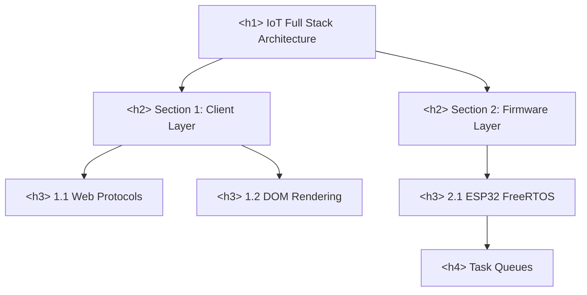

# Text Content And Formatting Elements

> **Course**: Git Version Control | **Module**: Introduction | **Difficulty**: beginner

---

- **Estimated Time**: 55 Minutes (20m Reading | 25m Practice | 10m Quiz)
- **Difficulty Level**: ⭐ Beginner
- **Prerequisites**: [Lesson 2.1 Syntax Rules & Element Classification](file:///d:/My%20Drive/all%20files/PROJECT%20FILES/notes/docs/curriculum/_01_html5/_01_04_html_syntax_rules_and_element_classification.md)
- **XP Reward**: +50 XP

### Learning Objectives
By the end of this lesson, you will be able to:
1. Construct an accessible document outline using strict heading hierarchy rules (`<h1>` through `<h6>`).
2. Distinguish between semantic formatting tags (`<strong>`, `<em>`, `<mark>`, `<small>`) and purely visual tags (`<b>`, `<i>`).
3. Format technical documentation, terminal commands, keyboard shortcuts, and variables using `<pre>`, `<code>`, `<kbd>`, `<samp>`, and `<var>`.
4. Implement citations, inline quotes, block quotes, abbreviations, and contact metadata using `<blockquote>`, `<q>`, `<cite>`, `<abbr>`, and `<address>`.
5. Utilize `<bdo>` and `<bdi>` for bi-directional internationalization text rendering.

---

---

Create a text formatting workbench file `formatting.html` in VS Code to run interactive code snippets during this lesson.

---

---

### 3.1 Heading Hierarchy (`<h1>` through `<h6>`)
Headings define the document tree outline consumed by search engines and screen readers:
- `<h1>`: Top-level document heading. **Rule**: Exactly ONE `<h1>` per page representing the primary topic.
- `<h2>`: Major module or section headers.
- `<h3>` to `<h6>`: Sub-sections and nested sub-headings.

> [!CAUTION]
> Never skip heading levels (e.g. jumping from `<h1>` directly to `<h3>`). Skipping levels breaks screen reader navigation algorithms.

### 3.2 Semantic vs Presentational Text Formatting
HTML5 strictly separates **semantic meaning** from **visual presentation**:

```
┌─────────────────────────────────────────────────────────────────────────────┐
│                   SEMANTIC VS PRESENTATIONAL FORMATTING                     │
├─────────────────┬───────────────────────────────────────────────────────────┤
│ <strong>        │ Semantic: Indicates high importance or urgent warning.    │
│                 │ Screen readers announce with EMPHASIZED voice inflection. │
├─────────────────┼───────────────────────────────────────────────────────────┤
│ <b>             │ Presentational: Draws visual attention (bold text)        │
│                 │ WITHOUT adding semantic importance or screen reader emphasis.│
├─────────────────┼───────────────────────────────────────────────────────────┤
│ <em>            │ Semantic: Indicates verbal stress emphasis.               │
├─────────────────┼───────────────────────────────────────────────────────────┤
│ <i>             │ Presentational: Technical terms, idiomatic phrases,       │
│                 │ foreign words, or taxonomy names (italic text).           │
└─────────────────┴───────────────────────────────────────────────────────────┘
```

#### Additional Structural Text Elements
- `<mark>`: Highlights text relevant for reference or search term matches.
- `<small>`: Represents side-comments, legal disclaimers, or copyright fine print.
- `<sub>` & `<sup>`: Subscript ($H_2O$) and Superscript ($E = mc^2$).
- `<ins>` & `<del>`: Inserted and Deleted text tracking document revisions.

### 3.3 Computer Code & Technical Documentation Elements

```
┌─────────────────────────────────────────────────────────────────────────────┐
│                   COMPUTER CODE FORMATTING ELEMENTS                         │
├──────────────┬──────────────────────────────────────────────────────────────┤
│ <code>       │ Inline code snippets (monospaced font).                      │
├──────────────┼──────────────────────────────────────────────────────────────┤
│ <pre>        │ Pre-formatted block; preserves all spaces, tabs, & newlines. │
├──────────────┼──────────────────────────────────────────────────────────────┤
│ <kbd>        │ Represents user keyboard input (e.g., Ctrl + C).             │
├──────────────┼──────────────────────────────────────────────────────────────┤
│ <samp>       │ Represents sample computer terminal output.                  │
├──────────────┼──────────────────────────────────────────────────────────────┤
│ <var>        │ Represents mathematical or programming variables.            │
└──────────────┴──────────────────────────────────────────────────────────────┘
```

```html
<!-- Combining <pre> and <code> for Block Code -->
<pre><code>def connect_sensor(pin: int) -> bool:
    return True</code></pre>
```

### 3.4 Quotations, Citations, & Abbreviations
- `<blockquote>`: Block-level quote from an external source (indented by default).
- `<q>`: Inline quotation; browser automatically adds language-appropriate quotation marks.
- `<cite>`: References title of a work (book, paper, specification).
- `<abbr>`: Defines an abbreviation or acronym; uses `title` attribute for expansion:
  ```html
  <abbr title="Domain Name System">DNS</abbr>
  ```
- `<address>`: Provides author/owner contact information.

### 3.5 Bidirectional Text Formatting (`<bdo>` & `<bdi>`)
- `<bdo dir="rtl">` (Bi-Directional Override): Explicitly overrides text direction.
- `<bdi>` (Bi-Directional Isolation): Isolates user-generated text (e.g. usernames in Arabic/Hebrew) so surrounding LTR layout direction is not corrupted.

---

---

### Accessible Heading Tree Outline


---

---

### 5.1 Technical Documentation Markup Example

```html
<!DOCTYPE html>
<html lang="en">
<head>
  <meta charset="UTF-8">
  <title>Technical Documentation Syntax</title>
  <style>
    body { font-family: system-ui, sans-serif; line-height: 1.6; padding: 20px; }
    kbd { background: #e2e8f0; border: 1px solid #cbd5e1; border-radius: 4px; padding: 2px 6px; font-family: monospace; }
    code { background: #f1f5f9; color: #0f172a; padding: 2px 6px; border-radius: 4px; font-family: monospace; }
    pre code { display: block; padding: 12px; background: #0f172a; color: #38bdf8; overflow-x: auto; }
    mark { background: #fef08a; padding: 2px 4px; }
  </style>
</head>
<body>

  <!-- Document Outline -->
  <h1>ESP32 Microcontroller Firmware Deployment</h1>

  <section>
    <h2>1. Flashing Instructions</h2>
    <p>To flash firmware onto the ESP32 board, press <kbd>Ctrl</kbd> + <kbd>Shift</kbd> + <kbd>P</kbd> in VS Code and select <mark>PlatformIO: Upload</mark>.</p>
    
    <p>Formula for power consumption: <var>P</var> = <var>V</var> &times; <var>I</var> (where <var>V</var> is voltage and <var>I</var> is current).</p>

    <!-- Terminal Output -->
    <p>Expected terminal output:</p>
    <p><samp>Connecting........<br>Writing at 0x00010000... (100 %)<br>Leaving... Hard resetting via RTS pin...</samp></p>
  </section>

  <section>
    <h2>2. Source Code Implementation</h2>
    <pre><code>#include &lt;WiFi.h&gt;

void setup() {
  Serial.begin(115200);
  // Connect to local network
  WiFi.begin("IoT_SSID", "SecretKey123");
}</code></pre>
  </section>

  <section>
    <h2>3. Citations & References</h2>
    <blockquote cite="https://www.espressif.com">
      "The ESP32 is a feature-rich MCU with integrated Wi-Fi and Bluetooth connectivity for IoT applications."
    </blockquote>
    <p>Source: <cite>Espressif Technical Reference Manual</cite> for <abbr title="Microcontroller Unit">MCU</abbr> devices.</p>
  </section>

</body>
</html>
```

---

---

### Accessible Developer Portals & CLI Documentation
Major engineering platforms (GitHub, Stripe, AWS) use semantic text formatting for API docs:
- `<kbd>` styling gives keybindings interactive physical key appearances.
- `<pre><code>` blocks integrate syntax highlighting engines (Highlight.js / Prism.js).
- `<abbr>` tags provide hover explanations for acronyms (`JSON`, `JWT`, `REST`, `MQTT`) without cluttering prose.

---

---

### Task: Build a Technical Quick Reference Sheet

#### Step 1: Create `cheatsheet.html`
Create a file named `cheatsheet.html` and add the following markup:

```html
<h2>Linux Terminal Quick Commands</h2>
<p>To view real-time log outputs, run <code>tail -f <var>logfile</var></code>.</p>
<p>Press <kbd>Ctrl</kbd> + <kbd>C</kbd> to terminate the active process.</p>
<p>Abbreviation: <abbr title="Secure Shell">SSH</abbr> connects via port 22.</p>
```

#### Step 2: Validate Accessibility Tree
1. Open `cheatsheet.html` in Chrome.
2. Open DevTools (`F12`) $\rightarrow$ Click **Accessibility** tab under Elements.
3. Inspect `<abbr>` and `<kbd>` nodes to verify accessibility role mappings.

---

---

| Symptom / Error | Root Cause | Engineering Solution |
| :--- | :--- | :--- |
| **SEO Penalty for Heading Skipping** | Using `<h5>` for small text styling instead of using CSS `font-size`. | Maintain strict logical heading order (`<h1>` $\to$ `<h2>` $\to$ `<h3>`); control visual text size purely via CSS. |
| **`pre` Code Overflowing Screen** | `<pre>` blocks default to `white-space: pre` and do not wrap long lines. | Add `overflow-x: auto` or `white-space: pre-wrap` to `<pre>` containers in CSS. |
| **Unannounced Emphasis on Screen Readers** | Using `<b>` and `<i>` everywhere instead of `<strong>` and `<em>`. | Use `<strong>` for important notices and `<em>` for stressed words to ensure screen readers apply vocal emphasis. |

---

---

- **Single `<h1>` per Page**: Maintain exactly one primary `<h1>` for page identity.
- **Use `<code>` Inside `<pre>`**: Always wrap code inside `<pre><code>...</code></pre>` for block code.
- **Provide Acronym Titles**: Always include `title="..."` attribute on `<abbr>` tags.
- **Use `kbd` for Key Combinations**: Wrap individual keys in separate `<kbd>` tags (e.g. `<kbd>Ctrl</kbd> + <kbd>S</kbd>`).

---

---

### Q1: What is the semantic difference between `<strong>` and `<b>`, and `<em>` and `<i>`?
**Answer**:
- `<strong>` and `<em>` are **semantic** elements. `<strong>` indicates strong importance or urgency; `<em>` indicates verbal stress emphasis. Screen readers alter voice pitch/volume when reading them.
- `<b>` and `<i>` are **presentational** elements. `<b>` draws visual attention without adding importance; `<i>` represents text in an alternate voice or mood (technical terms, foreign words, titles) without adding stress emphasis.

### Q2: How do `<bdo>` and `<bdi>` differ when handling internationalized text?
**Answer**:
- `<bdo dir="rtl">` (Bi-Directional Override) explicitly forces text inside it to render in the specified direction regardless of character properties.
- `<bdi>` (Bi-Directional Isolation) isolates enclosed text from surrounding text direction rules. It is essential when displaying user-generated data (e.g., dynamic usernames or comments) whose text direction (LTR or RTL) is unknown at build time.

---

---

```json
{
  "quiz_title": "Lesson 2.2 Text Content & Formatting Elements Assessment",
  "questions": [
    {
      "question_id": "Q1",
      "type": "multiple_choice",
      "question_text": "Which tag should be used to wrap keyboard shortcuts (e.g. Ctrl + C)?",
      "options": ["<code>", "<var>", "<kbd>", "<samp>"],
      "correct_answer_index": 2,
      "explanation": "<kbd> explicitly identifies user keyboard input."
    },
    {
      "question_id": "Q2",
      "type": "multiple_choice",
      "question_text": "What is the recommended rule for `<h1>` tags on a single HTML page?",
      "options": [
        "Include an h1 inside every div",
        "Use exactly one <h1> per document representing the main topic",
        "Never use h1 tags",
        "Use h1 tags only for navigation links"
      ],
      "correct_answer_index": 1,
      "explanation": "Accessibility and SEO best practices dictate exactly one primary <h1> per document."
    },
    {
      "question_id": "Q3",
      "type": "multiple_choice",
      "question_text": "Which element defines acronyms and abbreviations with a hover title?",
      "options": ["<cite>", "<abbr>", "<sub>", "<ins>"],
      "correct_answer_index": 1,
      "explanation": "<abbr title='Full Expansion'>Acronym</abbr> specifies abbreviations."
    },
    {
      "question_id": "Q4",
      "type": "multiple_choice",
      "question_text": "Which combination of elements is standard for displaying multi-line preformatted code blocks?",
      "options": ["<pre><code>", "<blockquote><q>", "<kbd><var>", "<samp><code>"],
      "correct_answer_index": 0,
      "explanation": "<pre> preserves whitespace while <code> provides semantic programming code designation."
    },
    {
      "question_id": "Q5",
      "type": "multiple_choice",
      "question_text": "Which tag isolates user-generated text of unknown directionality (LTR or RTL)?",
      "options": ["<bdo>", "<bdi>", "<em>", "<address>"],
      "correct_answer_index": 1,
      "explanation": "<bdi> (Bi-Directional Isolation) prevents dynamic text from corrupting surrounding layout direction."
    }
  ]
}
```

---

---

### Objective
Build a semantic Developer CLI Quick Start guide using technical formatting tags (`<h1>`-`<h3>`, `<kbd>`, `<pre><code>`, `<samp>`, `<abbr>`, `<mark>`).

---

---

**Front**: What is the purpose of the `<samp>` element?
**Back**: Represents sample output from a computer program, terminal, or script.
<!-- flashcard:end -->

**Front**: How do `<ins>` and `<del>` render by default in browsers?
**Back**: `<ins>` renders as underlined text (inserted); `<del>` renders as strikethrough text (deleted).
<!-- flashcard:end -->

**Front**: What tag should be used for mathematical variables in formulas?
**Back**: `<var>`
<!-- flashcard:end -->

---

---

### Key Takeaways
- **Heading Order**: Maintain strict logical hierarchy (`<h1>` $\to$ `<h2>` $\to$ `<h3>`).
- **Semantic Formatting**: Use `<strong>` and `<em>` for vocal/semantic weight; `<b>` and `<i>` for visual styling.
- **Code Tags**: Combine `<pre>` and `<code>` for code blocks; use `<kbd>` for shortcuts and `<samp>` for terminal output.

### Quick Syntax Reference

```html
<!-- Keyboard Shortcut -->
<p>Press <kbd>Ctrl</kbd> + <kbd>S</kbd> to save.</p>

<!-- Preformatted Code Block -->
<pre><code>console.log("Hello IoT");</code></pre>
```

### Official References
- [WHATWG HTML Specification: Text-level Semantics](https://html.spec.whatwg.org/multipage/text-level-semantics.html)
- [MDN Web Docs: HTML Text Formatting](https://developer.mozilla.org/en-US/docs/Learn/HTML/Introduction_to_HTML/HTML_text_fundamentals)

---
