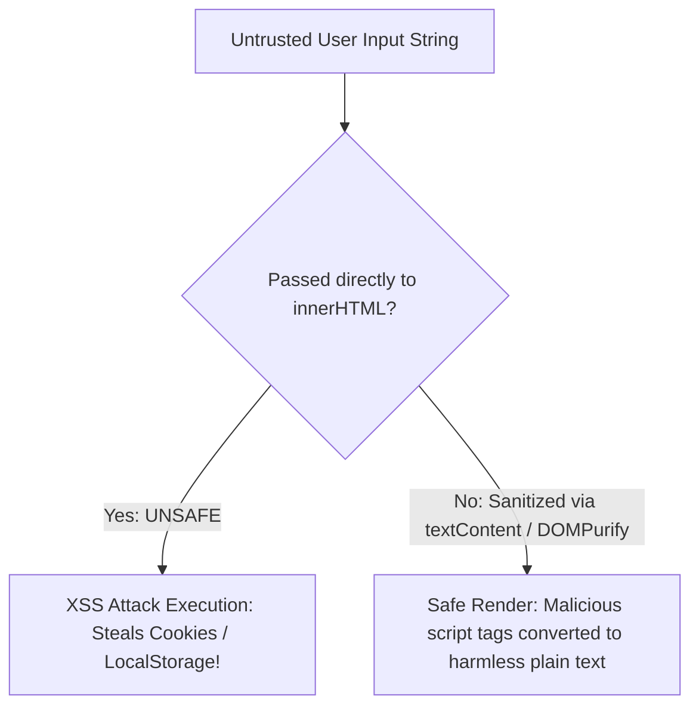

# Web Security Xss Csrf Csp Mitigation

> **Course**: Git Version Control | **Module**: Introduction | **Difficulty**: beginner

---

- **Estimated Time**: 55 Minutes (20m Reading | 25m Practice | 10m Quiz)
- **Difficulty Level**: ⭐⭐⭐ Advanced
- **Prerequisites**: [Lesson 11.3 Memory Management](file:///d:/My%20Drive/all%20files/PROJECT%20FILES/notes/docs/curriculum/_03_javascript/_03_40_memory_management_and_leak_prevention.md)
- **XP Reward**: +70 XP

### Learning Objectives
By the end of this lesson, you will be able to:
1. Identify and prevent the 3 forms of **Cross-Site Scripting (XSS)**: Stored, Reflected, and DOM-based.
2. Neutralize **Cross-Site Request Forgery (CSRF)** using `SameSite=Strict` cookies and Anti-CSRF tokens.
3. Configure robust **Content Security Policy (CSP)** HTTP headers to block unauthorized script execution.
4. Sanitize user-generated HTML inputs using **DOMPurify**.

---

---

Open Browser DevTools Console & Network Headers tab.

---

---

### 3.1 XSS vs CSRF Vulnerability Matrix

```
┌─────────────────────────────────────────────────────────────────────────────┐
│                           XSS VS CSRF COMPARISON                            │
├─────────────────┬──────────────────────────────────┬────────────────────────┤
│ Vulnerability   │ Attack Mechanism                 │ Primary Defense        │
├─────────────────┼──────────────────────────────────┼────────────────────────┤
│ **XSS**         │ Attacker injects malicious JS    │ Output Encoding, CSP,  │
│                 │ into victim's browser context    │ `DOMPurify.sanitize()` │
├─────────────────┼──────────────────────────────────┼────────────────────────┤
│ **CSRF**        │ Attacker tricks victim's browser │ `SameSite=Strict`,     │
│                 │ into submitting unwanted requests│ Anti-CSRF Tokens       │
└─────────────────┴──────────────────────────────────┴────────────────────────┘
```

### 3.2 Content Security Policy (CSP)
A **Content Security Policy (CSP)** is an HTTP response header that restricts the scripts, styles, and image sources the browser is permitted to execute:

```http
Content-Security-Policy: default-src 'self'; script-src 'self' 'nonce-rAnd0m123'; object-src 'none';
```

---

---



---

---

```javascript
// XSS Prevention & Context-Aware Escaping Demonstration

// 1. Context-Aware HTML Escaping Utility
function escapeHTML(str) {
  return String(str).replace(/[&<>"']/g, (match) => {
    const escapeMap = {
      "&": "&amp;",
      "<": "&lt;",
      ">": "&gt;",
      '"': "&quot;",
      "'": "&#39;"
    };
    return escapeMap[match];
  });
}

// 2. Safe DOM Insertion
function renderComment(username, commentText) {
  const commentCard = document.createElement("div");
  commentCard.className = "comment-card";

  // UNSAFE: commentCard.innerHTML = `<p>${commentText}</p>`;
  // SAFE: Setting textContent automatically escapes all HTML tags!
  const p = document.createElement("p");
  p.textContent = `${username}: ${commentText}`; // Safe against DOM XSS!
  
  commentCard.appendChild(p);
  return commentCard;
}

const maliciousPayload = "<script>alert('XSS STOLEN TOKEN');</script>";
console.log("Escaped HTML Output:", escapeHTML(maliciousPayload));
```

---

---

- **Banking & Enterprise Security Compliance**: Financial web applications enforce strict CSP headers, `SameSite=Strict` cookies, and automated XSS sanitization pipelines to pass SOC2 and OWASP Top 10 security audits.

---

---

1. Open DevTools Console.
2. Execute `escapeHTML('')` $\to$ Inspect sanitized HTML string!

---

---

| Bug / Error | Root Cause | Engineering Solution |
| :--- | :--- | :--- |
| **DOM-based XSS Vulnerability** | Assigning `location.hash` or query parameters directly to `element.innerHTML` or `eval()`. | Use `textContent` or DOMPurify library sanitization before rendering. |

---

---

- **Use `textContent` By Default**: Avoid `innerHTML` unless rendering sanitized rich text.

---

---

### Q1: What is a Content Security Policy (CSP) and how does it prevent XSS attacks?
**Answer**: A Content Security Policy (CSP) is an HTTP header returned by the server that tells the browser which sources of executable code are trusted. By restricting script execution to origin domains (`'self'`) or cryptographic nonces and disallowing inline scripts (`'unsafe-inline'`), CSP prevents injected XSS scripts from executing even if an attacker succeeds in injecting a `<script>` tag.

---

---

```json
{
  "quiz_title": "Lesson 11.4 Web Security Assessment",
  "questions": [
    {
      "question_id": "Q1",
      "type": "multiple_choice",
      "question_text": "Which DOM property safely sets plain text without executing injected HTML script tags?",
      "options": ["innerHTML", "outerHTML", "textContent", "document.write"],
      "correct_answer_index": 2,
      "explanation": "textContent automatically escapes HTML tags."
    }
  ]
}
```

---

---

Build a secure comment feed sanitizing user inputs via `escapeHTML()` and DOMPurify.

---

---

**Front**: What Cookie attribute prevents Cross-Site Request Forgery (CSRF) by withholding cookies on cross-origin requests?
**Back**: `SameSite=Strict` (or `SameSite=Lax`).
<!-- flashcard:end -->

---

---

```javascript
element.textContent = untrustedInput;
// Content-Security-Policy: default-src 'self'
```

---
