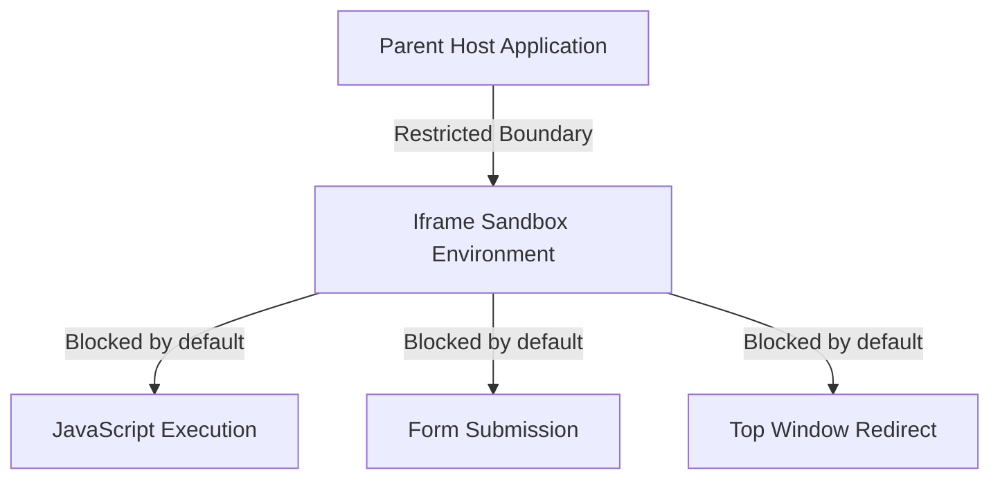

# Lesson 6.2 Embedded External Content

> **Course**: Html5 | **Module**: Module 1 | **Difficulty**: beginner

---

- **Estimated Time**: 45 Minutes (15m Reading | 20m Practice | 10m Quiz)
- **Difficulty Level**: ⭐⭐ Intermediate
- **Prerequisites**: [Lesson 6.1 Media Elements](file:///d:/My%20Drive/all%20files/PROJECT%20FILES/notes/docs/curriculum/_01_html5/_01_14_media_elements_images_audio_and_video.md)
- **XP Reward**: +50 XP

### Learning Objectives
By the end of this lesson, you will be able to:
1. Embed external web pages and widgets using `<iframe>`.
2. Secure embedded iframes using `sandbox`, `allow`, and Content Security Policy (CSP) directives.
3. Utilize `<object>` and `<embed>` for SVG or PDF document rendering.
4. Integrate external interactive maps, video players, and cloud IoT telemetry dashboards.

---

---

Open VS Code and create `iframe_demo.html` to write iframe embeds.

---

---

### 3.1 Inline Frames (`<iframe>`)
An `<iframe>` embeds an independent browsing context inside the current page:

```html
<iframe src="https://grafana.iotplatform.com/dashboard"
        width="100%" 
        height="500" 
        title="Live Sensor Graph">
</iframe>
```

### 3.2 Iframe Security Sandboxing (`sandbox` & `allow`)

> [!CAUTION]
> Unrestricted iframes pose Clickjacking and Cross-Site Scripting (XSS) risks. Always apply the `sandbox` attribute to untrusted embeds!

```html
<iframe src="https://third-party.com/widget"
        sandbox="allow-scripts allow-same-origin"
        allow="accelerometer; autoplay; encrypted-media; gyroscope"
        loading="lazy"
        title="Third Party Widget">
</iframe>
```

#### `sandbox` Permissions
- `sandbox=""` (Empty): Enforces maximum restrictions (disables scripts, forms, popups, top navigation).
- `allow-scripts`: Permits JavaScript execution inside iframe.
- `allow-same-origin`: Allows iframe content to retain its origin domain cookies/local storage.
- `allow-forms`: Permits form submission.

---

---

### Iframe Sandboxing Boundary


---

---

```html
<!DOCTYPE html>
<html lang="en">
<head>
  <meta charset="UTF-8">
  <title>Embedded IoT Dashboard</title>
  <style>
    iframe { border: 1px solid #cbd5e1; border-radius: 8px; width: 100%; height: 400px; }
  </style>
</head>
<body>

  <h1>Live Telemetry Portal</h1>
  
  <iframe src="https://example.com" 
          sandbox="allow-scripts" 
          title="Telemetry Dashboard">
  </iframe>

</body>
</html>
```

---

---

### Embedded Grafana & OpenStreetMap Widgets
Enterprise platforms embed Grafana telemetry panels or OpenStreetMap GPS nodes using secured `<iframe>` tags.

---

---

1. Save code as `iframe_demo.html`.
2. Verify iframe loads cleanly with sandboxing enabled.

---

---

| Bug / Error | Root Cause | Engineering Solution |
| :--- | :--- | :--- |
| **`Refused to display in a frame`** | Target server sent `X-Frame-Options: DENY` header. | Host target content on allowed domains or update X-Frame-Options headers. |

---

---

- **Always Include `title`**: Required for screen reader accessibility.
- **Use `sandbox`**: Restrict iframe permissions.

---

---

### Q1: What does an empty `sandbox=""` attribute do on an iframe?
**Answer**: Applies strict maximum security restrictions: disables JS, forms, popups, same-origin access, and top-level navigation.

---

---

```json
{
  "quiz_title": "Lesson 6.2 Embedded External Content Assessment",
  "questions": [
    {
      "question_id": "Q1",
      "type": "multiple_choice",
      "question_text": "Which attribute enforces security sandboxing on an `<iframe>`?",
      "options": ["secure", "sandbox", "csp", "restricted"],
      "correct_answer_index": 1,
      "explanation": "sandbox controls security permissions for iframes."
    }
  ]
}
```

---

---

Embed a interactive map widget using a sandboxed iframe.

---

---

**Front**: What HTTP header prevents a web page from being embedded inside an `<iframe>`?
**Back**: `X-Frame-Options: DENY` (or `Content-Security-Policy: frame-ancestors 'none'`).
<!-- flashcard:end -->

---

---

```html
<iframe src="https://example.com" sandbox="allow-scripts" title="Widget"></iframe>
```

---
