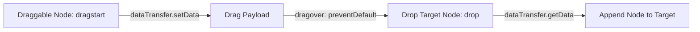

# Lesson 7.3 HTML5 Drag and Drop API

> **Course**: Html5 | **Module**: Module 1 | **Difficulty**: beginner

---

- **Estimated Time**: 45 Minutes (15m Reading | 20m Practice | 10m Quiz)
- **Difficulty Level**: ⭐⭐ Intermediate
- **Prerequisites**: [Lesson 2.1 Syntax Rules](file:///d:/My%20Drive/all%20files/PROJECT%20FILES/notes/docs/curriculum/_01_html5/_01_04_html_syntax_rules_and_element_classification.md)
- **XP Reward**: +60 XP

### Learning Objectives
By the end of this lesson, you will be able to:
1. Enable native dragging using `draggable="true"`.
2. Handle the 7 core Drag and Drop events (`dragstart`, `drag`, `dragend`, `dragenter`, `dragover`, `dragleave`, `drop`).
3. Store and retrieve drag payloads using `event.dataTransfer.setData()` and `getData()`.
4. Prevent default browser drag behaviors to construct interactive drop zones.

---

---

Open VS Code and create `dnd_demo.html` to build drag and drop interfaces.

---

---

### 3.1 Drag and Drop Lifecycle
1. Make an element draggable: `<div draggable="true">`.
2. On `dragstart`: Package data using `e.dataTransfer.setData('text/plain', id)`.
3. On `dragover`: Call `e.preventDefault()` to allow dropping!
4. On `drop`: Retrieve data using `e.dataTransfer.getData('text/plain')`.

```html
<!-- DRAGGABLE ELEMENT -->
<div id="item-1" draggable="true" ondragstart="event.dataTransfer.setData('text', this.id)">
  Drag Me
</div>

<!-- DROP TARGET ZONE -->
<div ondragover="event.preventDefault()" ondrop="dropItem(event)">
  Drop Zone
</div>
```

---

---



---

---

```html
<!DOCTYPE html>
<html lang="en">
<head>
  <meta charset="UTF-8">
  <title>Drag and Drop Kanban</title>
  <style>
    .zone { width: 200px; height: 200px; border: 2px dashed #3b82f6; display: inline-block; padding: 10px; }
    .card { background: #0f172a; color: #fff; padding: 10px; cursor: move; border-radius: 4px; }
  </style>
</head>
<body>
  <div class="zone" id="z1" ondragover="event.preventDefault()" ondrop="drop(event)">
    <div class="card" id="c1" draggable="true" ondragstart="drag(event)">Sensor Card #1</div>
  </div>
  <div class="zone" id="z2" ondragover="event.preventDefault()" ondrop="drop(event)"></div>

  <script>
    function drag(e) { e.dataTransfer.setData('text', e.target.id); }
    function drop(e) {
      e.preventDefault();
      const id = e.dataTransfer.getData('text');
      e.target.appendChild(document.getElementById(id));
    }
  </script>
</body>
</html>
```

---

---

- **Kanban Boards (Trello, Jira)**: Dragging task cards between status columns.

---

---

1. Save code as `dnd_demo.html`.
2. Drag **Sensor Card #1** into Zone 2.

---

---

| Bug / Error | Root Cause | Engineering Solution |
| :--- | :--- | :--- |
| **Drop Event Fails to Fire** | Missing `event.preventDefault()` inside `dragover` event listener. | Always call `event.preventDefault()` in `dragover` handlers. |

---

---

- **Always Call `preventDefault()` in `dragover`**: Required to permit dropping.

---

---

### Q1: Why is `event.preventDefault()` required in the `dragover` handler?
**Answer**: By default, browsers prevent dropping elements onto HTML nodes. Calling `e.preventDefault()` inside `dragover` cancels default behavior and allows a drop event to fire.

---

---

```json
{
  "quiz_title": "Lesson 7.3 Drag and Drop Assessment",
  "questions": [
    {
      "question_id": "Q1",
      "type": "multiple_choice",
      "question_text": "Which attribute makes a standard `<div>` element draggable?",
      "options": ["drag='true'", "draggable='true'", "moveable='true'", "drop='true'"],
      "correct_answer_index": 1,
      "explanation": "draggable='true' turns on native element dragging."
    }
  ]
}
```

---

---

Build a drag-and-drop dashboard widget organizer.

---

---

**Front**: What object is used to pass payload data during a Drag and Drop operation?
**Back**: `event.dataTransfer`
<!-- flashcard:end -->

---

---

```html
<div draggable="true">Drag</div>
```

---
