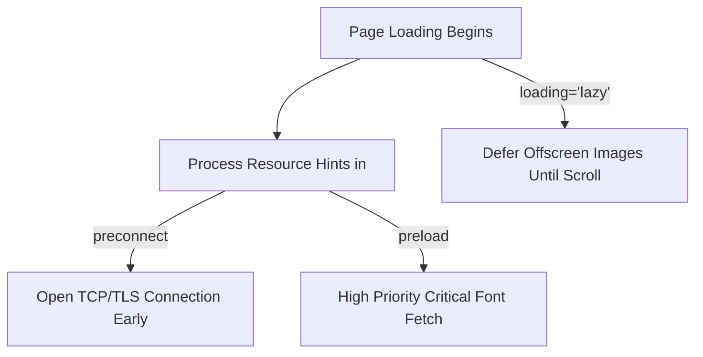

# Lesson 9.3 Performance Optimization & Best Practices

> **Course**: Html5 | **Module**: Module 1 | **Difficulty**: beginner

---

- **Estimated Time**: 55 Minutes (20m Reading | 25m Practice | 10m Quiz)
- **Difficulty Level**: ⭐⭐ Intermediate
- **Prerequisites**: [Lesson 1.2 Browser Rendering Engine](file:///d:/My%20Drive/all%20files/PROJECT%20FILES/notes/docs/curriculum/_01_html5/_01_02_browser_rendering_engine_architecture.md)
- **XP Reward**: +60 XP

### Learning Objectives
By the end of this lesson, you will be able to:
1. Configure browser resource hints (`dns-prefetch`, `preconnect`, `prefetch`, `preload`, `modulepreload`).
2. Apply native lazy loading (`loading="lazy"`) to images and `<iframe>` elements to defer offscreen network downloads.
3. Identify and purge obsolete, deprecated HTML elements (`<font>`, `<center>`, `<marquee>`, `<strike>`, `<big>`).
4. Validate HTML documents using W3C Validation Services to achieve 100% syntax compliance.

---

---

Run performance profiling in Chrome DevTools:
- Open DevTools (`F12`) $\rightarrow$ Click **Lighthouse** tab $\rightarrow$ Check **Performance** $\rightarrow$ Analyze page load.

---

---

### 3.1 Resource Hints Summary

```
┌─────────────────────────────────────────────────────────────────────────────┐
│                          HTML5 RESOURCE HINTS SUMMARY                       │
├─────────────────┬───────────────────────────────────────────────────────────┤
│ `dns-prefetch`  │ Performs early DNS lookup for external domain origin.     │
├─────────────────┼───────────────────────────────────────────────────────────┤
│ `preconnect`    │ Performs DNS lookup + TCP handshake + TLS negotiation.     │
├─────────────────┼───────────────────────────────────────────────────────────┤
│ `preload`       │ Mandatory high-priority fetch for current page assets     │
│                 │ (fonts, critical CSS, key JS).                            │
├─────────────────┼───────────────────────────────────────────────────────────┤
│ `prefetch`      │ Low-priority background fetch for FUTURE page assets.     │
├─────────────────┼───────────────────────────────────────────────────────────┤
│ `modulepreload` │ Preloads and compiles ES6 JavaScript modules.             │
└─────────────────┴───────────────────────────────────────────────────────────┘
```

### 3.2 Native Lazy Loading (`loading="lazy"`)
Native lazy loading delays network requests for images and iframes until they scroll near the visible viewport:

```html
<!-- Offscreen Image Lazy Loading -->


<!-- Offscreen Iframe Lazy Loading -->
<iframe src="dashboard.html" loading="lazy" title="Widget"></iframe>
```

### 3.3 Obsolete & Deprecated HTML Tags
Modern HTML5 separates styling (CSS) from structure. The following legacy presentational tags are **deprecated** and forbidden in production HTML5:

- `<font>`, `<center>`, `<marquee>`, `<strike>`, `<big>`, `<tt>`, `<frame>`, `<frameset>`.

---

---



---

---

```html
<!DOCTYPE html>
<html lang="en">
<head>
  <meta charset="UTF-8">
  <title>High Performance HTML5 Portal</title>

  <!-- 1. Resource Hints -->
  <link rel="dns-prefetch" href="https://fonts.googleapis.com">
  <link rel="preconnect" href="https://fonts.gstatic.com" crossorigin>
  <link rel="preload" href="/fonts/inter.woff2" as="font" type="font/woff2" crossorigin>

  <style>
    body { font-family: system-ui; margin: 0; padding: 20px; }
  </style>
</head>
<body>

  <h1>High Performance HTML5 Page</h1>

  <!-- Native Lazy Loaded Image -->
  

</body>
</html>
```

---

---

- **Core Web Vitals**: Utilizing `preload` and `loading="lazy"` improves Largest Contentful Paint (LCP) and Cumulative Layout Shift (CLS) scores on Google PageSpeed Insights.

---

---

1. Save code as `perf_demo.html`.
2. Run Lighthouse in Chrome DevTools $\rightarrow$ Verify **Performance Score** is 95+!

---

---

| Bug / Error | Root Cause | Engineering Solution |
| :--- | :--- | :--- |
| **`Preload trigger warning`** | Preloading an asset that is not used within 3 seconds of page load. | Only use `<link rel="preload">` for critical above-the-fold assets. |

---

---

- **Lazy Load Below-the-Fold Images**: Add `loading="lazy"`.
- **Preconnect Third-Party Domains**: Preconnect to font or API origins.

---

---

### Q1: What is the difference between `preload` and `prefetch`?
**Answer**: `preload` is a high-priority directive for critical assets needed on the *current* page. `prefetch` is a low-priority directive for assets likely needed on *future* pages during navigation.

---

---

```json
{
  "quiz_title": "Lesson 9.3 Performance Assessment",
  "questions": [
    {
      "question_id": "Q1",
      "type": "multiple_choice",
      "question_text": "Which attribute defers loading of offscreen images until they approach the viewport?",
      "options": ["defer", "async", "loading='lazy'", "preload"],
      "correct_answer_index": 2,
      "explanation": "loading='lazy' enables native browser lazy loading."
    }
  ]
}
```

---

---

Optimize an un-optimized HTML page to achieve a 100 Performance Score on Chrome Lighthouse.

---

---

**Front**: What resource hint opens early DNS, TCP, and TLS connections to an external domain?
**Back**: `<link rel="preconnect" href="...">`
<!-- flashcard:end -->

---

---

```html

```

---
