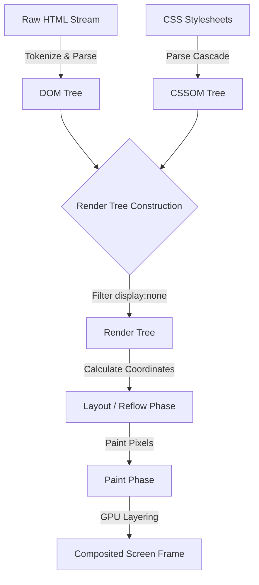

```yaml
schema_version: "2.0"
metadata:
  lesson_id: "HTML5-MOD01-LES02"
  course_slug: "course-01-html5"
  course_title: "Course 1: HTML5"
  module_slug: "mod-01-browser-architecture"
  module_title: "Module 1 - Web & Browser Architecture Fundamentals"
  lesson_slug: "browser-rendering-engine-architecture"
  lesson_title: "Lesson 1.2 Browser Rendering Engine Architecture"
  sort_order: 102

pedagogy:
  difficulty: "intermediate"
  estimated_time:
    reading_minutes: 20
    practice_minutes: 25
    quiz_minutes: 10
    total_minutes: 55
  bloom_taxonomy_level: "Analyze"
  xp_reward: 60

prerequisites:
  required_lesson_ids:
    - "HTML5-MOD01-LES01"
  required_skills:
    - "Client-Server Request-Response Mechanics"

skills_acquired:
  - "Browser Engine Architecture Identification"
  - "DOM & CSSOM Tree Construction Tracing"
  - "Render Tree Generation & Layout Pipeline Debugging"
  - "Reflow & Repaint Trigger Avoidance"
  - "Critical Rendering Path (CRP) Optimization"

dependencies:
  software:
    - "Google Chrome DevTools (Performance & Rendering Tabs)"
  hardware: []

seo_and_social:
  meta_title: "Browser Rendering Engine Architecture: DOM, CSSOM, CRP & Performance"
  meta_description: "Deep dive into browser rendering engines (Blink, Gecko, WebKit), DOM/CSSOM tree construction, Layout/Reflow, Repaint, and Critical Rendering Path optimization."
  keywords: ["Browser Engine", "Blink", "WebKit", "DOM Tree", "CSSOM", "Critical Rendering Path", "Reflow", "Repaint", "GPU Compositing"]

assessment_config:
  has_quiz: true
  has_lab: true
  has_flashcards: true
  pass_score_percentage: 80
```

# Lesson 1.2 Browser Rendering Engine Architecture

## 1. Overview & Learning Objectives [id: overview]

- **Estimated Time**: 55 Minutes (20m Reading | 25m Practice | 10m Quiz)
- **Difficulty Level**: ⭐⭐ Intermediate
- **Prerequisites**: [Lesson 1.1 Web Architecture & Protocols](file:///d:/My%20Drive/all%20files/PROJECT%20FILES/notes/docs/curriculum/_01_html5/_01_01_web_architecture_and_protocols.md)
- **XP Reward**: +60 XP

### Learning Objectives
By the end of this lesson, you will be able to:
1. Identify major modern browser engines (Blink, Gecko, WebKit) and their underlying multi-process architecture.
2. Trace the step-by-step conversion of raw HTML bytes into a Document Object Model (DOM) tree.
3. Explain CSSOM tree construction and how CSS specificity rules combine with DOM nodes to construct the Render Tree.
4. Distinguish between Layout (Reflow), Paint (Repaint), and Compositing rendering pipeline stages.
5. Apply Critical Rendering Path (CRP) optimization techniques (blocking scripts, `async`/`defer`, critical CSS) to achieve high Core Web Vitals performance scores.

---

## 2. Environment & Prerequisites [id: prerequisites]

This lesson uses the **Performance** and **Rendering** tooling built into Google Chrome / Chromium-based browsers:

```bash
# Open Chrome Performance Profiler shortcut:
# Windows/Linux: Ctrl + Shift + E (inside DevTools)
# macOS: Cmd + Option + E
```

> [!NOTE]
> Ensure Chrome extensions are disabled or tested in an Incognito window to avoid extension overhead skewing rendering performance traces.

---

## 3. Theoretical Foundations [id: theory]

### 3.1 Anatomy of a Modern Web Browser
Modern web browsers are not monolithic applications; they operate as multi-process systems to ensure security sandboxing, stability, and responsiveness:

- **Browser Process**: Manages address bar, bookmarks, back/forward buttons, network requests, and OS security permissions.
- **Renderer Process**: Controls the tab's interior content display. Executes HTML/CSS parsing, layout calculations, and JavaScript execution.
- **GPU Process**: Handles 3D transformations, composite layers, and GPU hardware acceleration.
- **Plugin Process**: Controls active browser extensions or plugins.

### 3.2 Major Browser Engines

| Browser Engine | Developing Organizations | Primary Browsers Using Engine | Key Characteristics |
| :--- | :--- | :--- | :--- |
| **Blink** | Google, Microsoft, Opera, Adobe | Google Chrome, MS Edge, Brave, Opera | Forked from WebKit; features V8 JS engine, multi-process architecture, LayoutNG. |
| **Gecko** | Mozilla Foundation | Mozilla Firefox, Tor Browser | C++ and Rust-based (Servo components); features Quantum Compositor & SpiderMonkey JS engine. |
| **WebKit** | Apple | Safari (iOS, macOS, iPadOS) | Power-efficient engine powering Apple ecosystem; features JavaScriptCore (JSC) engine. |

### 3.3 The 5 Stages of the Rendering Pipeline

```
HTML Bytes ──► Tokens ──► Nodes ──► DOM Tree ──┐
                                               ├──► Render Tree ──► Layout ──► Paint ──► Composite
CSS Bytes  ──► Tokens ──► Nodes ──► CSSOM Tree ┘
```

#### Stage 1: HTML Parsing & DOM Construction
1. **Conversion**: Browser reads raw bytes from network/disk and translates them to characters based on character encoding (UTF-8).
2. **Tokenization**: Converts characters into distinct W3C standard tokens (`<html>`, `<body>`, `<p>`).
3. **Lexing**: Converts tokens into Node objects containing attributes and rules.
4. **DOM Tree Construction**: Builds a tree structure defining parent-child-sibling node relationships.

> [!IMPORTANT]
> HTML parsing is **incremental**. The browser can parse and render initial DOM nodes while remaining bytes are still streaming over the network socket.

#### Stage 2: CSS Parsing & CSSOM Construction
While parsing HTML, the browser encounters CSS `<link rel="stylesheet">` tags. It downloads and parses CSS bytes into the **CSS Object Model (CSSOM)** tree. Unlike HTML, CSS parsing is **render-blocking**: the CSSOM must be fully calculated before layout can begin because cascade rules can overwrite styling later in the stylesheet.

#### Stage 3: Render Tree Generation
The browser combines the DOM and CSSOM trees into a **Render Tree**:
- Evaluates computed styles for every visible node.
- **Excludes Non-Visible Nodes**: Elements with `display: none`, `<head>`, `<script>`, and `<meta>` tags are excluded from the Render Tree. (Note: elements with `visibility: hidden` are *included* because they occupy spatial layout bounds).

#### Stage 4: Layout (Reflow)
The Layout stage (also called Reflow) calculates the exact geometry—width, height, and screen coordinates ($X, Y$)—for every node in the Render Tree relative to the viewport.

#### Stage 5: Paint, Repaint & GPU Compositing
1. **Paint (Repaint)**: Fills in pixels on screen layers (background colors, text, borders, shadows).
2. **Compositing**: Draws visual layers on separate GPU layers and composites them onto the screen in correct $Z$-index order.

### 3.4 Reflow vs Repaint Trigger Comparison

```
+-----------------------------------------------------------------------------------+
|  Reflow Trigger (Expensive)  ──► Recalculates Geometry ──► Triggers Repaint ──► Composite |
|  Repaint Trigger (Medium)    ──► Skips Layout          ──► Triggers Paint   ──► Composite |
|  GPU Composite Trigger (Fast)──► Skips Layout & Paint  ──► Executes on GPU  ──► Composite |
+-----------------------------------------------------------------------------------+
```

| Action | Triggers Reflow? | Triggers Repaint? | Triggers GPU Composite? | Performance Impact |
| :--- | :---: | :---: | :---: | :--- |
| Changing `width`, `height`, `margin`, `font-size` | **YES** | **YES** | **YES** | 🔴 Severe (Heavy CPU) |
| Changing `color`, `background-color`, `visibility` | **NO** | **YES** | **YES** | 🟡 Moderate |
| Changing `transform` (`translate3d`), `opacity` | **NO** | **NO** | **YES** | 🟢 Extremely Fast (GPU) |

---

## 4. Architecture & Diagram Visualizations [id: diagram]

### Critical Rendering Path Architecture


---

## 5. Code & Hardware Implementation [id: syntax]

### 5.1 Script Execution Blocking Modes (`async` vs `defer`)

By default, `<script>` tags are **parser-blocking**: HTML parsing stops completely while the script is downloaded and executed.

```html
<!-- 1. Default (Parser-Blocking): Stops HTML parsing, downloads script, executes script, resumes HTML parsing -->
<script src="app.js"></script>

<!-- 2. Async Mode: Downloads script asynchronously in background; pauses HTML parsing ONLY during script execution -->
<script src="analytics.js" async></script>

<!-- 3. Defer Mode (RECOMMENDED): Downloads asynchronously in background; executes ONLY after HTML parsing is 100% complete -->
<script src="main.js" defer></script>
```

#### Comparison Timeline Matrix

```
Default: [HTML Parsing] ──► (PAUSED: Download & Execute) ──► [HTML Parsing Continues]
Async:   [HTML Parsing ───────────────────────────────] ──► (Pause: Execute Script) ──► [Finish HTML]
           └─► (Download in background) ──────────────┘
Defer:   [HTML Parsing Complete ────────────────────────────────────────────────────] ──► [Execute Script]
           └─► (Download in background) ──────────────────────────────────────────────┘
```

---

## 6. Enterprise Real-World Applications [id: examples]

### Critical CSS Inline Pattern for Enterprise E-Commerce
For high-traffic web applications (like Amazon or Netflix), achieving a low **First Contentful Paint (FCP)** is critical for user retention.

- **Above-the-Fold Critical CSS**: Inlined directly inside `<head><style>...</style></head>` so the browser can render the initial viewport during the very first TCP packet payload without waiting for external `.css` network fetches.
- **Non-Critical CSS**: Loaded asynchronously using `<link rel="preload" as="style" onload="this.rel='stylesheet'">`.

```html
<!DOCTYPE html>
<html lang="en">
<head>
  <meta charset="UTF-8">
  <title>High Performance App</title>
  <!-- Inlined Critical CSS for Above-the-fold layout -->
  <style>
    body { margin:0; font-family: system-ui; background: #0f172a; color: #fff; }
    .hero { height: 100vh; display: flex; align-items: center; justify-content: center; }
  </style>
  <!-- Async loading non-critical stylesheet -->
  <link rel="preload" href="/static/css/full-app.css" as="style" onload="this.rel='stylesheet'">
  <!-- Deferred JavaScript execution -->
  <script src="/static/js/app.js" defer></script>
</head>
<body>
  <div class="hero">
    <h1>Instant Rendering Dashboard</h1>
  </div>
</body>
</html>
```

---

## 7. Guided Step-by-Step Hands-On Exercise [id: exercises]

### Task: Profile Reflow & Layout Thrashing in Chrome DevTools

#### Step 1: Create a Test HTML File (`reflow_test.html`)
Save the following code locally:

```html
<!DOCTYPE html>
<html lang="en">
<head>
  <meta charset="UTF-8">
  <title>Reflow Thrashing Test</title>
  <style>
    .box { width: 100px; height: 100px; background: #3b82f6; margin: 10px; transition: transform 0.3s; }
  </style>
</head>
<body>
  <button id="bad-btn">Run Forced Layout Thrashing (Bad)</button>
  <button id="good-btn">Run GPU Accelerated Animation (Good)</button>
  <div id="container"></div>

  <script>
    const container = document.getElementById('container');
    for (let i = 0; i < 100; i++) {
      const d = document.createElement('div');
      d.className = 'box';
      container.appendChild(d);
    }

    // BAD: Forced Synchronous Layout Thrashing
    document.getElementById('bad-btn').addEventListener('click', () => {
      const boxes = document.querySelectorAll('.box');
      boxes.forEach(box => {
        // Interleaving reading geometry (offsetHeight) and writing style (width) causes repeated Reflows!
        const h = box.offsetHeight; 
        box.style.width = (h + 5) + 'px';
      });
    });

    // GOOD: Batching reads or using GPU CSS Transforms
    document.getElementById('good-btn').addEventListener('click', () => {
      const boxes = document.querySelectorAll('.box');
      boxes.forEach(box => {
        box.style.transform = 'scaleX(1.1)';
      });
    });
  </script>
</body>
</html>
```

#### Step 2: Profile Performance in Chrome DevTools
1. Open `reflow_test.html` in Chrome.
2. Press `F12` $\rightarrow$ Open **Performance** tab.
3. Click the **Record** button (Ctrl+E).
4. Click **Run Forced Layout Thrashing (Bad)** button.
5. Click **Stop** recording.
6. Inspect the flamechart summary: observe red warning triangles indicating **Forced Reflow / Layout Thrashing**.

---

## 8. Common Pitfalls & Troubleshooting [id: common_mistakes]

| Symptom / Bug | Root Cause | Engineering Solution |
| :--- | :--- | :--- |
| **Layout Thrashing (Forced Synchronous Layout)** | Reading geometry properties (`offsetHeight`, `clientWidth`, `getBoundingClientRect()`) immediately after mutating inline DOM styles in a loop. | Separate reads from writes. Batch all DOM read operations first, then execute all DOM style write operations (or use `requestAnimationFrame`). |
| **Flash of Unstyled Content (FOUC)** | External CSS stylesheets placed at the bottom of `<body>` or dynamically loaded via un-deferred JS. | Move all `<link rel="stylesheet">` tags to `<head>` so CSSOM is constructed before initial paint. |
| **High Cumulative Layout Shift (CLS)** | Images or `<iframe>` tags loaded without explicit `width` and `height` dimensions. | Always specify `width` and `height` attributes on `` tags or use CSS `aspect-ratio` to reserve space before asset downloads. |

---

## 9. Best Practices & Optimization [id: best_practices]

- **Use `defer` for Scripts**: Add `defer` attribute to all non-critical `<script>` tags to eliminate parser-blocking.
- **Animate GPU-Accelerated Properties**: Restrict animations to `transform` and `opacity` to run on GPU composite layers at 60 FPS without triggering CPU reflows.
- **Reserve Layout Space**: Provide explicit `width` and `height` (or CSS `aspect-ratio`) for images and embeds to maintain 0 CLS (Cumulative Layout Shift).
- **Use `content-visibility: auto`**: Apply `content-visibility: auto` to off-screen section blocks to bypass rendering work for content outside the current viewport.

---

## 10. Industry Interview Q&A [id: interview_qa]

### Q1: What is the difference between Reflow and Repaint, and how do you minimize them?
**Answer**:
- **Reflow (Layout)** occurs when changes affect element geometry (width, height, position, font-size). The browser must recompute coordinates for the affected element and all impacted child/parent nodes.
- **Repaint (Paint)** occurs when visual appearance changes without affecting geometry (color, background-color, visibility). Repaint is less expensive than Reflow but still requires CPU painting.
- **Minimization**:
  1. Animate using `transform` and `opacity` (bypasses both Reflow and Repaint via GPU compositing).
  2. Batch DOM read and write operations.
  3. Modify class names (`classList.add`) instead of setting individual inline styles sequentially.

### Q2: How does the browser construct the Render Tree, and why are `display: none` elements excluded?
**Answer**:
The Render Tree is constructed by combining DOM and CSSOM nodes. For every visible element in the DOM tree, the browser computes its matching CSSOM rules. Elements with `display: none` are explicitly excluded from the Render Tree because they take up zero space in the visual layout calculation. Conversely, elements with `visibility: hidden` are included in the Render Tree because they occupy bounding geometry even though their pixels are transparent.

---

## 11. Self-Assessment Quiz [id: quiz]

```json
{
  "quiz_title": "Lesson 1.2 Browser Rendering Engine Architecture Assessment",
  "questions": [
    {
      "question_id": "Q1",
      "type": "multiple_choice",
      "question_text": "Which browser engine powers Google Chrome, Microsoft Edge, and Brave?",
      "options": ["Gecko", "WebKit", "Blink", "Trident"],
      "correct_answer_index": 2,
      "explanation": "Blink is the open-source browser rendering engine used by Chrome, Edge, Brave, and Opera."
    },
    {
      "question_id": "Q2",
      "type": "multiple_choice",
      "question_text": "Why is CSS parsing considered 'render-blocking'?",
      "options": [
        "CSS files are always larger than HTML files",
        "The browser cannot construct the Render Tree until the CSSOM is fully built",
        "CSS prevents HTML tokens from being generated",
        "JavaScript cannot execute without CSS"
      ],
      "correct_answer_index": 1,
      "explanation": "CSSOM must be complete because subsequent CSS rules can override earlier styling, so Render Tree generation must wait for full CSS parsing."
    },
    {
      "question_id": "Q3",
      "type": "multiple_choice",
      "question_text": "Which script attribute downloads the file in the background and delays execution until AFTER HTML parsing completes?",
      "options": ["async", "defer", "preload", "blocking"],
      "correct_answer_index": 1,
      "explanation": "defer downloads asynchronously and guarantees script execution only after DOM construction finishes."
    },
    {
      "question_id": "Q4",
      "type": "multiple_choice",
      "question_text": "Which CSS property mutation avoids both Reflow and Repaint by operating directly on GPU composite layers?",
      "options": ["width", "margin-left", "transform", "background-color"],
      "correct_answer_index": 2,
      "explanation": "transform (e.g. translate3d, scale) is handled by the GPU compositor layer without recalculating layout geometry or repainting pixels."
    },
    {
      "question_id": "Q5",
      "type": "multiple_choice",
      "question_text": "What happens when JavaScript reads a geometry property (like offsetHeight) immediately after mutating an element's style?",
      "options": [
        "The browser ignores the property read",
        "Forced Synchronous Layout (Layout Thrashing) occurs",
        "The GPU crashes",
        "The DOM tree is destroyed"
      ],
      "correct_answer_index": 1,
      "explanation": "Reading geometry after a style write forces the browser to flush pending style changes and execute an immediate synchronous Reflow."
    }
  ]
}
```

---

## 12. Portfolio Assignment & Challenge [id: lab]

### Objective
Modify an unoptimized HTML document to achieve 0 forced layout shifts and resolve parser-blocking script issues.

### Requirements
1. Convert all blocking `<script>` tags to use `defer`.
2. Replace inline geometry manipulations (`box.style.left = x + 'px'`) with GPU-accelerated `transform: translateX(x)`.
3. Add explicit `width` and `height` dimensions to all `` tags to eliminate Cumulative Layout Shift (CLS).

### Starter Code Snippet
```html
<!-- Refactor this unoptimized markup -->
<head>
  <script src="/js/heavy-library.js"></script> <!-- Fix parser blocking -->
</head>
<body>
   <!-- Fix missing dimensions -->
</body>
```

---

## 13. Spaced Repetition Flashcards [id: flashcards]

**Front**: What is the key structural difference in the Render Tree between an element with `display: none` and `visibility: hidden`?
**Back**: `display: none` elements are completely excluded from the Render Tree. `visibility: hidden` elements are included in the Render Tree and occupy layout space.
<!-- flashcard:end -->

**Front**: What is Layout Thrashing (Forced Synchronous Layout)?
**Back**: Occurs when JavaScript interleaves DOM style writes and geometry reads (e.g., `offsetHeight`), forcing the browser to recalculate layout repeatedly in a single frame.
<!-- flashcard:end -->

**Front**: Which two CSS properties can be animated at 60 FPS purely on GPU compositor layers?
**Back**: `transform` and `opacity`.
<!-- flashcard:end -->

---

## 14. Summary & Cheat Sheet [id: summary]

### Key Takeaways
- **Multi-Process Architecture**: Modern browsers separate Browser, Renderer, and GPU processes for security and stability.
- **Rendering Pipeline**: HTML/CSS $\rightarrow$ DOM/CSSOM $\rightarrow$ Render Tree $\rightarrow$ Layout (Reflow) $\rightarrow$ Paint (Repaint) $\rightarrow$ Compositing.
- **Optimize CRP**: Use `defer` for scripts, inline critical CSS, and avoid Layout Thrashing.

### Quick Syntax Cheat Sheet

```html
<!-- Optimal Asset Loading in <head> -->
<link rel="stylesheet" href="styles.css">
<script src="app.js" defer></script>

<!-- High Performance CSS Animation -->
<style>
  .card {
    will-change: transform;
    transition: transform 0.2s ease-out;
  }
  .card:hover {
    transform: translateY(-4px); /* GPU Composite only */
  }
</style>
```

### Official References
- [Google Web Fundamentals: How Browsers Work](https://web.dev/articles/howbrowserswork)
- [MDN Web Docs: Critical Rendering Path](https://developer.mozilla.org/en-US/docs/Web/Performance/Critical_rendering_path)
- [CSS-Tricks: What Forces Layout / Reflow](https://gist.github.com/paulirish/5d52fb081b1938277b3574db5656a773)
