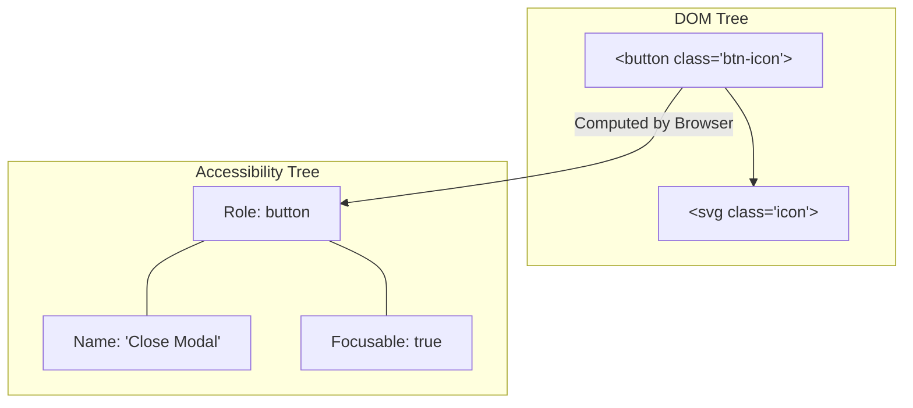

```yaml
schema_version: "2.0"
metadata:
  lesson_id: "HTML5-MOD03-LES02"
  course_slug: "course-01-html5"
  course_title: "Course 1: HTML5"
  module_slug: "mod-03-semantic-layout"
  module_title: "Module 3 - Semantic HTML5 & Document Layout Architecture"
  lesson_slug: "document-outline-and-accessibility-tree"
  lesson_title: "Lesson 3.2 Document Outline & Accessibility Tree"
  sort_order: 302

pedagogy:
  difficulty: "intermediate"
  estimated_time:
    reading_minutes: 20
    practice_minutes: 25
    quiz_minutes: 10
    total_minutes: 55
  bloom_taxonomy_level: "Analyze"
  xp_reward: 60

prerequisites:
  required_lesson_ids:
    - "HTML5-MOD03-LES01"
  required_skills:
    - "Semantic HTML5 Structural Landmarks"

skills_acquired:
  - "Accessibility Tree Mapping & Audit Inspection"
  - "ARIA Landmark Roles Implementation (`role='banner'`, `role='navigation'`, `role='main'`)"
  - "ARIA States & Properties (`aria-label`, `aria-labelledby`, `aria-expanded`, `aria-live`)"
  - "Screen Reader Landmark Navigation Modes"
  - "Keyboard Focus Order & `tabindex` Management (-1, 0, >0 rules)"

dependencies:
  software:
    - "VS Code"
    - "Chrome DevTools Accessibility Panel"
    - "Screen Reader (NVDA / VoiceOver / TalkBack)"
  hardware: []

seo_and_social:
  meta_title: "HTML5 Accessibility Tree, ARIA Roles & Keyboard Focus Management"
  meta_description: "Master the Accessibility Tree, ARIA roles, states (aria-expanded, aria-live), screen reader navigation, and tabindex keyboard focus management."
  keywords: ["Accessibility Tree", "a11y", "ARIA Roles", "aria-label", "aria-expanded", "aria-live", "tabindex", "Screen Readers", "NVDA", "VoiceOver"]

assessment_config:
  has_quiz: true
  has_lab: true
  has_flashcards: true
  pass_score_percentage: 80
```

# Lesson 3.2 Document Outline & Accessibility Tree

## 1. Overview & Learning Objectives [id: overview]

- **Estimated Time**: 55 Minutes (20m Reading | 25m Practice | 10m Quiz)
- **Difficulty Level**: ⭐⭐ Intermediate
- **Prerequisites**: [Lesson 3.1 Structural Semantic Elements](file:///d:/My%20Drive/all%20files/PROJECT%20FILES/notes/docs/curriculum/_01_html5/_01_07_structural_semantic_elements.md)
- **XP Reward**: +60 XP

### Learning Objectives
By the end of this lesson, you will be able to:
1. Explain how browsers transform the DOM tree into an parallel **Accessibility Tree (AOM)** for assistive technology.
2. Apply **ARIA (Accessible Rich Internet Applications)** landmark roles and explicit `role="..."` overrides.
3. Utilize ARIA attributes (`aria-label`, `aria-labelledby`, `aria-describedby`, `aria-hidden`, `aria-expanded`, `aria-live`).
4. Audit web pages using VoiceOver / NVDA screen reader landmark navigation shortcuts.
5. Manage keyboard focus states using `tabindex="-1"`, `tabindex="0"`, and avoid anti-pattern positive `tabindex` values.

---

## 2. Environment & Prerequisites [id: prerequisites]

Inspect accessibility properties using Chrome DevTools:
- Open DevTools (`F12`) $\rightarrow$ Click **Elements** tab $\rightarrow$ Open **Accessibility** sub-panel.
- Enable Chrome's built-in **Full Accessibility Tree Switch** (Top right icon in Elements panel).

---

## 3. Theoretical Foundations [id: theory]

### 3.1 The Accessibility Tree (AOM) Architecture
Browsers build an **Accessibility Tree** alongside the DOM tree. The Accessibility Tree exposes four core properties for every node:

```
┌─────────────────────────────────────────────────────────────────────────────┐
│                   THE 4 ACCESSIBILITY TREE NODE PROPERTIES                  │
├─────────────────┬───────────────────────────────────────────────────────────┤
│ 1. Role         │ Identifies element type (e.g., button, heading, link,     │
│                 │ checkbox, landmark).                                      │
├─────────────────┼───────────────────────────────────────────────────────────┤
│ 2. Name         │ Accessible label text spoken by screen readers            │
│                 │ (computed from text, alt, or aria-label).                 │
├─────────────────┼───────────────────────────────────────────────────────────┤
│ 3. State        │ Current dynamic state (e.g. expanded=true, checked=false, │
│                 │ disabled=true).                                           │
├─────────────────┼───────────────────────────────────────────────────────────┤
│ 4. Value        │ Numeric or textual value (e.g. progress bar value=75).    │
└─────────────────┴───────────────────────────────────────────────────────────┘
```

```
DOM Tree Node:  <button class="icon-btn" aria-label="Close Modal">X</button>
                    │
                    ▼ Transforms into:
Accessibility Node: Role: "button", Name: "Close Modal", Focusable: True
```

### 3.2 HTML5 Semantic Elements vs ARIA Landmark Roles
Native HTML5 tags map automatically to implicit ARIA landmark roles:

| HTML5 Element | Implicit ARIA Landmark Role | Screen Reader Shortcut Key |
| :--- | :--- | :---: |
| `<header>` (Page level) | `role="banner"` | `D` or `L` |
| `<nav>` | `role="navigation"` | `D` or `L` |
| `<main>` | `role="main"` | `D` or `L` |
| `<footer>` (Page level) | `role="contentinfo"` | `D` or `L` |
| `<aside>` | `role="complementary"` | `D` or `L` |
| `<section>` (With `aria-label`) | `role="region"` | `D` or `L` |
| `<form>` (With `aria-label`) | `role="form"` | `F` |

> [!IMPORTANT]
> **First Rule of ARIA**: If a native HTML element exists (`<button>`, `<header>`, `<input>`), use it instead of adding `role="..."` to a generic `<div>`!

### 3.3 Core ARIA Attributes & Properties

#### 1. Labeling Attributes (`aria-label`, `aria-labelledby`, `aria-describedby`)
- `aria-label="string"`: Provides an invisible accessible name directly on an element (used for icon buttons).
- `aria-labelledby="element-id"`: References one or more element IDs whose inner text forms the accessible name.
- `aria-describedby="element-id"`: References additional descriptive text (e.g., input field help text or error messages).

```html
<!-- Icon-only button with aria-label -->
<button aria-label="Search Database">
  <svg class="icon-search"></svg>
</button>

<!-- Complex Card Labeling -->
<h3 id="card-heading">ESP32 Firmware V2</h3>
<p id="card-desc">Low-power telemetry firmware update.</p>
<button aria-labelledby="card-heading" aria-describedby="card-desc">Download</button>
```

#### 2. Dynamic State Attributes (`aria-expanded`, `aria-hidden`, `aria-live`)
- `aria-expanded="true|false"`: Communicates whether an accordion, dropdown menu, or modal is currently expanded.
- `aria-hidden="true"`: Hides an element (like decorative background icons) from screen readers while keeping it visually visible on screen.
- `aria-live="polite|assertive"`: Instructs screen readers to announce dynamic DOM updates (e.g., live telemetry readings or chat notifications):
  - `polite`: Speaks notification when the user finishes current sentence.
  - `assertive`: Immediately interrupts user's speech stream (use for urgent warnings).

### 3.4 Keyboard Focus Management & `tabindex` Rules
Keyboard users rely on the <kbd>Tab</kbd> key to navigate focusable elements.

```
┌─────────────────────────────────────────────────────────────────────────────┐
│                           TABINDEX ATTRIBUTE RULES                          │
├─────────────────┬───────────────────────────────────────────────────────────┤
│ `tabindex="0"`  │ Inserts element into natural document keyboard tab order. │
│                 │ Makes non-interactive elements (<div>) focusable.          │
├─────────────────┼───────────────────────────────────────────────────────────┤
│ `tabindex="-1"` │ Removes element from tab order, BUT allows programmatic   │
│                 │ focus via JavaScript (`element.focus()`). Essential for    │
│                 │ modal dialog focus management.                            │
├─────────────────┼───────────────────────────────────────────────────────────┤
│ `tabindex="1+"` │ ANTI-PATTERN! Hardcodes positive focus priority, breaking  │
│                 │ natural DOM tab order. NEVER use positive tabindex!       │
└─────────────────┴───────────────────────────────────────────────────────────┘
```

---

## 4. Architecture & Diagram Visualizations [id: diagram]

### DOM Tree vs Accessibility Tree Mapping


---

## 5. Code & Hardware Implementation [id: syntax]

### 5.1 Fully Accessible Component Suite (`accessible_suite.html`)

```html
<!DOCTYPE html>
<html lang="en">
<head>
  <meta charset="UTF-8">
  <title>Accessible ARIA & Focus Management Suite</title>
  <style>
    body { font-family: system-ui; padding: 20px; }
    .sr-only { position: absolute; width: 1px; height: 1px; padding: 0; margin: -1px; overflow: hidden; clip: rect(0,0,0,0); border: 0; }
    .accordion-header { background: #0f172a; color: #fff; border: none; padding: 12px; width: 100%; text-align: left; font-size: 1rem; cursor: pointer; }
    .accordion-panel { padding: 16px; background: #f8fafc; border: 1px solid #cbd5e1; }
    .accordion-panel[aria-hidden="true"] { display: none; }
    .live-feed { background: #fef08a; padding: 12px; border-left: 4px solid #ca8a04; margin-top: 20px; }
    :focus-visible { outline: 3px solid #3b82f6; outline-offset: 2px; }
  </style>
</head>
<body>

  <h1>Accessible Component Suite</h1>

  <!-- 1. Accessible Accordion Widget -->
  <section aria-labelledby="acc-heading">
    <h2 id="acc-heading">System Diagnostics</h2>

    <button class="accordion-header" 
            id="acc-btn-1" 
            aria-expanded="false" 
            aria-controls="acc-panel-1">
      View Wi-Fi Diagnostic Telemetry
    </button>
    
    <div class="accordion-panel" 
         id="acc-panel-1" 
         role="region" 
         aria-labelledby="acc-btn-1" 
         aria-hidden="true">
      <p>Wi-Fi Signal (RSSI): -42 dBm (Excellent)</p>
      <p>Gateway IP: <code>192.168.1.1</code></p>
    </div>
  </section>

  <!-- 2. Live Telemetry Announcer (ARIA Live Region) -->
  <section>
    <h2>Live Telemetry Region</h2>
    <div class="live-feed" 
         role="status" 
         aria-live="polite" 
         aria-atomic="true">
      <span id="live-text">Waiting for live sensor data stream...</span>
    </div>
    <button id="trigger-btn">Simulate Sensor Reading</button>
  </section>

  <script>
    // 1. Accordion ARIA Expansion State Toggle
    const btn = document.getElementById('acc-btn-1');
    const panel = document.getElementById('acc-panel-1');

    btn.addEventListener('click', () => {
      const isExpanded = btn.getAttribute('aria-expanded') === 'true';
      btn.setAttribute('aria-expanded', !isExpanded);
      panel.setAttribute('aria-hidden', isExpanded);
    });

    // 2. ARIA Live Update Simulation
    const trigger = document.getElementById('trigger-btn');
    const liveText = document.getElementById('live-text');
    let count = 0;

    trigger.addEventListener('click', () => {
      count++;
      liveText.textContent = `[${new Date().toLocaleTimeString()}] Alert: Sensor Temp updated to 28.${count}°C`;
    });
  </script>

</body>
</html>
```

---

## 6. Enterprise Real-World Applications [id: examples]

### Automated Accessibility Testing in CI/CD Pipelines
Enterprise organizations integrate automated accessibility auditing tools into continuous integration build steps:

- **Lighthouse CLI / Axe-core**: Runs automated Accessibility Tree scans against web applications, flagging missing `aria-label` tags, insufficient color contrast, or bad `tabindex` values.
- **Pa11y CLI**: Fails CI build steps if WCAG 2.1 AA violations are detected.

---

## 7. Guided Step-by-Step Hands-On Exercise [id: exercises]

### Task: Audit Accessibility Tree Properties in Chrome DevTools

#### Step 1: Open `accessible_suite.html`
Save and launch the code from Section 5.1 in Chrome.

#### Step 2: Inspect Accessibility Tree Properties
1. Open DevTools (`F12`) $\rightarrow$ Click **Elements** tab.
2. Select `<button class="accordion-header">`.
3. In the right sub-panel, click **Accessibility**.
4. Observe computed properties:
   - **Name**: `"View Wi-Fi Diagnostic Telemetry"`
   - **Role**: `"button"`
   - **Expanded**: `false`

#### Step 3: Trigger Dynamic ARIA State Change
1. Click the accordion button on screen.
2. Observe computed **Expanded** property in DevTools updates dynamically to `true`.

---

## 8. Common Pitfalls & Troubleshooting [id: common_mistakes]

| Symptom / Bug | Root Cause | Engineering Solution |
| :--- | :--- | :--- |
| **Keyboard Trapping Failure** | Creating a clickable `div` (`<div onclick="...">`) without `tabindex="0"` or keyboard event listeners (`Enter`/`Space`). | Use native `<button>` tags for interactive triggers instead of `<div>`. |
| **Keyboard Navigation Order Jumps Erratically** | Using positive `tabindex` values (`tabindex="1"`, `tabindex="2"`). | Remove all positive `tabindex` values; rely on natural DOM tree order. |
| **Screen Reader Announces Incorrect Information** | Forgetting to toggle `aria-expanded="true/false"` via JavaScript when opening custom menus. | Update `aria-expanded` and `aria-hidden` attributes inside click event handlers. |

---

## 9. Best Practices & Optimization [id: best_practices]

- **Prefer Native Elements**: Native `<button>`, `<input>`, and `<a>` tags handle keyboard focus, ARIA roles, and click events automatically.
- **Never Use Positive `tabindex`**: Restrict `tabindex` to `0` (focusable) and `-1` (programmatically focusable).
- **Use `aria-live="polite"` for Non-Urgent Status Updates**: Avoid `assertive` unless announcing critical system failures.
- **Provide Visually Hidden Text for Screen Readers**: Use a `.sr-only` CSS utility class for icon-only buttons.

---

## 10. Industry Interview Q&A [id: interview_qa]

### Q1: What is the difference between `tabindex="0"`, `tabindex="-1"`, and `tabindex="1"`?
**Answer**:
- `tabindex="0"` inserts the element into the natural document tab order, making it focusable via the <kbd>Tab</kbd> key.
- `tabindex="-1"` removes the element from natural tab order, but permits programmatic focus via JavaScript (`element.focus()`). Useful for custom modal dialogs.
- `tabindex="1+"` (positive values) forces custom focus priority ahead of natural DOM order. This is a recognized accessibility anti-pattern and should never be used.

### Q2: How does `aria-live="polite"` differ from `aria-live="assertive"`?
**Answer**:
- `aria-live="polite"` queues dynamic content updates to be spoken by screen readers after the user finishes their current action or sentence without interrupting them.
- `aria-live="assertive"` immediately halts current screen reader speech output to announce the update instantly. Reserved for critical errors, system timeouts, or emergency alerts.

---

## 11. Self-Assessment Quiz [id: quiz]

```json
{
  "quiz_title": "Lesson 3.2 Document Outline & Accessibility Tree Assessment",
  "questions": [
    {
      "question_id": "Q1",
      "type": "multiple_choice",
      "question_text": "What are the four core node properties exposed by the Accessibility Tree (AOM)?",
      "options": [
        "Tag, Class, ID, Style",
        "Role, Name, State, Value",
        "Width, Height, Top, Left",
        "Color, Font, Margin, Padding"
      ],
      "correct_answer_index": 1,
      "explanation": "The Accessibility Tree computes Role, Name, State, and Value for assistive technology."
    },
    {
      "question_id": "Q2",
      "type": "multiple_choice",
      "question_text": "Which `tabindex` value makes a non-interactive element programmatically focusable via JS while keeping it OUT of natural tab order?",
      "options": ["tabindex='0'", "tabindex='-1'", "tabindex='1'", "tabindex='auto'"],
      "correct_answer_index": 1,
      "explanation": "tabindex='-1' enables programmatic focus via JS without inserting the node into natural tab order."
    },
    {
      "question_id": "Q3",
      "type": "multiple_choice",
      "question_text": "Which ARIA state attribute communicates whether a collapsible dropdown panel is currently open or closed?",
      "options": ["aria-hidden", "aria-expanded", "aria-selected", "aria-visible"],
      "correct_answer_index": 1,
      "explanation": "aria-expanded='true|false' communicates open/closed states for accordions and dropdowns."
    },
    {
      "question_id": "Q4",
      "type": "multiple_choice",
      "question_text": "What ARIA live region setting queues announcements politely without interrupting screen reader speech?",
      "options": ["aria-live='assertive'", "aria-live='polite'", "aria-live='off'", "aria-live='silent'"],
      "correct_answer_index": 1,
      "explanation": "aria-live='polite' speaks updates when screen reader speech stream becomes idle."
    },
    {
      "question_id": "Q5",
      "type": "multiple_choice",
      "question_text": "What is the First Rule of ARIA according to W3C accessibility guidelines?",
      "options": [
        "Add role='button' to all divs",
        "Always use positive tabindex values",
        "If a native HTML element exists, use it instead of adding ARIA roles to generic containers",
        "Never use aria-label attributes"
      ],
      "correct_answer_index": 2,
      "explanation": "The First Rule of ARIA is to use native semantic elements whenever possible."
    }
  ]
}
```

---

## 12. Portfolio Assignment & Challenge [id: lab]

### Objective
Remediate an inaccessible custom dropdown menu (built with generic `<div>` tags) by adding native `<button>` tags, `aria-expanded`, `aria-controls`, `aria-hidden`, and keyboard Esc dismiss handlers.

---

## 13. Spaced Repetition Flashcards [id: flashcards]

**Front**: What is the function of `aria-hidden="true"`?
**Back**: Hides an element from screen readers and assistive technology while keeping it visually visible on screen.
<!-- flashcard:end -->

**Front**: Why are positive `tabindex` values considered an anti-pattern?
**Back**: They override natural DOM tab order, creating unpredictable and frustrating keyboard navigation jumps for users.
<!-- flashcard:end -->

**Front**: What is the implicit ARIA role of `<main>`?
**Back**: `role="main"`
<!-- flashcard:end -->

---

## 14. Summary & Cheat Sheet [id: summary]

### Key Takeaways
- **Accessibility Tree**: Browser translates DOM $\to$ Role, Name, State, Value.
- **ARIA Rule #1**: Prefer native HTML tags over custom `<div>` + ARIA overrides.
- **Focus Management**: Use `tabindex="0"` for focusable items, `tabindex="-1"` for programmatic JS focus.
- **Live Regions**: Use `aria-live="polite"` to announce dynamic telemetry updates.

### Quick Syntax Reference

```html
<!-- Accessible Button with Icon -->
<button aria-label="Close Dialog">
  <svg aria-hidden="true">...</svg>
</button>

<!-- ARIA Live Region -->
<div role="status" aria-live="polite">
  Dynamic live telemetry updates go here...
</div>
```

### Official References
- [W3C ARIA Authoring Practices Guide (APG)](https://www.w3.org/WAI/ARIA/apg/)
- [MDN Web Docs: The Accessibility Tree](https://developer.mozilla.org/en-US/docs/Glossary/Accessibility_tree)
